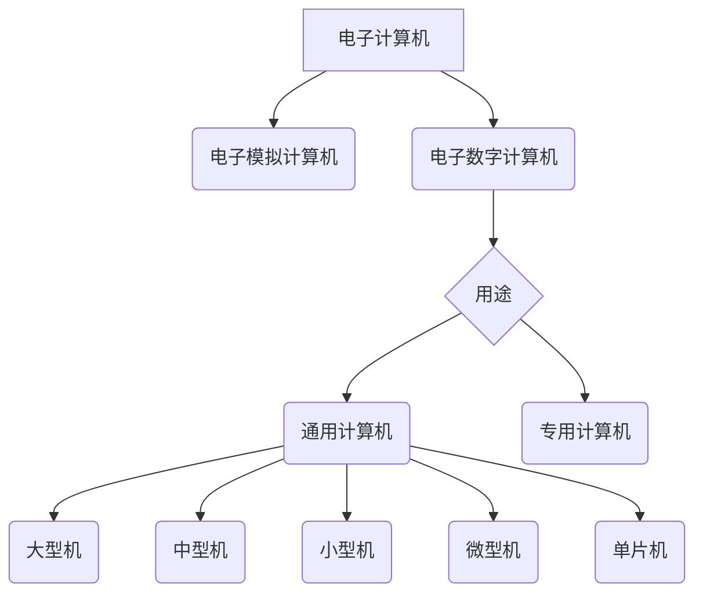
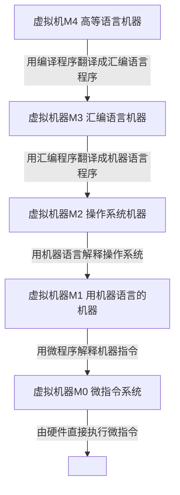

## 计算机系统概述

大纲要求
> 1. 计算机系统的发展与分类。
> 2. 计算机系统的组成与层次结构。
> 3. 冯·诺伊曼体系结构计算机的主要特点。
> 4. 计算机硬件系统的组成部件及其功能。
> 5. 计算机的主要性能指标。
> 6. 计算机中的三种语言：机器语言、汇编语言、高级语言。

### 内容精讲

#### 计算机系统的发展与分类

##### 计算机硬件的发展

###### 四个时代

电子管——>晶体管——>中小规模集成电路——>超大规模集成电路

###### 元器件更新换代

摩尔定律：当价格不变，集成电路上可容纳的晶体管数目没18个月会增加一倍。

微处理器的发展：1971年Intel开发出第一个微处理器4004 ——> 8008（8位）——> 8080（8位）——> **8086（16位）** ——> 8088（16位）——> 80286（16位）——> **80386（32位）**——> 80486（32位）——> Pentium（32位）——> **Pentium pro（64位）**等。

##### 计算机软件的发展

杭电这里怎么可能会出考题。。。

##### 计算机的分类

###### 按指令和数据流分

1. SISD 单指令流和单数据流系统，也即传统冯诺伊曼体系结构
2. SIMD 单指令流和多数据流系统，包括阵列处理器和向量处理器系统
3. MISD 多指令流和单数据流系统，这种计算机不存在
4. MSMD 多指令流和多数据流系统，包括多处理器和多计算机系统

#### 计算机系统的组成与层次结构

##### 计算机系统的组成

硬件系统和软件系统共同构成了一个完整的计算机系统。对某一功能来说，既可以用硬件实现，也可以用软件实现，则称为软硬件在逻辑上是**等效**的。

##### 计算机的工作过程

大致分为以下几步：

1. 把程序和数据装入到主存
2. 从程序的启示位置开始运行程序
3. 用程序的首地址从存储器中取出第一条指令，经过译码、执行步骤等控制计算机各功能部件协同运行，完成这条指令的功能，并计算下一条功能的地址。
4. 用新得到的地址继续读出并执行第二条指令，直到结束。每一条指令都是在取指、译码和执行的循环过程中完成的。

取数指令（将指令地址嘛指示的存储单元中的操作数取出后送到运算器的ACC中）的信息流如下：

取指令：PC -> MAR -> M -> MDR -> IR

分析指令：OP(IR) -> CU

执行指令：Ad(IR) -> MAR -> M -> MDR -> ACC

指向下一指令：PC+1

##### 计算机的层次结构

#### 冯·诺依曼体系计算机的主要特点

- 早期冯诺伊曼体系结构特点如下：

1. 计算机硬件系统由运算器、存储器、控制器、输入设备和输出设备5大部分组成。
2. 指令和数据以同等地位存于存储器中，并可按地址访问。
3. 指令和和数据均用2进制代码表示。
4. 指令由操作码和地址码组成，操作码用来表示操作的性质，地址码用来表示操作数在存储器中的位置。
5. 指令在存储器内按顺序存放。通常，指令是顺序执行的，在特定条件下，可根据运算结果或根据设定的条件改变执行顺序。
6. 早期冯诺伊曼机以运算器为中心，输入输出设备通过运算器与存储器传送数据。

- 现代计算机结构：

现代大部分计算机基本思想还是冯诺伊曼当年的思想，但由于CPU越来越快，和存储设备速度相差越来越大，以运算器为中心的结构不能满足发展要求，所以现代计算机以存储器为中心，使I/O尽量绕过CPU。

#### 计算机硬件系统的组成部件及其功能

1. 运算器

运算器是计算机的执行部件，用于对数据进行加工处理，做逻辑或算术运算，运算器的核心是ALU（算术逻辑单元）。运算器中包括若干通用寄存器，如累加器（ACC）、乘商寄存器（MQ）、操作数寄存器（X）、变址寄存器（IX）、基址寄存器（BR）等。运算器内还有程序状态寄存器（PSW），保留各类运算或测试的状态信息。

1. 控制器

控制器是指挥中心，由程序计数器（PC）、指令寄存器（IR）、控制单元（CU）组成。

PC用来存放下一条指令的地址，可以自加一，它与主存的MAR之间有一条直接通路。IR用来存放当前的指令，其内容来自主存的MDR。指令中的操作码OP(IR)送至CU，用以分析指令并发出各种微操作命令序列，而地址码Ad(IR)送网MAR来取操作数。

1. 存储器

存储器分为主存和辅存，CPU能直接访问的是主存，辅存帮助存储更多信息，辅存内容必须调到主存才能被CPU使用。

主存储器由许多存储单元组成，每个单元有若干个存储元件，每个元件存储一位2进制代码“0”或“1”，所以一个存储单元可以存储一串2进制代码，这一串称为存储字，串长度称为存储字长，字长可以是一个字节（8bit）或字节的偶数倍。主存储器的工作方式是按**存储单元的地址**进行存取的，这种存取方式称为按地址存取。

主存的最基本组成如下图，存储体中存放2进制信息，地址寄存器（MAR）存放访存地址，经过地址译码后找到所选存储单元。数据寄存器是主存和其他部件的中介机构，暂存要从存储器读或写的信息，时许控制逻辑用于产生存储器操作所需的各种时序信号。

MAR用于寻址，其位数对应着存储单元的个数，如MAR为10，则有210 = 1024个存储单元，记为1K。MAR的长度和PC的长度相等。

MDR的位数和存储字长相等。一般为字节的2次幂整数倍。

MAR和MDR都存在于CPU中。

1. 输入设备

1. 输出设备

这两个没得说

#### 计算机的主要性能指标

1. 机器字长

机器字长是指计算机进行一次整数运算（即定点整数运算）所能处理的二进制数据位数。通常与CPU的寄存器位数、加法器有关。字长越长，数表示的范围越大，**计算精度就越高**。

2. 数据通路带宽

指数据总线一次能并行传送信息的位数。这里的数据总线指外部数据总线，区别于CPU内部数据总线。

> 各个子系统通过数据总线连接形成的数据传送路径称为数据通路

3. 主存容量

所能粗处信息的最大容量，可以以字节衡量，也可以用字数*字长来表示。MAR的位数反映了存储单元的个数，MAR反映了可寻址的最大值（不一定实际有这么大）

4. 运算速度

   - 吞吐量和相应时间

   1. 吞吐量：值系统在单位时间内处理请求的数量。它取决于信息能多快地输出给内存，CPU能多快的从内存取信息。
   2. 响应时间：用户向计算机发出一个请求，到系统作出相应并返回想要结果所需要的时间。通常包括CPU时间和等待时间。

   - 主频和CPU时钟周期

   1. CPU时钟周期：通常为节拍脉冲或T周期，即主频的倒数，是CPU中最小的时间单位
   2. 机器内部主时钟的频率，对同一个型号计算机，主频越快，完成指令的一个执行步骤所用时间越短，执行指令速度越快。

   - CPI（Clock cycle Per Instruction）执行一条指令所需时钟周期数
   - CPU执行时间 指运行一个程序所花费的时间。

   CPU执行时间 = CPU时钟周期数/主频 = （指令条数 * CPI）/主频

   - MIPS、MFLOPS、GFLOPS和TFLOPS

   MIPS（Million Instructions Per Second）= 指令条数/（执行时间 * 10^6^） = 主频/CPI

   MFLOPS（Mega Floating-point Operations Per Second）= 浮点操作次数/（执行时间 * 10^6^）

   GFLOPS（Giga Floating-point Operations Per Second）= 浮点操作次数/（执行时间 * 10^9^）

   TFLOPS（Tera Floating-point Operations Per Second）= 浮点操作次数/（执行时间 * 10^12^）

#### 计算机中的三种语言

- 机器语言：唯一可以直接被机器执行的语言
- 汇编：汇编后才能被机器执行
- 高级语言：一般要先编译成汇编，再汇编成机器语言。

### 例题精解

####选择题

------------

2011

---------

【例题】计算机中采用二进制表示数据，下面哪一种理由是错误的：\_\_\_\_\_\_\_\_\_\_\_。

A. 二进制数表示的精度高

B. 二进制数运算规则简单

C. 二值状态的电子器件容易实现

D. 具有逻辑特性，可以进行逻辑运算

答案：A

【例题】下列有关计算机语言的说法中，错误的是\_\_\_\_\_\_\_。

A. 计算机硬件能够直接执行的语言是机器语言

B. 机器语言和汇编语言是面向机器的语言

C. 高级语言和汇编语言是符号化的语言

D. 高级语言需要编译成二机制机器指令后才能执行，而汇编语言因为与机器指令一一对应，所以不需要编译就可执行

答案：D

--------------

2012

--------

【例题】下面关于计算机语言的说法中，错误的是\_\_\_\_\_\_\_\_\_。

I. 机器语言是由0/1代码串构成的代码语言，而高级语言和汇编语言是符号化的语言

II. 机器语言和汇编语言是面向机器的语言，因此能够被计算机硬件直接执行

III. 高级语言需要编译成二进制代码才能执行，而汇编语言因为与机器指令一一对应，所以不需要编译就可以执行。

A. 仅I和II

B. 仅II和III

C. 仅I和III

D. I、II、III

答案：B

【例题】下面是在计算机中采用二进制表示数据的理由，正确的是：\_\_\_\_\_\_\_\_。

I. 二进制数的运算规则更简单

II. 二进制数的表示更精确

III. 具有逻辑特性，方便进行逻辑运算

IV. 存储二进制的器件容易实现

A. 全部正确

B. 仅I、II和III

C. 仅I、III和IV

D. 仅I和IV

E. 仅I和III

答案：C

【例题】下列寄存器中，汇编语言程序员可见的是\_\_\_\_\_\_。

I. 存储器地址寄存器（MAR）

II. 存储器数据寄存器（MDR）

III. 程序计数器（PC）

IV. 指令寄存器（IR）

V. 状态寄存器（FR）

VI. 通用寄存器

A. 仅VI

B. 仅III和VI

C. 仅III、V和VI

D. I、II、IV

答案：C

#### 填空题

----------

2011

---------

【例题】计算机硬件由五大部件组成，CPU包含了\_\_\_\_\_、\_\_\_\_\_\_两大部件。

答案：运算器、控制器

【例题】CPU中包含了若干个专用寄存器，用来存放指令地址的寄存器是\_\_\_\_\_\_\_\_；用来存放机器指令码本身的寄存器是\_\_\_\_\_\_\_\_；用来记录运算结果状态的寄存器是\_\_\_\_\_\_\_\_\_。

答案：PC IR PSW

--------

2012

----------

【例题】CPU中包含了若干个专用的寄存器，程序计数器PC用来存放\_\_\_\_\_\_\_；指令寄存器IR用来存放\_\_\_\_\_\_\_；状态寄存器FR用来存放\_\_\_\_\_\_\_\_。

答案：下一条要执行指令的地址、当前执行的指令、保留各类运算或测试的状态信息

#### 简答题

------------

2011

--------

【例题】简述冯诺伊曼体系结构计算机的主要特点

答案：

1. 计算机硬件系统由运算器、存储器、控制器、输入设备和输出设备5大部分组成。
2. 指令和数据以同等地位存于存储器中，并可按地址访问。
3. 指令和和数据均用2进制代码表示。
4. 指令由操作码和地址码组成，操作码用来表示操作的性质，地址码用来表示操作数在存储器中的位置。
5. 指令在存储器内按顺序存放。通常，指令是顺序执行的，在特定条件下，可根据运算结果或根据设定的条件改变执行顺序。
6. 早期冯诺伊曼机以运算器为中心，输入输出设备通过运算器与存储器传送数据。

---------

2012

--------

【例题】简述冯诺伊曼体系结构计算机的主要特点

答案：

1. 计算机硬件系统由运算器、存储器、控制器、输入设备和输出设备5大部分组成。
2. 指令和数据以同等地位存于存储器中，并可按地址访问。
3. 指令和和数据均用2进制代码表示。
4. 指令由操作码和地址码组成，操作码用来表示操作的性质，地址码用来表示操作数在存储器中的位置。
5. 指令在存储器内按顺序存放。通常，指令是顺序执行的，在特定条件下，可根据运算结果或根据设定的条件改变执行顺序。
6. 早期冯诺伊曼机以运算器为中心，输入输出设备通过运算器与存储器传送数据。

### 习题精练

