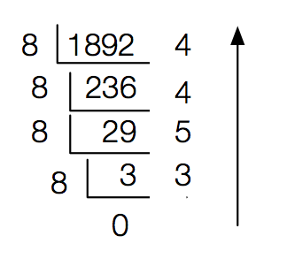
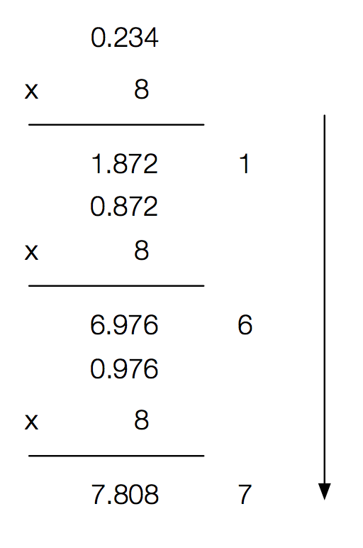
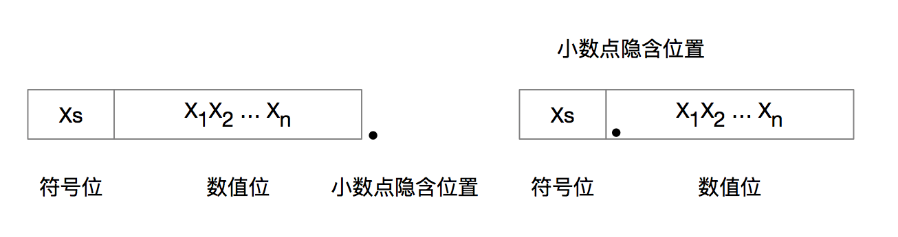
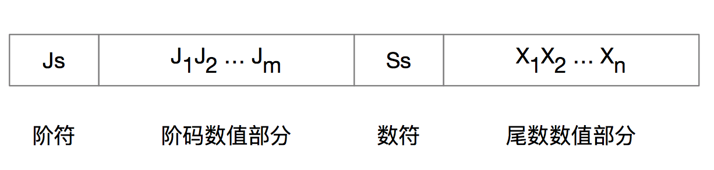
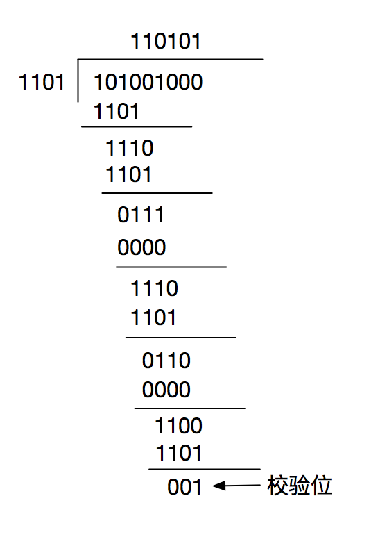
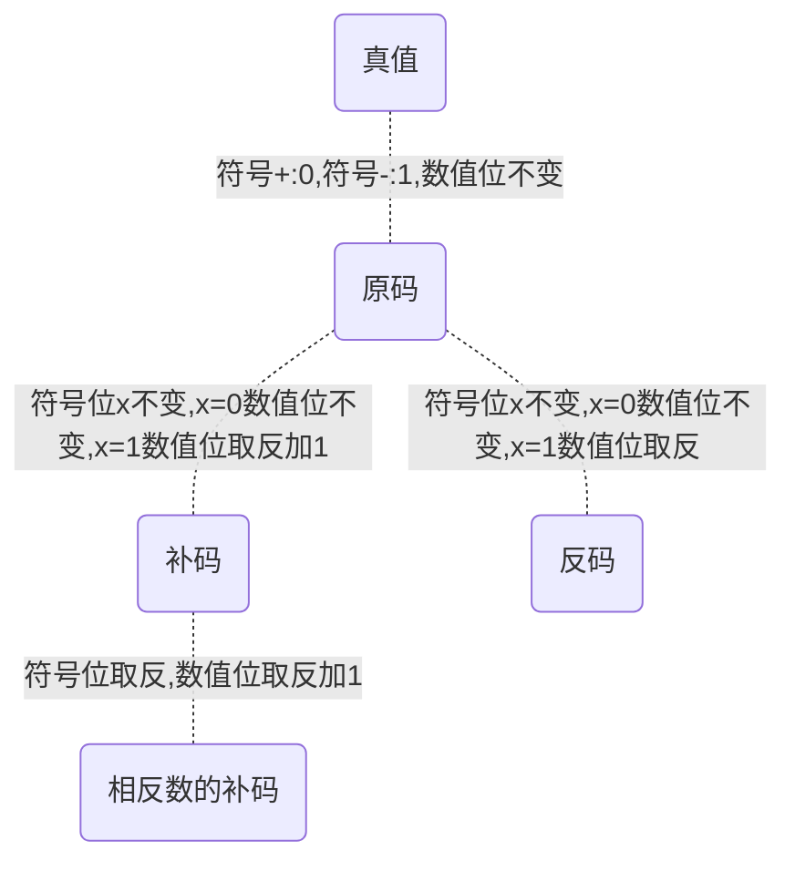

## 信息编码与数据表示

大纲要求

> 1. 计算机信息编码
>   1. 进位计数制及其相互转换。
>   2. BCD码。
>   3. 真值、机器数与数据格式。
>   4. 非数值数据的表示：字符、汉字。
>   5. 校验码校验方法及其校验能力。
> 2. 定点机器数的表示
>   1. 无符号数的表示。
>   2. 有符号数的表示：原码、反码、补码、移码。
> 3. 浮点机器数的表示
>   1. 浮点数的格式与特点。
>   2. 浮点数的规格化表示。
>   3. IEEE754浮点数标准。

### 内容精讲

#### 计算机信息编码

##### 进位计数制及相互转换

###### 进位计数法

进位计数法是一种计数的方法，生活中常用10进制数表示，计算机内常用2进制、8进制、16进制表示数据。在进位计数法中，每个数位可能用到的不同数码个数称为**基数**，十进制基数为10，每个数位满10就向高位进1。进位计数法中每一位所表示的权值不同，比如十进制的123，第一位的权值是100，第二位是10，第三位是1，123表示的数就是1\*100+2\*10+3\*1 = 123。

- 2进制

  计算机中使用最多的是二进制数，二进制数只有两个数字符号0/1，计数逢二进一，任意位的权重位2i，i为所在位数。

- 8进制

  8进制是2进制的一种书写形式，基数为8，逢8进1。因为8=23，所以只要把2进制3位编码成一组就是1位8进制数。

- 16进制

  16进制数是用0~9 A~F这16个符号来表示的，因为16=24，所以每4位2进制数分为一组，便可表示一位16进制数。

###### 不同进制数的互相转换

- 2进制 --> 8进制

  对于一个含小数部分的2进制数，在转换时要以小数点为界，整数部分从右往左，每3位一组，最左边用0补成满3位，小数部分从左往右，每3位一组，最右边可能要用0补满3位，然后整数、小数部分分别用对应的8进制数代替3位2进制数即可。

  例如将二进制1001010101100.0011转换为8进制数：

  先分组：**00**1 001 010 101 100.001 1**00**

  再对应：11254.14

  所以：(1001010101100.0011)2 = (11254.14)8

- 2进制 --> 16进制

  2进制到16进制的转换和到8进制基本一致，就是把前边的3位改为4位，这里做个例子：

  将二进制1001010101100.0011改为16进制

  先分组：**000**1 0010 1010 1100.0011

  再对应：12AC.3

  所以：(1001010101100.0011)2 = (12AC.3)16

- \* -- > 10进制

  任意进制数到十进制的转换都可以把它们各位数值与权值相乘，再把所有乘积相加，这种方式称为按权展开相加法。例如：

  (2341.32)8 = 2 \* 83 + 3 \* 82 + 4 * 81 + 1 \* 80 + 3 \* 8-1 + 2 \* 8-2 = 1249.40625

- 10进制 --> *

  10进制到任意进制的转换采用基数乘除法。对于整数部分，采用**除基取余法**，对于小数部分，采用**乘基取整法**，最后将两部分拼接起来。

  - 除基取余法：整数部分除基取余，最先得到的余数为结果的最低位，最后取得的余数为最高位，商为0时结束。（除基余取，先余为低，后余为高）
  - 乘基取整法：小数部分乘基取整，最先得到的整数位结果的最高位，最后取得的整数位最低位，乘积为0（或满足精度要求）时结束。（乘积取整，先整为高，后整为低）

  下边做一个例子，将十进制数1892.234换为8进制。

  先看整数部分:

  

  在看小数部分：

  

  所以(1892.234)10 = (3544.167)8

  通过上边的例子我们也能看到，计算机中不是每个数都是连续的，整数连续，小数是离散的。不是每个十进制小数都可以精确表示。

##### BCD码

BCD码是Binary-Coded Decimal（二进制编码十进制数）的简称，通常用4位2进制数表示1位10进制数，这种编码方式，使10进制和2进制之间转换得以快速进行。但4位2进制有16种组合，必然会有6个冗余。下边列举几个BCD码。

- 8421码：这是一种有权码，4位2进制数各位的权值分别是8、4、2、1，如0111表示的是0 \* 8 + 1 \* 4 + 1 \* 2 + 1 \* 1 = 7这个十进制数。

  如果8421码运算后大于(1001)2，则要加6（0110）修正，并向上进位。如计算8+4=12时：

  1000+0100=1100 > 1001 ==> 1100 + 0110 = 10010 = 12

- 余3码、2421码、格雷码、5211码等这里不细说。

##### 真值、机器数与数据格式

###### 真值 

真值就是我们日常用到的用正负号表示正负数的数（正号可省略），比如+4、-1等。真值是机器数要表示的实际值。

###### 机器数

数值数据在计算机中的表示形式称为机器数。机器数的特点是：表示的数值范围受计算机字长限制；机器数的符号位必须被数值化为0和1；机器数的小数点是用规定的隐含方式来表达的。

###### 数据格式

计算机中机器数分两种数据格式，一个是定点表示法，一个是浮点表示法。定点表示法约定所有机器数的小数点位置固定不变，可以分为定点整数、定点小数两种。格式如下图：

另一种浮点表示法，是将比例因子放入数据中，让小数点位置根据需要浮动。一般格式如下：

##### 字符、汉字的表示

由于计算机只能处理2进制数据，所以所有字符都要编码成2进制来表示。

###### ASCII码

ASCII码是用7位2进制数表示一个字符的系统，其中0～31位控制字符，127是DEL码，32是空格，剩下的32～126是95个可印刷字符。

###### 汉字表示

汉字编码包括汉字的输入码、汉字内码、汉字字形码三种，分别用于输入、内部处理、输出三种用途。

区位码：区位码是用两个字节表示一个汉字，每个字节用7位，把所有汉字表示在一个94\*94的二维表格中，每一行称为一个区，每一列为一个位，区位码是用4位十进制数表示某个汉字的，比如54行48列是“中”，那中的区位码就是5448。

国标码：区位码很好，但由于要和ASCII兼容，产生了国标码，国标码是把区位码转换成16进制后，每个字节加20H，所以国标码 = 区位码 + 2020H（0010 0000 0010 0000）。

汉字内码：汉字内码是汉字在存储、交换、检索等操作的机内代码，一般用2个字节表示。为了与ASCII字符混合使用，汉字内码规定：将汉字国标码两个字节的最高位均设置为1，即汉字内码=汉字国标码+8080H。（8080即1000000 1000000）。

##### 校验码

校验是能够发现或自动纠正错误的数据编码，校验码的实现原理是添加一些冗余码，来检验或纠错。

码距：任意两个合法的码字之间最少变化的二进制位数，称为码距，如1111和1101之间的码距为1，因为只有1位反转了。

###### 奇偶校验码

在原编码基础上添加一个校验位，可以检测出一位错误或奇数位错误，但不能检测偶数位错误，也不能找到出错位置。增加的冗余位称为奇偶校验位。

- 奇校验码：添加一位后，整个编码中有奇数个1。
- 偶校验码：添加一位后，整个编码中有偶数个1。

###### 海明校验码

是一种多重奇偶校验码。原理是在有效信息中加入几个校验位形成海明码，并把海明码的每一个二进制位分配到几个奇偶校验组中。当某一位出错后，就会引起有关的几个校验位的值发生变化，所以不但可以发现错位，还能纠正错位。

根据纠错理论得L - 1 = D + C (D>=C)，即编码最小码距L越大，其检错位D数就越大，纠正错误的位数C也越大，并且纠错能力恒小于或等于检错能力。

这里以一个例子说明求海明码的过程：

在n = 4、k = 3时，求1010的海明码。

1. 确定海明码的位数

   设有n位有效信息的位数，k为校验位的位数，则信息位n和校验位k应满足：n + k  <= 22 - 1。海明码位数为n + k = 7 <= 23 - 1成立，则n、k有效。设信息位D4D3D2D1(1010)，共4位，校验码P3P2P1，共三位，对应的海明码为H7H6H5H4H3H2H1。

2. 确定校验位的分布

   规定校验位Pi在海明位号为2i-1的位置上，其余各位为信息位，因此：

   - P1的海明位号为2i-1 = 20 = 1，即H1为P1。
   - P2的海明位号为2i-1 = 21 = 2，即H2为P2。
   - P3的海明位号为2i-1 = 22 = 4，即H4为P3。

   将信息位按原来的顺序插入，则海明码各位分布如下：

   | H7 | H6 | H5 | H4 | H3 | H2 | H1 |
   | ------------- | ------------- | -------------- | ------------- | ------------- | ------------- | ------------- |
   | D4 | D3 | D2 | P3 | D1 | P2 | P1 |

3. 分组，以形成校验关系

   每个数据位用多个校验位进行校验，但要满足：被校验的数据位的海明码位于等于校验该数据位的各校验位海明位号之和。另外，校验位不需要再被校验。

   D1在H3的位置，所以由P2P1校验

   D2在H5的位置，所以由P3P1校验

   D3在H6的位置，所以由P3P2校验

   D4在H7的位置，所以由P3P2P1校验

4. 校验位取值

   校验位Pi的值分为i组（由该校验位校验的数据位）所有位求异或。根据3.的分组，有：

   P1 = D1⊕D2⊕D4 = 0⊕1⊕1 = 0

   P2 =  D1⊕D3⊕D4 = 0⊕0⊕1 = 1

   P3 =  D2⊕D3⊕D4 = 1⊕0⊕1 = 0

   所以1010对应的海明码为101**0**0**10**

5. 海明码校验的原理

   每个校验组分别利用校验位和参与形成该校验位的信息位进行奇偶校验检查，就构成了k个校验方程：

   S1 = P1⊕D1⊕D2⊕D4

   S2 = P2⊕D1⊕D3⊕D4

   S3 = P3⊕D2⊕D3⊕D4

   若S3S2S1的值为“000”，则说明无措，否则说明出错，而这个数就是错误的位号。

###### CRC循环冗余校验码

CRC的基本思想是：在K位信息码后再拼接R位的校验码，整个编码长度为N位，因此这种编码又称为（N, K）码。

CRC码基于线性编码理论，在发送端，将要传送的K位2进制信息码左移R位，将它与生成多项式G(x)做模2的除法，生成一个R位校验码，并附在信息码后，构成一个新的2进制码（CRC码），共K+R位。在接收端，则利用生成多项式对接收到的编码做模2的除法，以检测和确定出错的位置，若无错则整除，生成多项式是接收端和发送端的一个约定。

任意一个2进制数码都可以用一个系数仅为0或1的多项式与其对应。生成多项式G(x)的最高幂次为R，转换成对应的2进制数有R+1位。例如多项式x3+x2+1对应的二进制数为1101。

这里以一个例子说明CRC码的检测过程：

设生成多项式为G(x) = x3+x2+1，信息码为101001，求对应的CRC码。

R = 生成多项式最高幂次 = 3，K = 信息码长度 = 6， N = K + R = 9

1. 移位

   将原信息码左移R位，低位补0，得101001000

2. 相除

   对移位后的信息码，用生成多项式进行模2除法，产生余数。得到余数为001，则101001编码后的CRC码为101001**001**。

3. 检错和纠错

   接收到CRC码，用生成多项式G(x)做模2的除法，若余数为0，则码字无错。

   若接收端接收的CRC码为101001011，将这个数据与1101进行模2除法，得到余数010，则说明倒数第二位出粗，将其取反即可。

> 模2除法：
>
> 模2加法和减法的结果相同，都是做异或运算，模2除法和算术除法类似，但每一位除（减）的结果不影响其他位，也就是不进位，过程如下：
>
> 1. 用除数对被除数最高几位做模2减（异或，不借位）
> 2. 除数右移1位，若余数做高位为1，商为1，并对余数做模2减。若余数最高位为0，商为0，除数继续右移一位。
> 3. 循环直到余数位数小于除数时，该余数为最终余数。
>
> 

#### 定点机器数表示

##### 无符号数的表示

整个机器字长的全部二进制位都是数值位，没有符号位，相当于数的绝对值，若机器字长为8，则无符号数的表示范围是0～28-1，即0～255。

##### 有符号数的表示

机器中，数的正负是无法直接表示的，所以一般用符号0表示正，用符号1表示负，从而将正负数值化。有符号数的机器表示方法有多种，下边一一总结。

###### 原码

原码表示法是用机器数的第一位表示符号，用其余各位表示数的绝对值。正数符号位用0表示，负数符号位用1表示。如+1101，-1101，+0.1010，-0.1010的原码分别表示为01101，11101，0.1010，1.1010。

所以原码的0有两种表示方法：00000，10000。

###### 反码

当要表示的数为正数时反码和原码相同，是负数时除符号位外其他位都取反，例如+1101，-1101，+0.1010，-0.1010的反码分别表示为01101，10010，0.1010，1.0101。

###### 补码

补码是最重要的一种编码方式。编码方式是在原码的基础上，若是正数，和原码完全一样，若是负数，则原码除符号位外其他位取反再加1，例如+1101，-1101，+0.1010，-0.1010的补码分别表示为01101，10011，0.1010，1.0110。

###### 移码

移码只能表示整数，常用来表示浮点数的阶码。和其他机器数表示不同的是它用1表示正，用0表示负，数值部分和补码相同。

#### 浮点机器数表示

浮点数表示是以适当的形式将比例因子表示在数据中，让小数点的位置根据需呀而浮动，这样在位数有限的情况下，既扩大了数的表示范围，又保持了数的有效精度。

##### 浮点数的格式与特点

通常浮点数表示为N=rE * M，式中r是浮点数阶码的底（隐含），与尾数的阶数相同，一般为2。E和M都是带符号的定点数，E称为阶码，M称为尾数。表示如下：

阶码是整数，阶符JS和阶码的位数m合起来反应的是浮点数表示范围和小数点的实际位置；数符SS代表浮点数的符号，尾数的位数n反应浮点数的精度。

##### 浮点数的规格化表示

为了提高运算精度，需要充分利用尾数的有效数位，通常采用浮点数规格化形式，即规定尾数的最高数位必须是一个有效值。非规格化的浮点数需要进行规格化才能变成规格化的浮点数。规格化过程就是通过调整尾数和阶码的大小，使非零的浮点数在尾数的最高位上保证是一个有效值。

- 左规：当浮点数运算的结果为非规格化时要进行规格化处理，将尾数算术左移一位，阶码减1的方法称为左规。左规可能要进行多次。
- 右规：当浮点数运算结果尾数出现溢出（双符号位为01或10）时，将尾数算术右移一位，阶码加1，这种方法称为右规，需要右规时只需一次。

规格化浮点数的尾数M的绝对值满足1/2 <= |M| <= 1（r=2时），规格化表示的尾数形式如下：

1. 原码规格化后

   正数为0.1XXXXX的形式，其最大值表示为0.11...1，最小值表示为0.10..0。

   尾数的表示范围为1/2 <= M <= (1-2-n)。

   负数为1.1XXXXX的形式，其最大值表示为1.10...0，最小值表示为1.11...1。

   尾数的表示范围为-(1-2-n) <= M <= -1/2。

2. 补码规格化后

   正数为0.1XXXXX的形式，其最大值表示为0.11...1，最小值表示为0.10..0。

   尾数的表示范围为1/2 <= M <= (1-2-n)。

   负数为1.0XXXXX的形式，其最大值表示为1.01...1，最小值表示为1.00...0。

   尾数的表示范围为-1<= M <= -(1/2 + 2-n)。

当浮点数尾数的基数为2时，原码规格化数的尾数最高一位一定是1，补码规格化数的尾数最高位一定与尾数符号位相反。

##### IEEE754浮点数标准

// TODO

### 例题精解

#### 选择题

-------

2011

----------

【例题】在汉字系统中存在下边几种编码，汉字库中存放的是\_\_\_\_\_\_\_\_\_。

A. 汉字输入码

B. 汉字内码

C. 汉字外码

D. 汉字字模码

答案：D

【例题】已知字符“0”的7位ASCII码是30H，假设在7位ASCII的最高位前面添加一位偶校验位，则字符“1”的偶校验码是\_\_\_\_\_\_\_。

A. 30H

B. B0H

C. B1H

D. B1H（非手误，试卷即是如此）

答案：C

【例题】在计算机数据的编码表示中，\_\_\_\_\_\_是不出现，而是隐含约定的。

A. 指数

B. 小数点

C. 尾数

D. 符号

答案：A

【例题】计算机机器数的表示方法中，零的表示方法唯一的是\_\_\_\_\_\_\_。

A. 原码

B. 反码

C. 补码

D. 移码

E. 补码和移码

答案：E

【例题】要想用定点数表示数据(-134)10，并存于寄存器至少要有\_\_\_\_\_\_\_\_位。

A. 8

B. 9

C. 10

D. 16

答案：B

【例题】假设一个16位的寄存器，用于存放补码表示的定点整数，则它能存放的最小数是\_\_\_\_\_\_\_\_。

A. -65535

B. -65536

C. -32768

D. -32767

答案：C

【例题】浮点机器数的符号（数符）由\_\_\_\_\_\_\_来决定。

A. 尾数的符号

B. 阶码的符号

C. 阶码的底

D. 隐含决定

答案：A

---------

2012

--------

【例题】如果某汉字使用24\*24位点阵码表示，则该汉字内码\_\_\_\_\_\_\_字节，字模码\_\_\_\_\_\_\_\_字节。

A. 9 72

B. 2 128

C. 1 128

D. 2 72

答案：D

【例题】已知字符“A”的7位ASCII码是41H，假设在7位ASCII的最高位前面添加一位偶校验位，则字符“E”的偶校验ASCII码是\_\_\_\_\_\_\_\_。

A. 45H

B. 8BH

C. C5H

D. C1H

答案：D

【例题】某8位寄存器用于存放补码表示的整型机器数，若将(-8)10放入其内，则该8位寄存器中的数据为：\_\_\_\_\_\_\_\_。

A. 08H

B. 88H

C. F8H

D. 18H

答案：B

【例题】计算机一般采用补码的形式表示整型数据。在某32位计算机中，假如定义一个整型变量int X，则X所能表示的最小数是\_\_\_\_\_\_\_\_。

A. -232

B. -232+1

C. -231

D. -231+1

答案：C

【例题】在计算机数据的编码表示中，\_\_\_\_\_\_\_是隐含约定的。

I. 小数点 II. 阶码 III. 尾数 IV. 符号 V. 阶码的底

A. 仅I和V

B. 仅I和IV

C. 仅V

D. 仅I

E. 仅II和III

答案：C

#### 填空题

--------

2012

---------

【例题】某8位寄存器中，存放了一个机器数，十六进制编码为80H，则：

1. 如果它是补码表示的定点整数，则它的十进制真值是\_\_\_\_\_\_\_\_。
2. 如果它是补码表示的定点小数，则它的十进制真值是\_\_\_\_\_\_\_\_。
3. 如果它是反码表示的定点整数，则它的十进制真值是\_\_\_\_\_\_\_\_\_。
4. 如果它是移码表示的定点整数，则它的十进制真值是\_\_\_\_\_\_\_\_\_。
5. 如果它是无符号整数，则它的十进制真值是\_\_\_\_\_\_\_\_\_。

答案：

#### 计算分析题

---------

2011

----------------

【例题】写出X和Y的8位原码、反码、补码和移码机器数的表示。

(X)10 = +58

(Y)10 = -17/64

【例题】设10位浮点数的格式为：阶码4位，包含一位符号位，尾数6位，包含一位符号位，阶码和尾数均用补码表示，阶码的底为2；排列顺序为：阶码在前、尾数（包括数符）在后。请写出上题中X和Y的规格化浮点数表示形式。

----------

2012

---------------

【例题】设12位浮点数的格式为：阶码4位，包含一位符号位，位数8位，包含一位符号位，阶码和尾数均用补码表示，阶码底为2；排列顺序为：阶码在前、尾数（包括数符）在后。已知：

(X)10 = -11.25

(Y)10 = -7.875

（1）请写出X和Y的规格化浮点数表示形式

（2）假设Z按照上述服点数格式表示出来的浮点机器数为64CH，请写出Z的十进制真值

（3）计算X+Y的浮点数，列出计算步骤

### 习题精练

### TODO

// 浮点数规格化