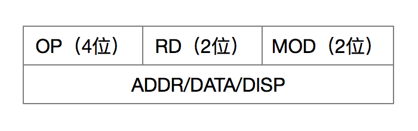

### 指令系统

大纲要求
> 1. 机器指令与指令系统的基本概念。
> 2. 指令格式
>   1. 机器指令的基本格式。
>   2. 指令操作码扩展技术。
> 3. 寻址方式
>   1. 寻址方式的基本概念：定义、设置的目的与意义。
>   2. 数据寻址与指令寻址。
>   3. 常见的数据寻址方式和指令寻址方式。
> 4. 指令类型。
> 5. CISC和RISC的特点。
> 6. 机器语言程序的编写与阅读。

### 内容精讲

### 例题精解

#### 选择题

-----

2011

----------

【例题】下面有关微指令、指令和微程序、程序的说法中，正确的是\_\_\_\_\_\_\_。

A. 每一条指令对应着一条微指令

B. 每一条指令就是由一段微程序来解释执行的

C. 程序就是由微程序构成的，指令就是由微指令构成的

D. 程序是指令的有序集合，而指令是微程序的有序集合

【例题】现有四级指令流水线，分别完成取址、取数、运算、传送结果4步操作，若完成上述操作的时间依次是9ns、10ns、6ns、8ns，则流水线的操作周期应设计为\_\_\_\_\_\_\_。

A. 6ns

B. 8ns

C. 9ns

D. 10ns

-------

2012

---------------

【例题】下面有关微指令、指令和微程序、程序的说法中，正确的是\_\_\_\_\_\_\_\_。

A. 每一条指令的功能是由一条微指令来实现的

B. 每一条指令的功能是由一段微程序来实现的

C. 程序由微程序构成，指令由微指令构成

D. 程序是指令的有序集合，而指令是微程序的有序集合

【例题】现有四级指令流水线，分别完成取址、取数、运算、传送结果4步操作，若完成上述操作的时间依次是90ns、100ns、60ns、80ns，则流水线的操作周期应设计为\_\_\_\_\_\_\_。

A. 60ns

B. 80ns

C. 90ns

D. 100ns

#### 填空题

------

2011

--------------

【例题】微指令按照格式可以分为\_\_\_\_\_\_\_和\_\_\_\_\_\_\_两种，前者的并行操作能力强，但字长较长；前者的并行操作能力弱，但字长较短。

【例题】指令系统中有多种寻址方式。\_\_\_\_\_\_\_\_寻址方式表明操作数在内存中的地址，存放在寄存器中，而指令中给出寄存器编号；\_\_\_\_\_\_\_\_寻址方式表明操作数在内存中的地址存放内存中另一个存储单元中，而指令中给出该存储单元地址。

---------

2012

--------------

RISC是指\_\_\_\_\_\_\_\_\_\_\_\_\_\_\_\_\_\_\_，CISC是指\_\_\_\_\_\_\_\_\_\_\_\_\_\_\_\_\_\_。

#### 名词解释

1. 指令系统
2. 微指令
3. 微程序
4. 指令周期
5. RISC
6. 寻址方式

#### 简答题

---------

2011

---------------

【例题】指令包含哪几部分？各表示什么含义？

-----------

2012

----------------

【例题】什么叫机器指令？什么叫指令系统？机器指令包括哪几部分？各表示什么含义？

【例题】写出RISC的5个特点

#### 计算分析题

----

2011

----------

【例题】设某机寄存器字长8位，用16进制表示，已知：变址寄存器内容为10H，PC的内容为12H，每取完一个指令字，PC就自动增2。内存中部分单元内容如下：

| 地址 | 内容 | 地址 | 内容 | 地址 | 内容 | 地址 | 内容 |
| :--: | :--: | :--: | :--: | :--: | :--: | :--: | :--: |
| 10H  | 12H  | 14H  | 18H  | 1AH  | 33H  | 22H  | 66H  |
| 11H  | 13H  | 15H  | 19H  | 1BH  | 44H  | 23H  | 77H  |
| 12H  | 14H  | 18H  | 11H  | 20H  | 66H  | 24H  | 88H  |
| 13H  | 15H  | 19H  | 22H  | 21H  | 55H  | 25H  | 99H  |

每条指令2个字节，格式如下：

操作码/寻址方式（8位）

立即数/直接地址/间接地址/形式地址/偏移量（8位）

若当前指令分别为下列寻址方式，求出操作数有效地址及操作数各为多少？

| 寻址方式 | 直接 | 变址 | 间接 |    立即     |
| -------- | :--: | :--: | :--: | :---------: |
| 有效地址 |      |      |      | ----------- |
| 操作数   |      |      |      |             |

---------

2012

-------------

【例题】设某8位计算机指令格式如下：

其中，RD为目的寄存器号，MOD为寻址方式嘛字段，指令第二字为地址、数据或偏移量；源操作数由MOD字段和指令第二字段共同确定，除了HALT指令为单字指令外，其他指令均为双字指令；JMP指令则由源操作数指出转移地址。各字段解释如下表。

| 指令助记符 | OP   | 指令助记符 | OP     | MOD  | 寻址方式 | RD   | 寄存器 |
| ---------- | ---- | ---------- | ------ | ---- | -------- | ---- | ------ |
| MOV        | 0000 | SBB        | 0100   | 00   | 立即寻址 | 00   | R0     |
| ADD        | 0001 | JMP        | 1000   | 01   | 直接寻址 | 01   | R1     |
| SUB        | 0010 | …….        | ...... | 10   | 相对寻址 | 10   | R2     |
| AND        | 0011 | HALT       | 1111   | 11   | 变址寻址 | 11   | R3     |

（1）指令AND R0, [66H]的功能是将R0寄存器的内容与内存地址66H单元的内容，进行“逻辑与”操作，结果存入R0寄存器，写出该条指令的机器码

（2）内存地址的部分单元内容如下表，若（PC）= 12H，变址寄存器（SI）= 10H，则此时启动程序执行，请写出前两条指令的功能、寻址方式、操作数、执行结果。

| 单元地址 | 内容 | 单元地址 | 内容 | 单元地址 | 内容 |
| -------- | ---- | -------- | ---- | -------- | ---- |
| 10H      | 50H  | 14H      | 14H  | 18H      | 25H  |
| 11H      | 60H  | 15H      | 30H  | 19H      | 13H  |
| 12H      | 07H  | 16H      | 82H  | 20H      | 15H  |
| 13H      | 08H  | 17H      | 20H  | 21H      | 17H  |

（3）写出程序执行的第四条指令的地址

### 习题精练