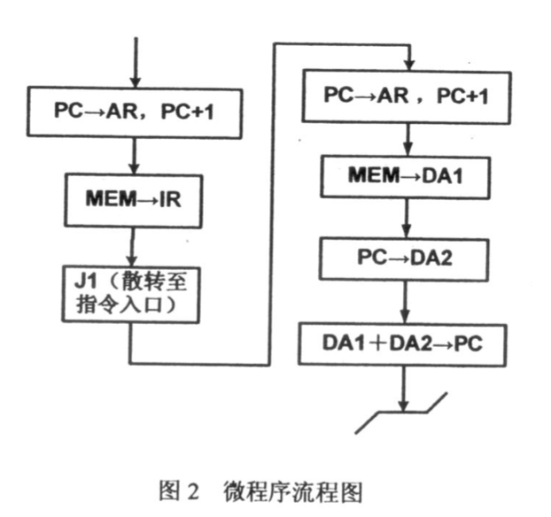

## 控制器

大纲要求
> 1. 控制器的组成与功能。
> 2. 两种控制器的特点和区别：硬布线控制器、微程序控制器。
> 3. 系统结构与数据通路。
> 4. 指令执行过程。
> 5. 指令周期、机器周期与时钟周期。
> 6. 硬布线控制器
>    1. 硬布线控制器的组成。
>    2. 硬布线控制器的设计。
> 7. 微程序控制器
>    1. 基本概念：微命令、微指令、微程序、微地址、控制存储器。
>    2. 微指令格式与微指令编码。
>    3. 微程序控制器的组成。
> 8. 指令流水线的基本概念。

### 内容精讲

### 例题精解

#### 选择题

-------

2011

---------

【例题】在微指令控制字段的分段译码方法中，微命令的分组原则是：\_\_\_\_\_\_\_。

A. 相容性的微命令分在不同组，相斥性的微命令分在同一组

B. 相容性的微命令分在同一组，相斥性的微命令分在不同组

C. 没有一定的规律

D. 以上都不对

---------

2012

----------

【例题】控制存储器中存放的是\_\_\_\_\_\_\_\_，它属于计算机五大部件中的\_\_\_\_\_\_\_部件。

A. 指令码，存储器

B. 微程序，控制器

C. 机器码，输入输出设备

D. 状态码，运算器

【例题】对于微程序控制器，下面说法错误的是\_\_\_\_\_\_\_\_。

A. 微指令中的下址段同指令中的地址码一样，用于指明操作数的地址。

B. 微程序控制器中的指令译码器的功能就是根据指令操作码来得到指令的微程序入口地址

C. 为实现动态微程序设计的功能，要求控制存储器必须为读写存储器

D. 两级微程序设计中，微指令是垂直型微指令，毫微指令是水平型微指令

#### 名词解释

1. 控制存储器
2. Cache
3. 相连存储器

#### 简答题

------

2011

------------

【例题】比较硬布线控制器和微程序控制器的异同点。

-------

2012

--------------

【例题】从工作原理、执行速度、规整性、易扩充性和适用场合几个方面来比较硬布线控制器和微程序控制器的不同点。

#### 综合设计题

-----

2012

----------

某8位模型机采用微程序控制器，结构如下图所示。其中MEM位主存，R0～R3是通用寄存器。各部件的控制信号均已标出，控制信号的命名准则是：’→‘符号前的数据发送方部件，’→‘符号后是数据接收方部件。并且控制信号中的B表示总线：J1控制指令译码，其他读写信号具有普通意义。

例题：B→DA1表示总线上的数据送入DA1暂存器；ALU→B表示ALU运算的结果送到总线上（低电平有效）。RD表示目的寄存器，RS表示源寄存器，S3～S0、M、Ci用于选择控制ALU和移位器的功能。

（1）图一中共有25个微操作控制信号，其中J1～J3三个信号是用于微指令转移的判别测试条件。如果微指令中，控制字段采用直接控制法，判别测试字段采用译码法编码，下址字段8位，则微指令字长多少位？该模型机的控存容量是多少？

（2）写出MEM→IR微指令必须发送的微操作控制信号。

（3）模型机的某条指令的微程序流程如图2所示，请问该指令有几个字节？每个字节的含义是什么？写出该条指令的功能和操作数的寻址方式。

（4）根据图1所示的数据通路，写出ADD RD, [ADDR]指令的微程序流程图。该指令功能位(RD) + (ADDR) → RD，即寄存器RD呢内容与内存单元ADDR的内容相加，结果送回RD寄存器，ADDR位于指令第二字。

### 习题精练