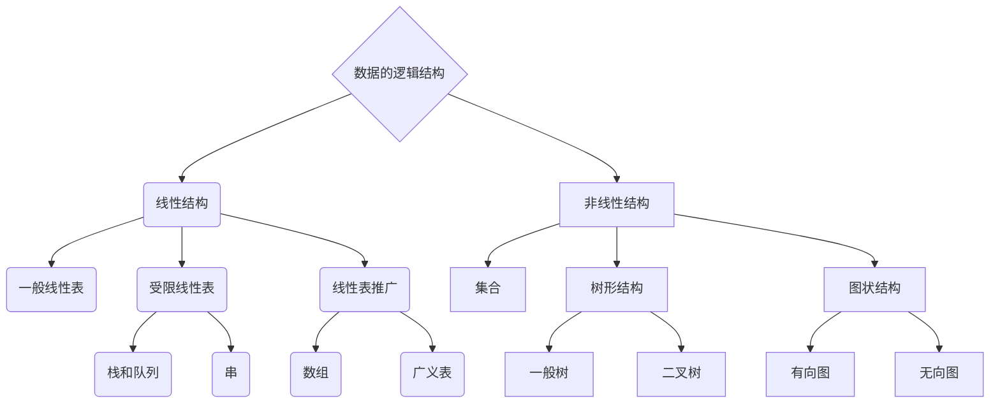

## 数据结构的一般概念
大纲要求
> 1. 掌握数据结构的基本概念和术语。 
> 2. 了解抽象数据类型的概念。
> 3. 掌握算法的特性，算法的描述和算法的分析。

### 内容精讲

#### 数据结构基础概念

> 数据结构是计算机存储、组织数据的方式。数据结构是指相互之间存在一种或多种特定关系的数据元素的集合。通常情况下，精心选择的数据结构可以带来更高的运行或者存储效率。数据结构往往同高效的检索算法和索引技术有关。


##### 数据结构基本术语

数据：数据是信息的载体，是描述客观事物熟悉的所有信息。

数据元素：数据元素（例如学生信息）是数据的基本单位，数据元素可由若干数据项（姓名、学号）组成。

数据对象：数据对象是有某种相同性质的数据元素的一个集合，比如大学男生是一个数据对象。

数据类型：指一组值和一组对这些值的操作的集合。比如C语言中int类型的取值范围是-2^31^到2^31^-1，int的操作包括+、-、*、/、%、<和>。原则上所有程序只使用类如int这种**原子类型**即可，但在更高层的抽象上编程可能更加方便，所以数据类型还包括**结构类型**和**抽象数据类型**。

抽象数据类型：见下文。

数据结构：指相互之间存在着一种或多种关系的数据元素的集合和该集合中数据元素之间关系组成。也可以理解为数据结构就是ADT的物理实现[^1]


##### 抽象数据类型

抽象数据类型（Abstract Data Type，ADT）是一种能够对使用者隐藏数据表示的数据类型。抽象数据类型主要是实现了数据和函数的关联，并将数据的表示方式隐藏起来。在使用抽象数据类型时，我们只需关心调用的API描述上，而不用关心具体数据表示。在实现ADT时，我们需要关注数据的具体表示方式和对这些数据的各种操作。

抽象数据类型之所以重要，是因为它使程序在设计上支持封装，比如后边我们将研究各种排序算法，我们可以通过ADT在不改变用例代码的情况下测试不同算法。


#### 算法基础概念

##### 什么是算法？

我们每天编写的程序，无论大小，一般都是实现一种已有的方法来解决某个问题，这种方法大多和编程语言无关，我们是用这种方法而不是计算机程序去描述这个解决问题的方案步骤。在计算机领域，我们用算法这个词来描述**有限**、**确定**、**有效**的适合计算机程序实现的解决问题的方法。算法是计算机科学的基础。


##### 算法的五个特性

1. 有穷性：算法必须在有限步内执行完成。
2. 确定性：算法的每一步必须有确切含义，同样的输入会有相同的输出。
3. 有效性：算法是有效可行的，即每一步都可被分解为有限个基本的可执行步。
4. 输入：一个算法有0个或多个输入，刻画运算对象的初始情况，所谓0个输入是指算法本身定出了初始条件。
5. 输出：一个算法有一个或多个输出，以反映对输入数据加工后的结果。没有输出的算法是毫无意义的。


##### 算法的描述

要定义一个算法，我们可以用自然语言描述解决某个问题的步骤，或者编写一段程序来实现这个过程。比如老祖宗发明的辗转相除法（找两个数的最大公约数）：

自然语言描述

> 计算两个非负整数p和q的最大公约数：若q是0，则最大公约数是p，否则，将p除以q得到余数r，p和q的最大公约数即位q和r的最大公约数。

C语言描述

```c
int gcd(int q, int p)
{   
	return p == 0 ? q : gcd(p, q % p);
}
```


##### 算法的简单分析

1. 时间复杂度分析[^2]

   1. 时间频度

   一个算法执行所耗费的时间，从理论上是不能算出来的，必须上机运行测试才能知道。但我们不可能也没有必要对每个算法都上机测试，只需知道哪个算法花费的时间多，哪个算法花费的时间少就可以了。并且一个算法花费的时间与算法中语句的执行次数成正比例，哪个算法中语句执行次数多，它花费时间就多。一个算法中语句的执行次数称为语句频度或时间频度，记为T(n)。

   2. 时间复杂度

   前面提到的时间频度T(n)中，n称为问题的规模，当n不断变化时，时间频度T(n)也会不断变化。但有时我们想知道它变化时呈现什么规律，为此我们引入时间复杂度的概念。一般情况下，算法中基本操作重复执行的次数是问题规模n的某个函数，用T(n)表示，若有某个辅助函数f(n)，使得当n趋近于无穷大时，T(n)/f(n)的极限值为不等于零的常数，则称f(n)是T(n)的同数量级函数，记作T(n)=O(f(n))，它称为算法的渐进时间复杂度，简称时间复杂度。

   3. O表示法

   算法复杂度分为最坏时间复杂度、平均时间复杂度、最好时间复杂度三个评估角度，这里O(f(n))表示最坏时间复杂度。
   大O表示法O(f(n))中的f(n)的值可以为1、n、logn、n²等，因此我们可以将O(1)、O(n)、O(logn)、O(nlogn)、O(n²)分别可以称为常数阶、线性阶、对数阶、线性对数阶和平方阶，那么如何推导出f(n)的值呢？我们接着来看推导大O阶的方法。

   - 用常数1来取代运行时间中所有加法常数。 
   - 修改后的运行次数函数中，只保留含n多项式最高阶项。 
   - 如果最高阶项存在且不是1，则将此项系数改为1。

   例如程序

   ```c
   int a = 100;
   a += 100;
   printf("%d\n", a);
   ```

   这段程序分三步运行，那么f(n) = 3，根据方法第一条，用1取代常数3，剩下f(n) = 1，没有含n的多项式，所以后两条用不到，结果就是O(1)。

   我们把常见的几种增加复杂度类型整理如下表：

| 量级 | 典型代码                                                     |           说明              | 计算方法                                                     |
| :--------: | :----------------------------------------------------------- | :----------------------: | :------------: |
|     1      | a = b + c;                                                   |    普通语句如两数相加       | 常数阶                                                       |
|    logn    | while(lo <= hi)<br>  int mid = lo + (hi - lo) / 2;<br>      if (key < a[mid])<br>           hi = mid - 1;<br>      else if (key > a[mid])<br>             lo = mid + 1<br>      else return mid; |    二分策略如二分查找       | 从前边代码可以看<br>出每次循环都会<br>减少剩下的1/2,假<br>设循环次数为x，<br>那么2^x^=n,所以x=logn |
|     n      | int max = a[0];<br>    for (int i = 0; i < n; i++)<br>        if (a[i] > max)<br>            max = a[i]; |    循环如找出最大元素   | 线性阶主要看循环<br>执行了多少次                        |
|   nlogn    | 略                                                           |      分治如归并排序      | 线性对数阶                                                   |
|    n^2^    | for (int i = 0; i < n; i++)<br>    for(int j = i + 1; j < n; j++)<br>        if (a[i] + a[j] == 0)<br>              cnt++; | 双层循环如检查所有元素对 | 需要注意的是内循<br>环中int j=i，而不<br>是int j=0。当i=0<br>时，内循环执行了<br>n次，i=1时内循环<br>执行了n-1次，当<br>i=n-1时执行了<br>1次,我们可以推算<br>出总的执行次数为：<br>n+(n-1)+(n-2)+...+1<br>=(n+1)+[(n-1)+2]<br>+[(n-2)+3]+...<br>=(n+1)+...+(n+1)<br>=(n+1)n/2 <br>=n(n+1)/2 <br>=n²/2+n/2<br>根据此前讲过的<br>推导大O阶的规则<br>的第二条：<br>只保留最高阶，因此<br>保留n²/2。根据第三<br>条去掉这个项<br>的常数，则去掉1/2,最终<br>这段代码的<br>时间复杂度为O(n²)。 |
|    n^3^    | for (int i = 0; i < n; i++)<br>    for(int j = i + 1; j < n; j++)<br>        for(int k = j + 1; k < n; k++)<br>            if(a[i] + a[j] + a[k] == 0)<br>                 cnt++; | 三层循环如检查所有三元组 | 立方阶                                                       |
|    2^n^    | 略                                                           |  穷举查找如检查所有子集  | 指数阶                                                       |

常见的时间复杂度有O(1)<O(logn)<O(n)<O(nlogn)<O(n^2^)<O(2^n^)


2. 空间复杂度分析 ==杭电没考过==

空间复杂度是对一个算法在运行过程中临时占用存储空间大小的量度，它是问题规模n的函数，渐进空间复杂度常简称为空间复杂度，记为S(n)=O(g(n))。

一个程序除了需要存储本身用到的指令、常数、变量等之外，还要对对数据进行操作的工作单元和存储一些为实现计算所需信息的辅助空间，若输入信息所占空间只取决于问题本身，和算法无关，则只分析除输入和算法之外的额外空间。

算法**原地工作**是指算法所需辅助空间是常量，即O(1)。

### 例题精解

【例题1】 数据结构通常有下列4种基本结构：线性结构、树型结构、图型结构、___________________。

答案：集合


【例题2】 线性表的顺序存储结构优于链式存储结构（   ）。

答案：错误


【例题3】 数据元素是数据的基本单位（   ）。

答案：正确


【例题4】 为度量一个算法的性能，需要在时间和空间方面进行权衡（   ）。

答案：正确


【例题5】数据的逻辑结构和物理结构密切相关，一个算法的设计取决于数据的逻辑结构，

而实现依赖于数据的存储结构（  ）。

答案：正确


【例题6】 从逻辑上可以把数据结构分成（     ）。

A. 动态结构和静态结构                 B. 顺序组织和链式组织

C. 线性结构和非线性结构             D. 基本类型和组合类型

答案：C

解析：数据的逻辑结构可分为：




【例题7】 设n是描述问题规模的非负整数，下面程序片段的时间复杂度是（    ）。

```c
void fuc(int n){
    int i = 1;
    while(i<=n)
    	i=i*2;
}
```

A. O(n)                                    B. O(n^2^)

C. O(nlog~2~n)                           D. O(log~2~n)

答案：D

解析：基本语句是i=i*2，且i最终要到大于n停止，i每次循环将增大2倍，设需要循环x次，则2^x^=n，即x=log~2~n。所以选D. O(log~2~n)。


【例题8】 求整数n（n>=0）阶乘的算法如下，其时间复杂度是（    ）。

```c
int fact(int n){
    if (n<=1) return 1;
    return n*fact(n-1);
}
```

A. O(log~2~n)                             B. O(n)

C. O(nlog~2~n)                           D. O(n^2^)

答案：B

解析：观察发现fact函数递归调用自己，每次参数减少1，从n乘到1，执行了n次递归，也就实现了n\*(n-1)\*(n-2)\*...\*1，即O(n)。


【例题9】 已知两个长度分别为m和n的升序链表，若将他们合并成一个长度为m+n的降序链表，则最坏情况下的时间复杂度是（    ）。

A. O(log~2~n)                              B. O(m*n)

C. O(min(m, n))                      D. O(max(m, n))

答案：D

解析：将两个升序链表合并，并改变链表的排序方向，我们首先想到的就是将两个链表中元素一一比较，即将较小的放到新链表，移动头指针到下一个位置，再比较两个链表的头指针所指元素大小，如此循环下去，直到一个链表用完，再将另一个链表全部放到新链表后边即可。最坏情况就是两个链表所有元素都进行比较，此时时间复杂度为O(max(m, n))。


【例题10】 下列程序段的时间复杂度是（    ）。

```c
count = 0;
for (k = 1; k <= n; k*=2)
	for (j = 1; j <= n; j++)
		count++;
```

A. O(log~2~n)                              B. O(n)

C. O(nlog~2~n)                            D. O(n^2^)

答案：C

解析：外层是log~2~n（同例题7），内层是1到n的循环是O(n)，所以结果O(nlog~2~n)。


【例题11】 下列函数的时间复杂度是（    ）。

```c
int func(int n) {
    int i = 0, sum = 0;
    while(sum < n) sum += ++i;
    return i;
}
```

A. O(logn)                                B. O(n^1/2^)

C. O(n)                                     D. O(nlogn)

答案：B

解析：观察sum += ++i，设一共要循环x次，可列出1+2+3+...+x = n，解方程得x=[-1+(1+8n)^1/2^]/2，时间复杂度即为O(n^1/2^)


### 习题精炼


求解斐波那契数列 $$  F(n) = \begin{cases} 1, & \text{n=0,1} \\ F(n-1)+F(n-2),& \text{n>1} \end{cases} $$ 有两种常用的算法：递归算法和非递归算法。试分别分析两种算法的时间复杂度。


--------------

说明

例题精解中题目全部取自杭电历年数据结构真题和408真题

习题真练为笔者即兴取题

------------

### 参考文献


[^1]: [数据结构与算法分析](https://baike.baidu.com/item/%E6%95%B0%E6%8D%AE%E7%BB%93%E6%9E%84%E4%B8%8E%E7%AE%97%E6%B3%95%E5%88%86%E6%9E%90).
[^2]: [算法（一）时间复杂度](https://blog.csdn.net/itachi85/article/details/54882603)