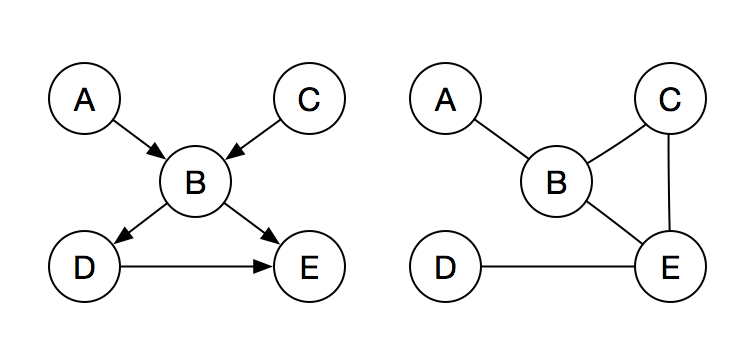
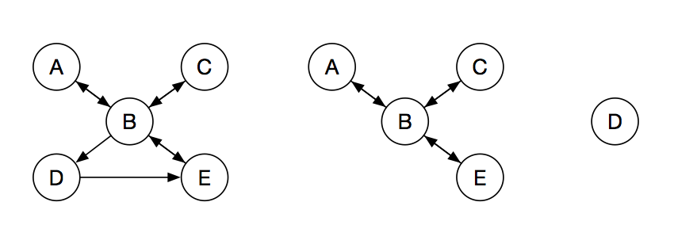
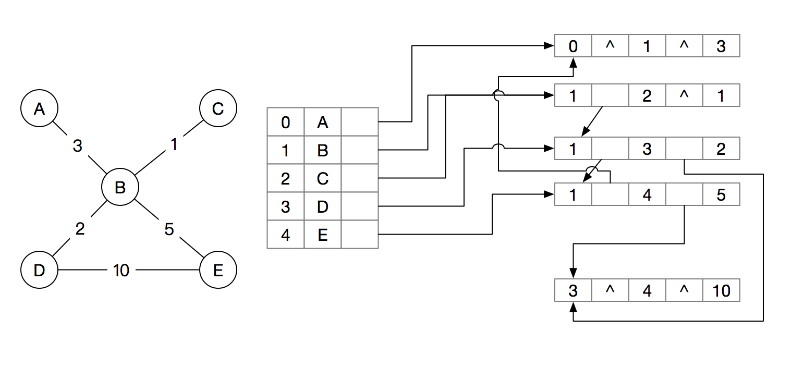
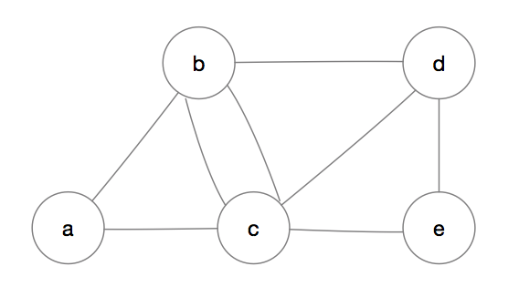
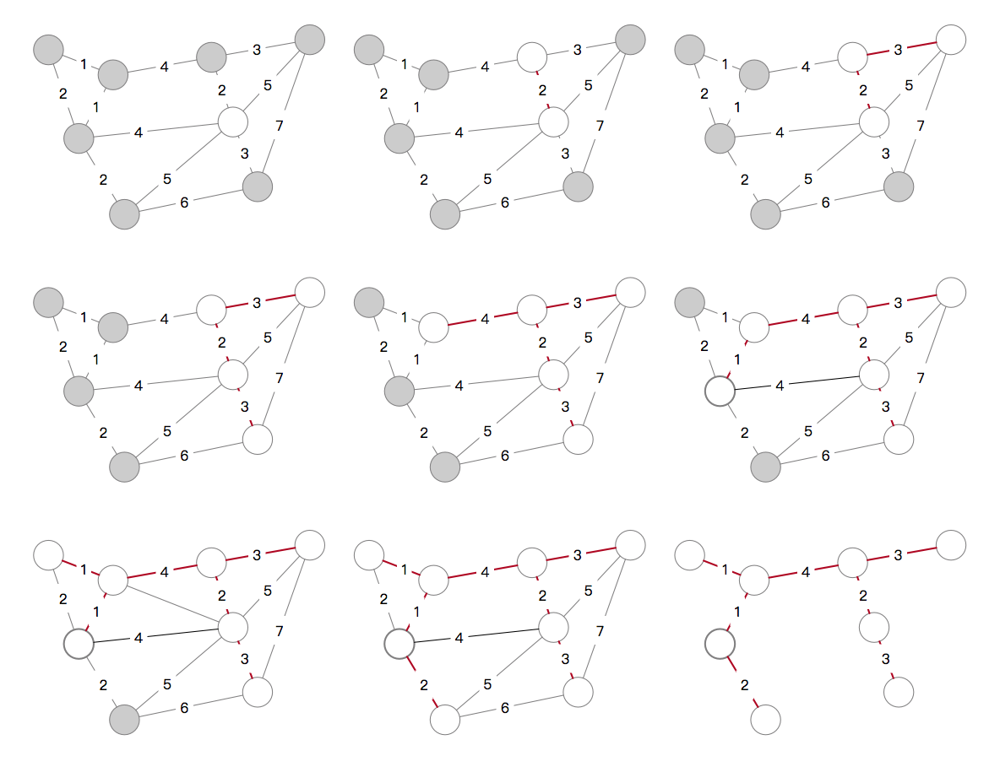
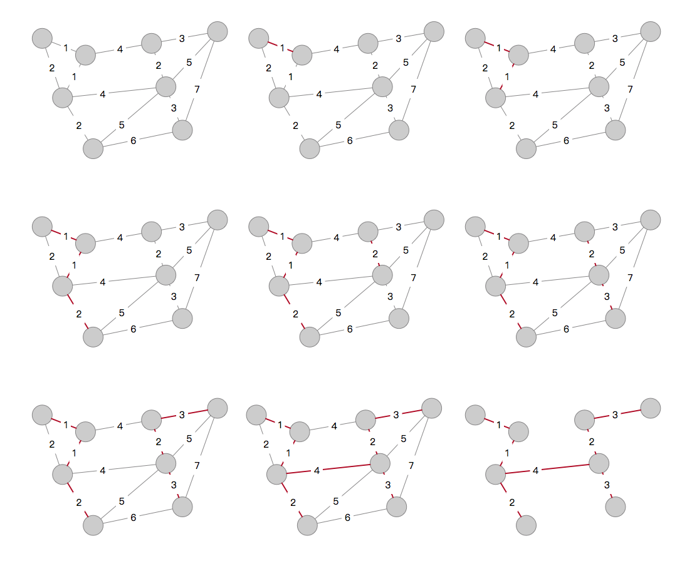
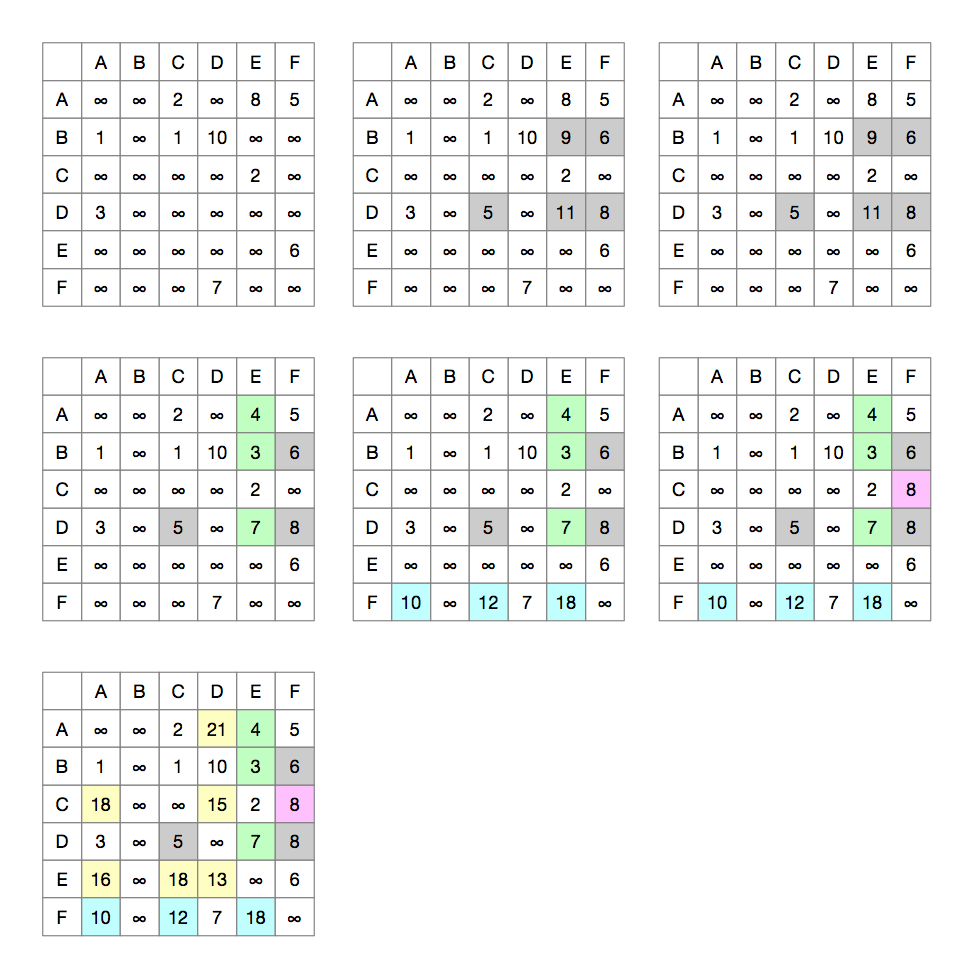
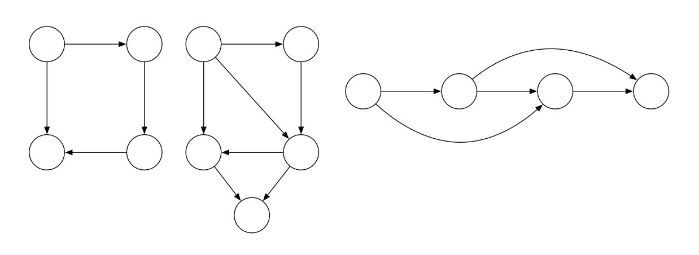
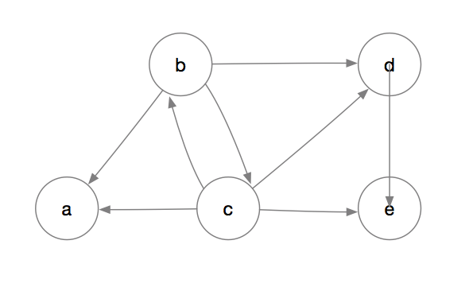

## 图

大纲要求
> 1. 掌握图的定义和术语。
> 2. 掌握图的存贮结构；理解图的基本操作。
> 3. 掌握图的遍历算法；了解利用图的遍历解决图的应用问题。
> 4. 理解图的有关应用：求最小生成树、求最短路径、拓扑排序及关键路径等算法的基本思想。


### 内容精讲

#### 图的基本概念

图G由顶点V和边集E组成，记为G=(V, E)，其中V(G)表示图G中顶点的有限非空集；E(G)表示图G中边集。这里要注意的是线性表可以是空表，树可以是空树，但图不能是空图，至少有一个顶点。



##### 图的基本术语

- 有向图：


若E是有向边的集合，则图G为有向图。这时边也叫弧，记为<v, w>，v指向w，v称为弧尾，w称为弧头，称为从顶点v到顶点w的弧，也称v邻接到w，或w邻接自v。上图1记为G<sub>1</sub>：

```
G1 = (V, { E }) 
其中  V = {A, B, C, D, E}
     E = {<A, B>, <C, B>, <B, D>, <B, E>, <D, E>}
```

- 无向图

若E是无向边的有限集合，则图G为无向图。边是顶点的无序对，记为(v, w)或(w, v)，v和w是顶点，可以称顶点w和顶点v互为邻接点。或者说边(v, w)和顶点v、w相关联。上图2记为G<sub>2</sub>：

```
G2 = (V, { E })
其中 V = {A, B, C, D, E}
    E = {(A, B), (B, C), (C, E), (E, D), (E, B)}
```

- 简单图

若图满足a. 没有到自己的边 b. 没有重复边，则此图为简单图，考研数据结构只考简单图。

- 多重图

非简单图即为多重图

- 完全图

任意两个顶点之间都有最多边的简单图为完全图，即无向图中任意两点间都有边（n(n-1)/2条），有向图中任意两点中都有相反的两条弧（n(n-1)条）。

- 子图

子图通俗来讲就是包含与被包含的关系，比如下边图都是图G1的子图


- 连通、连通图、连通分量

在无向图中，若从顶点v到顶点w的路径存在，则称v和w是联通的，若图G中任意两个顶点都是联通的，则图G为联通图，否则是非联通图。无向图中极大联通子图被称为联通分量。如下图中后两图都是第一图的联通分量。


这里说明一下**极大连通子图**和<span id="jxltzt">**极小连通子图**</span>的概念，首先明确极大连通子图可以存在于无向图也可以存在于有向图中，而极小连通子图只存在于连通的无向图中。

无向图可以分成两种类型：连通的无向图、不连通的无向图.连通的无向图只有一个极大连通子图，即它本身，因为不存在另一个连通的子图包含的点和边比它本身还要多，所以叫作极大连通子图。不连通的无向图可以拆分为若干个连通的无向图，如果我们在拆分时注意把能连通的点边都放在一个连通子图中,使这个连通子图足够，,以至于再多包含一个点或边它就变成不连通的了，我们称这个连通子图为极大连通子图。

极小连通子图只存在于连通的无向图中，也就是说该图中只有一个连通分量（极大连通子图），之所以说它极小,是因为极小连通子图只要求包含图中所有顶点及其比顶点数量少一个的边（且不能成环），也就是说如果给极小连通子图任意两个顶点间加入一条边，则必有环。

极大和极小不是指一个意思，不要弄混了。极大连通子图是讨论连通分量的，极小连通子图是讨论生成树的。

- 强连通图、强连通分量

在有向图中，若在顶点v、w之间有两条互相连接的路径，则称这两个顶点时强连通的。若图中任意一对顶点都是强连通的，则此图为强连通图。有向图中极大强连通子图称为有向图的强连通分量，如下图所示：



- 生成树、生成森林

连通图的生成树是包含图中所有顶点的一个极小连通子图。顶点数为n的图的生成树有n-1条边，生成树如果少一条边即会不连通，多一条边即会出现环。非连通图的连通分量的生成树构成了非连通图的生成森林。下图即为生成树示意图：


- 顶点的度

顶点的度是和顶点相关联的边的数目，记为TD(V)。

对于无向图，图中顶点度之和等于边数的两倍。

对于有向图，度分为入度和出度，入度是以顶点为终点的边的条数，记为ID(V)，出度是以顶点为起点的边的条数，记为OD(V)，T(V) = ID(V) + OD(V)。有向图的所有顶点入度之和等于出度之和等于边数。

- 边的权和网

在一个图中，每条边上都标出某个具有某种意义的数值，该值被称为权，这种带权的图称为带权图，也叫网。

- 稠密图和稀疏图

边数很少的图叫稀疏图，反之稠密图。

- 路径

顶点v<sub>p</sub>到顶点v<sub>q</sub>的一条路径指顶点v<sub>p</sub>, v<sub>1</sub>, v<sub>2</sub>, ..., v<sub>n</sub>, v<sub>q</sub>，路径上边的数目为路径长度，第一个顶点和最后一个顶点重合的路径称为环或回路。

- 简单路径、简单回路

在路径序列中，顶点不重复出现的路径称为简单路径，处第一个顶点和最后一个顶点外其它顶点不重复出现的回路称为简单回路。

- 距离

顶点v到顶点w之间的最短路径若存在，则此路径称为v到w的距离，若不存在路径，则距离为∞。

- 有向树

有一个顶点入度为0，其余顶点入度为1的有向图称为有向树。


#### 图的存储及基本操作

图的存储要求能完整、准确的反映顶点和边的信息，所以不论用何种方法存储，目的是一致的，只是不同的方法会给使用时的效率产生较大的影响，这里介绍四种方法。


##### 数组表示法

数组表示法也叫邻接矩阵法，是用一个一维数组存储顶点信息，一个二维数组存储边的信息的方法。存储边（即各顶点之间关系）的二维数组称为邻接矩阵。

结点数为n的图G，其邻接矩阵时n*n阶的，若v<sub>i</sub>和v<sub>j</sub>之间存在路径，则A\[i\]\[j\] = 1, 否则为0。对于带权图，如果两顶点间有路径存在则A\[i\]\[j\] = 权重，用∞或0表示两点间不存在路径。


其结构可以定义如下：

```c
#define MAXVERTEXNUM 10

struct Graph
{
    VertexType vex[MAXVERTEXNUM];
    int edge[MAXVERTEXNUM][MAXVERTEXNUM];
    int vexnum;        // 图当前顶点数
    int arcnum;        // 当前弧数
};
```


##### 邻接表

如果图是稀疏图，那采用上边的邻接矩阵存储将会浪费大量空间，邻接表法解决了这个问题，邻接表法和前边树的孩子表示法有异曲同工之妙。

邻接表法是对图中每个顶点建立一个单链表，每个单链表表示依附于该顶点的边（或从顶点出来的弧），这个单链表就称为顶点的边表（出边表）。另一个表是顶点表，保存着顶点信息和边表的头指针，所以在以邻接表存储的图中有两种结点：边结点、顶点结点。存储逻辑如下：


其结构体定义为：

```c
struct ArcNode
{
    int adjvex;            // 该弧指向的顶点位置
    int weigh;             // 权值
    struct ArcNode *next;  // 该弧指向的下一条弧
};
struct VexNode
{
    VertexType data;
    struct ArcNode *first;  // 指向从该顶点出发的第一条弧的指针
};
struct AGraph
{
    struct VexNode adjList[MAXVERTEXNUM]; // 邻接表
    int vexnum;                           // 图的顶点数
    int arcnum;                           // 图的弧数
};
```


##### 十字链表

在邻接表存储方式中，访问一个方向（进or出）一个结点可以很容易，但要是既要访问某结点的下一个结点又要访问上一个结点就不容易了。十字链表是**有向图**的另一种链式存储方式，解决了邻接表的问题。

在十字链表存储方式中，每个顶点有一个对应的结点，每个弧也有一个结点，结点定义如下：

- 顶点结点

顶点结点有3个域，data域存放数据信息，firstin指向第一个以该顶点为弧尾的弧结点，firstout指向第一个以该顶点为弧头的弧结点。

- 弧结点

弧结点有5个域，start为弧尾顶点在图中的位置，end为弧头顶点的位置，nextin指向下一个以end为弧头的结点，nextout指向下一个以start为弧尾的结点，weight为此边权重。存储逻辑如下图：


具体结构可以这样定义：

```c
struct GArcNode
{
    int start;
    int end;
    struct GVexNode* nextin;
    struct GVexNode* nextout;
    int weight;

};
struct GVexNode
{
    VertexType data;
    struct GArcNode *firstin;
    struct GArcNode *firstout;
};
struct GGraph
{
    struct GVexNode list[MAXVERTEXNUM];
    int vexnum;
    int arcnum;
};
```


##### 邻接多重表

邻接多重表是为**无向图**设计的另一种链式存储结构，在邻接表中，对无向图中每条边会存储两次，这样无疑是不优雅的，邻接多重表应用而生。

与十字链表类似，邻接多重表中每个顶点和边也用一个节点表示，其顶点结点有两个域，分别是数据域和指向与之相连第一条边的一个指针。边结点有5个域，分别存储该边依附的两个顶点在图中的位置，和分别依附与这两个顶点的下一条边，还有一个域保存边的权重。如下图：



代码定义：

```c
struct AMArcNode
{
    int ivex;
    int jvex;
    struct AMArcNode *inext;
    struct AMArcNode *jnext;
    int weight;
};
struct AMVexNode
{
    VertexType data;
    AMArcNode *firstedgt;
};
struct AMGraph
{
    struct AMVexNode list[MAXVERTEXNUM];
    int vexnum;
    int arcnum;
};
```


##### 图的基操

图的基本操作独立于图的存储结构，不同结构其对应操作的性能也会有很大不同，下边罗列一下图的基本操作。

- CreateGraph(&G, V, VR);
- DestroyGraph(&G);
- LocateVex(G, u);
- GetVex(G, v);
- PutVex(G, v, value);
- FirstAdjVex(G, v);
- NextAdjVex(G, v, w);
- InsertVex(&G, v);
- DeleteVex(&G, v);
- InsertArc(&G, v, w);
- DeleteArc(&G, v, w);
- DFSTraverse(G, Visit());
- BFSTraverse(G, Visit());


#### 图的遍历

图的遍历要求我们从某一顶点出发，对每个顶点访问且仅访问一次的过程。这一块主要涉及到2个思想过程，广度优先和深度优先，类比到树，广度优先就好像树的层次遍历，即访问一个节点，再访问与之直接相连的节点，一层一层向下；深度优先好比树的先根遍历法，现深入到树根，再往上遍历。


##### 广度优先搜索（BFS）

这种搜索类似于二叉树的层次遍历，基本思想是首先访问起始顶点v，接着从v出发，访问与v邻接的顶点v<sub>1</sub>、v<sub>2</sub>…，v<sub>n</sub>，然后再依次访问v<sub>1~n</sub>的邻接顶点，这样一层一层访问下去，直到所有顶点都被访问一遍。

要实现广度优先算法，要借助一个队列结构，用以记忆正在访问顶点的下一层顶点。其代码如下：

```c
int visited[MAXVERTEXNUM];
void BFSTraverse(Graph G)
{
    // 辅助数组visited标志顶点是否被访问过，这里先初始化为都没被访问。
    for (int i = 0; i < G.vexnum; i++)
    {
        visited[i] = FALSE;
	}
    // 初始化队列
    InitQueue(Q);
    // 循环遍历
    for (int i = 0; i < G.vexnum; i++)
    {
        if (!visited[i])
            BFS(G, i);
    }
}
void BFS(Graph G, int v)
{
    // 访问初始顶点v
    visit(v);
    visited[v] = TRUE;
    // 将v入队
    Put(Q, v);
    while(!isEmpty(Q))
    {
        // 将v出队
        Poll(Q ,v);
        // 访问v的所有邻接顶点
        for (w = FirstAdjVex(G, v); w >= 0; w = NextAdjVex(G, v, w))
        {
            // 没有被访问过则访问并入对
            if (!visited[w])
            {
                visit(w);
                visited[w] = TRUE;
                Put(Q, w);
            }
        }
    }
}
```

这里也像别人一样，举个例子：



- 假设从a节点开始访问，将其visited置为访问过标志，并将其入队；

- 此时对列非空，进入循环，将a出队，w有邻接顶点b，且b没有被访问过，访问b，并将b的visited置为访问过，将b入队；

- 接着访问a的下一个邻接顶点c，c之前没有被访问过，访问c，并将c的visited置为访问过，将c入队；

- 此时a没有邻接顶点了，for循环结束，此时队列里有b、c两个元素，将b出队，b有邻接顶点d，且d没有被访问过，访问d，将d的visited置为访问过，将d入队；

- 这时b没有邻接顶点了，跳出for循环，此时队列有c、d，c出队，b有邻接顶点b，但b被访问过，则看下一个邻接顶点d，d也被访问过，看下一个顶点e，e没有被访问过，访问e，将e的visited置为访问过，将e入队；

- 此时队列有d、e，将d出队，d的邻接顶点都被访问过，e出队，e的邻接顶点都被访问过，此时队列为空队列，广度遍历结束。


##### BFS的应用

###### 单源最短路径问题

由于广度优先遍历访问的次序是由近到远的，所以对于一个非带权图来说，用BFS可以找到单源最短路径。算法如下：

```c
// G为要找最短路径的图
// u为基点
void BFSMinDistance(Graph G, int u)
{
    for (int i = 0; i < G.vexnum; i++)
    {
        // d[i]存储顶点i到u的距离
        d[i] = -1;
    }
    visited[u] = TRUE;
    d[u] = 0;
    Put(Q, u);
    while(!isEmpty(Q))
    {
        Poll(Q, u);
        for (w = FirstAdjVex(G, u); w >= 0; w = NextAdjVex(G, u, w))
        {
            // 没有被访问过则访问并入对
            if (!visited[w])
            {
                visit(w);
                d[w] = d[u] + 1;
                Put(Q, w);
            }
        }
    }
}
// 此算法和上边的BFS遍历算法完全一样，不详细按步骤介绍了。
```


###### 广度优先生成树

可以利用广度优先遍历得到一棵遍历树，称之为广度优先生成树。由于图的邻接矩阵表示是唯一的，所以生成树是唯一的，二邻接表不唯一，生成树也不唯一。连通图可以生成一棵树，非连通图会生成森林。如下图是图的广度优先生成树事例：


##### 深度优先搜索（DFS）

这种搜索算法类似于树的先根遍历，是先根遍历的推广。基本思想是先从图的一个顶点v出发，访问与v邻接且未被访问的顶点w<sub>1</sub>，接着访问与w<sub>1</sub>邻接且未被访问的顶点w<sub>2</sub>，依次进行下去，直到不能再继续访问，退回到最近一个被访问的顶点，若它还有未被访问的邻接点，则继续上述过程，直到所有点都被访问完。

DFS的递归代码如下：

```c
int visited[MAXVERTEXNUM];
void DFSTraverse(Graph G)
{
    // 辅助数组visited标志顶点是否被访问过，这里先初始化为都没被访问。
    for (int i = 0; i < G.vexnum; i++)
    {
        visited[i] = FALSE;
	}
    // 循环遍历
    for (int i = 0; i < G.vexnum; i++)
    {
        if (!visited[i])
            DFS(G, i);
    }
}
void DFS(Graph G, int v)
{
	visit(v);
    visited[v] = TRUE;
    for (w = FirstAdjVex(G, u); w >= 0; w = NextAdjVex(G, u, w))
    {
        // w是G中未被访问过的u的邻接顶点
        if (!visited[w])
            DFS(G, w);
    }
}
```

再举个例子：


- 假设从a节点开始访问，将其visited置为访问过标志。找到a的第一个邻接点b，b没有被访问过，对b进行DFS。
- 访问b，将其visited置为访问过标志，找到b的第一个邻接点c，c没有被访问过，对c进行DFS。
- 访问c，将其visited置为访问过标志，找到c的第一个邻接点b，b被访问过，找下一个邻接点e，e没有被访问过，对e进行DFS。
- 访问e，将其visited置为访问过标志，找到e的第一个邻接点d，d没有被访问过，对d进行DFS。
- 访问d，将其visited置为访问过标志，d的所邻接点都被访问过，结束本次访问。
- 结束DFSTraverse中的第一层for循环，进入第二层。所有结点已经被访问过，所以后序for循环都是空循环，DFS完成。


##### DFS的应用

###### 深度优先生成树

和广度优先生成树一样，深度优先遍历也是对连通图生成一棵树，非连通图生成森林，分别称为深度优先生成树和深度优先生成森林。同样，基于邻接表的深度优先树不唯一。下图是一个例子：


#### 图的应用

##### 最小生成树

一个连通图的生成树是图的[极小连通子图](#jxltzt)，对一个带权的无向连通图G = (V, E)，生成树不同，每棵树的权也可能不同，在所有生成树中找到权值最小的那棵，即为最小生成树。举个讲人话的例子：下沙大学城有一堆大学，你每天早上要在杭电、理工、传媒、计量、财经这几所大学间跑步，设计路线可以经过每所学校，其中最短那条路线（包含学校）就是最小生成树。通过这个例子我们可以知道：

- 最小生成树不唯一，杭电 -> 传媒 -> 理工 -> 杭职院 和 传媒 -> 杭电 -> 杭职院 -> 理工都是最小生成树。
- 最小生成树的边权值之和唯一，如果不唯一，那最小那个才是最小生成树。
- 最小生成树边数是顶点树减1。

构造最小生成树的算法为一般为先在所有顶点之间找到权值最小的边，将其放入树中，再在剩下的顶点之间找最小权值边，再把它们放入树中，最后将合成最小生成树。下边介绍具体算法。


###### Prim算法

这个算法很古老，和下边要说的Kruskal算法在《算法·第四版》中都将其描述为“最古老和最知名的算法之一”我们当然要掌握。

Prim算法思想很朴素，即先任找一点，放入结果集，再在所有与结果集相连的边中找出代价最小的边，将此顶点放入结果集，直到顶点集包含所有顶点，此时边集必然有顶点数减1条边，此时Prim算法完成。可视化的过程如下图：



算法的简单伪代码描述如下：

```c
void Prim(G, T)
{
    T = NULL;
    U = { w };    // 初始化添加任意一点到结果顶点集
    while(V - U)  // 若所有点没有被包含进结果集
    {
        (u, v) = min{(U, V) | u ∈ U, v ∈ (V - U)};
        T = T ∪ {(u, v)};
        U = U ∪ {v};
    }
}
```

Prim算法的时间复杂度为O(V<sup>2</sup>)，不依赖于边，因此可以求稠密图的最小生成树。


###### Kruskal算法

Kruskal算法的思想同样朴素，是一种按权值递增的顺序选择边的方法，先将每个顶点看成是单独的树，整个图构成了一个森林，在森林中依次寻找权值最小的边，如果加入这条边会构成回路，则忽略这条边，直到有顶点数减1条边。



Kruskal伪代码如下：

```c
void Kruskal
{
	T = V;   // 初始化结果集只包含顶点
	num = n; // 连通分量数
	while (num - 1) // 当联通分量大于1时继续循环
    {
    	(u, v) = min{(U, V)}   // 找到权值最小的边
    	if (!(v ⊂ T && u ⊂ T)) // v u不同时再一个连通分量里
        {
        	T = T ∪ {(u ,v)};
        	num--;
        }
    }
}
```

Kruskal算法的时间复杂度为O(ElogE)，适合于稀疏但顶点较多的图。


##### 最短路径

下边讨论的最短路径都是基于带权图，若是无权图，前边的广度优先搜索找到的路径即可。

最短路径的求解一般依赖两点之间最短路径也包含路径上其它顶点之间的最短路径。最短路径问题分为两类，一类是单源最短路径，即求某一点到图上各点的最短路径，常用算法为Dijkstra算法；另一种是求每一点间的最短路径，常用Floyd算法求解。


###### Dijkstra算法

狄杰斯特拉算法曾出现在了我们的数据结构、计网、算法导论课里，重要性可见一斑，然而它还并不向上边算法那么“朴素”，所以我们得再好好复习一遍。

Dijkstra算法是用来计算单源最短路径的算法，即一个点到其它各点的最短路径，路径的权值不能为负数，该算法和前边的Prim算法有相似之处，也是每一步都向最终结果中加入一条新边。具体操作是先构造一个存放已求得最短路径的点的集合s，初始化为只有给定点在s内。另外还要设置两个数组dist[]和path[]，dist[i]存放给定点到v<sub>i</sub>的路径长度，初始化dist[i] = arc\[0\]\[i\]，path[i]存放从源点到顶点i之间最短路径的下一个节点，通过path[]可以找到源点到任意点的具体路径。


对于上图，我们具体描述一下Dijkstra的操作过程：

1. 初始化S = {A}，dist = {1, ∞, ∞, 2, ∞, ∞, ∞}，path={}。
2. 从顶点集合V-S里找到到A路径最短的B，此时S = {A, B}，dist = {1, ∞, ∞, 2, ∞, ∞, ∞}，path{}
3. 已经知道A->B是最短路径，所以以B为起点，判断B到S内除了A之外的其他点的距离是否比上次计算的dist中的值小，如果小，更新dist，这里S除A和B之外没有其他点，所以不更新。
4. 从{C, D, E, F, G, H}里找到到A路径最短的E, 此时S = {A, B, E}，dist = {1, ∞, ∞, 2, ∞, ∞, ∞}。
5. 已经知道A->E是最短路径，所以以E为起点，判断E到S内除了A之外的其他点的距离是否比上次计算的dist中的值小，如果小，更新dist，这里没有这样的点，所以不更新。
6. 从{C, D, F, G, H}里找到到A路径最短的G, 此时S = {A, B, E, G}，dist = {1, ∞, ∞, 2, ∞, 4, ∞}。
7. 已经知道A->E->G是最短路径，所以以G为起点，判断G到S内除了A之外的其他点的距离是否比上次计算的dist中的值小，如果小，更新dist，这里没有这样的点，所以不更新。
8. 从{C, D, F, H}里找到到A路径最短的C, 此时S = {A, B, C, E, G}，dist = {1, 5, ∞, 2, ∞, 4, ∞}。
9. 已经知道A->B->C是最短路径，所以以C为起点，判断C到S内除了A之外的其他点的距离是否比上次计算的dist中的值小，如果小，更新dist，这里没有这样的点，所以不更新。
10. 从{D, F, H}里找到到A路径最短的F, 此时S = {A, B, C, E, F, G}，dist = {1, 5, ∞, 2, 6, 4, ∞}。
11. 已经知道A->E->F是最短路径，所以以F为起点，判断F到S内除了A之外的其他点的距离是否比上次计算的dist中的值小，如果小，更新dist，这里没有这样的点，所以不更新。
12. 从{D, H}里找到到A路径最短的D, 此时S = {A, B, C, D, E, F, G}，dist = {1, 5, 8, 2, 6, 4, ∞}。
13. 已经知道A->B->C->D是最短路径，所以以D为起点，判断D到S内除了A之外的其他点的距离是否比上次计算的dist中的值小，如果小，更新dist，这里没有这样的点，所以不更新。
14. 从{ H }里找到到A路径最短的H, 此时S = {A, B, C, D, E, F, G, H}，dist = {1, 5, 8, 2, 6, 4, 10}。
15. 已经知道A->E->G->H是最短路径，所以以H为起点，判断H到S内除了A之外的其他点的距离是否比上次计算的dist中的值小，如果小，更新dist，这里没有这样的点，所以不更新。
16. S中已包含所有顶点，Dijkstra算法操作完成。

上边的过程也可以用下表表示：


Dijkstra算法是基于贪心的，其时间复杂度为O(V<sup>1</sup>)。


###### Floyd算法

佛洛依德算法是用来求解带权图中每个顶点之间最短路径问题，虽然Dijkstra如果运行n次也可以实现这个功能，且这两个算法的时间复杂度都是O(V<sup>3</sup>)但Floyd更简单。

Floyd的核心思想是：对网中任意两个顶点，其最短路径只有两种可能，或两点之间边的权值就是最短路径，或两点之间经过若个点后，他们的权值之和为最短路径。

具体操作就是用图中所有点做以下判断：

```
Distance(A, K) + Distance(K, B) < Distance(A, B)
```

K表示图中所有点，Distance(A, B)表示A到B的距离。我们要做的就是，用每一个顶点（使K从空到包含全部的顶点）作为中间点判断上边式子是否成立，若成立，则更新A, B之间的距离。操作过程如下图：




Floyd算法允许图中有带负权值的边，但不允许有包含负权值的边组成的回路。


##### 拓扑排序

###### 有向无环图

有向无环图简称DAG（Directed Acycline Graph），假设以有向图表示一个活动的实施顺序，则图中不可能出现回路，如果有回路，说明此项活动以自身为先觉条件，这是不可能的。下图都是DAG。



###### AOV网

如果用DAG表示一个工程，顶点表示事件，有向边表示活动的前后关系，边上的权值表示活动持续的时间，这样的图称为AOV网（Activity On Vertex Network）。在AOV网中，任何活动不能以自己作为前驱或后继。AOV网中只能有一个入度为0的点，称为开始顶点（源点），表示整个工程的开始。同时也只有一个出度为0的点，称为结束顶点（汇点），表示整个工程的结束。


###### 拓扑排序

拓扑排序是一种对非线性结构的有向图进行线性化的重要操作。一个由有向无环图顶点组成的序列如果满足：

1. 每个顶点只出现一次
2. 若顶点A在顶点B前面，则在图中不存在从顶点B到顶点A的路径。

拓扑排序的方法如下：

1. 从图中选择一个入度为0的顶点并输出。
2. 从图中删掉该顶点和以其为弧尾的弧。
3. 重复执行上述两个步骤，直到有向无环图为空结束。若最后图不为空但也不存在无前驱的顶点，则此图一定有环。

下边是一个实例：


所以拓扑排序的结果为：{A, B, C, D, E}。

拓扑排序的时间复杂度为O(V+E)。


##### 关键路径

在带权有向图中，以顶点表示事件，有向边表示活动，边上的权值表示完成该活动的开销，则称这样的有向图为用边表示活动的网络，简称AOE（Activity On Edge Network）。在AOE网中，从源点到汇点的路径可能有多条，具有**最大路径长度**的路径称为关键路径，关键路径上的互动称为关键活动。我们的任务便是找到AOE网中的关键路径。


###### 基础概念

- 事件v<sub>k</sub>的最早发生时间ve(k)

从开始顶点v到v<sub>k</sub>的最长路径长度。

- 事件v<sub>k</sub>的最晚发生时间vl(k)

在不推迟整个工程完成的前提下，即保证它所指向的事件v<sub>i</sub>再ve(i)时刻能够发生时，该事件最迟必须发生的时间。

- 活动a<sub>i</sub>的最早开始时间e(i)

指该活动的起点所表示的事件最早发生的时间。

- 活动a<sub>i</sub>的最晚开始时间l(i)

指该活动的终点所表示的事件最迟发生的时间与该活动所需的事件差。

- 一个活动a<sub>i</sub>的最晚开始时间l(i)和其最早开始时间e(i)的差额d(i) = l(i) - e(i)

指该活动完成的时间余量，在不增加完成整个工程所需的总时间的情况下，活动a<sub>i</sub>可以拖延的时间。

有了上边的几个基础概念，我们可以按以下步骤求解关键路径：

1. 求AOE网中所有事件的最早发生时间ve()。
2. 求AOE网中所有事件的最晚发生时间vl()。
3. 求AOE网中所有活动的最早发生时间e()。
4. 求AOE网中所有活动的最晚发生时间l()。
5. 求AOE网中所有活动的差额d()，找出所有d() = 0的活动构成的关键路径。

下边是一个例子：


通过拓扑排序顺序找到每个事件（顶点）的最早发生时间，再通过逆拓扑排序的顺序找到顶点最晚发生时间（其中vl(G)和ve(G)相等），最早活动发生时间是这条边之前所有边的权值，最晚活动发生时间为其指向事件最晚发生时间减去此活动的权值。最终关键路径如上图。


### 例题精解

【判断题】

- 用邻接矩阵（数组表示法）存储一个图时，所需的存储空间大小与图的边数无关。

答案：正确


【例题】任何一个连通网的最小生成树\_\_\_\_\_\_。

A. 只有一棵                              B. 有一棵或多棵

C. 一定有多棵                          D. 可能不存在

答案：B


【例题】关键路径是指在只有一个源点和一个汇点的有向无环网中源点至汇点\_\_\_\_\_\_。

A. 弧的数目最多                      B. 弧的数目最少

C. 权值之和最大                      D. 权值之和最小

答案：C


【例题】在一个有向图中，所有顶点的出度之和等于所有的弧的（      ）倍。

A. 3                      B. 2                   C. 1                   D. 1/2

答案：C


【例题】设无向图G = (V, E)和G' = (V', E')，若G'是G的生成树，则下面不正确的是\_\_\_\_\_\_。

A. G‘是G的子图                       B. G’是G的连通分量

C. G'是G的无环子图               D. G‘是G的极小连通子图且V' = V

答案：


【例题】n个顶点的强连通图至少有\_\_\_\_\_\_条弧，至多有\_\_\_\_\_\_条弧。

【例题】n个顶点的连通图至少有\_\_\_\_\_\_条边，至多有\_\_\_\_\_\_条边。

【例题】对于无向图的存储结构有\_\_\_\_\_\_\_\_\_\_\_\_，\_\_\_\_\_\_\_\_\_\_\_\_，\_\_\_\_\_\_\_\_\_\_\_\_等方法。

【例题】关键路径时AOE网中源点到汇点的\_\_\_\_\_\_\_\_\_\_\_\_路径。

【例题】已知某无向图如下图所示：


（1）画出该图的邻接表存储结构。

（2）画出该图的邻接矩阵存储结构。

（3）根据你所绘制的邻接表给出DFS及BFS次序。

【例题】设有向图如下：




（1）试画出该图的邻接表。

（2）根据你的邻接表，给出BFS和DFS次序。

（3）画出该图的十字链表。

【例题】若有带权的无向图G = (V, E)，其中顶点集V = {a, b, c, d, e, f}，边集E = {(a, b), (a, c), (b, c), (c, e), (c, f), (d, e), (e, f)}，各边对应的权值依次为(4, 10, 8, 5, 6, 7, 12, 9)。

（1）写出其邻接矩阵。

（2）用Prim算法，从顶点a开始构造最小生成树，一次列出加入生成树的边。

【例题】算法填空，请在“\_\_\_\_\_\_”填上合适的短语，完成该算法。

1. 建立有向图的邻接表

```c
Createdg(algraph &G)
{
    scanf(&g.vexnum, &g.arcnum, &incinfo);
    g.king = dg;
    for (i = 0; i < g.vexnum; i++)
    {
        scanf(&g.vertices[i].data);
        __________________________;
    }
    for (k = 0; _____________; k++)
    {
        scanf(&v1, &v2)
        i = locatevex(g, v1);
        j = locatevex(g, v2);
        P = (arcnode*)malloc(sizeof(arcnode));
        *p = {j, g.vertices[i].firstarc };
        _________________________________;
        if (incinfo)
            input(*p->info);
    }
}
```

【例题】算法设计题。设有向图的十字链表存储结构定义如下，试分别编写求图中顶点i的出度和入度的算法。（14分）

```c
#define MAX_V_NUM 20
typedef struct ArcNode // 弧结点
{
    int tailvex, headvex; // 该弧的尾和头顶点位置
    struct ArcNode *hlink, tlink; // 分别为弧头相同和弧尾形同的弧的链域
}ArcNode;
typedef struct Vnode
{
    VErtexType data;  // 顶点信息
    ArcNode *firstin, *firstout; //分别指向该顶点的第一条入弧和出弧
}VNode;
typedef struct
{
    VNode xList[MAX_V_NUM];
    int vexnum, arcnum; // 有向图的当前顶点数和弧数
}OLGraph;
```

【例题】算法设计。写一算法，判断有向图是否有回路。（此题13分）


#### 单项选择题

------

2018

------

【例题】若邻接表中有奇数个表结点，则该图是（          ）。

A. 连通图

B. 强连通图

C. 无向图

D. 有向图


【例题】以下叙述中，不正确的是（         ）

A. 图和树的区别之一在于树的序偶对个数等于顶点数减一、而图的序偶对个数可以大于顶点数。

B. 假设有图G={V, E}及G’ = {V’, E’}，满足V’⊆V 且E’⊆E，则G’是G的子图。

C. 无向图的连通分量指无向图中的极小连通子图

D. 连通图的遍历一定能从图中某一顶点出发访遍图中全部顶点


【例题】下列AOE网表示一项包含8个活动的工程，其关键活动为（         ）。


A. a,b,c,d,e,f

B. b,c,d,e,h,g

C. b,c,d,e,f,h

D. a,b,d,e,f,h


#### 问答与图示题

-------

2018

------

【例题】已知某无向网如图所示：


（1）采用邻接多重表表示该无向图，画出存储结构示意图（要求复合按边结点次序插入在相应链表中）

（2）依据所建图的邻接多重表存储，分别给出该图的深度优先和广度优先遍历序列。

（3）分别按Prim算法（从顶点A开始）及Kruskal算法依次给出最小生成树的边集。


#### 程序阅读题

------

2018

------

【例题】1

```c
bool A-1(Graph G, VertexType Vi, VeretexType Vj)
{
    for (v = 0; v < G.vexnum; ++v)
    {
        visited[v] = false;
    }
    found = false;
    i = LocateVex(G, Vi);
    j = LocateVex(G, Vj);
    A-2(G, i, j, found);
    if (found)
        return true;
    else
        return false;
}

void A-2(Graph G, int v, int u, bool &found)
{
    visited[v] = true;
    for (w = FirstAdjVex(G, v); !found && w >= 0; w = NextAdjVex(G, v, w))
    {
        if (w == u)
        {
            found = true;
            break;
        }
        if (!visited[w])
            A-2(G, w, u, found);
    }
}
```


#### 算法设计题

-----

2018

------

【例题】已知有向图采用邻接表存储表示，试用深度优先搜索的策略基于图的邻接表存储写一算法，判断有向图是否存在回路。


### 习题精炼

求一个无向连通图的割点，割点的定义为：如果除去此节点和与其相关的边，无向图不再连通，描述算法。（网易笔试）


### TODO

图的基本操作

这一章的所有代码实现