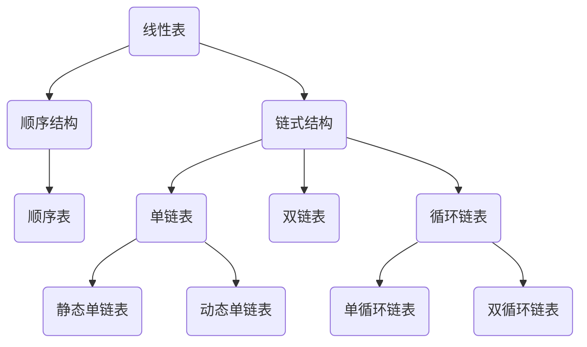

## 线性表

大纲要求

> 1. 理解线性表的逻辑结构。
> 2. 掌握线性表的顺序存贮结构和链式存贮结构；掌握线性表基本操作的实现。
> 3. 了解线性表的应用。


### 内容精讲

#### 线性表的基本概念

线性表是一组含有**相同数据类型**的n(n >= 0)个数据元素的**有限序列**。这种数据结构的特点是：存在唯一一个没有前驱的（头）元素；存在唯一一个没有后继的（尾）元素；此外，每个元素均有一个直接前驱和直接后继。

这里要注意“线性表”一词表示的是一种逻辑结构，是一对一的关系，与之对应的还有集合、树状结构（一对多），图（多对多）。

线性表有如下关系：




#### 线性表的顺序存储

##### 顺序表的定义

顺序表是以数组的形式保存在内存中的线性表，即用一组地址连续的存储单元一次数据元素的线性数据结构。

线性表的基本存储结构如下：

```c
/*
* 顺序表的固定内存分配结构
*/
#define INIT_SIZE 100          // 线性表的最大长度
struct S_SqList
{
    ElemType elem[INIT_SIZE];
    int length;                // 顺序表当前长度
};
```

当然也可以这样定义：

```c
/*
* 顺序表的动态内存分配结构
*/
struct D_SqList
{
    ElemType *elem;            // 存储空间起始地址
    int length;                // 顺序表当前长度
    int listsize;              // 当前分配的最大长度
};
```


##### 顺序表的基本操作

针对上边两种不同的内存使用策略，基本操作大致相同，这里我们针对两种策略分别实现12个基本操作，首先研究动态内存分配的顺序表基本操作。

- 初始化顺序表

```c
void InitList(struct D_SqList *L)
{
    L->elem = malloc(LIST_INIT_SIZE * sizeof(ElemType));
    if (!L->elem)
        exit(OVERFLOW);
    L->length = 0;
    L->listsize = LIST_INIT_SIZE;
}
```

- 删除顺序表

```c
void DestroyList(struct D_SqList *L)
{
    free(L->elem);
    L->elem = NULL;
    L->length = 0;
    L->listsize = 0;
}
```

- 清空顺序表

```c
void ClearList(struct D_SqList *L)
{
    L->length = 0;
}
```

- 判断顺序表是否为空，若为空返回TRUE，否则FALSE

```c
Status ListEmpty(struct D_SqList L)
{
    if (L.length == 0)
        return TRUE;
    return FALSE;
}
```

- 返回顺序表长度

```c
int ListLength(struct D_SqList L)
{
    return L.length;
}
```

- 获取第i个值，置于e

```c
Status GetElem(struct D_SqList L, int i, ElemType *e)
{
    if (i < 1 || i > L.length)
        return ERROR;
    *e = L.elem[i - 1];
    return OK;
}
```

- 返回e的位置

```c
int LocateElem(struct D_SqList L, ElemType e)
{
    int i = 0;
    for(; i <= L.length; i++)
    {
        if (L.elem[i] == e)
            break;
    }
    if (i >= L.length)
        return 0;
    else
        return i + 1;
}
```

- 返回cur_e的前驱给pre_e

```c
Status PriorElem(struct D_SqList L, ElemType cur_e, ElemType *pre_e)
{
    int i = 1;
    for (; i < L.length; i++)
    {
        if(L.elem[i] == cur_e)
        {
            *pre_e = L.elem[i - 1];
            break;
        }
    }
    if (i < L.length)
        return OK;
    else
        return INFEASIBLE;
}
```

- 返回cur_e的后继给next_e

```c
Status NextElem(struct D_SqList L, ElemType cur_e, ElemType *next_e)
{
    int i = 0;
    for (; i < L.length - 1; i++)
    {
        if (L.elem[i] == cur_e)
        {
            *next_e = L.elem[i + 1];
            break;
        }
    }
    if (i < L.length - 1)
        return OK;
    else
        return INFEASIBLE;
}
```

- 在线性表第i个位置插入e

```c
Status ListInsert(struct D_SqList *L, int i, ElemType e)
{
    if (i < 1 || i > L->length + 1)
        return ERROR;
    if (L->length >= L->listsize)
    {
        ElemType *newBase;
        newBase = realloc(L->elem, (L->listsize + LIST_INCREMENT) * sizeof(ElemType));
        if (!newBase)
            exit(OVERFLOW);
        L->elem = newBase;
        L->listsize += LIST_INCREMENT;
    }
    ElemType *p, *q;
    q = &(L->elem[i - 1]);
    for (p = &(L->elem[L->length - 1]); p >= q; --p)
        p[1] = *p;
    *q = e;
    L->length++;
    return OK;
}
```

- 删除线性表第i个位置元素，并赋值给e

```c
Status ListDelete(struct D_SqList *L, int i, ElemType *e)
{
    if (i < 1 || i > L->length)
    {
        return ERROR;
    }
    *e = L->elem[i - 1];
    for (int j = i; j < L->length; j++)
    {
        L->elem[j - 1] = L->elem[j];
    }
    L->length--;
    return OK;
}
```

- 顺序打印顺序表的内容

```c
Status ListShow(struct D_SqList L)
{
    for (int i = 0; i < L.length; i++)
    {
        printf("%d ", L.elem[i]);
    }
    printf("\n");
    return OK;
}
```

静态分配的顺序表实现起来和动态分配基本一致，在插入操作上有些许不同，省去了判断是否需要再重新分配内存的步骤，插入代码如下：

```c
Status SListInsert(struct S_SqList *L, int i, ElemType e)
{
    if (i < 1 || i > L->length + 1)
        return ERROR;
    if (L->length >= LIST_MAX_SIZE)
        return OVERFLOW;
    for (int j = i - 1; j < L->length; j++)
    {
        L->elem[j + 1] = L->elem[j];
    }
    L->elem[i - 1] = e;
    L->length++;
    return OK;
}
```

上述12个顺序线性表的操作方法方法，总体来看，代码非常简单，只要静下心来，手打一遍，肯定可以明白。


#### 线性表的链式存储

通过顺序表代码的研究，我们发现顺序表对数据的插入、删除支持很不好，要进行大量数据的移动，这时线性表的链式存储结构应运而生，正好解决了这个问题。

链式存储不需要连续的物理空间，而是通过指针将数据联系起来，因此链表的删除插入等不需要移动元素，只要改变指针所指向的位置即可。但是查找一个节点或者访问特定编号的节点则需要O(n)的时间，而顺序表相应的时间复杂度分别是O(logn)和O(1)。

##### 单链表

链表中最简单的一种是单向链表，它包含两个域，一个信息域和一个指针域。这个指针指向列表中的下一个节点，而最后一个节点则指向一个空值。

如图，每个节点都分为两部分，信息域和指针域，单向链表只可以向一个方向遍历。通常用“头指针”来标示一个单链表，如下图中的L，头指针如果为NULL，这表示一个空链表。通常为了方便，还会设置一个“头节点”，头节点信息域可以不设任何数据，指针域指向链表的第一个元素节点。


头指针和头节点的区别：头指针始终指向链表的第一个节点，如果存在头节点，那头指针就指向头节点，头节点只是一个节点，信息域通常不保存信息。

引入头节点的好处是不论链表是否是空链表，他的头指针都是指向一个节点的非空指针，这样就会是空表和非空表操作一致，方便处理。

单链表的实现方式也有两种，动态单链表和静态单链表。

1. 动态单链表

动态单链表即可动态分配存储空间的链表，动态单链表的数据结构可以这样定义：

```c
struct LNode
{
    ElemType data;
    struct LNode *next;
};
typedef struct LNode* LinkList;
```

下边我们也列举几个动态单链表的操作：

- 初始化一个单链表

```c
// 具有头指针，头结点，头结点->next=NULL
int InitList(LinkList *L)
{
    (*L) = (LinkList)malloc(sizeof(struct LNode));
    (*L)->next = NULL;
    return OK;
}
```

- 头插法创建一个链表

```c
int CreateListHead(LinkList *L, int n)
{
    struct LNode *p;
    for (int i = 0; i < n; i++)
    {
        p = (struct LNode*)malloc(sizeof(struct LNode));
        p->data = i;
        p->next = (*L)->next;
        (*L)->next = p;
    }
    return OK;
}
```

- 尾插法创建一个链表

```c
int CreateListTail(LinkList *L, int n)
{
    struct LNode *p, *tmp;
    tmp = (*L);
    for (int i = 0; i < n; i++)
    {
        p = (struct LNode*)malloc(sizeof(struct LNode));
        p->data = i;
        p->next = NULL;
        tmp->next = p;
        tmp = p;
    }
    return OK;
}
```

- 给链表追加一个节点，在最末尾处增加

```c
int InsertListTail(LinkList *L, ElemType data)
{
    LinkList tmp;
    struct LNode *node = (struct LNode*)malloc(sizeof(struct LNode));
    node->data = data;
    tmp = (*L);
    for (;;)
    {
        if (tmp->next)
            tmp = tmp->next;
        else
        {
            tmp->next = node;
            break;
        }
    }
    return OK;
}
```

- 在链表的指定位置（第i个节点）插入一个节点

```c
int InsertList(LinkList *L, int i, ElemType data)
{
    if (i < 1)
        return ERROR;
    LinkList tmp;
    struct LNode *node = (struct LNode*)malloc(sizeof(struct LNode));
    node->data = data;
    tmp = (*L);
    for (int j = 0; j < i; j++)
    {
        if (tmp->next)
            tmp = tmp->next;
    }
    if (!(tmp->next))
        return ERROR;
    node->next = tmp->next;
    tmp->next = node;
    return OK;
}
```

上述为几个关键函数，全部函数可查看我写的源文件。


2. 静态单链表

静态链表是指用数组来描线性表链式结构的一种方式，与动态链表相同，静态链表也有数据域和指针域，但存储空间不是动态分配，是在编译时固定分配指定大小的内存空间。

静态单链表可如下方式定义：

```c
#define MAX_SIZE 10
struct SLNode
{
    ElemType data;
    int next;
};
typedef struct SLNode SLinkList[MAX_SIZE]
```

静态链表存储示意图图下：


静态链表的基本操作方式与动态链表相同，这里不再赘述。


##### 双链表

单链表中只有指向其后继的指针，这使得单链表只能向后遍历，为了克服这个缺点，引入了双链表，双链表有两个指针域，分别指向其前驱和后继，可如下定义：

```c
struct DoublyLNode
{
    ElemType data;
    struct DNode *Prior;
    struct DNode *next;
};
typedef struct DoublyLNode *DoublyLinkList;
```


其示意图如下：


双链表仅仅是在单链表的基础上增加了一个指向其前驱的指针，所以双链表的大多数操作与单链表保持一致，但插入和删除却有较大不同，因为多了一个指针，在保证改变节点后不断链的问题上需要多加注意。

1. 双链表插入节点操作

```c
Status InsertDoublyList(DoublyLinkList *L, int i, ElemType data)
{
    DoublyLinkList p, s;
    if (i < 1 || i > ListLength(L) + 1)
        return ERROR;
    p = GetElemP(L, i - 1);
    if (!p)
        return ERROR;
    s = (DoublyLinkList)malloc(sizeof(DoublyLNode));
    if (!s)
        return OVERFLOW;
    s->data = data;
    s->prior = p; // 在第i-1个元素之后插入
    s->next = p->next;
    p->next->prior = s;
    p->next = s;
    return OK;
}
```


2. 双链表删除节点操作

```c
Status DeleteDoublyList(DoublyLinkList *L, int i, ElemType *e) {
    DoublyLinkList p;
    if (i < 1)
        return ERROR;
    p = (*L);
    for (int j = 1; j <= i; j++)
    {
        p = p->next;
    }
    if (!p)
        return ERROR;
    *e = p->data;
    p->prior->next = p->next;
    p->next->prior = p->prior;
    free(p);
    return OK;
}
```


##### 循环链表

循环链表是是一种特殊的链式存储结构，它的最后一个节点不是指向NULL，而是指向第一个节点，形成一个环。因此循环链表没有指针域会指向NULL，判断为空的条件是尾指针是否等于头指针。

1. 单循环链表

循环单链表的存储结构和单链表相同，操作和单链表也基本一样，差别仅仅是循环中的条件略有不同。通常我们可以只设置尾指针`r`，而不设头指针`h`，因为`r->next`就是h，即使从表头开始操作也没问题。不设头指针的循环单链表结构如下：


2. 双循环链表

由前边的双链表、循环单链表我们很自然可以想出循环双链表这样数据结构，要注意的是，双循环链表的头节点的prior还要指向尾节点，双循环链表看似指针繁多，其实这样是更方便我们的操作。带头节点的双循环链表结构如下图：


双向循环链表结构操作都和双链表基本一致，不再赘述。


#### 线性表的基本应用

- 两种特殊的线性表－堆栈、队列

堆栈和队列都是受限的线性表，是程序设计最有用的基本工具。内容较多，下章继续写。

- TODO: 添加其他应用

-------------

### 例题精解

【例题1】线性表的链式存储结构是一种（      ）的存储结构。（选择题2分）

A. 散列存取    B. 索引存取    C. 顺序存取    D. 随机存取

答案：C

解析：线性表有两种存储结构： 

1. 顺序存储结构---顺序表。顺序表以数组形式出现，可以取任意下标访问，所以是一种随机存取的存储结构。 

2. 链式存储结构---链表。链表以链表的形式出现，必须从头开始访问，所以是一种顺序存取的存储结构。


【例题2】用链表表示线性表的优点是（     ）。

A. 便于随机存取                        B. 花费的存储空间比顺序少

C. 便于插入和删除                    D. 数据元素的物理顺序与逻辑顺序相同

答案：C


【例题3】线性表的_____________存储结构是以物理位置来表示数据元素之间的逻辑关系的。而线性表的_____________存储结构是通过指针保持数据元素之间的逻辑关系的。（填空题2分）

答案：顺序 链式


【例题4】不带头节点的单链表head为空的判断条件是_____________。

答案：`head == NULL`

解析：带头节点的单链表head判空条件是`head->next == NULL`，不带头节点的单链表head判空条件是<br>`head == NULL`


【例题5】线性表的顺序存储结构优于链式存储结构。（    ）（判断题2分）

答案：错误


【例题6】阅读以下程序，指出算法功能。（每题6分）

程序1：

```c
Status A1(SqList L, ElemType cur_e, ElemType &next_e)
{
    // 初始条件：顺序线性表L已存在
    int i = 1;
    ElemType *p = L.elem;
    while (i < L.length && *p != cur_e)
    {
        i++;
        p++;
    }
    if (i == L.length)
        return INFEASIBLE;
    else
    {
        next_e = *++p;
        return OK;
    }
}
```

答案：查找`L`中`cur_e`的下一个元素，如果有则将下一个元素赋值给`next_e`，并返回`OK`，如果没有返回`INFEASIBLE`。


程序2：

```c
Status A2(LinkList L, int i, ElemType e)
{
    // 初始条件：带头节点的单链表L已存在
    int j = 0;
    LinkList p = L, s;
    while (p && j < i - 1)
    {
        p = p->next;
        j++;
    }
    if (!p || j > i - 1)
        return ERROR;
    s = (LinkList)malloc(sizeof(LNode));
    s->data = e;
    s->next = p->next;
    p->next = s;
    return OK;
}
```

答案：在L的第i个位置插入新元素e。


【例题7】请在“_____________”处填上合适的语句，完成该算法。（每小题6分）

1. 删除顺序表中第i个节点

```c
Status ListDelete_Sq(SqList &L, int i, ElemType &e)
{
    if ((i < 1) || __________)
        return ERROR;
    p = &(L.elem[i - 1]);
    e = *p;
    q = __________;
    for (++p; p <= q; ++p)
        __________;
    --L.length;
    return OK;
}
```

答案：`i > L.length`  ` &(L.elem[L.length - 1])`  `L.elem[p] = L.elem[p + 1]`


2. 在带头节点的单链表中第i个节点之前插入新的元素e

```c
Status ListInsert_L(LinkList L, int i, ElemType e)
{
    p = L;
    j = 0;
    while (p && j < i - 1)
    {
        __________;
        ++j;
    }
    if (!p || j > i - 1)
        return ERROR;
    s = (LinkList) malloc(sizeof(LNode));
    s->data = e;
    __________;
    __________;
    return OK;
}
```

答案：`p = p->next` `s->next = p->next` `p->next = s`


【例题8】设顺序表结构为：

```c
typedef struct {
    ElemType *elem;
    int length;
    int listsize;
}SqList;
```

单链表结构为：

```c
typedef struct LNode {
    ElemType data;
    struct LNode *next;
}LNode, *LinkList;
```

写一函数`void A1(SqList &L1, LinkList &L2)`将已存在的线性表L1中的所有数据元素以逆置的方式移至新建的单链表（带头节点）L2中。（此题12分）

答案：

```c
void A1(SqList *L1, LinkList *L2)
{
    LinkList tmp = (*L2);
    for (int i = L1->length - 1; i >= 0; i--)
    {
        LNode *p = (LNode*)malloc(sizeof(LNode));
        p->data = L1->elem[i];
        tmp->next = p;
        tmp = p;
    }
}
```

解析：本题全部可运行代码在[src/example-8.c](./src/example-8.c)


#### 单项选择题

------

2018

------

【例题】若将长度为n的循环单链表链接在长度为m的循环单链表之后，其算法的时间复杂度为（          ）

A. O(1)

B. O(n)

C. O(m)

D. O(m+n)

答案：C

分析：题目没有说有指向尾节点的指针，所以要先遍历整个长度为m的链表，找到表尾，才能链接，时间复杂度是O(m)。


【例题】用单链表方式存储队列（有头尾指针，非循环），在进行删除时（          ）。

A. 仅修改头指针

B. 仅修改尾指针

C. 头尾指针都需修改

D. 头尾指针可能都需修改

答案：


#### 算法设计题

------

2018

------

【例题】已知无表头节点的单链表la及单链表lb存在，写一算法，删除单链表la中第i个节点起长度为len的节点，并将其插入至单链表lb第j个节点之前。


### 习题精炼

Josephu问题：据说著名犹太历史学家 Josephus有过以下的故事：在罗马人占领乔塔帕特后，39 个犹太人与Josephus及他的朋友躲到一个洞中，39个犹太人决定宁愿死也不要被敌人找到，于是决定了一个自杀方式，41个人排成一个圆圈，由第1个人开始报数，每报数到第3人该人就必须自杀，然后再由下一个重新报数，直到所有人都自杀身亡为止。然而Josephus 和他的朋友并不想遵从，Josephus要他的朋友先假装遵从，他将朋友与自己安排在第16个与第31个位置，于是逃过了这场死亡游戏。 如何用循环链表来求解Josephu问题？


-----------------

### 笔者学习心得


怎样才能学会呢？怎样才敢肯定自己在考试中以不变应万变呢？借用大佬一句话

> **Read the fucking source code**

多看看代码，多抄抄，这些东西自然就会了。
