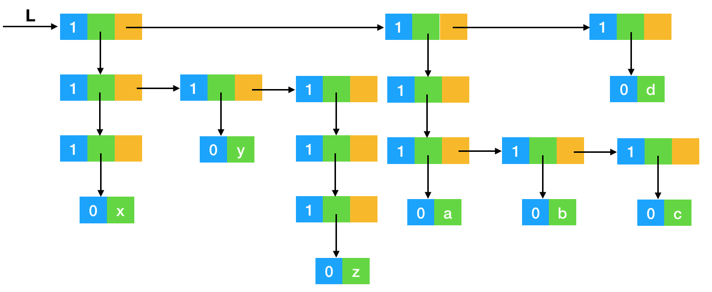

## 其他线性结构

大纲要求
> 1. 掌握栈的定义、栈的存贮结构及基本操作的实现。
> 2. 理解用栈实现表达式的求值，递归过程及其实现。
> 3. 掌握队列的定义、存贮结构及基本操作的实现
> 4. 理解串的逻辑定义及其基本操作；理解串的存贮结构。
> 5. 理解数组的定义、数组的顺序存贮结构及矩阵的存贮压缩。
> 6. 理解广义表的定义及存贮结构。


### 内容精讲

#### 栈

栈是一种先进后出的结构（FILO），是一种受限的线性表，这里要记住的唯一知识就是__先进后出__，其他内容其实都是前边线性表的知识。

栈就是一种特殊的线性表，因此也有两种基本结构，链式和顺序结构。


##### 链栈

链栈是以链表为基础的数据结构，可以动态增删节点，其定义如下：

```c
struct StackNode
{
    ElemType data;
    struct StackNode *next;
};
typedef struct StackNode *Stack;
```


###### 链栈的基本操作

基本操作和链表大致一样，只是增加了限制，只允许从栈顶放入/取出元素。下边罗列几个常用操作：

- 初始化一个空栈

```c
Status InitStack(struct StackNode **s)
{
   (*s) = NULL; 
   return OK;
}
```


- 在栈顶放入元素

```c
Status Push(struct StackNode **s, ElemType e)
{
    struct StackNode *node = (struct StackNode*)malloc(sizeof(struct StackNode));
    if (!node)
    {
        return ERROR;
    }
    node->data = e;
    node->next = (*s);
    (*s) = node;
    return OK;
}
```


- 在栈顶取出元素

```c
Status Pop(struct StackNode **s, ElemType *e)
{
    if (!*s)
        return ERROR;
    *e = (*s)->data;
    (*s) = (*s)->next;
    return OK;
}
```


- 获取栈顶元素的值

```c
Status GetTopElem(struct StackNode *s, ElemType *e)
{
    if (s)
    {
        *e = s->data;
        return OK;
    }
    return ERROR;
}
```

链栈全部代码见这里：[链栈](./src/linked_stack.c)


##### 顺序栈

顺序栈是用一组连续地址空间存储的栈，事先分配好内存，不能动态增删。

其基本机构为：

```c
struct Stack
{
    ElemType data[MAXSIZE];
    int top;
};
```


###### 顺序栈的基本操作

对应上边链栈，这里也写几个常用操作：

- 初始化一个空栈

```c
Status InitStack(struct Stack *s)
{
    s->top = -1;
    return OK;
}
```


- 在栈顶放入元素

```c
Status Push(struct Stack *s, ElemType e)
{
    if (s->top < MAXSIZE - 1)
    {
        s->top++;
        s->data[s->top] = e;
        return OK;
    }
    else
        return OVERFLOW;
}
```


- 在栈顶取出元素

```c
Status Pop(struct Stack *s, ElemType *e)
{
    if (s->top == -1)
        return ERROR;
    else
    {
        *e = s->data[s->top--];
    }
    return OK;
}
```


- 获取栈顶元素的值

```c
Status GetTopElem(struct Stack s, ElemType *e)
{
    if (s.top == -1)
        return ERROR;
    else
    {
        *e = s.data[s.top];
    }
    return OK;
}
```

顺序栈全部代码见这里：[顺序栈](./src/sequential_stack.c)


##### 用栈实现表达式求值

终于有个看得见的东西可以写写了，很开心是不是？表达式求值，是一个实际问题，最常见的办法是把中缀表达式（就是我们常用到的比如a+b-c这种操作符在操作数中间的）转换为后缀表达式（类似这样abc-+），然后再计算后缀表达式的值。

这里有两个算法，一个是中缀转后缀，一个是后缀式的计算。

###### 中缀转后缀

转换规则：

1. 遇到操作数，直接输出； 
2. 栈为空时，遇到运算符，入栈； 
3. 遇到左括号，将其入栈； 
4. 遇到右括号，执行出栈操作，并将出栈的元素输出，直到弹出栈的是左括号，左括号不输出； 
5. 遇到其他运算符’+”-”*”/’时，弹出所有优先级大于或等于该运算符的栈顶元素，然后将该运算符入栈； 
6. 最终将栈中的元素依次出栈，输出。 

规则比较啰嗦，我直接上个过程图吧，可以对照着规则一步一步的看


下边是代码示例：

```c
void ToPostfix(char *e, char* post)
{
    int index = 0;
    int pop = 0;
    struct StackNode *stack;
    InitStack(&stack);
    for(;*e;)
    {
        pop = 0;
        if (*e > 47 && *e < 58) // 操作数直接输出
            post[index++] = *e;
        if (*e == 40)           // '('
            Push(&stack, *e);
        if (*e == 41)           // ')'
        {
            for (Pop(&stack, &pop); pop != 40; Pop(&stack, &pop))
            {
                post[index++] = pop;
            }
        }

        if (*e == 42 || *e == 43 || *e == 45 || *e ==47)   // * + - /
        {
            if(!StackEmpty(stack))  // 栈为空
            {
                Push(&stack, *e);
            }
            else
            {
                for (; (StackEmpty(stack) && pop != -1) ;)
                {
                    GetTopElem(stack, &pop);
                    switch (pop)
                    {
                        case 42:
                        case 47:
                            Pop(&stack, &pop);
                            post[index++] = pop;
                            break;
                        case 43:
                        case 45:
                            if (*e == 43 || *e == 45)
                            {
                                Pop(&stack, &pop);
                                post[index++] = pop;
                            }
                            else
                                pop = -1;
                            break;
                        default:
                            pop = -1;
                            break;
                    }

                }
                Push(&stack, *e);
            }
        }
        *e++;
    }
    // 全部出栈
    for (; StackEmpty(stack);)
    {
        Pop(&stack, &pop);
        post[index++] = pop;
    }
    post[index] = '\0';
}
```


###### 后缀式的计算

后缀表达式的计算比较容易，借助栈可以很轻松实现。过程如下：

顺序扫描表达式的每一项，若是操作数，则入栈，若是操作符（记为\<op\>），则连续出栈两次（先出栈的是x后出的y），然后计算`y<op>x`，并将结果在压入栈中。最终当扫描完毕表达式，栈顶存放的就是表达式结果。

我实现了一个最基础的一位数四则运算小程序：

```c
void CalcPostfix(char *e, int *a)
{
    struct StackNode *stack;
    int x = 0;
    int y = 0;
    InitStack(&stack);
    char *expression = malloc(sizeof(char) * strlen(e));
    strcpy(expression, e);
    while (*expression)
    {
        if (*expression >= '1' && *expression <= '9')
        {
            x = *expression - '0';
            Push(&stack, x);
        }
        else if (*expression == '+' || *expression == '-' ||
                *expression == '*' || *expression == '/')
        {
            Pop(&stack, &y); 
            Pop(&stack, &x); 
            switch (*expression)
            {
                case '+':
                {
                    Push(&stack, x + y);
                    break;
                }
                case '-':
                {
                    Push(&stack, x - y);
                    break;
                }
                case '*':
                {
                    Push(&stack, x * y);
                    break;
                }
                case '/':
                {
                    Push(&stack, x / y);
                    break;
                }
            }
        }
        else
        {
            exit(ERROR);
        }
        *expression++;
    }
    Pop(&stack, &x);
    *a = x;
}
```

有兴趣的读者可以扩展它，使之不仅仅支持一位数的算法。


##### 再看递归

// TODO: 


#### 队列

学习队列只需记住先进先出（FIFO），其他东西都是线性表的知识，所以想学好队列，要先把线性表学扎实。


##### 链队

链队和前边的单链表相似，只是限制了操作，其头指针指向头节点，尾指针指向尾节点，只允许从头节点处删除，只允许从尾节点处添加。

其基本结构图下：

```c
struct QueueNode
{
    ElemType data;
    struct QueueNode *next;
};

struct Queue
{
    struct QueueNode *front;
    struct QueueNode *rear;
};
```


###### 链队的基本操作

- 初始化队列

```c
Status InitQueue(struct Queue **q)
{
    (*q) = (struct Queue*)malloc(sizeof(struct Queue));
    (*q)->front = (*q)->rear = (struct QueueNode*)malloc(sizeof(struct QueueNode));
    (*q)->front = (*q)->rear = NULL;
    return OK;
}
```


- 判断队列是否为空

```c
Status QueueEmpty(struct Queue* q)
{
    if (!q->front && !q->rear)
        return TRUE;
    return FALSE;
}
```


- 获取队列长度

```c
int QueueLength(struct Queue *q)
{
    int n = 0;
    if (!q->front && !q->rear)
        return n;
    struct QueueNode* node;
    node = q->front;
    while (node)
    {
        node = node->next;
        n++;
    }
    return n;
}
```


- 在队尾放入元素

```c
Status Put(struct Queue **q, ElemType e)
{
    struct QueueNode *node = (struct QueueNode*)malloc(sizeof(struct QueueNode));
    node->data = e;
    node->next = NULL;
    if ((*q)->rear == NULL)
        (*q)->rear = (*q)->front = node;
    else
    {
        (*q)->rear->next = node;
        (*q)->rear = node;
    }
    return OK;
}
```


- 在队首删除元素

```c
Status Poll(struct Queue **q, ElemType *e)
{
    if ((*q)->front)
    {
        if ((*q)->rear == (*q)->front->next)
            (*q)->rear = NULL;
        *e = (*q)->front->data;
        (*q)->front = (*q)->front->next;
        return OK;
    }
    return ERROR;
}
```


- 获取队首元素值

```c
Status Get(struct Queue *q, ElemType *e)
{
    if (q->front)
    {
        *e = q->front->data;
        return OK;
    }
    return ERROR;
}
```

链队列全部代码见这里：[链式队列](./src/linked_queue.c)


##### 顺序队列

队列的顺序存储是事先分配好一块连续的固定大小内存空间，并设置两个指针分别指向队首和队尾。其结构如下：

```c
#define MAXSIZE 10
struct Queue
{
    ElemType data[MAXSIZE];
    int front;
    int rear;
};
```


###### 顺序队列的基本操作

和栈对应，这里也列举几个常用操作。

- 初始化队列

```c
Status InitQueue(struct Queue *q)
{
    q->front = 0;
    q->rear = 0;
    return OK;
}
```


- 判断队列是否为空

```c
Status QueueEmpty(struct Queue q)
{
    if (!(q.rear && q.front))
    {
        return TRUE;
    }
    return FALSE;
}
```


- 在队尾放入元素

```c
Status Put(struct Queue *q, ElemType e)
{
    if (q->rear < MAXSIZE)
    {
        q->data[q->rear] = e;
        q->rear++;
        return OK;
    }
    return OVERFLOW;
}
```


- 在队首取出元素

```c
Status Poll(struct Queue *q, ElemType *e)
{
    if (q->front < q->rear)
    {
        *e = q->data[q->front];
        q->front++;
        return OK;
    }
    return ERROR;
}
```


- 获取队首元素值

```c
Status Get(struct Queue q, ElemType *e)
{
    if (q.front < q.rear)
    {
        *e = q.data[q.front];
        return OK;
    }
    return ERROR;
}
```

顺序队列全部代码见这里：[顺序队列](./src/sequential_queue.c)


###### 循环队列

上边的顺序队列有一个缺点，就是当Put n次并Poll n次后按理说剩余可用空间还是最初设定的最大值，但实际却是最大值减去n，如果n等于最大值，那么队列将不能在放入元素，此即为“上溢出”。循环链表很好的解决了这个问题，用首尾相接的办法，使队列成环，这样就可以循环利用队列有限的空间。

但循环队列操作上稍有点麻烦，就是首指针和尾指针的索引计算问题，下边是计算方法：

- 队首指针加1: `q.front = (q.front + 1) % MAXSIZE`
- 队尾指针加1: `q.rear = (q.rear + 1) % MAXSIZE`
- 队列长度: `q-rear - q-front + MAXSIZE) % MAXSIZE`

其基本操作除了上述几个计算不一样外，和普通顺序队列一样：

- 初始化队列

```c
Status InitQueue(struct Queue *q)
{
    q->front = 0;
    q->rear = 0;
    return OK;
}
```


- 判断队列是否为空

```c
Status QueueEmpty(struct Queue q)
{
    if (!(q.rear && q.front))
    {
        return TRUE;
    }
    return FALSE;
}
```


- 返回队列长度

```c
int QueueLength(struct Queue q)
{
    return (q.rear - q.front + MAXSIZE) % MAXSIZE;
}
```


- 在队尾放入元素

```c
Status Put(struct Queue *q, ElemType e)
{
    if (((q->rear + 1) % MAXSIZE) != q->front)
    {
        q->data[q->rear] = e;
        q->rear = (q->rear + 1) % MAXSIZE;
        return OK;
    }
    return OVERFLOW;
}
```


- 在队首取出元素

```c
Status Poll(struct Queue *q, ElemType *e)
{
    if (q->rear != q->front)
    {
        *e = q->data[q->front];
        q->front = (q->front + 1) % MAXSIZE;
        return OK;
    }
    return ERROR;
}
```


- 获取队首元素值

```c
Status Get(struct Queue q, ElemType *e)
{
    if (q.front != q.rear)
    {
        *e = q.data[q.front];
        return OK;
    }
    return ERROR;
}

```

循环队列全部代码见这里：[循环队列](./src/circular_queue.c)


##### 双端队列

双端队列允许队列两端都可以入队和出队，所以也可以把它看成是栈和队列的结合，基于双向链表实现的双端队列结构如下图：


双端队列也包含输入受限（一端可以出入，另一端只能出队）的队列，和输出受限的队列（一端可以出入，另一端只能入队）。

双端队列在主流现代编程语言中都能看到影子，这里不给出具体代码，将具体代码留给习题精炼供大家练习。


#### 串

串又叫字符串，是由零个或多个字符组成的有限序列。串也是一种线性表，所以当然可以用顺序或链式的结构存储，存储方式取决于要如何对串进行操作。串的基本操作有初始化串、求串长度、求字串、串的拼接、串的比较等等，都较为简单，不赘述。


#### 数组

数组是由n(n >= 1)个相同类型的元素组成的有限序列，数组可以看作是线性表的推广，即一维数组就是一个线性表，二维数组是线性表的线性表，以此类推。数组的大小是固定的，所使用的内存空间是连续的。所以可以通过下标计算对应元素的地址：``` Location(a[i]) = Location(a[0]) + Length(ElemType) * i``` ，对于二维数组，一般按行优先的策略存储，即先存储行号较小的，行号相同再按列号存储。计算w行c列二维数组某元素的地址可以这样：``` Location(a[i, j]) = Location(a[0, 0]) + Length(ElemType) * (i * w + j)```。


##### 矩阵的存储压缩

矩阵是m行乘以n列的阵列，用计算机存储矩阵，我们自然会想到二维数组，看是很完美的对应，但在实际的数学研究或图形学等实践中，会有很多特殊的矩阵，元素分布不均匀，如果用二维数组一一对应存储会浪费很多空间，下边我们分别对几种特殊矩阵做压缩存储的介绍。

###### 对称矩阵

$$
\left(\begin{array}{cccc}
a_{1,1}      & a_{1,2}      & \cdots & a_{1,n}      \\
a_{2,1}      & a_{2,2}      & \cdots & a_{2,n}      \\
\vdots & \vdots & \ddots & \vdots \\
a_{n,1}      & a_{n, 2}      & \cdots & a_{n,n}      \\
\end{array}\right)
$$

对称矩阵是a<sub>i,j</sub>=a<sub>j,i</sub>的一种方阵，我们只需保存对角线和下三角区域即可。即第一行保存1个元素第二行两个第n行n个。将a<sub>i,j</sub>存储一维数组中其数组下标是`i(i-1)/2+j-1`。


###### 三角矩阵

$$
\left(\begin{array}{cccc}
a_{1,1}& a_{1,2} & \cdots & a_{1,n} \\
       &a_{2,2}  & \cdots &a_{2,n}  \\
       &         & \ddots & \vdots  \\
{\Huge0}
       &         &        &a_{n,n}
\end{array}\right)
$$


下三角矩阵的存储和前边的对称矩阵存储一样，其计算公式依然是a<sub>i,j</sub>对应数组下标是`i(i-1)/2+j-1`。

上三角矩阵公式不一样，但画个图还是很容易推出来的：a<sub>i,j</sub>对应数组下标是`(i-1)(2n-i+2)/2+(j-i)`。


###### 对角矩阵

$$
\left(\begin{array}{cccc}
a_{1,1}& a_{1,2} &  & & \\
a_{2,1}& a_{2,2} &  &  & {\Huge 0}\\
       & \ddots  & \ddots       & \ddots\\
       &     &    & a_{n-1, n-1} &a_{n-1, n} \\
       {\Huge 0}
       &     &    & a_{n,n-1}        &a_{n,n}
\end{array}\right)
$$

这里我们以三对角矩阵做例子，其他类似。

存储这类矩阵可以按行优先存储，那么a<sub>i,j</sub>在一维数组中下标就是：`2i+j-3`。

###### 稀疏矩阵

$$
\left(\begin{array}{cccc}
0      & 1      & 0 & 0      \\
0      & 0      & 0 & 9      \\
0      & 0      & 0 & 0      \\
0      & 1      & 0 &0       \\
\end{array}\right)
$$

稀疏矩阵大多使用（行，列，值）这样的三元组保存，如上图可以保存如下的表格：

| 行   | 列   | 值   |
| ---- | ---- | ---- |
| i    | 2    | 1    |
| 2    | 4    | 9    |
| 4    | 2    | 1    |

也可以使用行指针链表（第一列为数组，指向本行下一个有用元素的位置）// TODO: 完善这里

或使用十字链表（我赌不考）十字链表参考[这篇博文](https://blog.csdn.net/zhuyi2654715/article/details/6729783)


#### 广义表

广义表是线性表的推广。广义表一般记作LS=(a<sub>1</sub>,α<sub>2</sub>,...,α<sub>n</sub>)，n是它的长度a<sub>i</sub>可以是单个元素也可以是广义表，分别称为广义表LS的原子和子表。当广义表LS非空时，称第一个元素a<sub>1</sub>为LS的表头（Head），其余元素组成的表（a<sub>1</sub>,α<sub>2</sub>,...,α<sub>n</sub>）是LS的表尾（Tail）。


##### 广义表的表示[^ 1 ]

- E = ()

L是一个空表，长度为0

- L = (a, b)

L是一个长度为2的广义表，他的两个元素都是原子

- A = (x, L) = (x, (a, b))

A是长度为2的广义表，第一个元素是原子x，第二个元素是子表L。

- B = (A, y) = ((x, (a, b)), y)

B是长度为2的广义表，第一个元素是子表A，第二个元素是原子y。

- C = (A，B) = ((x, (a, b)), ((x, (a，b)),y))

C的长度为2，两个元素都是子表。

- D=(a, D)=(a, (a, (a, (…))))

D的长度为2，第一个元素是原子，第二个元素是D自身，展开后它是一个无限的广义表。

广义表C可以用下边这种结构图表示：


其存储示意图见【例题6】

广义表的长度是指表中元素的个数（第一层）

广义表的深度是指表展开后所含括好的层数，如A、B、C、D的层数分别是2、3、4、∞。


##### 广义表的运算

广义表拥有普通线性表的运算，这里只说其特有的两个：tail()和head()，分别是取表尾和取表头。这里要注意的是任何一个非空广义表的表头是表中第一个元素，它可以是原子，也可以是子表，而其表尾必定是子表。 

比如L=((x, (a, b)), ((x, (a，b)),y))，进行head(L)后结果是(x,(a, b))，进行tail(L)后结果是(((x, (a, b)), y))，这里注意tail()操作的()。


### 例题精解

【例题1】判断下列陈述是否正确

1. 栈和队列也是线性表，如果需要，可对他们中的任一元素进行操作。
2. 非空广义表的表头和表尾都有可能是原子或广义表。
3. 串在用定长顺序存储表示时，如果实际串值长超过预定义长度，则用压缩方式存储。

答案：错误 错误 错误

解析：

1. 只能对栈顶/队尾/队首操作，如果能对任一元操作就不是栈/队列了。
2.  根据定义，非空广义表的 表头是一个元素，它可以是原子也可以是一个子表， 而表尾则必定是子表。例如:LS=(a,b),表头为a,表尾是（b）而不是b.另外：LS=（a)的表头为a，表尾为空表(). 
3. 我手头没有标准答案，我觉得错误。


【例题2】递归过程可借助于_____________转化为非递归过程。

答案：栈


【例题3】循环队列用数组A[0...m-1]存放其元素值，设头尾游标分别为front（队头元素的位置）和rear（队尾元素的位置），则当前队列中的元素个数是_____________。

答案：(rear-front+m)%m


【例题4】压栈次序为a、b、c，则不可能得到的输出序列是_____________。

答案：cab

解析：三个元素入栈，出栈共有6种可能情况，分别是：abc acb bac bca cab cba，观察可知cab不可能。（有人说如果给出abcdefgh入栈这个题该怎么做，也这样列出来显然不可能，怎么做呢？这是个小问题，自己悟吧😂）


【例题5】已知广义表L=(((x), y, ((z))),((a, b, c)), d)，利用head(T)（取T的表头）和tail(T)（取T的表尾）两个运算，则从L表中取出原子项y的运算为_____________。

答案：head(tail(head(L)))

解析：

head(L)=((x),y,((z)))

tail(head(L))=(y,((z)))

head(tail(head(L)))=y


【例题6】给出上题中广义表的节点结构定义（形式定义或图示定义均可），并根据你定义的节点结构，画出该广义表的存储结构图。

答案：如图：





【例题7】对广义表A=((a,(b)),(c,( )),d)执行操作gettail(gethead(gettail(A)))的结果是：_____________。

A. ( )                                         B. (( ))

C. d                                          D. (d)

答案：B

解析：

gettail(A)=((c,()),d)

gethead(gettail(A))=(c,())

gettail(gethead(gettail(A)))=(())


【例题8】如下关于串的陈述中，正确的是_____________、_________。

A. 串是数据元素类型特殊的线性表

B. 串中的元素是字母

C. 串中若干个元素构成的子序列称为子串

D. 空串即为空格串

答案：A C


【例题9】若顺序栈S的类型为：

```c
typedef struct
{
    SElemType *base;
    int top; // top 为栈顶指示器，初始化时，将top置为-1
    int stacksize;
}SqStack;
```

则向S中压入新元素时，应当（    ）。

A. 先移动栈顶指示器，再在栈顶指示器所指处存入元素

B. 先在栈顶指示器所指处存入元素，再移动栈顶指示器

C. 先后次序无关紧要，只要在栈顶指示器所指处存入元素即可

D. 同时进行

答案：A


【例题10】阅读下列函数，指出算法功能

```c
int A1(LinkQueue Q)
{
    int i = 0;
    QueuePtr p;
    p = Q.front;
    while (Q.rear != p)
    {
        i++;
        p = p->next;
    }
    return i;
}

```

答案：计算队列长度


【例题11】若栈结构的存储采用带头节点的单链表实现，写出链栈的初始化、入栈和出栈过程。

答案：

```c
// 初始化
void initStack(LinkStack *s)
{
  (*s) = (Node *)malloc(sizeof(Node));
  if(!(*s)) return NULL;
  (*s) -> next = NULL;
}

// 入栈
Status Push(LinkStack *s, ElemType e)
{
    struct StackNode *node = (struct StackNode*)malloc(sizeof(struct StackNode));
    if (!node)
    {
        return ERROR;
    }
    node->data = e;
    node->next = (*s)->next;
    (*s)->next = node;
    return OK;
}

// 出栈
Status Pop(LinkStack *s, ElemType *e)
{
    if (!(*s)->next)
        return ERROR;
    *e = (*s)->next->data;
    (*s)->next = (*s)->next->next;
    return OK;
}
```


#### 填空题

------

2018

------

【例题】若每一数据只能进栈一次、出栈一次，则通过栈对先后输入的三个数据3，2，1进行调度，不能得到的调度结果为：\_\_\_\_\_\_\_\_\_\_\_。


【例题】设有二维数组A\[10\]\[10\]，假设每个数组元素用4个字节存储，存储器按字节编址，从首地址1000开始以行序为主次序连续存放，则数组元素A\[3\]\[7\]的起始地址为\_\_\_\_\_\_\_\_\_\_\_。


【例题】广义表((), (a)((b, c),d))的表尾为\_\_\_\_\_\_\_\_\_\_\_。


#### 程序阅读题

----

2018

-----

【例题】1

```c
bool A(HString &S, int pos, HString T)
{
    if (pos < 1 || pos > S.length + 1)
    {
        return false;
    }
    if (T.length)
    {
        S.ch = (char*)realloc(S.ch, (S.length + T.length) * sizeof(char));
        if (!S.ch)
            return false;
        for (i = S.length - 1; i >= pos - 1; i--)
            S.ch[i + T.length] = S.ch[i];
        for (i = 0; i < T.length; i++)
            S.ch[pos - 1 + i] = T.ch[i];
        S.length += T.length;
	}
    return true;
}
```


### 习题精炼

【习题1】用栈的思想方法，设计算法，计算`((1+29)+(3*(48-34)))/30`。

【习题2】实现双端队列的基本操作。


### 笔者学习心得

这一块每年都考，但感觉不是重点考察内容。


[^ 1 ]: [广义表-百度](https://baike.baidu.com/item/%E5%B9%BF%E4%B9%89%E8%A1%A8/3685109?fr=aladdin)

