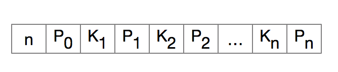
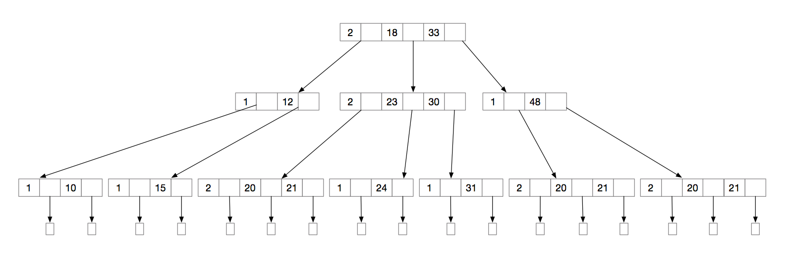
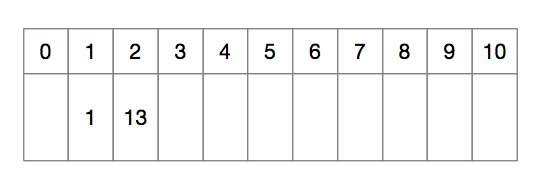
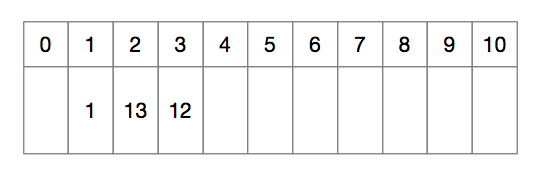
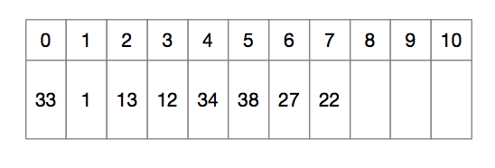
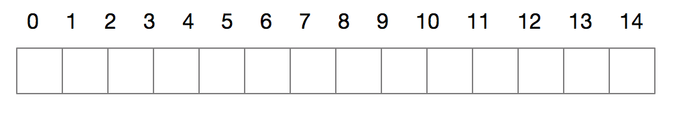

## 查找

大纲要求
> 1. 掌握静态查找表。
> 2. 掌握二叉排序树和平衡二叉树。
> 3. 理解B－树；了解B＋树。
> 4. 掌握哈希表。
> 5. 掌握各种查找方法的时间性能分析。


### 内容精讲


#### 查找的基本概念

查找即按照某种方法，从给定的数据集中找到满足某个约束条件的某个或某类数据元素的过程。

- 查找表

用于查找的数据集合称为查找表，由同一类数据元素组成。

- 静态查找表

只用作查找的查找表称为静态查找表，主要操作包括

1. 查询某个特定元素是否存在于查找表中
2. 查找某个元素的各种属性

静态查找包括：顺序查找、有序表查找、散列查找等。

- 动态查找表

在查找过程中可以动态地改变查找表元素的查找表称为动态查找表，主要操作包括：

1. 查找是插入元素
2. 查找时删除元素

动态查找包括二叉排序树查找、散列查找等。

- 关键字

在一个查找中可以唯一标识一个查找结果的字段称为关键字。如数据元素是学生信息，那么学号便可作为关键字。

- 平均查找长度

查找长度是一次查找中关键字需要比较的次数。平均查找长度则是所有查找过程中关键字需要比较的次数的平均值，用ASL表示，数学定义为：
$$
\sum_{i=1} ^{n}P_iC_i\qquad
$$
P<sub>i</sub>是查找第i个数据元素的概率，C<sub>i</sub>是找到第i个元素要进行比较的次数。由于我们没有任何理由判定哪个数据要进比较的可能性更大，只好认为P<sub>i</sub> = 1/n。


#### 静态查找表

静态查找表的概念我们上边已经做过讨论，这里我们主要介绍五种具体实施方式，包括一般顺序查找、有序表的顺序查找、二分查找、索引顺序表查找和散列查找。


##### 无序表顺序查找

顺序查找又叫线性查找，主要在线性表中进行查找。顺序查找作为一种最最朴素的查找方式，即从第一个元素开始，依次遍历整个顺序表，直到找到为止，找到返回当前位置，遍历到最后都没找到返回-1。这里有个小技巧是设置“哨兵”。可以使代码更短，但使用时会又些不便，具体对比如下：

```c
// 算法1
int SeqSearch1(struct D_SqList l, ElemType key)
{
    for(int i = 1; i <= l.length; i++)
    {
        if (l.elem[i] == key)
        {
            return i;
        }
    }
    return -1;
}
SeqSearch1(L, 914);
```

```c
// 算法2
int SeqSearch2(struct D_SqList l, ElemType key)
{
    int i = 0;
    for (i = l.length; l.elem[i] != key; i--);    // 没有找到key，也会在哨兵位置退出
        return i;
}
ListInsert(&L, 1, 914); // 在第一个位置插入“哨兵”
SeqSearch2(L, 914);
```

上边的算法应该是我们学编程接触到的第一个算法，大家都很熟悉，不多说，时间复杂度时O(n)。其优势是对存储结构没有要求，顺序存储、链式存储都可以，缺点是当n很大时，用时可能会很长。

ASL=


##### 有序表顺序查找

这里提出的有序表的顺序查找有别于下边马上要说的有序表二分查找，这里的查找方式还是从顺序表的第一个位置依次向后查找，当出现key大于表中元素（针对递增的顺序表）但还没找到key时，则退出循环，查找失败，对于递减的顺序表则相反。代码如下：

```c
// flag为0是升序，否则降序
int SeqedSearch(struct D_SqList l, int flag, ElemType key)
{
    for (int i = 0; i < l.length; i++)
    {
        if (l.elem[i] == key)
            return i;
        if (flag && (l.elem[i] < key))
        {
            return -1;
        }
        else if (!flag && (l.elem[i] > key))
        {
            return -1;
        }
    }
    return -1;
}
```

这个算法同样适用于顺序结构存储的线性表和链式存储的线性表，如果查找成功，所用时间和前边无序表顺序查找一样，但查找失败，用这个算法会更快一些。


##### 二分查找

二分查找又叫折半查找，仅适用于顺序存储的有序表，因为要按下标随机访问元素，思路是设置三个“指针”low、high、mid，low、high开始时分别指向顺序表的第一个和最后一个位置，mid则指向中间位置⌊(low+high)/2⌋ ，此时对比要查找的key和mid所指位置元素关键字的大小，若大于mid，则low = mid，mid = ⌊(low+high)/2⌋，若小于mid，则high = mid，mid = ⌊(low+high)/2⌋，再比较key和mid的大小，依次比下去，直到key=mid则返回mid，或者low<=high不成立，返回失败。具体代码如下：

```c
// flag为0是升序，否则降序
int BinarySearch(struct D_SqList l, int flag, ElemType key)
{
    int low = 0;
    int high = l.length;
    while (low <= high)
    {
        int mid = (low + high) / 2;
        if (key == l.elem[mid])
        {
            return mid;
        }
        else if (!flag && (key > l.elem[mid]))
            low = mid + 1;
        else if (!flag && (key < l.elem[mid]))
            high = mid - 1;
        else if (flag && (key > l.elem[mid]))
            high = mid - 1;
        else if (flag && (key < l.elem[mid]))
            low = mid + 1;
    }
    return -1;
}

```

二分查找也是一种我们最常用的查找算法，其时间复杂度为O(log<sub>2</sub>n)。


##### 索引顺序表查找

索引顺序表查找又叫分块查找，是结合了顺序查找和二分查找的算法，是将要查找的集合先分成若干块，其中第一块中最大元素小于第二块中最小元素，第二块中最大元素小于第三块中最小元素，依次类推，然后把每块中最大的元素拿出来建立一个有序索引，每块中元素可以无序。要查找时先用前边讲到的二分查找或有序表顺序查找在索引表中确定要查找的块，在用顺序查找在块内查找最终要找的元素。

如下图，用一个有序数组保存索引，按索引指示到具体块中查找元素。


索引顺序表查找的代码如下：

```c
// b为已分好的块
// index为索引数组
// p q分别时结果所在的块下标和在块内的下标
Status BlockSearch(struct Block *b, int *index, ElemType key, int *p, int *q)
{
    int i = 0;
    int j = 0;
    for (i = 0; ;i++)
    {
        if (index[i] >= key)
            break;
    }
    for (j = 0; j < b[i].length; j++)
    {
        if (b[i].elem[j] == key)
            break;
    }
    *p = i;
    *q = j;
    return 0;
}
```

设要查找序列的元素总数为n，将其分为n<sup>1/2</sup>块时，效率最高。

静态查找表的所有代码在[这](./src/sequenticl_search.c)


##### 散列查找

散列查找具体做法见[哈希表](#hash)


#### 二叉查找树和二叉平衡树

[二叉查找树](../Tree/README.md#rcczs)和[二叉平衡树](../Tree/README.md#ecphs)前边在树章节已经讨论过，不再啰嗦。


#### B-树和B+树

B-树和B+树都是为处理大块数据的读和写操作。算法减少定位记录时所经历的中间过程，从而加快存取速度。普遍运用在数据库和文件系统。B/B+树上操作的时间通常由存取磁盘的时间和CPU计算时间这两部分构成,而CPU的速度非常快,所以B/B+树的操作效率取决于访问磁盘的次数,关键字总数相同的情况下B/B+树的高度越小，磁盘I/O所花的时间越少。

题外话：B-树，读作B树，不是B减树，就把中间的“-”看成连字符吧，B+树是真的B加树。


##### B-树

B-树又叫多路平衡查找树，B-树中所有结点的孩子结点树的最大值称为B-树的阶，通常用m表示，一棵m阶B-树或为空树，或满足如下的特征：

- 树中每个结点至多有m棵子树（至多含有m-1个关键字）
- 若根结点不是终端节点，则至少有两棵子树
- 除非根结点外的所有非叶节点至少有⌈m/2⌉棵子树（至少含有⌈m/2⌉-1个关键字
- 所有的非叶结点的结构如下：



其中K<sub>i</sub>为关键字，且满足K<sub>1</sub> < K<sub>2</sub> < ... < K<sub>n</sub>；P<sub>i</sub>为指向子树根结点的指针，且指针P<sub>i-1</sub>所指子树的所有结点的关键字均小于K<sub>i</sub>，P<sub>i</sub>所指子树的所有结点的关键字均大于K<sub>i</sub>，n为关键字个数。（⌈m / 2⌉ <= n <= m - 1）

- 所有的叶结点都出现在同一层上，并且不带信息。

B树是所有结点的平衡因子都是0的多路查找树，下图便是一棵3阶B树，底层长方形结点表示叶结点，不存储任何信息。



###### B-树的高度


###### B-树的查找


###### B-树的插入


###### B-树的删除


##### B+树


#### <span id="hash">哈希表</span>

##### 哈希表的概念

前边介绍的线性表和树的查找都是基于一次次比较进行的，这是因为表中关键字和记录关键字的位置没有任何关系，哈希表使关键字和位置产生了关连，是一种和前边的查找完全不同的操作。

要使关键字和位置产生关联，要用到**哈希函数**，通常表示为Hash(key) = Address。（这里的位置不一定指内存地址，也指数组下标等可以标识位置的手段）通过哈希函数，可以生成一张关键字对应地址的**哈希表**，然后就可以通过哈希表直接用关键字访问到其具体地址。但在生成地址的时候可能会出现**冲突**，即不同的key会对应同一个地址，这时候称这两个不同的关键字为**同义词**，为了解决这种冲突，我们不仅要设计更优的哈希函数，还要设计解决冲突的方法。


##### 哈希函数

哈希函数是整个哈希表存储的关键，一个好的哈希函数必须满足下边几点：

- 定义域包含所有关键字，值域依赖哈希表的大小。
- 哈希函数计算结果能均匀分布在整个地址空间，减少冲突发生。
- 哈希函数要尽可能高效

下边是几种哈希函数实例：

###### 直接定址法

直接取关键字的某种线性函数值为哈希地址，Hash(key) = a * key + b，这种方式不会出现冲突，但对于不连续数据会造成很大空间浪费。

###### 除留余数法

这是考试**最经常考**的方法，具体操作是：假定哈希表表长为m，取一个不大于m但最接近或等于m的质数p，取模p，即Hash(key) = key % p。这里的关键是p的选取，尽可能让关键字通过该函数后能均匀分布在哈希表上。

###### 数字分析法

这种方法是观察分析关键字的规律，如果某些信息出现分布很不均匀而另一部分相对均匀，那么就舍去不均匀的，将均匀位作为哈希地址，比如一个班中同学的出生日期，年份很可能都是相同的，那么就舍去年份，只用月和日来作为哈希地址。

###### 平方取中法

取关键字平方后的中间几位为哈希地址。

###### 折叠法

将关键字分割成位数相同的几部分（最后一部分的位数可以不同），然后取这几部分的叠加和（舍去进位）作为哈希地址。


##### 处理冲突的方法

常用的散列函数作用到关键词后都会或多或少的产生冲突，这里介绍处理冲突的两种方法。


###### 开放定址法

开放定址法就是一旦发生冲突，就去寻找下一个空的散列地址，只要散列表足够大，空的散列地址总能找到，并将记录存入。H<sub>i</sub> = (H(key) + d<sub>i</sub>) % m, i=1, 2, …, k(k <= m - 1)，其中H(key)为散列函数，m为散列表长，d<sub>i</sub>为增量序列。通过取不同的d<sub>i</sub>，这里又分为4种：

- 线性探测法

这里d<sub>i</sub>取0，1，2，3，4，…，m-1。也就是如果发生冲突，就到下一个地址探测，如果还是冲突，就到下下个，如果遇到表尾，就反过来从表头开始找，直到找到空的散列地址，或者查遍全表仍未找到，此时表满。可以用下边的例子帮助理解。

【例】使用散列函数H(key) = key % 11，把一个整数值转换成散列表下标，现要把数据{1，13，12，34，38，33，27，22}依次插入到散列表中，使用线性探测法构造散列表。

首先第一步画出散列表，因为这里是模11，所以画10列就够了。先用1模11，得1，填入表中下标是1的位置，结果如下：


再用13模11，得2，将13填入下标为2的位置：



用12模模11，得1，发现1的位置已经被占用，按照线性探测法，去探测下一个位置，位置2也被占用，再探测位置3，发现3没有被占用，将12填入下标为3的位置：



接着是34，用34模11得1，按照前边同样的方法，这次把34填到了位置4：


一直这样做下去，最终结果如图：



这就是线性探测法的具体使用过程，如果要<span id="hashSearch">查询</span>某值是否存在，比如27，过程和上边一样，先用27模11得5，去下标为5的位置找，发现38不等于27，就去下一个位置6找，直到找到27。

线性探测法可能使本该存在第i个位置的元素存到i+1的位置，i+1的元素存到i+2的位置，最终使大量元素堆积起来，大大降低查找速度，所以引入下边的平方探测法。

- 平方探测法

平方探测法中d<sub>i</sub>=1<sup>2</sup>,-1<sup>2</sup>, 2<sup>2</sup>, -2<sup>2</sup>, 3<sup>2</sup>, -3<sup>2</sup>, …, k<sup>2</sup>, -k<sup>2</sup>，其中k<=m/2。具体操作过程和线性探测法基本一致，不赘述。用这种方法能较好的处理堆积问题，但是只能探测到表上一半的位置。


###### 拉链法

不同的关键字通过哈希函数可能会映射到同一个地址，除了把该放a位置的元素放到b位置外，我们还可以在a位置建立一个链表，这条链表包含了所有映射到这个位置的元素，这种方法称为拉链法。仍然是前边线性探测法用到的数据，我们再用拉链法做一次。

【例】使用散列函数H(key) = key % 11，把一个整数值转换成散列表下标，现要把数据{1，13，12，34，38，33，27，22}依次插入到散列表中，使用拉链法构造散列表。


##### 装填因子

装填因子一般记为𝞪，表示一个表装满的程度，即：
$$
𝞪=\frac{表中记录数n}{散列表长度m}
$$
散列表的平均查找长度依赖于装填因子𝞪，而不是直接依赖于n或m，因为𝞪越大，表越满，越可能出现冲突，冲突越多，查询长度越长。


##### 哈希查找

哈希查找和构造哈希表过程基本一样，也是通过将key交由哈希函数处理，得到一个地址，用该地址对应的值与key对比是否相等，若等，则查找成功，不等，则按照冲突处理方法所规定的规则去找下一个位置，直到找到或找寻完整个表。参考[上边](#hashSearch)的具体过程。


#### KMP算法

// 杭电不考KMP。。。。有时间再总结


#### 各种查找方法性能分析


### 例题精解


【例题】下列查找方法中，\_\_\_\_\_\_\_\_\_适用于查找单链表。

A. 顺序查找                              B. 折半查找

C. 分块查找                              D. hash查找


【例题】静态查找表和动态查找表的区别是\_\_\_\_\_\_\_\_\_。

A. 前者是顺序存储，后者是链式存储

B. 前者仅适宜查找操作，后者既适宜查找也适宜插入和删除操作

C. 前者只能顺序查找，后者只能折半查找

D. 前者可被排序，后者不能被排序


【例题】在一个含有n个元素的有序表上进行折半查找，找到一个元素最多要进行（        ）次元素比较。

A.  ⌊log<sub>2</sub>(n)⌋                            C. ⌊log<sub>2</sub>(n)⌋ + 1

C.  ⌊log<sub>2</sub>(n + 1)⌋                     D. ⌊log<sub>2</sub>(n + 1)⌋ + 1


【例题】哈希表的查找效率取决于构造hash函数的方法、处理冲突的策略、及\_\_\_\_\_\_\_\_\_。


【例题】设哈希函数为H(key) = key mod 7，用链地址法处理冲突，若依次在哈希表中插入12个元素32、65、83、25、74、21、33、18、61、27、47、28.

（1）画出它们在表中的分布情形。

（2）计算其平均成功的查找长度。


【例题】设哈希表长度为15，哈希函数为H(key) = mod 13，用开放定址法的二次探测再散列处理冲突（d<sub>i</sub> = 1<sup>2</sup>, -1<sup>2</sup>, 2<sup>2</sup>, -2<sup>2</sup>, 3<sup>2</sup>, -3<sup>2</sup>……）。依次存入12个元素：

56、82、17、24、36、21、83、96、13、34、57、50.

（1）画出它们在表中的分布情形。

（2）计算平均成功的查找长度。



【例题】在“\_\_\_\_\_\_\_\_\_”处填上合适的语句，完成算法。

```c
// 折半查找
int Search_Bin(SSTable ST, KeyType key)
{
    low = 1;
    high = ST.length;
    while (______________)
    {
        mid = ______________;
        if (EQ(key, ST.elem[mid].key))
            return mid;
        else if (LT(key, ST.elem[mid].keu))
            high = mid - 1;
        else
            _____________;
    }
    return 0;
}
```


【例题】阅读函数，指出算法功能。

```c
int A1(SSTable ST, KeyType key)
{
    // 初始条件：顺序表ST已存在
    int i;
    ST.elem[0].key = key;
    for (i = ST.length; !EQ(ST.elem[i].key, key); --i);
    return i;
}
```


#### 填空题

-----

2018

-------

哈希表的地址区间为0-10，哈希函数为H(K) = K mod 11。采用开放地址法处理冲突，增量序列取平方探测再散列，将关键字序列26，25，72，38，8，18，59，32，28依次存储到哈希表中。则关键字59存放在表中的下标地址是\_\_\_\_\_\_\_\_\_\_，关键字28存放在表中的下标地址是\_\_\_\_\_\_\_\_\_。


### 习题精炼


自学红黑树


### TODO

B/B+树

KMP算法

各算法性能分析