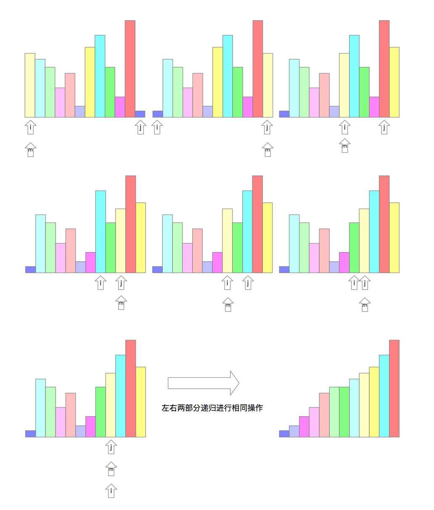
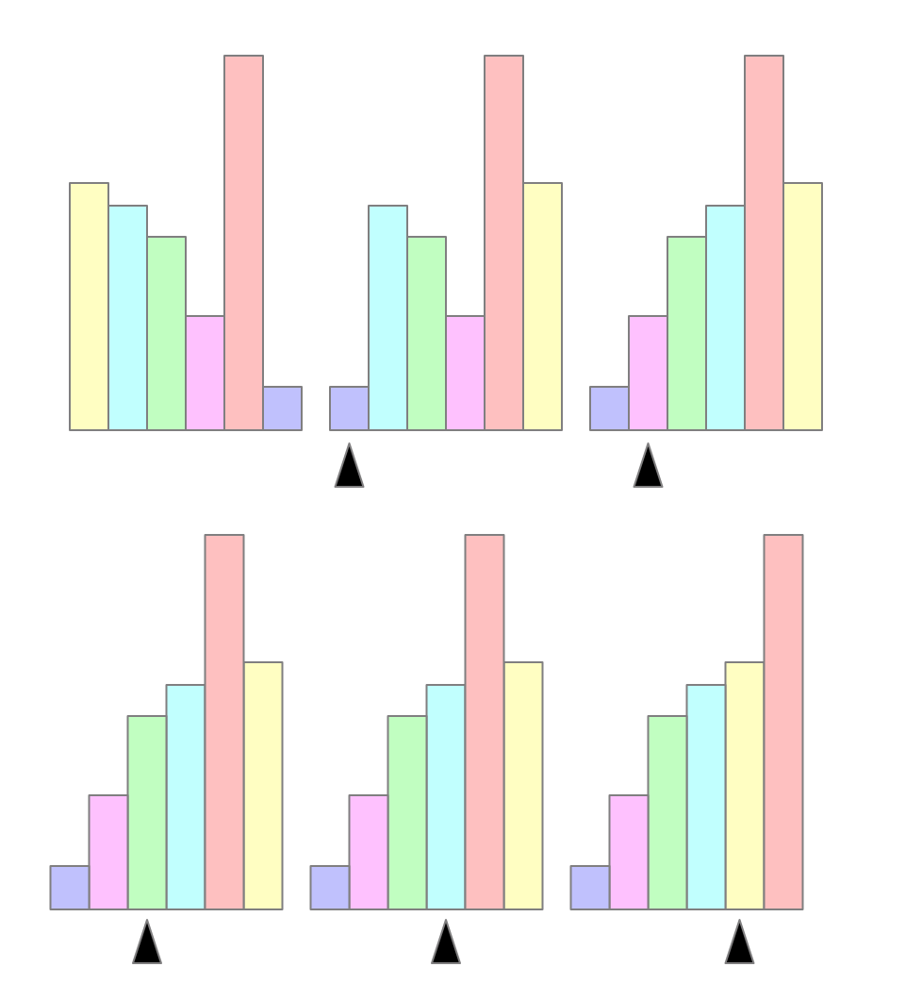
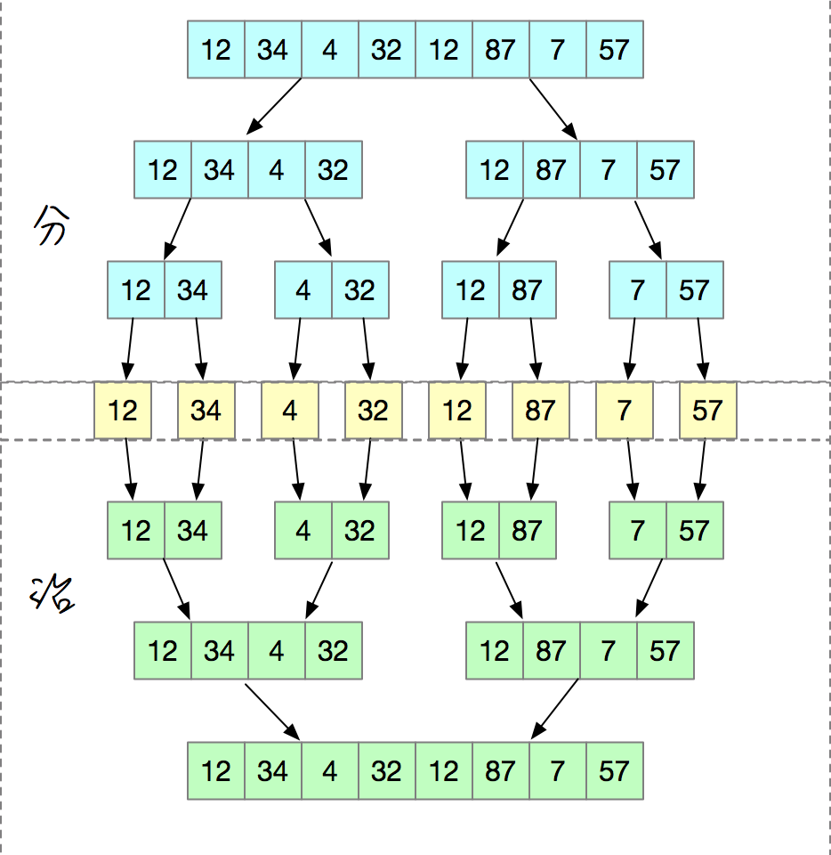
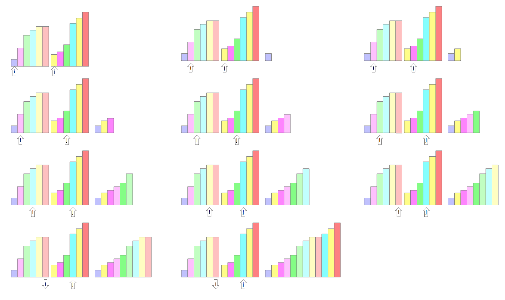
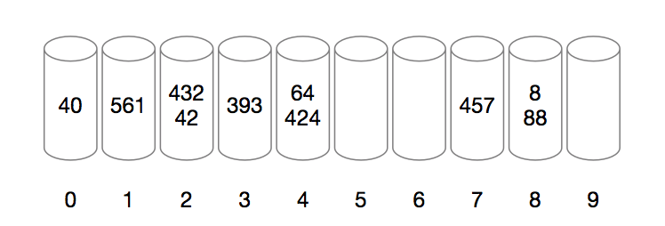
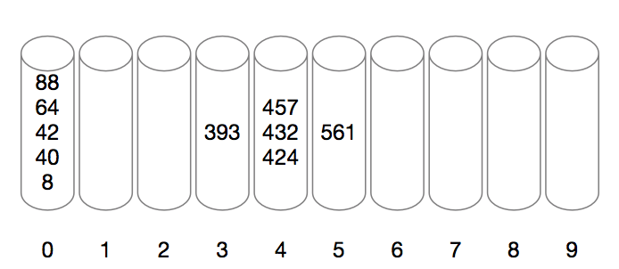
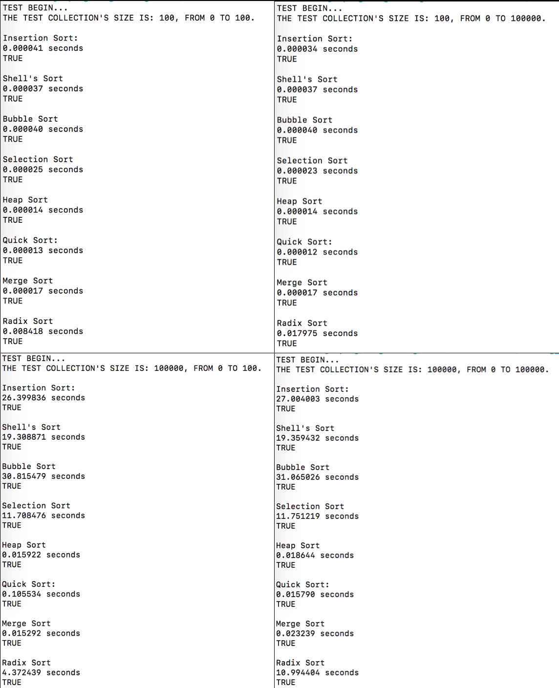

## 内部排序

大纲要求
> 1. 掌握直接插入排序、希尔排序、冒泡排序、快速排序、简单选择排序、堆排序、归并排序；理解基数排序。
> 2. 学会各种内部排序方法的比较（时间复杂度、空间复杂度、稳定性）。


### 内容精讲

#### 排序

排序就是通过一定的算法，使一组无序元素变得有序。


##### 算法稳定性

假定在待排序的序列中存在关键字相等的元素，排序完成后关键字相等的元素的相对位置没有发生变化，则此算法稳定，否则不稳定。


##### 内部排序

算法运行期间所有数据都存放在内存中，这样的排序算法称为内部排序。这里，我们只讨论内部排序，共8种：


##### 外部排序

在排序期间，大数据无法全部存放于内存，必须不断进行内外存交换的排序方法称为外部排序。


#### 插入排序

##### 综述

插入排序的思想是每一轮循环将一个元素插入到已排好序（8种算法我们都按递增序列为例）的序列中，直到全部都插完。在实际操作中是首先将第一个元素看作是已排好序的序列，把第二个插入，把第三个插入。。。直到全部插入。


##### 示意图


##### 代码实现

```c
void InsertionSort(struct D_SqList *l)
{
    int len = l->length;
    ElemType tmp;
    for (int i = 0; i < len; i++)
    {
        for (int j = i; j > 0; j--)
        {
            if (l->elem[j] <= l->elem[j-1])
            {
                tmp = l->elem[j];
                l->elem[j] = l->elem[j-1];
                l->elem[j-1] = tmp;
            }
        }
    }
}
```


##### 时间复杂度

整个排序过程中，向有序子表插入元素一共进行了n-1次，每次操作都有若干次比较和移动。

###### 最好情况

若原表即有序表，则每次插入一个元素只需比较，不需移动，此时为O(n)。

###### 最坏情况

若原表逆向有序，则每插入一个元素都需要进行比较、移动，且越到后边比较移动的次数越多，从第二个元素开始，比较次数分别为1、2、3、4、…、n-1，移动次数也为1、2、3、4、...、n-1，所以加起来等于n<sup>2</sup>-n。用O表示法表示为O(n<sup>2</sup>)。

###### 平均情况

平均情况可能既不是顺序也不是逆序，这里我们取最好最坏的平均值为平均情况的复杂度，所以，平均比较次数为(n<sup>2</sup>+n)/2，平均移动次数是(n<sup>2</sup>-n)/4。加起来是(3n<sup>2</sup>+n)/4，即O(n<sup>2</sup>)。

// TODO: 我哪里分析错了？为什么和书上不一样？


##### 空间复杂度

仅使用了一个tmp中间变量，常数个，所以空间复杂度为O(1)。


##### 稳定性

每次插入一个新数都是从后取，且从后向前循环比较，如果关键字相同，不会改变相对位置，所以插入排序是稳定的。


##### 适用性

不需要按下标随机访问，适用于顺序存储结构和链式存储结构。针对基本有序且数据量不太大的序列使用直接插入排序性能很好。


#### 希尔排序

##### 综述

希尔排序（Shell's Sort）又称缩小增量排序，是为了解决直接插入排序对完全无序和数据量太大不太靠谱而产生的排序方式。希尔排序是先将要排序序列分为n份，把每一份中第一个进行插入排序，排完后，再把n缩小，再把每一份第一个数据排序，直到n=1，这时候基本已经是有序序列了，再用直接插入法排一次即可得到排序好的序列。这里的份数，也就是步长一般取总数据量的⌈1/2⌉，以后每次再取⌈1/2⌉，直到1。


##### 示意图


##### 代码实现

```c
void ShellSort(struct D_SqList *l)
{
    int len = l->length;
    ElemType tmp = 0;
    for (int step = len / 2; step >= 1; step /= 2)
    {
        for (int i = 0; i < len; i+=step)
        {
            for (int j = i; j > 0; j -= step)
            {
                if (l->elem[j] < l->elem[j - step])
                {
                    tmp = l->elem[j];
                    l->elem[j] = l->elem[j-step];
                    l->elem[j-step] = tmp;
                }
            }
        }
    }
}
```


##### 时间复杂度

时间复杂度和我们取的步长有关，**据说**数学上都解不出来？听人说最差时间复杂度是O(n<sup>2</sup>)，最好的时间复杂度是O(n)，平均时间复杂度还是O(n<sup>2</sup>)。


##### 空间复杂度

使用一个辅助临时变量，常数个，空间复杂度为O(1)。


##### 稳定性

当相同关键字被分到不同的子表时，可能会出现相对位置交换，所以希尔排序时不稳定的。


##### 适用性

适合直接排序性能不够的大量数据，且要求数据时顺序存储。


#### 冒泡排序

##### 综述

我们接触的第一个排序算法，大概就是冒泡了，再复习一下。

冒泡排序就是从前往后，每次找到最到的一个元素，放到表尾，称为一次冒泡。具体来说便是第一次从第一个元素到最后一个元素，依次遍历，对比大小，将最大的往后移动，第二次便从第一个到倒数第二个元素进行遍历，再找到一个最大的，放到倒数第二的位置，这样依次进行下去，直到要遍历的元素只剩下第一个，排序结束。


##### 示意图


##### 代码实现

```c
void BubbleSort(struct D_SqList *l)
{
    int len = l->length;
    int tmp = 0;
    for (int i = 0; i < len - 1; i++)
    {
        for (int j = 0; j < len - i - 1; j++)
        {
            if (l->elem[j] > l->elem[j + 1])
            {
                tmp = l->elem[j];
                l->elem[j] = l->elem[j + 1];
                l->elem[j + 1] = tmp;
            }
        }
    }
}
```


##### 时间复杂度

###### 最好情况

当初始序列即为有序序列时，只需要进行比较，不需要移动，要比较的次数为：(n-1)+(n-2)+...+1，即n*(n-1)/2，时间复杂度为O(n<sup>2</sup>)。

###### 最坏情况

最坏情况下所有元素正好逆序，这时每个元素都要进行移动，且移动位置次数为：(n-1)+(n-2)+...+1，也是n*(n-1)/2，所以比较和移动一共加起来时n(n-1)，时间复杂度为O(n<sup>2</sup>)。

###### 平均情况

平均情况取最好和最坏的平均值，时间复杂度是O(n<sup>2</sup>)。


##### 空间复杂度

辅助变量只用到一个，常数个辅助空间，空间复杂度为O(1)。


##### 稳定性

对比时如果两个元素相等，不会交换两元素位置，是稳定的。


##### 适用性


#### 快速排序

##### 综述

快速排序是对冒泡排序的一种改进。算法每次都会将待排序序列分为两部分，一部分关键字都小于一个值，一部分关键字都大于一个值，这个值叫做枢轴值。这里枢轴值取每次序列的第一个值，具体做法是设置两个指针，分别指向序列第一个和最后一个元素下标，先找到后边指针所指值小于枢轴值的元素，和枢轴值交换位置，再去前边找到第一个大于枢轴值的元素，和枢轴值交换位置，再去后边找，再去前边找，直到前边和后边的指针所指位置相同，这时正好把序列分为了以枢轴为分界线的两部分，然后分别去这两部分中再次使用同样的方式，直到序列一边只剩下一个元素，快速排序完成。


##### 示意图




##### 代码实现

```c
void sort(struct D_SqList *l, int start, int end)
{
    if (start >= end)
        return;
    int mid = start;
    ElemType tmp = 0;
    for (int i = start, j = end; i < j; )
    {
        for (; l->elem[mid] <= l->elem[j] && j > i;)
        {
            j--;
        }
        tmp = l->elem[j];
        l->elem[j] = l->elem[mid];
        l->elem[mid] = tmp;
        mid = j;
        for (; l->elem[mid] >= l->elem[i] && i < j;)
        {
            i++;
        }
        tmp = l->elem[i];
        l->elem[i] = l->elem[mid];
        l->elem[mid] = tmp;
        mid = i;
    }
    sort(l, start, mid - 1);
    sort(l, mid + 1, end);
}

void QuickSort(struct D_SqList *l)
{
    int len = l->length;
    sort(l, 0, len-1);
}
```


##### 时间复杂度

快速排序是所有内部排序中效率最高的。具体时间复杂度和所选取的枢轴有关。

###### 最坏情况

最坏的情况是假如每次枢轴都选取序列的最大值或最小值时，这时候和冒泡排序的时间复杂度一样，是O(n<sup>2</sup>)。

###### 最好情况

最好情况是枢轴正好是序列中间元素，这时的时间复杂度是O(nlog<sub>2</sub>n)。

###### 平均情况

由于平均来看，当序列足够大时，枢轴的值会越来越趋于将列表分为两个长度相同的序列，所以平均时间复杂度可以近似看为O(nlog<sub>2</sub>n)。


##### 空间复杂度

快速排序要用到递归，所以需要与其序列长度相关的额外空间，其大小与递归调用的最大深度一致。要递归调用log<sub>2</sub>n次所以空间复杂度为O(log<sub>2</sub>n)。


##### 稳定性

不稳定。在划分算法中，若一边两个关键字相同的元素被交换的另一边，其相对位置会发生改变。


#### 简单选择排序

##### 综述

这个算法比较简单，算法的思想是依次遍历序列，找出最小的，和第一个位置元素交换，再找出第二小的，和第二个位置交换，一直找到最后一个元素。


##### 示意图




##### 代码实现

```c
void SelectionSort(struct D_SqList *l)
{
    int len = l->length;
    int min = 0;
    ElemType tmp = 0;
    for (int i = 0; i < len - 1; i++)
    {
        min = i;
        for (int j = i; j < len; j++)
        {
            if (l->elem[min] > l->elem[j])
            {
                min = j;
            }
        }
        tmp = l->elem[min];
        l->elem[min] = l->elem[i];
        l->elem[i] = tmp;
    }

}
```


##### 时间复杂度

###### 最好情况

当原序列本来就有序，此时不需要交换位置，但比较的次数是n + (n-1) + (n-2) + ...+ 1 =  n(n+1)/2，此时时间复杂度为O(n<sup>2</sup>)。

###### 最差情况

如果原来序列是逆序的，除了要进行n(n+1)/2次比较，还要进行n-1次移动，所以时间复杂度还是O(n<sup>2</sup>)。

###### 平均情况

最差最好都是O(n<sup>2</sup>)，平均情况也是O(n<sup>2</sup>)。


##### 空间复杂度

需要常数个辅助单元，因此空间复杂度是O(1)。


##### 稳定性

是一个不稳定的排序算法。在第i趟循环时，最小值和第i个元素交换位置，可能把本来i上的元素换到和它关键字一样元素的后边，相对顺序可能发生改变。


#### 堆排序

##### 综述

堆分为大顶堆和小顶堆，本质都是完全二叉树。大顶堆要求子结点关键字不能大于其双亲结点，所以，堆顶元素一定是整个堆中关键字最大的元素，小顶堆反之。

堆排序利用了大顶堆（小顶堆）的性质，每次从堆顶取元素，放到序列最后，再把剩余元素重新调整为大顶堆（小顶堆），再取堆顶放到序列最后，以此类推，直到所有元素都被排序。

所以，建堆是我们首先要考虑的，建堆的过程是：首先找到最后一个非叶子结点p（⌈n/2⌉-1），判断它的孩子关键字是否大于它，若大，则和孩子交换位置；接着p向前移动一个位置，再次进行判断，将双亲结点和孩子结点中关键字最大的放到双亲结点上，一直做下去，直到做完p指向树的根结点的情况（步骤如下图），这时候我们就得到了一个大顶堆。

有了上边建堆的过程，接着堆排序的正式排序就比较容易了，每次从堆顶取一个最大元素放到序列尾部，再对前边未排序部分进行建堆，再取最大放到后边，依次进行，直到完成。


##### 示意图

构建堆


堆排序


##### 代码实现

```c
void adjustHeap(struct D_SqList *l, int parent, int length)
{
    int tmp = l->elem[parent];
    int child = 2 * parent + 1; // 左孩子
    while (child < length)
    {
        // 如果右孩子存在
        if (child + 1 < length && l->elem[child] < l->elem[child + 1])
            child++;
        if (tmp >= l->elem[child])
            break;
        l->elem[parent] = l->elem[child];
        parent = child;
        child = 2 * parent + 1;
    }
    l->elem[parent] = tmp;
}

void HeapSort(struct D_SqList *l)
{
    int len = l->length;
    for (int i = len / 2 - 1; i >= 0; i--)
    {
        adjustHeap(l, i, len);
    }
    for (int i = len - 1; i > 0; i--)
    {
        int tmp = l->elem[i];
        l->elem[i] = l->elem[0];
        l->elem[0] = tmp;
        adjustHeap(l, 0, i);
    }

}
```


##### 时间复杂度

建堆的时间复杂度是O(n)，从堆顶取出元素后的重建堆的时间复杂度是O(logn)，所以整个堆排序的时间复杂度是O(nlogn)。


##### 空间复杂度

使用了常数个辅助单元，空间复杂度为O(1)。


##### 稳定性

不稳定，举个例子：

序列100 10 10 10，如果堆顶100先输出，最后一个10将会直接换到堆顶，下次输出的就是最后一个10，和另外的10交换了相对位置，不稳定。


#### 归并排序

##### 综述

归并排序和上边我们说的有些不同，是利用归并的思想实现的排序方法，该算法采用经典的分治（divide-and-conquer）策略（分治法将问题分(divide)成一些小的问题然后递归求解，而治(conquer)的阶段则将分的阶段得到的各答案"修补"在一起，即分而治之)。



如何合并两个有序子序列呢？我们可以按下图所示的方法进行合并。


##### 示意图




##### 代码实现

```c
void merge(struct D_SqList *l, int reg[], int start, int end)
{
    if (start >= end)
        return;
    int len = end -start;
    int mid = len / 2 + start;
    int start1 = start;
    int end1 = mid;
    int start2 = mid + 1;
    int end2 = end;
    merge(l, reg, start1, end1);
    merge(l, reg, start2, end2);
    int k = start;
    while (start1 <= end1 && start2 <= end2)
        reg[k++] = l->elem[start1] < l->elem[start2] ? l->elem[start1++] : l->elem[start2++];
    while (start1 <= end1)
        reg[k++] = l->elem[start1++];
    while (start2 <= end2)
        reg[k++] = l->elem[start2++];
    for (k = start; k <= end; k++)
        l->elem[k] = reg[k];
}

void MergeSort(struct D_SqList *l)
{
    int len = l->length;
    int reg[len];
    merge(l, reg, 0, len-1);
}
```


##### 时间复杂度

每次合并操作的平均时间复杂度为O(n)，而完全二叉树的深度为log<sub>2</sub>n。总的平均时间复杂度为O(nlog<sub>2</sub>n)。而且，归并排序的最好，最坏，平均时间复杂度均为O(nlog<sub>2</sub>n)。


##### 空间复杂度

归并操作需要占用n个辅助单元，所以空间复杂度是O(n)。


##### 稳定性

是稳定的。归并不会改变元素本来的相对位置。


#### 基数排序

##### 综述

基数排序又叫分配式排序，是一种采用多关键字排序思想的算法，借助“分配”、“收集”两种操作，每次只对单逻辑关键字进行排序。基数排序分为高位优先（MSD）排序和低位优先（LSD）排序。下边以LSD为例说明算法。

设初始序列为{393, 88, 40, 424, 8, 64, 42, 561, 457, 432}，先按个位放入：



将桶中数依次倒出，对于同一个桶中的数按先进先出顺序倒出，为{40, 561, 42, 432, 393, 424, 64, 457, 88, 8}，再按十位放入：


将桶中数依次倒出，对于同一个桶中的数按先进先出顺序倒出，为{8, 424, 432, 40, 42, 457, 561, 64, 88, 393}，再按百位放入：



再依次到出，此时序列为{8, 40, 42, 64, 88, 393, 424, 432, 457, 561}，可以发现，已经排好了次序。


##### 示意图

如上图


##### 代码实现

```c
void RadixSort(struct D_SqList *l)
{
    int max = getMax(*l);
    int len = l->length;
    struct Queue Q[10];
    int time = 10;
    for (int i = 0; i < 10; i++)
    {
        InitQueue(&Q[i]);
    }

    while (max / (time/10))
    {
        int d = 0;
        // 提取一位，放到对应的桶中
        for (int i = 0; i < len; i++)
        {
            d = (l->elem[i] % time) / (time / 10);
            Put(&Q[d], l->elem[i]);
        }
        // 依次将桶中的数据取出，放回序列
        ClearList(l);
        for (int k = 0, i = 0; k < 10; k++)
        {
            int a = 0;
            while (QueueLength(Q[k]))
            {
                Poll(&Q[k], &a);
                ListInsert(l, i + 1, a);
                i++;
            }
        }
        time *= 10;
    }
}
```


##### 时间复杂度

时间分为两部分，分配和搜集，每趟分配需要O(n)，每趟搜集需要O(q)，一共需要t趟分配搜集过程，所以时间复杂度为O(t(n+q))。


##### 空间复杂度

一趟排序需要辅助存储空间为q个（q为队列个数），单这q个队列可以重复利用，所以空间复杂度为O(q)。


##### 稳定性

是稳定的。因为按位排序时每次是稳定的，最后的结果也是稳定的。


### 例题精解

【例题】判断题

- 对于任何待排序的序列来说，快速排序均快于冒泡排序。


【例题】下列排序中，\_\_\_\_\_\_\_\_\_\_\_\_是稳定的，\_\_\_\_\_\_\_\_\_\_\_\_具有最好的平均性能，当待排序的关键字为倒序时，若需要为之进行正序排序，下列方案中以\_\_\_\_\_\_\_\_\_\_\_\_为佳。

A. 堆排序                                   B. 快速排序

C. 直接插入排序                        D. 简单选择排序


【例题】在一个含有n个元素的有序表上进行折半查找，找到一个元素最多要进行（    ）次元素比较。

A. ⌈log<sub>2</sub>(n)⌉                                B. ⌈log<sub>2</sub>(n)⌉ + 1

C. ⌈log<sub>2</sub>(n+1)⌉                            D. ⌈log<sub>2</sub>(n+1)⌉  + 1


【例题】对5个不同的数据元素进行插入排序，最少需要进行（          ）次比较。

A. 4                       B. 5                             C. 8                                D. 10


【例题】若需要从100万个记录中挑选出关键字最小的50个记录，下列方法中最好使用（          ）方法。

A. 插入排序                                B. 希尔排序

C. 快速排序                                D. 堆排序


【例题】下列排序方法中，（           ）平均时间复杂度为O(nlogn)，最坏情况下时间复杂度为O(n<sup>2</sup>)；（           ）所有情况下时间复杂度均为O(nlogn)；当记录的个数n较大时，若仅需要排定前m元素的位置（m远小于n）时，下列方案中（       ）为佳；当初始记录依关键字有序时下列方案中（      ）为佳。

A. 希尔排序              B. 快速排序              C. 堆排序

D. 直接插入排序      E. 简单选择排序       F. 基数排序


【例题】已知待排序序列为：33，34，7，28，38，11，65，15，37，20，则：

以第一个元素为枢轴的快速排序第一趟分划的结果为\_\_\_\_\_\_\_\_\_\_\_\_。

堆排序初始建堆（小顶堆）的结果是\_\_\_\_\_\_\_\_\_\_\_\_。

希尔排序第一趟（增量为3）的结果是\_\_\_\_\_\_\_\_\_\_\_\_。


【例题】

已知待排序序列为：25，12，9，20，7，31，24，35，17，10，试写出：

（1）堆排序初始建堆（大顶堆）的结果。

（2）以第一个元素为枢轴的快速排序一趟分划的结果。

（3）希尔排序第一趟（增量为5）的结果。


【例题】请在“\_\_\_\_\_\_\_\_\_\_\_\_”处填上合适的语句，完成算法。

1. 已知R[s..m]中记录的关键字除R[s]之外均满足堆的特征，本函数自上而下调整R[s]的关键字，使R[s..m]也成为一个大顶堆。

```c
void HeapAdjust(RcdType &R[], int s, int m)
{
    rc = R[s];
    for (j = 2*s; j <= m; ______________)
    {
        if (j < m && ___________)
            ++j;
        if (rc.key >= R[j].key)
            break;
        R[s] = R[j];
        s = j;
    }
    ________________;
}
```

2. 折半查找

```c
int Search_Bin(SSTable ST, KeyType key)
{
    low = 1;
    high = ST.length;
    while (_____________)
    {
        mid = ______________;
        if (EQ(key, ST.elem[mid].key))
            return mid;
        else if (LT(key, ST.elem[mid].key))
            high = mid - 1;
        else
            _________________;
    }
    return 0;
}
```


【例题】阅读函数，指出算法功能。

```c
int A(SqList L, int i)
{
    // 初始条件：顺序表L已存在
    int min;
    int j, k;
    k = i;
    min = L.r[i].key;
    for (j = i + 1; j <= L.length; j++)
        if (L.r[j].key < min)
        {
            k = j;
            min = L.r[j].key;
        }
    return k;
}
```


【例题】阅读以下过程：

```c
void A(ElemType R[], int n)
{
    i = n;
    while (i > 1)
    {
        lastExchangeIndex = 1;
        for (j = 1; j < i; j++)
            if (R[j + 1].key < R[j].keu)
            {
                Swap(R[j], R[j+1]);
                lastExchangeIndex = j;
            }
        i = lastExchangeIndex;
    }
}
```

回答以下问题：

1. 算法的功能
2. 当初始数据依关键字递增有序时关键字的比较次数是多少？
3. 当初始数据依关键字递减有序时关键字的比较次数是多少？
4. 算法的时间复杂度？


【例题】算法设计题。单链表结构如下：

```c
typedef struct LNode
{
    int data;
    struct LNode *next;
} *LinkList;
```

写一函数void A(LinkList L)试采用直接插入排序的方法将单链表L（带头节点）中的节点按非递减次序排列。


#### 单项选择题

------

2018

------

【例题】下列排序方法中，时间性能与待排序记录的初始排列无关的是（        ）。

A. 插入排序和快速排序

B. 归并排序和快速排序

C. 堆排序和归并排序

D. 插入排序和归并排序


#### 问答与图示题

------

2018

------

【例题】给出一组关键字T = (37,58,31,45,8,25,32,19,26,18,62,11)：

（1）给出希尔排序（第一趟排序的增量为5）一趟排序的结果。

（2）给出快速排序（选第一个记录为枢轴）一趟排序的结果。

（3）给出小顶堆的排列结果。

（4）给出归并排序（非递归）一趟排序的结果。

（5）给出基础排序一趟排序的结果。


### 习题精炼

编写一个程序Frequency，从标准输入读取一列字符串并按照字符串出现频率由高到低的顺序打印每个字符串及其出现的次数。


### 排序时间实测

下边我对这八种算法进行了几次测试，分别对应：

- A组小规模数据&小关键字
- B组小规模数据&大关键字
- C组大规模数据&小关键字
- D组大规模数据&大关键字



排除代码写法、机器随机因素、只看数量级，观察可知快速排序、归并排序、堆排序。在任何情况下表现都很出色，基数排序和要排序的序列范围有较大关系，直接插入排序、冒泡排序在大数据面前速度是真的慢。

上图的测试代码在[这](./src/test.c)