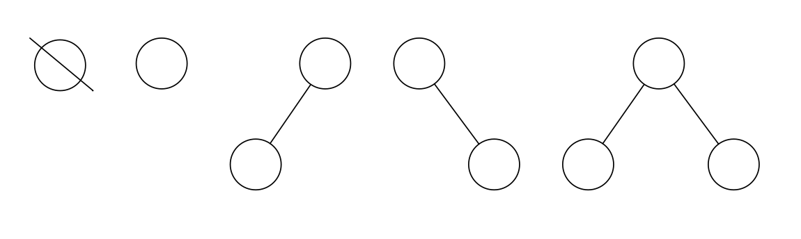
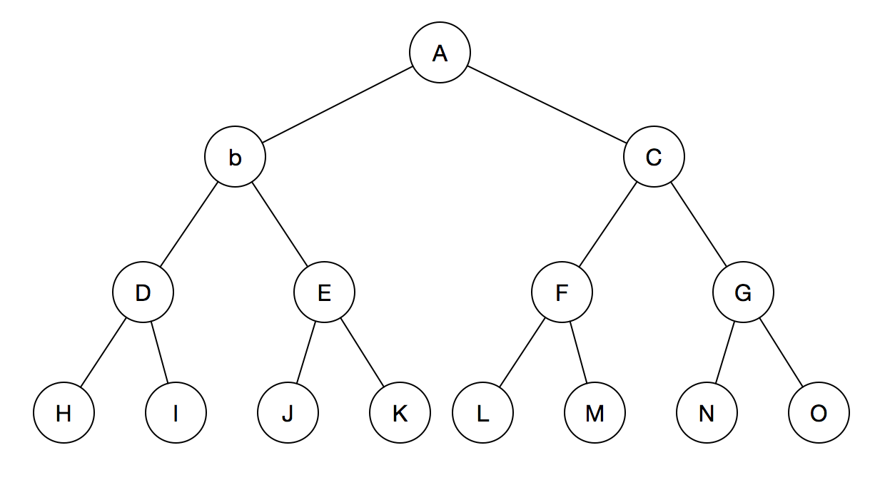
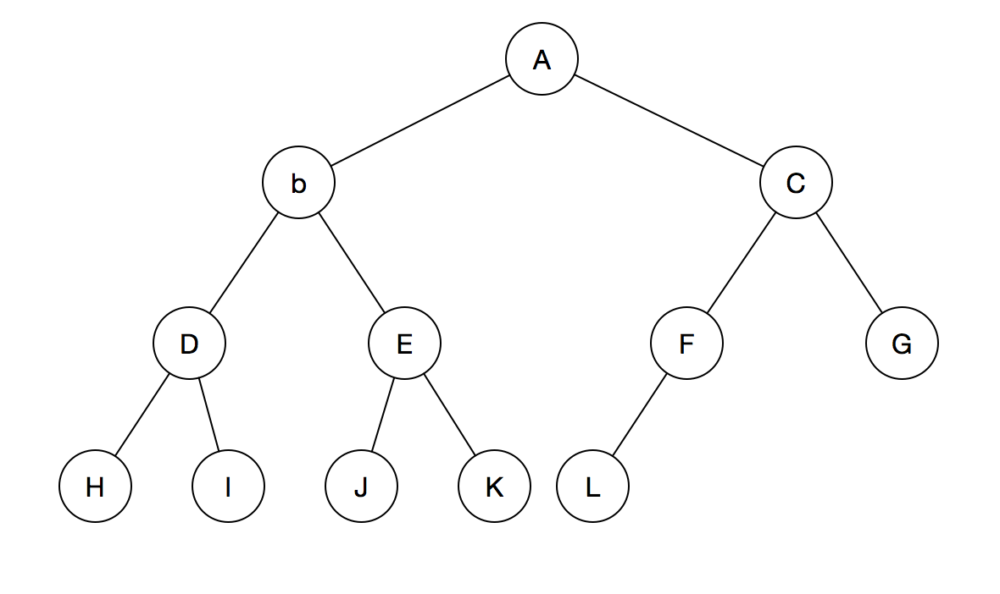
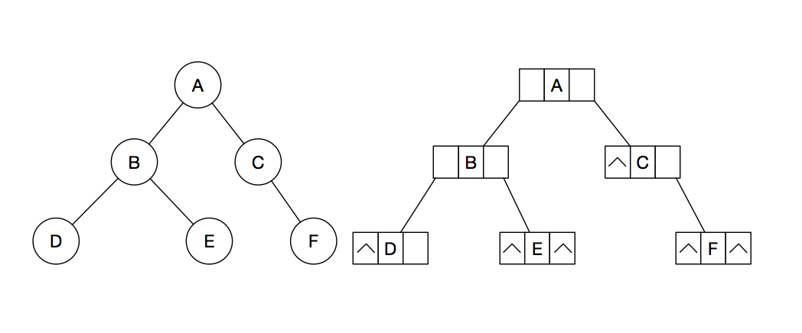
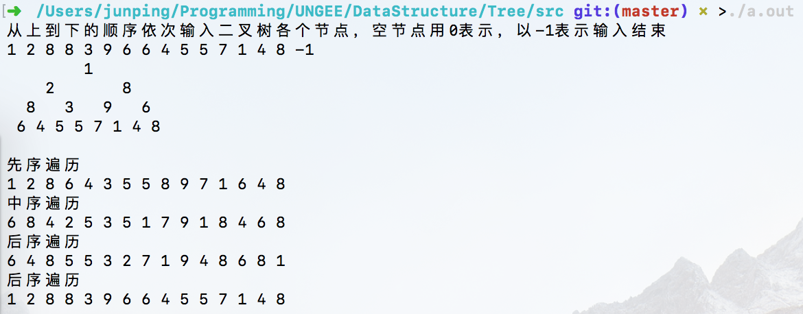
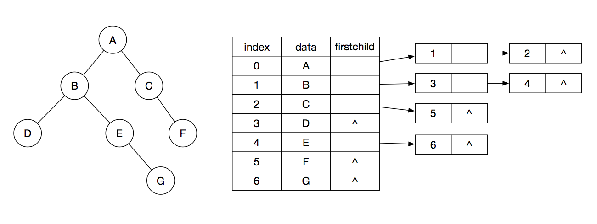
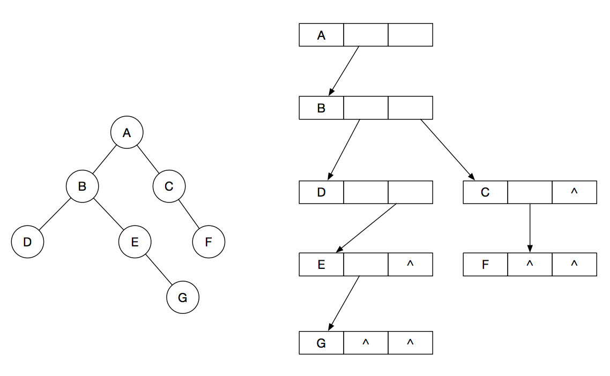
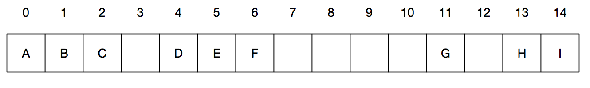
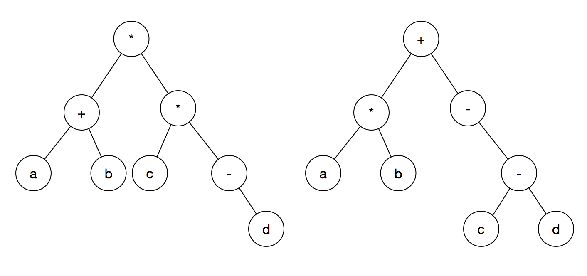

## 树和二叉树	

大纲要求
> 1. 掌握树型结构的定义。
> 2. 掌握二叉树的定义、性质及各种存贮结构。
> 3. 掌握遍历二叉树、线索二叉树及其他基本操作。
> 4. 掌握树、森林与二叉树的相互转换；理解树的遍历；掌握哈夫曼树及其应用。


### 内容精讲

#### 树的基本概念

树是由n(n>=0)个结点构成的具有层次关系的有限集合。对于任意一棵非空树有：

- 每个元素称为结点（node）。
- 有一个特定的被称为根结点的结点。
- 除根结点外其余的数据元素被分为m（m>=0)个互不相交的集合T<sub>1</sub>，T<sub>2</sub>，…，T<sub>m-1</sub>，其中每一个集合T<sub>i</sub>也是一棵树，被称为原树的子树。

树是递归定义的，是一种递归的数据结构，但在逻辑上，是分层的，有如下特点：

- 树中除根结点之外的所有结点都有唯一的前驱结点。
- 每个结点都有零个或多个后继节点。


##### 基本术语


1. 祖先结点：从根到该节点所经分支上的所有节点。
2. 子孙结点：以某结点为根的子树中任一节点都称为该结点的子孙，如I是C的子孙结点。
3. 双亲结点：若一个结点含有子节点，则这个节点称为其子结点的父节点。
4. 孩子结点：一个结点含有的子树的根节点称为该节点的子结点。
5. 兄弟结点：具有相同父节点的节点互称为兄弟节点。
6. 堂兄弟结点：双亲在同一层的节点互为堂兄弟结点。H和I为堂兄弟结点。
7. 结点的度：一个结点含有的子树的个数称为该结点的度。
8. 树的度：一棵树中，最大的结点的度称为树的度。
9. 结点的层次：从根开始定义起，根为第1层，根的子结点为第2层，以此类推。
10. 结点的深度：对于任意节点n,n的深度为从根到n的唯一路径长，根的深度为0。
11. 结点的高度：对于任意节点n,n的高度为从n到一片树叶的最长路径长，所有叶结点的高度为0。
12. 树的高度（深度）：树中结点的最大高度。上树高度为4。
13. 叶结点（终端结点）：度为0的结点称为叶结点。
14. 森林：m（m>=0）棵互不相交的树的集合称为森林；


##### 表示方法

###### 图像表达

如下图，是树的最基本图像表达方式。


###### 符号表达

树也可以用符号表达，即用括号先将根结点放入一对圆括号中，然后把它的子树由左至右的顺序放入括号中，而对子树也采用同样的方法处理

上图可表示为：(A (B(D, E, F), C(G(H, I))))


##### 树的性质

- 树中所有结点数等于所有结点的度数加一。

这一条理解起来比较容易，即本层所有结点的度之和是下一层结点个数，最后一层结点度为0，正好没有加根结点，所有结点数之和为所有结点的度数加一。

- 度为m的树中第i层至多有m<sup>i-1</sup>个结点。

这里说最多有多少个，每一个节点的度都是m才能使结点最多，所以第一层1个，然后依此是1\*m、1\*m\*m、1\*m\*m\*m，找到规律即m<sup>i-1</sup>。

- 高度为h的m叉树至多有(m<sup>h</sup>-1)/(m-1)个节点

还是说最多有多少个，假设每个节点度都是m可使结点最多，和上边一样，第一层1个，第二层m个，第h层有m<sup>h-1</sup>个，是个等比数列，所以一共有(m<sup>h</sup>-1)/(m-1)个。

- 具有n个结点的m叉树的最小高度为$$ \lceil \log _{m}(n(m-1)+1) \rceil$$。

根据上一条的高度为h的m叉树最多有(m<sup>h</sup>-1)/(m-1)个节点，反解得$$ \lceil \log _{m}(n(m-1)+1) \rceil$$。


#### 二叉树的基本概念

二叉树是n（n>=0）个结点构成的有限集合，每个结点最多只有2个子结点，并且这两个子结点区分左右，次序不能颠倒。类似前边树的定义，二叉树有：

- n为0时，二叉树为空二叉树
- n不为0时，是一个由根结点和左右两个互不相交的被称为左子树和右子树的二叉树构成，左子树和右子树又是一个二叉树。

这里也不难看出**二叉树不是树**，因为树是不区分左右子树的，二叉树只能说是有树状结构。

二叉树有5种基本形态：



##### 二叉树的类型

###### 满二叉树

这种树的特点是每一层上的节点数都是最大节点数，即除叶子结点外其它结点的度都是2。如下图所示：



###### 完全二叉树

二叉树除最后一层外，若其余层都是满的，并且最后一层或者是满的，或者是在右边缺少连续若干节点，这样的树是完全二叉树。如下图：



###### 平衡二叉树

平衡二叉树又被称为AVL树，树上任意节点的左子树和右子树的高度差不超过1。

###### 二叉排序树

一棵空二叉树或者是其左子树上所有结点关键字均小于根结点关键字，右子树上所有结点关键字均大于根结点关键字的二叉树被称为二叉排序树。


##### 二叉树的性质

1. 非空二叉树第i层结点总数不超过2<sup>i-1</sup>。
2. 高度为h的二叉树最多有2<sup>h</sup>-1个节点，最少有h个节点。
3. 记二叉树叶结点数为n<sub>0</sub>，度为2的结点总数记为n<sub>2</sub>，则n<sub>0</sub>=n<sub>2</sub>+1。
4. 具有n个结点的完全二叉树的深度为$$ \lceil \log _{2}(n+1) \rceil$$。
5. 给定n个节点，能构成C(n)种不同的二叉树。C(n)为卡特兰数的第n项。C(n)=(2n)!/[(n+1)!n!]。


##### 二叉树的存储形式

###### 顺序存储

顺序存储就是用一组连续的地址空间将二叉树从上至下从左至右依次存储，并且将二叉树中缺少的结点用0补齐。因此满二叉树和完全二叉树比较适合这种存储方式，在最糟糕的情况下比如高度为h的二叉树每个节点都只有右孩子，这样就需要2<sup>h</sup>-1个存储空间，实际只有h个节点，浪费极大。顺序存储可以很容易确定双亲和子结点的关系，若父节点索引为i，则它的左子结点的索引是2i+1，右子结点索引是2i+2，他的父节点（若存在）为$$ \lfloor \frac{i-1}{2} \rfloor$$。（这里假设根结点索引为0）


###### 链式存储

顺序存储空间利用率较低，所以通常使用链式存储，用链表中一个节点存储二叉树中的一个节点。通常链表中每个节点有三个域：数据域、左指针域、右指针域，有些也会添加指向父节点的指针，在含有n个节点的二叉链表中含有n+1个空链域。链式存储结构如下图：




#### 二叉树的基本操作和线索二叉树

二叉树可以顺序存储也可以链式存储，其顺序存储的结构如下：

```c
#define MAXSIZE 100

struct BTree
{
    ElemType data[MAXSIZE];
    int length;
};
```

链式定义如下：

```c
struct BTNode
{
    ElemType data;
    struct BTNode* lchild;
    struct BTNode* rchild;
};

typedef struct BTNode *BTree;

```


##### 二叉树的遍历

二叉树的遍历是指按一定次序依次访问二叉树中每个结点，按照不同的访问顺序，我们把这些方法分为先序遍历、中序遍历、后序遍历。

###### 先序遍历

先序遍历是指：

- 如果二叉树为空，返回
- 访问根结点
- 先序遍历左子树
- 再序遍历右子树

具体代码如下：

```c
// 顺序存储
Status preorder(struct BTree b, int n)
{
    // data[n] == 0即为空结点，data[n] == -1为结束标志
    if (!(b.data[n] == 0 || b.data[n] == -1))
    {
        printf("%d ", b.data[n]);
        preorder(b, 2*n+1);
        preorder(b, 2*n+2);
    }
    return OK;
}
```

```c
// 链式存储
Status preorder(BTree b)
{
    if (b)
    {
        printf("%c ", b->data);
        preorder(b->lchild);
        preorder(b->rchild);
    }
    return OK;
}

```


###### 中序遍历

中序遍历是指：

- 如果二叉树为空，返回
- 先序遍历左子树
- 访问根结点
- 再序遍历右子树

具体代码：

```c
// 顺序存储
Status inorder(struct BTree b, int n)
{
    if (!(b.data[n] == 0 || b.data[n] == -1))
    {
        inorder(b, 2*n+1);
        printf("%d ", b.data[n]);
        inorder(b, 2*n+2);
    }
    return OK;
}
```

```c
// 链式存储
Status inorder(BTree b)
{
    if (b)
    {
        inorder(b->lchild);
        printf("%c ", b->data);
        inorder(b->rchild);
    }
    return OK;
}
```


###### 后序遍历

后序遍历是指：

- 如果二叉树为空，返回
- 先序遍历左子树
- 再序遍历右子树
- 访问根结点

具体代码：

```c
// 顺序存储
Status postorder(struct BTree b, int n)
{
    if (!(b.data[n] == 0 || b.data[n] == -1))
    {
        postorder(b, 2*n+1);
        postorder(b, 2*n+2);
        printf("%d ", b.data[n]);
    }
    return OK;
}
```

```c
// 链式存储
Status postorder(BTree b)
{
    if (b)
    {
        postorder(b->lchild);
        postorder(b->rchild);
        printf("%c ", b->data);
    }
    return OK;
}

```


###### 层次遍历

层次便是按照二叉树的层次序一层一层遍历了，对于顺序二叉树来说很容易，只需将数组中元素依次输出即可，但链式二叉树则需要借助队列来完成，具体做法先将根结点入队，然后出队，访问该结点，如果它有左子树，则将左子树根结点入队，如果它有右子树，则将右子树根结点入队。然后出队，一直循环下去。具体代码如下：

```c
// 顺序结构
Status levelorder(struct BTree b)
{
    for (int i = 0; i < b.length; i++)
    {
        printf("%d ", b.data[i]);
    }
    printf("\n");
    return OK;
}
```

```c
// 链式结构
Status levelorder(BTree b)
{
    InitQueue(&q);
    Btree p;
    Put(&q, p);
    while(!isEmpty(q))
    {
        Poll(q, p);
        visit(p);
        if (p->lchild)
            Put(q, p->lchild);
        if (p->rchild)
            Put(q, p->rchild);
    }
}
```


四种遍历方式，得到的结果如下：



二叉树初始化及遍历等代码在[这里](./src/sequential_binary_tree.c)和[这里](./src/linked_binary_tree.c)


##### 线索二叉树


#### 树、森林

##### 树的存储结构

前面的二叉树我们分别用顺序和链式进行了存储，整个过程比较自然，但树结构比较复杂，表面看来无论如何都不可能将一棵树存到线性的结构中，所以，下边内容挺难，多练练才能记住。


###### 双亲表示法

双亲表示法是以一组连续的空间存储每个结点，每个结点都附设一个指向其双亲结点的伪指针，根结点尾指针设为-1。结点可以定义为：

```c
struct PNode
{
    ElemType data;
    int parent;
};
```

树可以定义为：

```c
#define MAXSIZE 100
struct PTree
{
    struct PNode node[MAXSIZE];
    int n;
};
```

其直观的图形表示是这样：


用双亲表示法可以根据结点的parent域很容易找到双亲结点，但是找子结点就要遍历整个树。

###### 孩子表示法

双亲表示法查找子结点很不优雅，这里提出孩子表示法，具体做法是把每个结点的孩子结点排列起来，以单链表作存储结构，则n个结点有n个孩子链表，如果是叶子结点则此单链表为空。然后n个头指针又组成一个线性表，采用顺序存储结构，存放进一个一维数组中。如图：



为此设计的结构是：

```c
struct CNode
{
    int child;
    struct CNode* next;
};

struct CTree
{
    ElemType data;
    struct CNode* firstchild;
};
```

其中TNode用来存放孩子链表的结点，child域放某结点再表头数组的下标，next指向下一个孩子节点。

Tree是表头数组的结点，data存放具体数据信息，firstchild指向第一个孩子结点。


###### 孩子兄弟表示法

孩子兄弟表示法又称二叉树表示法，是用二叉链表作为树的存储结构。每个结点保存此结点数据和指向它第一个孩子的指针和指向它右兄弟的指针。如下图：



其结构是：

```c
struct CSNode
{
    ElemType data;
    struct CSNode *firstchild, *rightsibling;
};
```


##### 树与二叉树的转换

树转换为二叉树的规则：二叉树中每个结点左指针指向它的第一个孩子结点，右指针指向和它紧邻的右边兄弟结点，可记为“左孩子右兄弟”，根结点没有兄弟结点，所以生成的二叉树没有右子树。二叉树转树逆向做一遍即可。


##### 森林与二叉树的转换

森林转换到二叉树的规则是：先将森林中每棵树转换成二叉树，第一棵树的根作为二叉树的根，第一棵树的左子树作为二叉树的左子树，第二棵树作为二叉树的右子树，第三棵树作为第二课树根结点的右子树，依次类推，二叉树转树倒做一遍即可，具体操作如下图：


##### 树的遍历

树的遍历是以某种次序访问树的每个结点的过程，一般分为两种遍历方式，先根遍历和后根遍历。

- 先根遍历

先根次序遍历的遍历规则为：若树为空。则退出；否则先访问树的根点，然后从左到右依次先根遍历根的每棵子树。其顺序和这棵树对应二叉树的先序遍历顺序相同。

- 后根遍历

后根次序遍历的遍历规则为：若树为空。则退出；否则按从左到右依次遍历根的每棵子树，之后再访问根结点。其顺序和这棵树对应二叉树的后序遍历顺序相同。


#### 树与二叉树的应用

##### 哈夫曼树和哈夫曼编码

###### 哈夫曼树（最优二叉树）

- 路径和路径长度

在一棵树中，从一个节点往下可以达到的孩子或者子孙节点之间的通路称为路径。通路中分支的数目称为路径长度。

- 结点的权

若将树中结点赋给一个有着某种含义的数值，则这个数值称为该结点的权。

- 结点带权路径长度

从根结点到该结点之间的路径长度与该结点的权的乘积。

- 树的带权路径长度

所有叶子结点的带权路径长度之和，记为WPL。


例如上图的WPL计算方式为

WPL=2\*7+2\*2+2\*5+1\*4=32

在含有n个带权叶子结点的二叉树中，WPL最小的二叉树被称为哈夫曼树，也叫最优二叉树。


###### 构造哈夫曼树

对于一组已知权值的n个结点做以下处理可得到哈夫曼树。

1. 首先把 n 个结点看做 n 棵树（仅有一个结点的二叉树），n棵树组成一个森林。
2. 把森林中权值最小和次小的两棵树合并成一棵树(小的放左边，大的放右边)，该树根结点的权值是两棵子树权值之和，这时森林中还有 n-1 棵树。
3. 重复第2步直到森林中只有一棵为止。此树就是哈夫曼树。

具体过程如下图：


###### 哈夫曼编码

哈夫曼编码是一种编码方式，是一种用于无损数据压缩的熵编码（权编码）算法。把要处理的字符当作是独立的结点，出现的频度作为权值，构造哈夫曼树。所有字符将出现在叶子结点上，我们可以把路径中向左转的标记为1，向右转的标记为0（此顺序没有硬性规定），那么对每一个节点都有唯一的标记串与之对应。比如上图中的哈夫曼树中各字母的编号可以是：

|  A   |  B   |  C   |  D   |  E   |
| :--: | :--: | :--: | :--: | :--: |
| 111  | 110  |  10  |  01  |  00  |


##### <span id = "rcczs">二叉查找树</span>

二叉查找树（BST）也叫二叉搜索树、有序二叉树、排序二叉树。二叉查找树或者是一棵空树，或者是一棵具有以下性质的树：

- 若左子树非空，则左子树上所有结点关键值均小于根结点的关键值。
- 若右子树非空，则右子树上所有结点关键值均大于根结点的关键值。
- 左右子树也分别是一棵二叉查找树。

如下图便是一棵二叉查找树：


对二叉查找树进行中序遍历便可得到递增的序列：3 12 13 17 20 27 28 29 40。


###### 二叉查找树的查找

二叉查找树的查找是从根结点开始，和给定的关键值对比，若相等，则查找成功，若大于要查找的值，则在左子树查找，若小于，则在右子树继续查找，一次查找下去。代码如下：

```c
// 二叉查找树的查找，找到返回值，找不到返回-1
ElemType Get(BTree t, ElemType key)
{
    if (!t)
    {
        return -1;
    }
    else if (key > t->data)
        return Get(t->rchild, key);
    else if (key < t->data)
        return Get(t->lchild, key);
    return t->data;
}

```

###### 二叉查找树的插入

由于二叉搜索树的特殊性质确定了二叉搜索树中每个元素只可能出现一次，所以在插入的过程中如果发现这个元素已经存在于二叉搜索树中，就不进行插入。否则若二叉树为空，则直接插入结点，若关键字小于根结点的值，则插入左子树，否则插入右子树。代码如下：

```c
Status Put(BTree *t, ElemType e)
{
    // printf("Put: %d ", e);
    if (!(*t))
    {
        (*t) = (BTree)malloc(sizeof(struct BTNode));
        (*t)->data = e;
        (*t)->rchild = NULL;
        (*t)->lchild = NULL;
        return OK;
    }
    else if (e == (*t)->data)
    {
        return ERROR;
    }
    else if (e > (*t)->data)
        return Put(&(*t)->rchild, e);
    else if (e < (*t)->data)
        return Put(&(*t)->lchild, e);
    return OK;
}
```


###### 二叉查找树的构造

构造二叉查找树就是依次插入数据，依次调用上边的插入函数即可：

```c
Status InitBST(BTree *t, char *str)
{
    (*t) = NULL;
    while (*str)
    {
        Put(t, (int)*str++ - '0');
    }
    return OK;
}
```


###### 二叉查找树的删除

二叉查找树删除元素较为复杂，这里分三种情况说明

- 若要删除结点是叶结点，直接删除。
- 若要删除结点只有左子树或右子树，则让此左子树/右子树替代删除结点。
- 若要删除结点既有左子树有有右子树，那么找到右子树最小的元素替代删除元素。

代码再补。。。。


##### <span id="ecphs">二叉平衡树</span>

为了避免二叉查找树高度增长过快，降低查找性能，规定在插入和删除二叉树结点时要保证任意的左右子树高度差不超过1，这样的二叉树称为二叉平衡树，简称AVL树。二叉平衡树或是一棵空树或满足以下性质：

- 左子树和右子树都是一棵二叉平衡树。
- 左子树和右子树高度差不超过1。


###### 二叉平衡树的插入


###### 二叉平衡树的删除


### 例题精解

【例题1】在有n个节点的二叉树的三叉链表表示中，空指针数为_____________。

A. 不确定          B. n          C. n+1          D. n+2

【例题1】在有n个节点的二叉树的二叉链表表示中，空指针数为_____________。

A. 不确定          B. n          C. n+1          D. n-1

【例题】图示的三棵二叉树中_____________为最优二叉树。


【例题】若从二叉树的根节点到其它任一节点的路径上所经过的节点序列按其关键字递增有序，则该二叉树是_________。

A. 二叉排序树

B. 哈夫曼树

C. 堆

D. 平衡二叉树

【例题】若某二叉树有n<sub>0</sub>个叶子节点，有n<sub>1</sub>个节点仅有一个孩子，则该二叉树的总节点数为（          ）

A. n<sub>0</sub>+n<sub>1</sub>                                  B. 2n<sub>0</sub>+n<sub>1</sub>

C. 2n<sub>0</sub>+n<sub>1</sub>+1                           D. 2n<sub>0</sub>+n<sub>1</sub>-1

【例题】一个二叉树按顺序方式存储在一个一维数组中，如下图：



则节点H在二叉树的第（      ）层。（根节点为第一层）

A. 1          B. 2          C. 3          D. 4

【例题】当二叉排序树是一棵平衡树时，其平均查找长度为______________。

【例题2】若某一二叉树按中序遍历可得到有序序列，则该二叉树是_____________。若某一二叉树从根节点到其它任一节点的路径上所经过的节点序列按其关键字递增有序，则该二叉树是_____________。

【例题】若二叉树的第i层存在，则二叉树的第i层上至少有____________个节点，至多有____________个节点，深度为k的二叉树至多有_________________个节点。

【例题】设高度为h的二叉树中只有度为0和度为2的节点，则此二叉树中所包含的节点数至少是_____________，至多是 ________。

【例题】具有n个节点的二叉查找树其高度至少是_____________ ，至多是 _____________。

【例题】一棵m阶的B-树，所有非终端节点至多有_____________棵子树，根节点至少有二棵子树，除根外的其它非终端节点至少有______________棵子树。

【例题3】若对完全二叉树中的节点从1开始按层进行编号，设最大编号为n，则编号为i的节点（1<i<=n）的父节点编号为_____________；所有编号_____________的节点为叶子节点。

【例题】判断题

1. 在二叉树的先序遍历序列中，任一节点均处在其孩子节点前面。
2. 通常，在二叉树的第i层上有2<sup>i-1</sup>个节点。
3. 二叉树按某种次序线索化后，任一节点均有指向其前驱和后继的线索指针。
4. 哈夫曼树中的节点个数一定是奇数。
5. 对于一颗m阶的B-树而言，树中每个节点至多有m个关键字，除根节点之外的所有非终端节点至少有$$ \lceil m/2 \rceil$$个关键字。
6. 对于具有n个节点的二叉树，不论其形态如何，进行先序、中序或后序遍历到1时间复杂度均为O(N)。

【例题】对二叉树_____________可得到有序序列。

【例题】已知某二叉树的先序遍历次序为：ABCDEFG，中序遍历次序为：BADCFEG。

（1）画出该二叉树。

（2）给出该二叉树的后续遍历次序。

（3）画出中序线索化后的二叉树形。

【例题】依序将关键字20、40、30、80、70、50、60、10插入到一棵2-3树中（初始状态为空）

（1）请画出该B-树。

（2）请先后删除关键字40、60，画出删除后的B-树。

【例题】请根据插入次序20，40，30，60，35，80

（1）请给出以此插入次序建立二叉排序树最终变化的结果。

（2）若仍以此插入次序建立平衡的二叉排序树，请给出最终变化的结果。

【例题】假设用于通讯的电文仅由8个字符A、B、C、D、E、F、G、H组成，字符在电文中出现的频率分别为3、12、9、23、2、17、21、13

（1）画出你所建的哈夫曼树

（2）给出每一字符的哈夫曼编码

【例题】将如下所示森林转换成二叉树，并分别写出该森林的先序序列和中序序列。


【例题】阅读函数，指出功能

```c
void A1(Bitree T, Status(*Visit)(TElemType))
{
    // 初始条件：二叉树T已存在
    if (T)
    {
        A1(T->lchild, Visit);
        A4(T->rchild, Visit);
        Visit(T->data);
	}
}
```


```c
typedef struct BiTreeNode
{
    ElemType data;
    BiTreeNode *lchild, *rchild;
} BiTreeNode, BiTree;

BinTreeNode* BinTreeS(BinTreeNode *BT)
{
    if (!BT)
        return NULL;
    else
    {
        pt = (BiTree)malloc(sizeof(BiTreeNode));
        pt->data = BT->data;
        pt->rchild = BinTreeS(BT->lchild);
        pt->lchild = BinTreeS(BT->rchild);
        return pt;
    }
}
```


【例题】请在“_____________“处填上合适的语句，完成该算法

```c
// 中序线索二叉树的遍历算法
void InOrderTraverse_Thr(BiThrTree T, void (*Visit)(TElemType e))
{
    p = T->lchild;
    while (p != T)
    {
        while (p->LTag == Link)
            p = p->lchild;
        ____________________;
        while (p->RTag == Thread && p->rchild != T)
        {
            ___________________;
            Visit(p->data);
        }
        __________________;
    }
}
```


【例题】设二叉链表结构为：

```c
typedef struct BiTNode
{
    TElemType data;
    struct BiNode *lchild, *rchild;
} *BiTree;
```

写一函数`void A1(BiTree T)`求二叉树T的深度。

【例题】设二叉链表表结构为：

```c
typedef struct BiTNode
{
    TElemType data;
    struct BiTNode *lchild, *rchild;
} BiTNoe, *BiTree;
```

写一过程：`void A1(BiTree & T, TElemType e1, TElemType e2)`

若在一颗已知二叉树T中存在数据元素为e<sub>1</sub>的节点，则删除该节点的右子树p；若存在数据元素e<sub>2</sub>的节点且该节点无右子树，则将p插入为该节点的右子树。

【例题】设有带头节点的非空中序线索二叉树T（T指向头节点，头节点的左指针lchild指向根节点，头节点的右指针rchild指向中序线索二叉树中最后访问的节点），若指针p指向其中某个节点，试写出插入p的中序后继s节点的算法。

注：节点结构如下：


#### 单项选择题

------

2018

-------

【例题】以下说法中（          ）是正确的。

A. 构造线索二叉树是为能方便找到每个结点的双亲

B. 任何一棵二叉树，终端结点数为度为2的结点数减1

C. 二叉树不能用顺序结构表示

D. 完全二叉树中，某叶子结点的双亲若存在左兄弟X，则X一定不是叶子结点


### 习题精炼

设计一个算法，将给定的表达式树（二叉树）转换为等价的中缀表达式（通过括号反应操作符的操作次序）并输出，例如下列两棵表达式树作为算法的输入时：



输出的等价中缀表达式分别是(a+b)\*(*(-d))和(a\*b)+(-(c-d))。

二叉树结点定义如下：

```c
typedef struct node
{
    char data[10];
    struct node *left, *right;
} BTree;
```

要求：

1）给出算法的基本设计思想。

2）根据设计思想，采用C/C++语言描述算法，关键之处给出注释。


#### 填空题

----

2018

------

【例题】假设用于通讯的电文仅由8个字母组成，字母在电文中出现的频率分别为7，19，2，6，32，3，21，10。若为这8个字母设计哈夫曼编码（设合并两棵子树时次序在前的为左子树，次序在后的为右子树）。则频率为6的字母编码为：\_\_\_\_\_\_\_\_\_\_\_\_\_，频率为7的字母边阿妹为\_\_\_\_\_\_\_\_\_\_\_。


#### 问答与图示题

----

2018

----

【例题】已知森林的先序次序为：A,B,C,D,E,F,G,H,I,J,K。中序次序为：B,E,F,C,D,A,G,I,K,J,H。

（1）画出该森林。

（2）利用孩子兄弟法将其转化成二叉树。

（3）将该二叉树的中序线索化。


【例题】依次在查找表中插入：76，29，33，71，26，19，45，23，67，18，51。

（1）依照插入次序建立二叉排序树。

（2）依照插入次序建立平衡的二叉排序树

（3）依照插入次序建立3阶B-树。


#### 程序阅读题

----

2018

---------

【例题】1

```c
bool A(Bitree T)
{
    Initstack(S);
    Push(S, T);
    while(!StackEmpty(S))
    {
        while(GetTop(S, p) && p)
        {
            printf("%c", p->data);
            push(S, p->lchild);
        }
        Pop(S, p);
        if (!StackEmpty(S))
        {
            Pop(S, p);
            Push(S, p->rchild);
        }
    }
    return true;
}
```


###TODO

二叉树链式存储层次遍历（使前边实现的队列可用）

线索二叉树

二叉搜索树的删除

二叉平衡树
