## 考研数据结构复习


### 目录

1. [数据结构的一般概念](#common)

2. [线性表](#Linear_List)

3. [其他线性结构](#Other_Linear_Structure)

4. [树](#Tree)

5. [图](#Graph)

6. [查找](#Search_Algorithm)

7. [内部排序](#Sorting_Algorithm)


## <span id="common">数据结构的一般概念</span>

大纲要求
> 1. 掌握数据结构的基本概念和术语。 
> 2. 了解抽象数据类型的概念。
> 3. 掌握算法的特性，算法的描述和算法的分析。


### 内容精讲

#### 数据结构基础概念

> 数据结构是计算机存储、组织数据的方式。数据结构是指相互之间存在一种或多种特定关系的数据元素的集合。通常情况下，精心选择的数据结构可以带来更高的运行或者存储效率。数据结构往往同高效的检索算法和索引技术有关。


##### 数据结构基本术语

数据：数据是信息的载体，是描述客观事物熟悉的所有信息。

数据元素：数据元素（例如学生信息）是数据的基本单位，数据元素可由若干数据项（姓名、学号）组成。

数据对象：数据对象是有某种相同性质的数据元素的一个集合，比如大学男生是一个数据对象。

数据类型：指一组值和一组对这些值的操作的集合。比如C语言中int类型的取值范围是-2^31^到2^31^-1，int的操作包括+、-、*、/、%、<和>。原则上所有程序只使用类如int这种**原子类型**即可，但在更高层的抽象上编程可能更加方便，所以数据类型还包括**结构类型**和**抽象数据类型**。

抽象数据类型：见下文。

数据结构：指相互之间存在着一种或多种关系的数据元素的集合和该集合中数据元素之间关系组成。也可以理解为数据结构就是ADT的物理实现。


##### 抽象数据类型

抽象数据类型（Abstract Data Type，ADT）是一种能够对使用者隐藏数据表示的数据类型。抽象数据类型主要是实现了数据和函数的关联，并将数据的表示方式隐藏起来。在使用抽象数据类型时，我们只需关心调用的API描述上，而不用关心具体数据表示。在实现ADT时，我们需要关注数据的具体表示方式和对这些数据的各种操作。

抽象数据类型之所以重要，是因为它使程序在设计上支持封装，比如后边我们将研究各种排序算法，我们可以通过ADT在不改变用例代码的情况下测试不同算法。


#### 算法基础概念

##### 什么是算法？

我们每天编写的程序，无论大小，一般都是实现一种已有的方法来解决某个问题，这种方法大多和编程语言无关，我们是用这种方法而不是计算机程序去描述这个解决问题的方案步骤。在计算机领域，我们用算法这个词来描述**有限**、**确定**、**有效**的适合计算机程序实现的解决问题的方法。算法是计算机科学的基础。


##### 算法的五个特性

1. 有穷性：算法必须在有限步内执行完成。
2. 确定性：算法的每一步必须有确切含义，同样的输入会有相同的输出。
3. 有效性：算法是有效可行的，即每一步都可被分解为有限个基本的可执行步。
4. 输入：一个算法有0个或多个输入，刻画运算对象的初始情况，所谓0个输入是指算法本身定出了初始条件。
5. 输出：一个算法有一个或多个输出，以反映对输入数据加工后的结果。没有输出的算法是毫无意义的。


##### 算法的描述

要定义一个算法，我们可以用自然语言描述解决某个问题的步骤，或者编写一段程序来实现这个过程。比如老祖宗发明的辗转相除法（找两个数的最大公约数）：

自然语言描述

> 计算两个非负整数p和q的最大公约数：若p是0，则最大公约数是q，否则，将q除以p得到余数r，p和q的最大公约数即为p和r的最大公约数。

C语言描述

```c
int gcd(int q, int p)
{   
	return p == 0 ? q : gcd(p, q % p);
}
```


##### 算法的简单分析

1. 时间复杂度分析

   1. 时间频度

   一个算法执行所耗费的时间，从理论上是不能算出来的，必须上机运行测试才能知道。但我们不可能也没有必要对每个算法都上机测试，只需知道哪个算法花费的时间多，哪个算法花费的时间少就可以了。并且一个算法花费的时间与算法中语句的执行次数成正比例，哪个算法中语句执行次数多，它花费时间就多。一个算法中语句的执行次数称为语句频度或时间频度，记为T(n)。

   2. 时间复杂度

   前面提到的时间频度T(n)中，n称为问题的规模，当n不断变化时，时间频度T(n)也会不断变化。但有时我们想知道它变化时呈现什么规律，为此我们引入时间复杂度的概念。一般情况下，算法中基本操作重复执行的次数是问题规模n的某个函数，用T(n)表示，若有某个辅助函数f(n)，使得当n趋近于无穷大时，T(n)/f(n)的极限值为不等于零的常数，则称f(n)是T(n)的同数量级函数，记作T(n)=O(f(n))，它称为算法的渐进时间复杂度，简称时间复杂度。

   3. O表示法

   算法复杂度分为最坏时间复杂度、平均时间复杂度、最好时间复杂度三个评估角度，这里O(f(n))表示最坏时间复杂度。
   大O表示法O(f(n))中的f(n)的值可以为1、n、logn、n²等，因此我们可以将O(1)、O(n)、O(logn)、O(nlogn)、O(n²)分别可以称为常数阶、线性阶、对数阶、线性对数阶和平方阶，那么如何推导出f(n)的值呢？我们接着来看推导大O阶的方法。

   - 用常数1来取代运行时间中所有加法常数。 
   - 修改后的运行次数函数中，只保留含n多项式最高阶项。 
   - 如果最高阶项存在且不是1，则将此项系数改为1。

   例如程序

   ```c
   int a = 100;
   a += 100;
   printf("%d\n", a);
   ```

   这段程序分三步运行，那么f(n) = 3，根据方法第一条，用1取代常数3，剩下f(n) = 1，没有含n的多项式，所以后两条用不到，结果就是O(1)。

   我们把常见的几种增加复杂度类型整理如下表：

| 量级 | 典型代码                                                     |           说明              | 计算方法                                                     |
| :--------: | :----------------------------------------------------------- | :----------------------: | :------------: |
|     1      | a = b + c;                                                   |    普通语句如两数相加       | 常数阶                                                       |
|    logn    | while(lo <= hi)<br>  int mid = lo + (hi - lo) / 2;<br>      if (key < a[mid])<br>           hi = mid - 1;<br>      else if (key > a[mid])<br>             lo = mid + 1<br>      else return mid; |    二分策略如二分查找       | 从前边代码可以看<br>出每次循环都会<br>减少剩下的1/2,假<br>设循环次数为x，<br>那么2^x^=n,所以x=logn |
|     n      | int max = a[0];<br>    for (int i = 0; i < n; i++)<br>        if (a[i] > max)<br>            max = a[i]; |    循环如找出最大元素   | 线性阶主要看循环<br>执行了多少次                        |
|   nlogn    | 略                                                           |      分治如归并排序      | 线性对数阶                                                   |
|    n^2^    | for (int i = 0; i < n; i++)<br>    for(int j = i + 1; j < n; j++)<br>        if (a[i] + a[j] == 0)<br>              cnt++; | 双层循环如检查所有元素对 | 需要注意的是内循<br>环中int j=i，而不<br>是int j=0。当i=0<br>时，内循环执行了<br>n次，i=1时内循环<br>执行了n-1次，当<br>i=n-1时执行了<br>1次,我们可以推算<br>出总的执行次数为：<br>n+(n-1)+(n-2)+...+1<br>=(n+1)+[(n-1)+2]<br>+[(n-2)+3]+...<br>=(n+1)+...+(n+1)<br>=(n+1)n/2 <br>=n(n+1)/2 <br>=n²/2+n/2<br>根据此前讲过的<br>推导大O阶的规则<br>的第二条：<br>只保留最高阶，因此<br>保留n²/2。根据第三<br>条去掉这个项<br>的常数，则去掉1/2,最终<br>这段代码的<br>时间复杂度为O(n²)。 |
|    n^3^    | for (int i = 0; i < n; i++)<br>    for(int j = i + 1; j < n; j++)<br>        for(int k = j + 1; k < n; k++)<br>            if(a[i] + a[j] + a[k] == 0)<br>                 cnt++; | 三层循环如检查所有三元组 | 立方阶                                                       |
|    2^n^    | 略                                                           |  穷举查找如检查所有子集  | 指数阶                                                       |

常见的时间复杂度有O(1)<O(logn)<O(n)<O(nlogn)<O(n^2^)<O(2^n^)


2. 空间复杂度分析 ==杭电没考过==

空间复杂度是对一个算法在运行过程中临时占用存储空间大小的量度，它是问题规模n的函数，渐进空间复杂度常简称为空间复杂度，记为S(n)=O(g(n))。

一个程序除了需要存储本身用到的指令、常数、变量等之外，还要对对数据进行操作的工作单元和存储一些为实现计算所需信息的辅助空间，若输入信息所占空间只取决于问题本身，和算法无关，则只分析除输入和算法之外的额外空间。

算法**原地工作**是指算法所需辅助空间是常量，即O(1)。


### 例题精解

【例题1】 数据结构通常有下列4种基本结构：线性结构、树型结构、图型结构、___________________。

答案：集合


【例题2】 线性表的顺序存储结构优于链式存储结构（   ）。

答案：错误


【例题3】 数据元素是数据的基本单位（   ）。

答案：正确


【例题4】 为度量一个算法的性能，需要在时间和空间方面进行权衡（   ）。

答案：正确


【例题5】数据的逻辑结构和物理结构密切相关，一个算法的设计取决于数据的逻辑结构，

而实现依赖于数据的存储结构（  ）。

答案：正确


【例题6】 从逻辑上可以把数据结构分成（     ）。

A. 动态结构和静态结构                 B. 顺序组织和链式组织

C. 线性结构和非线性结构             D. 基本类型和组合类型

答案：C

解析：数据的逻辑结构可分为：

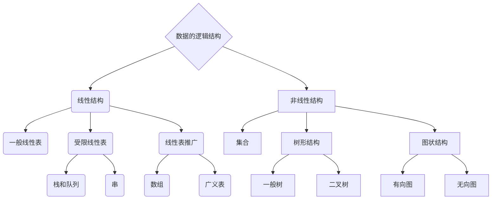
```mermaid
graph TD
A{数据的逻辑结构} --> B(线性结构)
A --> C[非线性结构]
B --> B1(一般线性表)
B --> B2(受限线性表)
B --> B3(线性表推广)
B2 --> B21(栈和队列)
B2 --> B22(串)
B3 --> B31(数组)
B3 --> B32(广义表)
C --> C1[集合]
C --> C2[树形结构]
C --> C3[图状结构]
C2 --> C21[一般树]
C2 --> C22[二叉树]
C3 --> C31[有向图]
C3 --> C32[无向图]
```


【例题7】 设n是描述问题规模的非负整数，下面程序片段的时间复杂度是（    ）。

```c
void fuc(int n){
    int i = 1;
    while(i<=n)
    	i=i*2;
}
```

A. O(n)                                    B. O(n^2^)

C. O(nlog~2~n)                           D. O(log~2~n)

答案：D

解析：基本语句是i=i*2，且i最终要到大于n停止，i每次循环将增大2倍，设需要循环x次，则2^x^=n，即x=log~2~n。所以选D. O(log~2~n)。


【例题8】 求整数n（n>=0）阶乘的算法如下，其时间复杂度是（    ）。

```c
int fact(int n){
    if (n<=1) return 1;
    return n*fact(n-1);
}
```

A. O(log~2~n)                             B. O(n)

C. O(nlog~2~n)                           D. O(n^2^)

答案：B

解析：观察发现fact函数递归调用自己，每次参数减少1，从n乘到1，执行了n次递归，也就实现了n\*(n-1)\*(n-2)\*...\*1，即O(n)。


【例题9】 已知两个长度分别为m和n的升序链表，若将他们合并成一个长度为m+n的降序链表，则最坏情况下的时间复杂度是（    ）。

A. O(log~2~n)                              B. O(m*n)

C. O(min(m, n))                      D. O(max(m, n))

答案：D

解析：将两个升序链表合并，并改变链表的排序方向，我们首先想到的就是将两个链表中元素一一比较，即将较小的放到新链表，移动头指针到下一个位置，再比较两个链表的头指针所指元素大小，如此循环下去，直到一个链表用完，再将另一个链表全部放到新链表后边即可。最坏情况就是两个链表所有元素都进行比较，此时时间复杂度为O(max(m, n))。


【例题10】 下列程序段的时间复杂度是（    ）。

```c
count = 0;
for (k = 1; k <= n; k*=2)
	for (j = 1; j <= n; j++)
		count++;
```

A. O(log~2~n)                              B. O(n)

C. O(nlog~2~n)                            D. O(n^2^)

答案：C

解析：外层是log~2~n（同例题7），内层是1到n的循环是O(n)，所以结果O(nlog~2~n)。


【例题11】 下列函数的时间复杂度是（    ）。

```c
int func(int n) {
    int i = 0, sum = 0;
    while(sum < n) sum += ++i;
    return i;
}
```

A. O(logn)                                B. O(n^1/2^)

C. O(n)                                     D. O(nlogn)

答案：B

解析：观察sum += ++i，设一共要循环x次，可列出1+2+3+...+x = n，解方程得x=[-1+(1+8n)^1/2^]/2，时间复杂度即为O(n^1/2^)


### 习题精炼

求解斐波那契数列 $$  F(n) = \begin{cases} 1, & \text{n=0,1} \\ F(n-1)+F(n-2),& \text{n>1} \end{cases} $$ 有两种常用的算法：递归算法和非递归算法。试分别分析两种算法的时间复杂度。


--------------

说明

例题精解中题目全部取自杭电历年数据结构真题和408真题

习题真练为笔者即兴取题


## <span id="Linear_List">线性表</span>

大纲要求

> 1. 理解线性表的逻辑结构。
> 2. 掌握线性表的顺序存贮结构和链式存贮结构；掌握线性表基本操作的实现。
> 3. 了解线性表的应用。


### 内容精讲

#### 线性表的基本概念

线性表是一组含有**相同数据类型**的n(n >= 0)个数据元素的**有限序列**。这种数据结构的特点是：存在唯一一个没有前驱的（头）元素；存在唯一一个没有后继的（尾）元素；此外，每个元素均有一个直接前驱和直接后继。

这里要注意“线性表”一词表示的是一种逻辑结构，是一对一的关系，与之对应的还有集合、树状结构（一对多），图（多对多）。

线性表有如下关系：

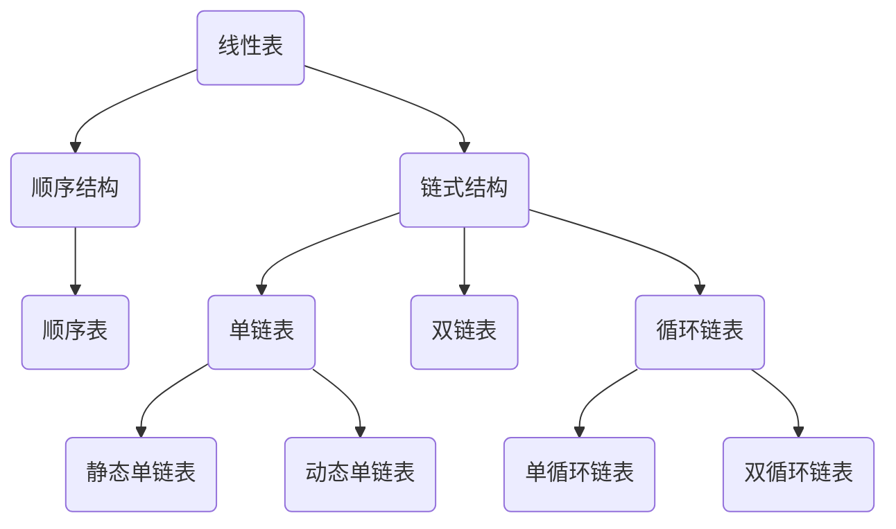
```mermaid
graph TD
A(线性表) --> B(顺序结构)
A --> C(链式结构)
B --> B1(顺序表)
C --> D(单链表)
C --> E(双链表)
C --> F(循环链表)
D --> D1(静态单链表)
D --> D2(动态单链表)
F --> F1(单循环链表)
F --> F2(双循环链表)
```


#### 线性表的顺序存储

##### 顺序表的定义

顺序表是以数组的形式保存在内存中的线性表，即用一组地址连续的存储单元一次数据元素的线性数据结构。

线性表的基本存储结构如下：

```c
/*
* 顺序表的固定内存分配结构
*/
#define INIT_SIZE 100          // 线性表的最大长度
struct S_SqList
{
    ElemType elem[INIT_SIZE];
    int length;                // 顺序表当前长度
};
```

当然也可以这样定义：

```c
/*
* 顺序表的动态内存分配结构
*/
struct D_SqList
{
    ElemType *elem;            // 存储空间起始地址
    int length;                // 顺序表当前长度
    int listsize;              // 当前分配的最大长度
};
```


##### 顺序表的基本操作

针对上边两种不同的内存使用策略，基本操作大致相同，这里我们针对两种策略分别实现12个基本操作，首先研究动态内存分配的顺序表基本操作。

- 初始化顺序表

```c
void InitList(struct D_SqList *L)
{
    L->elem = malloc(LIST_INIT_SIZE * sizeof(ElemType));
    if (!L->elem)
        exit(OVERFLOW);
    L->length = 0;
    L->listsize = LIST_INIT_SIZE;
}
```

- 删除顺序表

```c
void DestroyList(struct D_SqList *L)
{
    free(L->elem);
    L->elem = NULL;
    L->length = 0;
    L->listsize = 0;
}
```

- 清空顺序表

```c
void ClearList(struct D_SqList *L)
{
    L->length = 0;
}
```

- 判断顺序表是否为空，若为空返回TRUE，否则FALSE

```c
Status ListEmpty(struct D_SqList L)
{
    if (L.length == 0)
        return TRUE;
    return FALSE;
}
```

- 返回顺序表长度

```c
int ListLength(struct D_SqList L)
{
    return L.length;
}
```

- 获取第i个值，置于e

```c
Status GetElem(struct D_SqList L, int i, ElemType *e)
{
    if (i < 1 || i > L.length)
        return ERROR;
    *e = L.elem[i - 1];
    return OK;
}
```

- 返回e的位置

```c
int LocateElem(struct D_SqList L, ElemType e)
{
    int i = 0;
    for(;i <= L.length ;i++)
    {
        if (L.elem[i] == e)
            break;
    }
    if (i >= L.length)
        return 0;
    else
        return i + 1;
}
```

- 返回cur_e的前驱给pre_e

```c
Status PriorElem(struct D_SqList L, ElemType cur_e, ElemType *pre_e)
{
    int i = 1;
    for (; i < L.length; i++)
    {
        if(L.elem[i] == cur_e)
        {
            *pre_e = L.elem[i - 1];
            break;
        }
    }
    if (i < L.length)
        return OK;
    else
        return INFEASIBLE;
}
```

- 返回cur_e的后继给next_e

```c
Status NextElem(struct D_SqList L, ElemType cur_e, ElemType *next_e)
{
    int i = 0;
    for (; i < L.length - 1; i++)
    {
        if (L.elem[i] == cur_e)
        {
            *next_e = L.elem[i + 1];
            break;
        }
    }
    if (i < L.length - 1)
        return OK;
    else
        return INFEASIBLE;
}
```

- 在线性表第i个位置插入e

```c
Status ListInsert(struct D_SqList *L, int i, ElemType e)
{
    if (i < 1 || i > L->length + 1)
        return ERROR;
    if (L->length >= L->listsize)
    {
        ElemType *newBase;
        newBase = realloc(L->elem, (L->listsize + LIST_INCREMENT) * sizeof(ElemType));
        if (!newBase)
            exit(OVERFLOW);
        L->elem = newBase;
        L->listsize += LIST_INCREMENT;
    }
    ElemType *p, *q;
    q = &(L->elem[i - 1]);
    for (p = &(L->elem[L->length - 1]); p >= q; --p)
        p[1] = *p;
    *q = e;
    L->length++;
    return OK;
}
```

- 删除线性表第i个位置元素，并赋值给e

```c
Status ListDelete(struct D_SqList *L, int i, ElemType *e)
{
    if (i < 1 || i > L->length)
    {
        return ERROR;
    }
    *e = L->elem[i - 1];
    for (int j = i; j < L->length; j++)
    {
        L->elem[j - 1] = L->elem[j];
    }
    L->length--;
    return OK;
}
```

- 顺序打印顺序表的内容

```c
Status ListShow(struct D_SqList L)
{
    for (int i = 0; i < L.length; i++)
    {
        printf("%d ", L.elem[i]);
    }
    printf("\n");
    return OK;
}
```

静态分配的顺序表实现起来和动态分配基本一致，在插入操作上有些许不同，省去了判断是否需要再重新分配内存的步骤，插入代码如下：

```c
Status SListInsert(struct S_SqList *L, int i, ElemType e)
{
    if (i < 1 || i > L->length + 1)
        return ERROR;
    if (L->length >= LIST_MAX_SIZE)
        return OVERFLOW;
    for (int j = i - 1; j < L->length; j++)
    {
        L->elem[j + 1] = L->elem[j];
    }
    L->elem[i - 1] = e;
    L->length++;
    return OK;
}
```

上述12个顺序线性表的操作方法方法，总体来看，代码非常简单，只要静下心来，手打一遍，肯定可以明白。


#### 线性表的链式存储

通过顺序表代码的研究，我们发现顺序表对数据的插入、删除支持很不好，要进行大量数据的移动，这时线性表的链式存储结构应用而生，正好解决了这个问题。

链式存储不需要连续的物理空间，而是通过指针将数据联系起来，因此链表的删除插入等不需要移动元素，只要改变指针所指向的位置即可。但是查找一个节点或者访问特定编号的节点则需要O(n)的时间，而顺序表相应的时间复杂度分别是O(logn)和O(1)。

##### 单链表

链表中最简单的一种是单向链表，它包含两个域，一个信息域和一个指针域。这个指针指向列表中的下一个节点，而最后一个节点则指向一个空值。

如图，每个节点都分为两部分，信息域和指针域，单向链表只可以向一个方向遍历。通常用“头指针”来标示一个单链表，如下图中的L，头指针如果为NULL，这表示一个空链表。通常为了方便，还会设置一个“头节点”，头节点信息域可以不设任何数据，指针域指向链表的第一个元素节点。

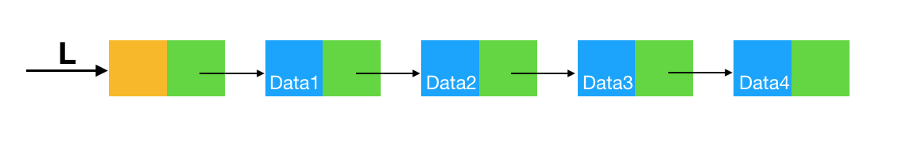

头指针和头节点的区别：头指针始终指向链表的第一个节点，如果存在头节点，那头指针就指向头节点，头节点只是一个节点，信息域通常不保存信息。

引入头节点的好处是不论链表是否是空链表，他的头指针都是指向一个节点的非空指针，这样就会是空表和非空表操作一致，方便处理。

单链表的实现方式也有两种，动态单链表和静态单链表。

1. 动态单链表

动态单链表即可动态分配存储空间的链表，动态单链表的数据结构可以这样定义：

```c
struct LNode
{
    ElemType data;
    struct LNode *next;
};
typedef struct LNode* LinkList;
```

下边我们也列举几个动态单链表的操作：

- 初始化一个单链表

```c
// 具有头指针，头结点，头结点->next=NULL
int InitList(LinkList *L)
{
    (*L) = (LinkList)malloc(sizeof(struct LNode));
    (*L)->next = NULL;
    return OK;
}
```

- 头插法创建一个链表

```c
int CreateListHead(LinkList *L, int n)
{
    struct LNode *p;
    for (int i = 0; i < n; i++)
    {
        p = (struct LNode*)malloc(sizeof(struct LNode));
        p->data = i;
        p->next = (*L)->next;
        (*L)->next = p;
    }
    return OK;
}
```

- 尾插法创建一个链表

```c
int CreateListTail(LinkList *L, int n)
{
    struct LNode *p, *tmp;
    tmp = (*L);
    for (int i = 0; i < n; i++)
    {
        p = (struct LNode*)malloc(sizeof(struct LNode));
        p->data = i;
        p->next = NULL;
        tmp->next = p;
        tmp = p;
    }
    return OK;
}
```

- 给链表追加一个节点，在最末尾处增加

```c
int InsertListTail(LinkList *L, ElemType data)
{
    LinkList tmp;
    struct LNode *node = (struct LNode*)malloc(sizeof(struct LNode));
    node->data = data;
    tmp = (*L);
    for (;;)
    {
        if (tmp->next)
            tmp = tmp->next;
        else
        {
            tmp->next = node;
            break;
        }
    }
    return OK;
}
```

- 在链表的指定位置（第i个节点）插入一个节点

```c
int InsertList(LinkList *L, int i, ElemType data)
{
    if (i < 1)
        return ERROR;
    LinkList tmp;
    struct LNode *node = (struct LNode*)malloc(sizeof(struct LNode));
    node->data = data;
    tmp = (*L);
    for (int j = 0; j < i; j++)
    {
        if (tmp->next)
            tmp = tmp->next;
    }
    if (!(tmp->next))
        return ERROR;
    node->next = tmp->next;
    tmp->next = node;
    return OK;
}
```

上述为几个关键函数，全部函数可查看我写的源文件。


2. 静态单链表

静态链表是指用数组来描线性表链式结构的一种方式，与动态链表相同，静态链表也有数据域和指针域，但存储空间不是动态分配，是在编译时固定分配指定大小的内存空间。

静态单链表可如下方式定义：

```c
#define MAX_SIZE 10
struct SLNode
{
    ElemType data;
    int next;
};
typedef struct SLNode SLinkList[MAX_SIZE]
```

静态链表存储示意图图下：

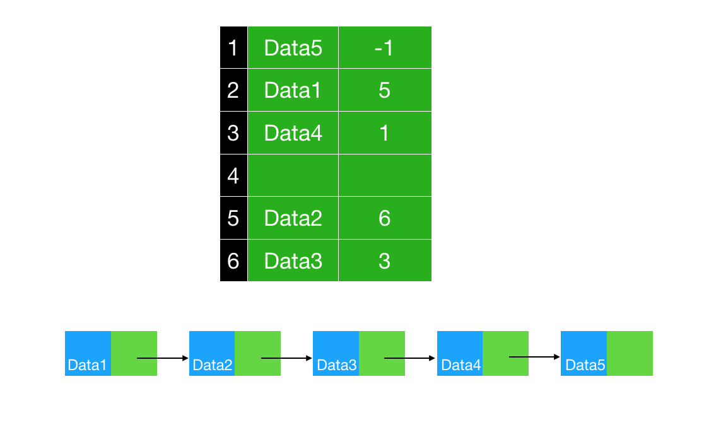

静态链表的基本操作方式与动态链表相同，这里不再赘述。


##### 双链表

单链表中只有指向其后继的指针，这使得单链表只能向后遍历，为了克服这个缺点，引入了双链表，双链表有两个指针域，分别指向其前驱和后继，可如下定义：

```c
struct DoublyLNode
{
    ElemType data;
    struct DNode *Prior;
    struct DNode *next;
};
typedef struct DoublyLNode *DoublyLinkList;
```


其示意图如下：

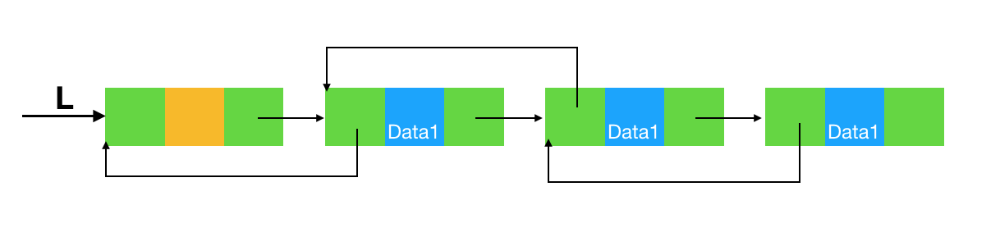

双链表仅仅是在单链表的基础上增加了一个指向其前驱的指针，所以双链表的大多数操作与单链表保持一致，但插入和删除却有较大不同，因为多了一个指针，在保证改变节点后不断链的问题上需要多加注意。

1. 双链表插入节点操作

```c
Status InsertDoublyList(DoublyLinkList *L, int i, ElemType data)
{
    DoublyLinkList p, s;
    if (i < 1 || i > ListLength(L) + 1)
        return ERROR;
    p = GetElemP(L, i - 1);
    if (!p)
        return ERROR;
    s = (DoublyLinkList)malloc(sizeof(DoublyLNode));
    if (!s)
        return OVERFLOW;
    s->data = data;
    s->prior = p; // 在第i-1个元素之后插入
    s->next = p->next;
    p->next->prior = s;
    p->next = s;
    return OK;
}
```


2. 双链表删除节点操作

```c
Status DeleteDoublyList(DoublyLinkList *L, int i, ElemType *e) {
    DoublyLinkList p;
    if (i < 1)
        return ERROR;
    p = (*L);
    for (int j = 1; j <= i; j++)
    {
        p = p->next;
    }
    if (!p)
        return ERROR;
    *e = p->data;
    p->prior->next = p->next;
    p->next->prior = p->prior;
    free(p);
    return OK;
}
```


##### 循环链表

循环链表是是一种特殊的链式存储结构，它的最后一个节点不是指向NULL，而是指向第一个节点，形成一个环。因此循环链表没有指针域会指向NULL，判断为空的条件是尾指针是否等于头指针。

1. 单循环链表

循环单链表的存储结构和单链表相同，操作和单链表也基本一样，差别仅仅是循环中的条件略有不同。通常我们可以只设置尾指针`r`，而不设头指针`h`，因为`r->next`就是h，即使从表头开始操作也没问题。不设头指针的循环单链表结构如下：

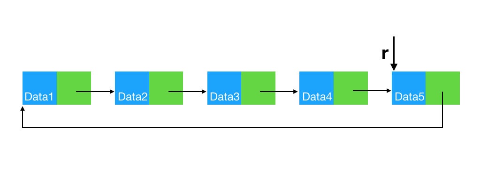

2. 双循环链表

由前边的双链表、循环单链表我们很自然可以想出循环双链表这样数据结构，要注意的是，双循环链表的头节点的prior还要指向尾节点，双循环链表看似指针繁多，其实这样是更方便我们的操作。带头节点的双循环链表结构如下图：

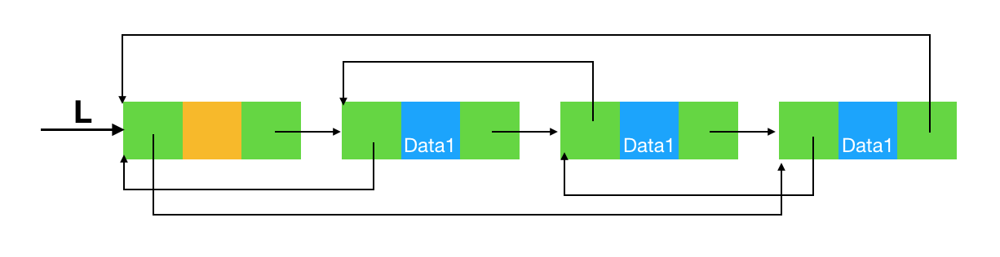

双向循环链表结构操作都和双链表基本一致，不再赘述。


#### 线性表的基本应用

- 两种特殊的线性表－堆栈、队列

堆栈和队列都是受限的线性表，是程序设计最有用的基本工具。内容较多，下章继续写。

- TODO: 添加其他应用

-------------

### 例题精解

【例题1】线性表的链式存储结构是一种（      ）的存储结构。（选择题2分）

A. 散列存取    B. 索引存取    C. 顺序存取    D. 随机存取

答案：C

解析：线性表有两种存储结构： 

1. 顺序存储结构---顺序表。顺序表以数组形式出现，可以取任意下标访问，所以是一种随机存取的存储结构。 

2. 链式存储结构---链表。链表以链表的形式出现，必须从头开始访问，所以是一种顺序存取的存储结构。


【例题2】用链表表示线性表的优点是（     ）。

A. 便于随机存取                        B. 花费的存储空间比顺序少

C. 便于插入和删除                    D. 数据元素的物理顺序与逻辑顺序相同

答案：C


【例题3】线性表的_____________存储结构是以物理位置来表示数据元素之间的逻辑关系的。而线性表的_____________存储结构是通过指针保持数据元素之间的逻辑关系的。（填空题2分）

答案：顺序 链式


【例题4】不带头节点的单链表head为空的判断条件是_____________。

答案：`head == NULL`

解析：带头节点的单链表head判空条件是`head->next == NULL`，不带头节点的单链表head判空条件是<br>`head == NULL`


【例题5】线性表的顺序存储结构优于链式存储结构。（    ）（判断题2分）

答案：错误


【例题6】阅读以下程序，指出算法功能。（每题6分）

程序1：

```c
Status A1(SqList L, ElemType cur_e, ElemType &next_e)
{
    // 初始条件：顺序线性表L已存在
    int i = 1;
    ElemType *p = L.elem;
    while (i < L.length && *p != cur_e)
    {
        i++;
        p++;
    }
    if (i == L.length)
        return INFEASIBLE;
    else
    {
        next_e = *++p;
        return OK;
    }
}
```

答案：查找`L`中`cur_e`的下一个元素，如果有则将下一个元素赋值给`next_e`，并返回`OK`，如果没有返回`INFEASIBLE`。


程序2：

```c
Status A2(LinkList L, int i, ElemType e)
{
    // 初始条件：带头节点的单链表L已存在
    int j = 0;
    LinkList p = L, s;
    while (p && j < i - 1)
    {
        p = p->next;
        j++;
    }
    if (!p || j > i - 1)
        return ERROR;
    s = (LinkList)malloc(sizeof(LNode));
    s->data = e;
    s->next = p->next;
    p->next = s;
    return OK;
}
```

答案：在L的第i个位置插入新元素e。


【例题7】请在“_____________”处填上合适的语句，完成该算法。（每小题6分）

1. 删除顺序表中第i个节点

```c
Status ListDelete_Sq(SqList &L, int i, ElemType &e)
{
    if ((i < 1) || __________)
        return ERROR;
    p = &(L.elem[i - 1]);
    e = *p;
    q = __________;
    for (++p; p <= q; ++p)
        __________;
    --L.length;
    return OK;
}
```

答案：`i > L.length`  ` &(L.elem[L.length - 1])`  `L.elem[p] = L.elem[p + 1]`


2. 在带头节点的单链表中第i个节点之前插入新的元素e

```c
Status ListInsert_L(LinkList L, int i, ElemType e)
{
    p = L;
    j = 0;
    while (p && j < i - 1)
    {
        __________;
        ++j;
    }
    if (!p || j > i - 1)
        return ERROR;
    s = (LinkList) malloc(sizeof(LNode));
    s->data = e;
    __________;
    __________;
    return OK;
}
```

答案：`p = p->next` `s->next = p->next` `p->next = s`


【例题8】设顺序表结构为：

```c
typedef struct {
    ElemType *elem;
    int length;
    int listsize;
}SqList;
```

单链表结构为：

```c
typedef struct LNode {
    ElemType data;
    struct LNode *next;
}LNode, *LinkList;
```

写一函数`void A1(SqList &L1, LinkList &L2)`将已存在的线性表L1中的所有数据元素以逆置的方式移至新建的单链表（带头节点）L2中。（此题12分）

答案：

```c
void A1(SqList *L1, LinkList *L2)
{
    LinkList tmp = (*L2);
    for (int i = L1->length - 1; i >= 0; i--)
    {
        LNode *p = (LNode*)malloc(sizeof(LNode));
        p->data = L1->elem[i];
        tmp->next = p;
        tmp = p;
    }
}
```

解析：本题全部可运行代码在[src/example-8.c](https://github.com/qvjp/UNGEE/tree/master/DataStructure/Linear_List/src/example-8.c)


#### 单项选择题

------

2018

------

【例题】若将长度为n的循环单链表链接在长度为m的循环单链表之后，其算法的时间复杂度为（          ）

A. O(1)

B. O(n)

C. O(m)

D. O(m+n)

答案：C

分析：题目没有说有指向尾节点的指针，所以要先遍历整个长度为m的链表，找到表尾，才能链接，时间复杂度是O(m)。


【例题】用单链表方式存储队列（有头尾指针，非循环），在进行删除时（          ）。

A. 仅修改头指针

B. 仅修改尾指针

C. 头尾指针都需修改

D. 头尾指针可能都需修改

答案：


#### 算法设计题

------

2018

------

【例题】已知无表头节点的单链表la及单链表lb存在，写一算法，删除单链表la中第i个节点起长度为len的节点，并将其插入至单链表lb第j个节点之前。


### 习题精炼

Josephu问题：据说著名犹太历史学家 Josephus有过以下的故事：在罗马人占领乔塔帕特后，39 个犹太人与Josephus及他的朋友躲到一个洞中，39个犹太人决定宁愿死也不要被敌人找到，于是决定了一个自杀方式，41个人排成一个圆圈，由第1个人开始报数，每报数到第3人该人就必须自杀，然后再由下一个重新报数，直到所有人都自杀身亡为止。然而Josephus 和他的朋友并不想遵从，Josephus要他的朋友先假装遵从，他将朋友与自己安排在第16个与第31个位置，于是逃过了这场死亡游戏。 如何用循环链表来求解Josephu问题？


-----------------

### 笔者学习心得


怎样才能学会呢？怎样才敢肯定自己在考试中以不变应万变呢？借用大佬一句话

> **Read the fucking source code**

多看看代码，多抄抄，这些东西自然就会了。


## <span id="Other_Linear_Structure">其他线性结构</span>

大纲要求
> 1. 掌握栈的定义、栈的存贮结构及基本操作的实现。
> 2. 理解用栈实现表达式的求值，递归过程及其实现。
> 3. 掌握队列的定义、存贮结构及基本操作的实现
> 4. 理解串的逻辑定义及其基本操作；理解串的存贮结构。
> 5. 理解数组的定义、数组的顺序存贮结构及矩阵的存贮压缩。
> 6. 理解广义表的定义及存贮结构。


### 内容精讲

#### 栈

栈是一种先进后出的结构（FILO），是一种受限的线性表，这里要记住的唯一知识就是__先进后出__，其他内容其实都是前边线性表的知识。

栈就是一种特殊的线性表，因为也有两种基本结构，链式和顺序结构。


##### 链栈

链栈是以链表为基础的数据结构，可以动态增删节点，其定义如下：

```c
struct StackNode
{
    ElemType data;
    struct StackNode *next;
};
typedef struct StackNode *Stack;
```


###### 链栈的基本操作

基本操作和链表大致一样，只是增加了限制，只允许从栈顶放入/取出元素。下边罗列几个常用操作：

- 初始化一个空栈

```c
Status InitStack(struct StackNode **s)
{
   (*s) = NULL; 
   return OK;
}
```


- 在栈顶放入元素

```c
Status Push(struct StackNode **s, ElemType e)
{
    struct StackNode *node = (struct StackNode*)malloc(sizeof(struct StackNode));
    if (!node)
    {
        return ERROR;
    }
    node->data = e;
    node->next = (*s);
    (*s) = node;
    return OK;
}
```


- 在栈顶取出元素

```c
Status Pop(struct StackNode **s, ElemType *e)
{
    if (!*s)
        return ERROR;
    *e = (*s)->data;
    (*s) = (*s)->next;
    return OK;
}
```


- 获取栈顶元素的值

```c
Status GetTopElem(struct StackNode *s, ElemType *e)
{
    if (s)
    {
        *e = s->data;
        return OK;
    }
    return ERROR;
}
```

链栈全部代码见这里：[链栈](https://github.com/qvjp/UNGEE/tree/master/DataStructure/Other_Linear_Structure/src/linked_stack.c)


##### 顺序栈

顺序栈是用一组连续地址空间存储的栈，事先分配好内存，不能动态增删。

其基本机构为：

```c
struct Stack
{
    ElemType data[MAXSIZE];
    int top;
};
```


###### 顺序栈的基本操作

对应上边链栈，这里也写几个常用操作：

- 初始化一个空栈

```c
Status InitStack(struct Stack *s)
{
    s->top = -1;
    return OK;
}
```


- 在栈顶放入元素

```c
Status Push(struct Stack *s, ElemType e)
{
    if (s->top < MAXSIZE - 1)
    {
        s->top++;
        s->data[s->top] = e;
        return OK;
    }
    else
        return OVERFLOW;
}
```


- 在栈顶取出元素

```c
Status Pop(struct Stack *s, ElemType *e)
{
    if (s->top == -1)
        return ERROR;
    else
    {
        *e = s->data[s->top--];
    }
    return OK;
}
```


- 获取栈顶元素的值

```c
Status GetTopElem(struct Stack s, ElemType *e)
{
    if (s.top == -1)
        return ERROR;
    else
    {
        *e = s.data[s.top];
    }
    return OK;
}
```

顺序栈全部代码见这里：[顺序栈](https://github.com/qvjp/UNGEE/tree/master/DataStructure/Other_Linear_Structure/src/sequential_stack.c)


##### 用栈实现表达式求值

终于有个看得见的东西可以写写了，很开心是不是？表达式求值，是一个实际问题，最常见的办法是把中缀表达式（就是我们常用到的比如a+b-c这种操作符在操作数中间的）转换为后缀表达式（类似这样abc-+），然后再计算后缀表达式的值。

这里有两个算法，一个是中缀转后缀，一个是后缀式的计算。

###### 中缀转后缀

转换规则：

1. 遇到操作数，直接输出； 
2. 栈为空时，遇到运算符，入栈； 
3. 遇到左括号，将其入栈； 
4. 遇到右括号，执行出栈操作，并将出栈的元素输出，直到弹出栈的是左括号，左括号不输出； 
5. 遇到其他运算符’+”-”*”/’时，弹出所有优先级大于或等于该运算符的栈顶元素，然后将该运算符入栈； 
6. 最终将栈中的元素依次出栈，输出。 

规则比较啰嗦，我直接上个过程图吧，可以对照着规则一步一步的看

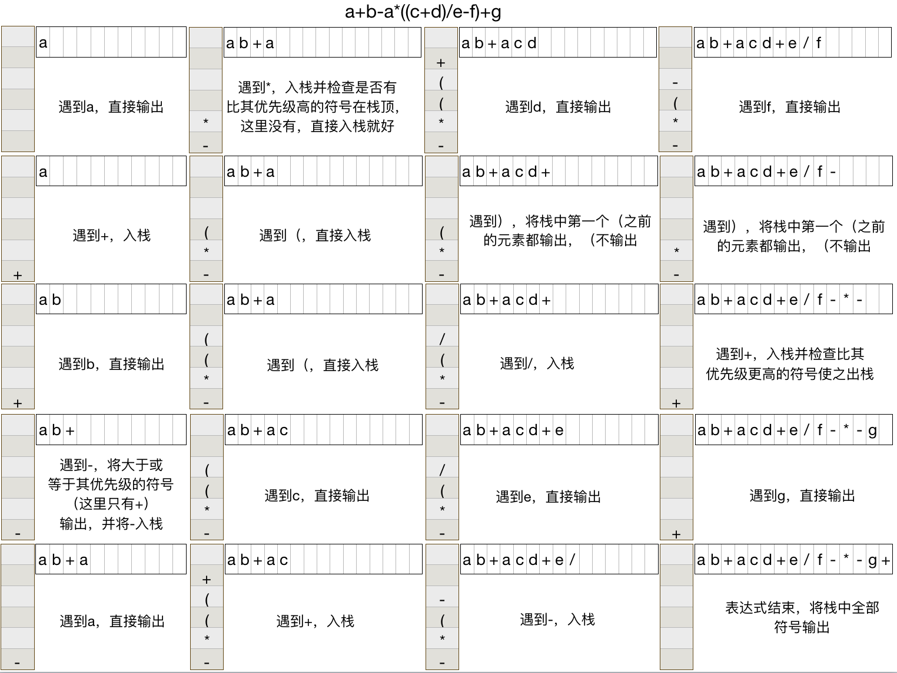


下边是代码示例：

```c
void ToPostfix(char *e, char* post)
{
    int index = 0;
    int pop = 0;
    struct StackNode *stack;
    InitStack(&stack);
    for(;*e;)
    {
        pop = 0;
        if (*e > 47 && *e < 58) // 操作数直接输出
            post[index++] = *e;
        if (*e == 40)           // '('
            Push(&stack, *e);
        if (*e == 41)           // ')'
        {
            for (Pop(&stack, &pop); pop != 40; Pop(&stack, &pop))
            {
                post[index++] = pop;
            }
        }

        if (*e == 42 || *e == 43 || *e == 45 || *e ==47)   // * + - /
        {
            if(!StackEmpty(stack))  // 栈为空
            {
                Push(&stack, *e);
            }
            else
            {
                for (; (StackEmpty(stack) && pop != -1) ;)
                {
                    GetTopElem(stack, &pop);
                    switch (pop)
                    {
                        case 42:
                        case 47:
                            Pop(&stack, &pop);
                            post[index++] = pop;
                            break;
                        case 43:
                        case 45:
                            if (*e == 43 || *e == 45)
                            {
                                Pop(&stack, &pop);
                                post[index++] = pop;
                            }
                            else
                                pop = -1;
                            break;
                        default:
                            pop = -1;
                            break;
                    }

                }
                Push(&stack, *e);
            }
        }
        *e++;
    }
    // 全部出栈
    for (; StackEmpty(stack);)
    {
        Pop(&stack, &pop);
        post[index++] = pop;
    }
    post[index] = '\0';
}
```


###### 后缀式的计算

后缀表达式的计算比较容易，借助栈可以很轻松实现。过程如下：

顺序扫描表达式的每一项，若是操作数，则入栈，若是操作符（记为\<op\>），则连续出栈两次（先出栈的是x后出的y），然后计算`y<op>x`，并将结果在压入栈中。最终当扫描完毕表达式，栈顶存放的就是表达式结果。

我实现了一个最基础的一位数四则运算小程序：

```c
void CalcPostfix(char *e, int *a)
{
    struct StackNode *stack;
    int x = 0;
    int y = 0;
    InitStack(&stack);
    char *expression = malloc(sizeof(char) * strlen(e));
    strcpy(expression, e);
    while (*expression)
    {
        if (*expression >= '1' && *expression <= '9')
        {
            x = *expression - '0';
            Push(&stack, x);
        }
        else if (*expression == '+' || *expression == '-' ||
                *expression == '*' || *expression == '/')
        {
            Pop(&stack, &y); 
            Pop(&stack, &x); 
            switch (*expression)
            {
                case '+':
                {
                    Push(&stack, x + y);
                    break;
                }
                case '-':
                {
                    Push(&stack, x - y);
                    break;
                }
                case '*':
                {
                    Push(&stack, x * y);
                    break;
                }
                case '/':
                {
                    Push(&stack, x / y);
                    break;
                }
            }
        }
        else
        {
            exit(ERROR);
        }
        *expression++;
    }
    Pop(&stack, &x);
    *a = x;
}
```

有兴趣的读者可以扩展它，使之不仅仅支持一位数的算法。


##### 再看递归

// TODO: 


#### 队列

学习队列只需记住先进先出（FIFO），其他东西都是线性表的知识，所以想学好队列，要先把线性表学扎实。


##### 链队

链队和前边的单链表相似，只是限制了操作，其头指针指向头节点，尾指针指向尾节点，只允许从头节点处删除，只允许从尾节点处添加。

其基本结构图下：

```c
struct QueueNode
{
    ElemType data;
    struct QueueNode *next;
};

struct Queue
{
    struct QueueNode *front;
    struct QueueNode *rear;
};
```


###### 链队的基本操作

- 初始化队列

```c
Status InitQueue(struct Queue **q)
{
    (*q) = (struct Queue*)malloc(sizeof(struct Queue));
    (*q)->front = (*q)->rear = (struct QueueNode*)malloc(sizeof(struct QueueNode));
    (*q)->front = (*q)->rear = NULL;
    return OK;
}
```


- 判断队列是否为空

```c
Status QueueEmpty(struct Queue* q)
{
    if (!q->front && !q->rear)
        return TRUE;
    return FALSE;
}
```


- 获取队列长度

```c
int QueueLength(struct Queue *q)
{
    int n = 0;
    if (!q->front && !q->rear)
        return n;
    struct QueueNode* node;
    node = q->front;
    while (node)
    {
        node = node->next;
        n++;
    }
    return n;
}
```


- 在队尾放入元素

```c
Status Put(struct Queue **q, ElemType e)
{
    struct QueueNode *node = (struct QueueNode*)malloc(sizeof(struct QueueNode));
    node->data = e;
    node->next = NULL;
    if ((*q)->rear == NULL)
        (*q)->rear = (*q)->front = node;
    else
    {
        (*q)->rear->next = node;
        (*q)->rear = node;
    }
    return OK;
}
```


- 在队首删除元素

```c
Status Poll(struct Queue **q, ElemType *e)
{
    if ((*q)->front)
    {
        if ((*q)->rear == (*q)->front->next)
            (*q)->rear = NULL;
        *e = (*q)->front->data;
        (*q)->front = (*q)->front->next;
        return OK;
    }
    return ERROR;
}
```


- 获取队首元素值

```c
Status Get(struct Queue *q, ElemType *e)
{
    if (q->front)
    {
        *e = q->front->data;
        return OK;
    }
    return ERROR;
}
```

链队列全部代码见这里：[链式队列](https://github.com/qvjp/UNGEE/tree/master/DataStructure/Other_Linear_Structure/src/linked_queue.c)


##### 顺序队列

队列的顺序存储是事先分配好一块连续的固定大小内存空间，并设置两个指针分别指向队首和队尾。其结构如下：

```c
#define MAXSIZE 10
struct Queue
{
    ElemType data[MAXSIZE];
    int front;
    int rear;
};
```


###### 顺序队列的基本操作

和栈对应，这里也列举几个常用操作。

- 初始化队列

```c
Status InitQueue(struct Queue *q)
{
    q->front = 0;
    q->rear = 0;
    return OK;
}
```


- 判断队列是否为空

```c
Status QueueEmpty(struct Queue q)
{
    if (!(q.rear && q.front))
    {
        return TRUE;
    }
    return FALSE;
}
```


- 在队尾放入元素

```c
Status Put(struct Queue *q, ElemType e)
{
    if (q->rear < MAXSIZE)
    {
        q->data[q->rear] = e;
        q->rear++;
        return OK;
    }
    return OVERFLOW;
}
```


- 在队首取出元素

```c
Status Poll(struct Queue *q, ElemType *e)
{
    if (q->front < q->rear)
    {
        *e = q->data[q->front];
        q->front++;
        return OK;
    }
    return ERROR;
}
```


- 获取队首元素值

```c
Status Get(struct Queue q, ElemType *e)
{
    if (q.front < q.rear)
    {
        *e = q.data[q.front];
        return OK;
    }
    return ERROR;
}
```

顺序队列全部代码见这里：[顺序队列](https://github.com/qvjp/UNGEE/tree/master/DataStructure/Other_Linear_Structure/src/sequential_queue.c)


###### 循环队列

上边的顺序队列有一个缺点，就是当Put n次并Poll n次后按理说剩余可用空间还是最初设定的最大值，但实际却是最大值减去n，如果n等于最大值，那么队列将不能在放入元素，此即为“上溢出”。循环链表很好的解决了这个问题，用首尾相接的办法，使队列成环，这样就可以循环利用队列有限的空间。

但循环队列操作上稍有点麻烦，就是首指针和尾指针的索引计算问题，下边是计算方法：

- 队首指针加1: `q.front = (q.front + 1) % MAXSIZE`
- 队尾指针加1: `q.rear = (q.rear + 1) % MAXSIZE`
- 队列长度: `q-rear - q-front + MAXSIZE) % MAXSIZE`

其基本操作除了上述几个计算不一样外，和普通顺序队列一样：

- 初始化队列

```c
Status InitQueue(struct Queue *q)
{
    q->front = 0;
    q->rear = 0;
    return OK;
}
```


- 判断队列是否为空

```c
Status QueueEmpty(struct Queue q)
{
    if (!(q.rear && q.front))
    {
        return TRUE;
    }
    return FALSE;
}
```


- 返回队列长度

```c
int QueueLength(struct Queue q)
{
    return (q.rear - q.front + MAXSIZE) % MAXSIZE;
}
```


- 在队尾放入元素

```c
Status Put(struct Queue *q, ElemType e)
{
    if (((q->rear + 1) % MAXSIZE) != q->front)
    {
        q->data[q->rear] = e;
        q->rear = (q->rear + 1) % MAXSIZE;
        return OK;
    }
    return OVERFLOW;
}
```


- 在队首取出元素

```c
Status Poll(struct Queue *q, ElemType *e)
{
    if (q->rear != q->front)
    {
        *e = q->data[q->front];
        q->front = (q->front + 1) % MAXSIZE;
        return OK;
    }
    return ERROR;
}
```


- 获取队首元素值

```c
Status Get(struct Queue q, ElemType *e)
{
    if (q.front != q.rear)
    {
        *e = q.data[q.front];
        return OK;
    }
    return ERROR;
}

```

循环队列全部代码见这里：[循环队列](https://github.com/qvjp/UNGEE/tree/master/DataStructure/Other_Linear_Structure/src/circular_queue.c)


##### 双端队列

双端队列允许队列两端都可以入队和出队，所以也可以把它看成是栈和队列的结合，基于双向链表实现的双端队列结构如下图：

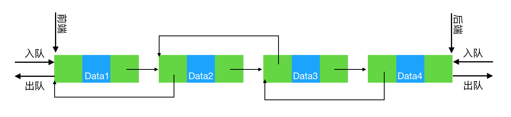

双端队列也包含输入受限（一端可以出入，另一端只能出队）的队列，和输出受限的队列（一端可以出入，另一端只能入队）。

双端队列在主流现代编程语言中都能看到影子，这里不给出具体代码，将具体代码留给习题精炼供大家练习。


#### 串

串又叫字符串，是由零个或多个字符组成的有限序列。串也是一种线性表，所以当然可以用顺序或链式的结构存储，存储方式取决于要如何对串进行操作。串的基本操作有初始化串、求串长度、求字串、串的拼接、串的比较等等，都较为简单，不赘述。


#### 数组

数组是由n(n >= 1)个相同类型的元素组成的有限序列，数组可以看作是线性表的推广，即一维数组就是一个线性表，二维数组是线性表的线性表，以此类推。数组的大小是固定的，所使用的内存空间是连续的。所以可以通过下标计算对应元素的地址：``` Location(a[i]) = Location(a[0]) + Length(ElemType) * i``` ，对于二维数组，一般按行优先的策略存储，即先存储行号较小的，行号相同再按列号存储。计算w行c列二维数组某元素的地址可以这样：``` Location(a[i, j]) = Location(a[0, 0]) + Length(ElemType) * (i * w + j)```。


##### 矩阵的存储压缩

矩阵是m行乘以n列的阵列，用计算机存储矩阵，我们自然会想到二维数组，看是很完美的对应，但在实际的数学研究或图形学等实践中，会有很多特殊的矩阵，元素分布不均匀，如果用二维数组一一对应存储会浪费很多空间，下边我们分别对几种特殊矩阵做压缩存储的介绍。

###### 对称矩阵

$$
\left(\begin{array}{cccc}
a_{1,1}      & a_{1,2}      & \cdots & a_{1,n}      \\
a_{2,1}      & a_{2,2}      & \cdots & a_{2,n}      \\
\vdots & \vdots & \ddots & \vdots \\
a_{n,1}      & a_{n, 2}      & \cdots & a_{n,n}      \\
\end{array}\right)
$$

对称矩阵是a<sub>i,j</sub>=a<sub>j,i</sub>的一种方阵，我们只需保存对角线和下三角区域即可。即第一行保存1个元素第二行两个第n行n个。将a<sub>i,j</sub>存储一维数组中其数组下标是`i(i-1)/2+j-1`。


###### 三角矩阵

$$
\left(\begin{array}{cccc}
a_{1,1}& a_{1,2} & \cdots & a_{1,n} \\
       &a_{2,2}  & \cdots &a_{2,n}  \\
       &         & \ddots & \vdots  \\
{\Huge0}
       &         &        &a_{n,n}
\end{array}\right)
$$


下三角矩阵的存储和前边的对称矩阵存储一样，其计算公式依然是a<sub>i,j</sub>对应数组下标是`i(i-1)/2+j-1`。

上三角矩阵公式不一样，但画个图还是很容易推出来的：a<sub>i,j</sub>对应数组下标是`(i-1)(2n-i+2)/2+(j-i)`。


###### 对角矩阵

$$
\left(\begin{array}{cccc}
a_{1,1}& a_{1,2} &  & & \\
a_{2,1}& a_{2,2} &  &  & {\Huge 0}\\
       & \ddots  & \ddots       & \ddots\\
       &     &    & a_{n-1, n-1} &a_{n-1, n} \\
       {\Huge 0}
       &     &    & a_{n,n-1}        &a_{n,n}
\end{array}\right)
$$

这里我们以三对角矩阵做例子，其他类似。

存储这类矩阵可以按行优先存储，那么a<sub>i,j</sub>在一维数组中下标就是：`2i+j-3`。

###### 稀疏矩阵

$$
\left(\begin{array}{cccc}
0      & 1      & 0 & 0      \\
0      & 0      & 0 & 9      \\
0      & 0      & 0 & 0      \\
0      & 1      & 0 &0       \\
\end{array}\right)
$$

稀疏矩阵大多使用（行，列，值）这样的三元组保存，如上图可以保存如下的表格：

| 行   | 列   | 值   |
| ---- | ---- | ---- |
| i    | 2    | 1    |
| 2    | 4    | 9    |
| 4    | 2    | 1    |

也可以使用行指针链表（第一列为数组，指向本行下一个有用元素的位置）// TODO: 完善这里

或使用十字链表（我赌不考）十字链表参考[这篇博文](https://blog.csdn.net/zhuyi2654715/article/details/6729783)


#### 广义表

广义表是线性表的推广。广义表一般记作LS=(a<sub>1</sub>,α<sub>2</sub>,...,α<sub>n</sub>)，n是它的长度a<sub>i</sub>可以是单个元素也可以是广义表，分别称为广义表LS的原子和子表。当广义表LS非空时，称第一个元素a<sub>1</sub>为LS的表头（Head），其余元素组成的表（a<sub>1</sub>,α<sub>2</sub>,...,α<sub>n</sub>）是LS的表尾（Tail）。


##### 广义表的表示

- E = ()

L是一个空表，长度为0

- L = (a, b)

L是一个长度为2的广义表，他的两个元素都是原子

- A = (x, L) = (x, (a, b))

A是长度为2的广义表，第一个元素是原子x，第二个元素是子表L。

- B = (A, y) = ((x, (a, b)), y)

B是长度为2的广义表，第一个元素是子表A，第二个元素是原子y。

- C = (A，B) = ((x, (a, b)), ((x, (a，b)),y))

C的长度为2，两个元素都是子表。

- D=(a, D)=(a, (a, (a, (…))))

D的长度为2，第一个元素是原子，第二个元素是D自身，展开后它是一个无限的广义表。

广义表C可以用下边这种结构图表示：

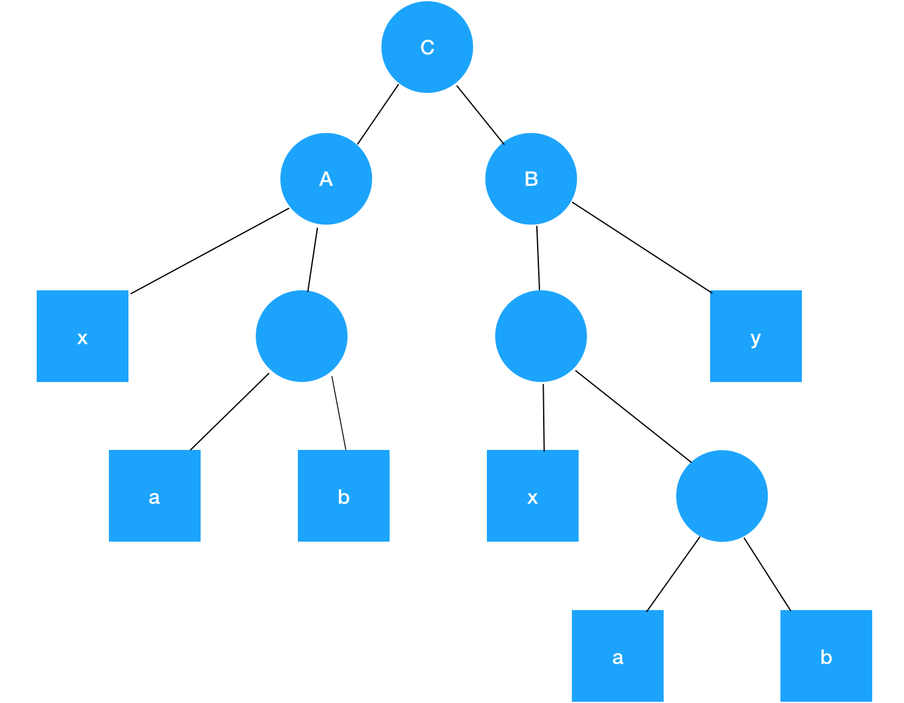


其存储示意图见【例题6】

广义表的长度是指表中元素的个数（第一层）

广义表的深度是指表展开后所含括好的层数，如A、B、C、D的层数分别是2、3、4、∞。


##### 广义表的运算

广义表拥有普通线性表的运算，这里只说其特有的两个：tail()和head()，分别是取表尾和取表头。这里要注意的是任何一个非空广义表的表头是表中第一个元素，它可以是原子，也可以是子表，而其表尾必定是子表。 

比如L=((x, (a, b)), ((x, (a，b)),y))，进行head(L)后结果是(x,(a, b))，进行tail(L)后结果是(((x, (a, b)), y))，这里注意tail()操作的()。


### 例题精解

【例题1】判断下列陈述是否正确

1. 栈和队列也是线性表，如果需要，可对他们中的任一元素进行操作。
2. 非空广义表的表头和表尾都有可能是原子或广义表。
3. 串在用定长顺序存储表示时，如果实际串值长超过预定义长度，则用压缩方式存储。

答案：错误 错误 错误

解析：

1. 只能对栈顶/队尾/队首操作，如果能对任一元操作就不是栈/队列了。
2.  根据定义，非空广义表的 表头是一个元素，它可以是原子也可以是一个子表， 而表尾则必定是子表。例如:LS=(a,b),表头为a,表尾是（b）而不是b.另外：LS=（a)的表头为a，表尾为空表(). 
3. 我手头没有标准答案，我觉得错误。


【例题2】递归过程可借助于_____________转化为非递归过程。

答案：栈


【例题3】循环队列用数组A[0...m-1]存放其元素值，设头尾游标分别为front（队头元素的位置）和rear（队尾元素的位置），则当前队列中的元素个数是_____________。

答案：(rear-front+m)%m


【例题4】压栈次序为a、b、c，则不可能得到的输出序列是_____________。

答案：cab

解析：三个元素入栈，出栈共有6种可能情况，分别是：abc acb bac bca cab cba，观察可知cab不可能。（有人说如果给出abcdefgh入栈这个题该怎么做，也这样列出来显然不可能，怎么做呢？这是个小问题，自己悟吧😂）


【例题5】已知广义表L=(((x), y, ((z))),((a, b, c)), d)，利用head(T)（取T的表头）和tail(T)（取T的表尾）两个运算，则从L表中取出原子项y的运算为_____________。

答案：head(tail(head(L)))

解析：

head(L)=((x),y,((z)))

tail(head(L))=(y,((z)))

head(tail(head(L)))=y


【例题6】给出上题中广义表的节点结构定义（形式定义或图示定义均可），并根据你定义的节点结构，画出该广义表的存储结构图。

答案：如图：

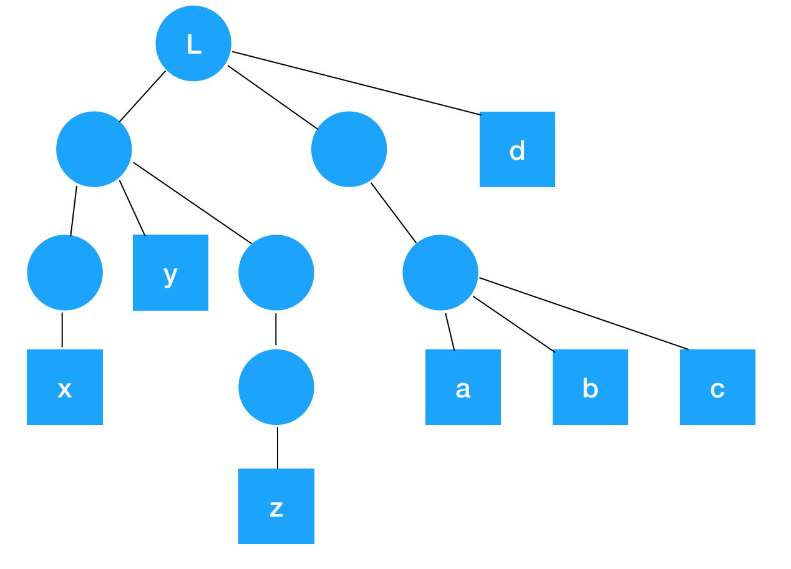


【例题7】对广义表A=((a,(b)),(c,( )),d)执行操作gettail(gethead(gettail(A)))的结果是：_____________。

A. ( )                                         B. (( ))

C. d                                          D. (d)

答案：B

解析：

gettail(A)=((c,()),d)

gethead(gettail(A))=(c,())

gettail(gethead(gettail(A)))=(())


【例题8】如下关于串的陈述中，正确的是_____________、_________。

A. 串是数据元素类型特殊的线性表

B. 串中的元素是字母

C. 串中若干个元素构成的子序列称为子串

D. 空串即为空格串

答案：A C


【例题9】若顺序栈S的类型为：

```c
typedef struct
{
    SElemType *base;
    int top; // top 为栈顶指示器，初始化时，将top置为-1
    int stacksize;
}SqStack;
```

则向S中压入新元素时，应当（    ）。

A. 先移动栈顶指示器，再在栈顶指示器所指处存入元素

B. 先在栈顶指示器所指处存入元素，再移动栈顶指示器

C. 先后次序无关紧要，只要在栈顶指示器所指处存入元素即可

D. 同时进行

答案：A


【例题10】阅读下列函数，指出算法功能

```c
int A1(LinkQueue Q)
{
    int i = 0;
    QueuePtr p;
    p = Q.front;
    while (Q.rear != p)
    {
        i++;
        p = p->next;
    }
    return i;
}

```

答案：计算队列长度


【例题11】若栈结构的存储采用带头节点的单链表实现，写出链栈的初始化、入栈和出栈过程。

答案：

```c
// 初始化
void initStack(LinkStack *s)
{
  (*s) = (Node *)malloc(sizeof(Node));
  if(!(*s)) return NULL;
  (*s) -> next = NULL;
}

// 入栈
Status Push(LinkStack *s, ElemType e)
{
    struct StackNode *node = (struct StackNode*)malloc(sizeof(struct StackNode));
    if (!node)
    {
        return ERROR;
    }
    node->data = e;
    node->next = (*s)->next;
    (*s)->next = node;
    return OK;
}

// 出栈
Status Pop(LinkStack *s, ElemType *e)
{
    if (!(*s)->next)
        return ERROR;
    *e = (*s)->next->data;
    (*s)->next = (*s)->next->next;
    return OK;
}
```


#### 填空题

------

2018

------

【例题】若每一数据只能进栈一次、出栈一次，则通过栈对先后输入的三个数据3，2，1进行调度，不能得到的调度结果为：\_\_\_\_\_\_\_\_\_\_\_。


【例题】设有二维数组A\[10\]\[10\]，假设每个数组元素用4个字节存储，存储器按字节编址，从首地址1000开始以行序为主次序连续存放，则数组元素A\[3\]\[7\]的起始地址为\_\_\_\_\_\_\_\_\_\_\_。


【例题】广义表((), (a)((b, c),d))的表尾为\_\_\_\_\_\_\_\_\_\_\_。


#### 程序阅读题

----

2018

-----

【例题】1

```c
bool A(HString &S, int pos, HString T)
{
    if (pos < 1 || pos > S.length + 1)
    {
        return false;
    }
    if (T.length)
    {
        S.ch = (char*)realloc(S.ch, (S.length + T.length) * sizeof(char));
        if (!S.ch)
            return false;
        for (i = S.length - 1; i >= pos - 1; i--)
            S.ch[i + T.length] = S.ch[i];
        for (i = 0; i < T.length; i++)
            S.ch[pos - 1 + i] = T.ch[i];
        S.length += T.length;
	}
    return true;
}
```


### 习题精炼

【习题1】用栈的思想方法，设计算法，计算`((1+29)+(3*(48-34)))/30`。

【习题2】实现双端队列的基本操作。


### 笔者学习心得

这一块每年都考，但感觉不是重点考察内容。


## <span id="Tree">树和二叉树</span>

大纲要求
> 1. 掌握树型结构的定义。
> 2. 掌握二叉树的定义、性质及各种存贮结构。
> 3. 掌握遍历二叉树、线索二叉树及其他基本操作。
> 4. 掌握树、森林与二叉树的相互转换；理解树的遍历；掌握哈夫曼树及其应用。


### 内容精讲

#### 树的基本概念

树是由n(n>=0)个结点构成的具有层次关系的有限集合。对于任意一棵非空树有：

- 每个元素称为结点（node）。
- 有一个特定的被称为根结点的结点。
- 除根结点外其余的数据元素被分为m（m>=0)个互不相交的集合T<sub>1</sub>，T<sub>2</sub>，…，T<sub>m-1</sub>，其中每一个集合T<sub>i</sub>也是一棵树，被称为原树的子树。

树是递归定义的，是一种递归的数据结构，但在逻辑上，是分层的，有如下特点：

- 树中除根结点之外的所有结点都有唯一的前驱结点。
- 每个结点都有零个或多个后继节点。


##### 基本术语

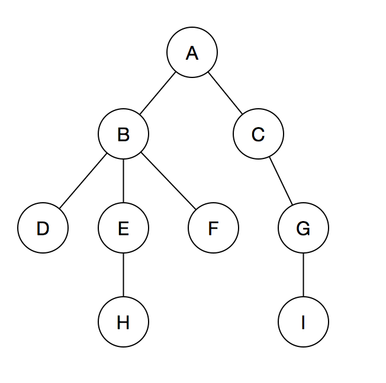

1. 祖先结点：从根到该节点所经分支上的所有节点。
2. 子孙结点：以某结点为根的子树中任一节点都称为该结点的子孙，如I是C的子孙结点。
3. 双亲结点：若一个结点含有子节点，则这个节点称为其子结点的父节点。
4. 孩子结点：一个结点含有的子树的根节点称为该节点的子结点。
5. 兄弟结点：具有相同父节点的节点互称为兄弟节点。
6. 堂兄弟结点：双亲在同一层的节点互为堂兄弟结点。H和I为堂兄弟结点。
7. 结点的度：一个结点含有的子树的个数称为该结点的度。
8. 树的度：一棵树中，最大的结点的度称为树的度。
9. 结点的层次：从根开始定义起，根为第1层，根的子结点为第2层，以此类推。
10. 结点的深度：对于任意节点n,n的深度为从根到n的唯一路径长，根的深度为0。
11. 结点的高度：对于任意节点n,n的高度为从n到一片树叶的最长路径长，所有叶结点的高度为0。
12. 树的高度（深度）：树中结点的最大高度。上树高度为4。
13. 叶结点（终端结点）：度为0的结点称为叶结点。
14. 森林：m（m>=0）棵互不相交的树的集合称为森林；


##### 表示方法

###### 图像表达

如下图，是树的最基本图像表达方式。

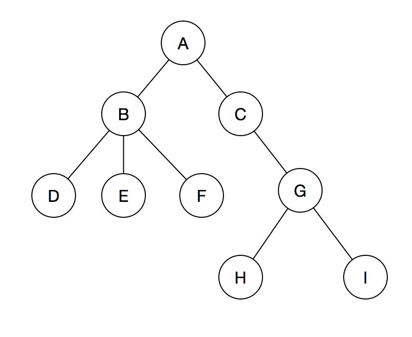

###### 符号表达

树也可以用符号表达，即用括号先将根结点放入一对圆括号中，然后把它的子树由左至右的顺序放入括号中，而对子树也采用同样的方法处理

上图可表示为：(A (B(D, E, F), C(G(H, I))))


##### 树的性质

- 树中所有结点树等于所有结点的度数加一。

这一条理解起来比较容易，即本层所有结点的度之和是下一层结点个数，最后一层结点度为0，正好没有加根结点，所有结点数之和为所有结点的度数加一。

- 度为m的树中第i层至多有m<sup>i-1</sup>个结点。

这里说最多有多少个，每一个节点的度都是m才能使结点最多，所以第一层1个，然后依此是1\*m、1\*m\*m、1\*m\*m\*m，找到规律即m<sup>i-1</sup>。

- 高度为h的m叉树至多有(m<sup>h</sup>-1)/(m-1)个节点

还是说最多有多少个，假设每个节点度都是m可使结点最多，和上边一样，第一层1个，第二层m个，第h层有m<sup>h-1</sup>个，是个等比数列，所以一共有(m<sup>h</sup>-1)/(m-1)个。

- 具有n个结点的m叉树的最小高度为$$ \lceil \log _{m}(n(m-1)+1) \rceil$$。

根据上一条的高度为h的m叉树最多有(m<sup>h</sup>-1)/(m-1)个节点，反解得$$ \lceil \log _{m}(n(m-1)+1) \rceil$$。


#### 二叉树的基本概念

二叉树是n（n>=0）个结点构成的有限集合，每个结点最多只有2个子结点，并且这两个子结点区分左右，次序不能颠倒。类似前边树的定义，二叉树有：

- n为0时，二叉树为空二叉树
- n不为0时，是一个由根结点和左右两个互不相交的被称为左子树和右子树的二叉树构成，左子树和右子树又是一个二叉树。

这里也不能看出**二叉树不是树**，因为树是不区分左右子树的，二叉树只能说是有树状结构。

二叉树有5种基本形态：


##### 二叉树的类型

###### 满二叉树

这种树的特点是每一层上的节点数都是最大节点数，即除叶子结点外其它结点的度都是2。如下图所示：


###### 完全二叉树

二叉树除最后一层外，若其余层都是满的，并且最后一层或者是满的，或者是在右边缺少连续若干节点，这样的树是完全二叉树。如下图：


###### 平衡二叉树

平衡二叉树又被称为AVL树，树上任意节点的左子树和右子树的高度差不超过1。

###### 二叉排序树

一棵空二叉树或者是其左子树上所有结点关键字均小于根结点关键字，右子树上所有结点关键字均大于根结点关键字的二叉树被称为二叉排序树。


##### 二叉树的性质

1. 非空二叉树第i层结点总数不超过2<sup>k-1</sup>。
2. 高度为h的二叉树最多有2<sup>h</sup>-1个节点，最少有h个节点。
3. 记二叉树叶结点数为n<sub>0</sub>，度为2的结点总数记为n<sub>2</sub>，则n<sub>0</sub>=n<sub>2</sub>+1。
4. 具有n个结点的完全二叉树的深度为$$ \lceil \log _{2}(n+1) \rceil$$。
5. 给定n个节点，能构成C(n)种不同的二叉树。C(n)为卡特兰数的第n项。C(n)=(2n)!/[(n+1)!n!]。


##### 二叉树的存储形式

###### 顺序存储

顺序存储就是用一组连续的地址空间将二叉树从上至下从左至右依次存储，并且将二叉树中缺少的结点用0补齐。因此满二叉树和完全二叉树比较适合这种存储方式，在最糟糕的情况下比如高度为h的二叉树每个节点都只有右孩子，这样就需要2<sup>h</sup>-1个存储空间，实际只有h个节点，浪费极大。顺序存储可以很容易确定双亲和子结点的关系，若父节点索引为i，则它的左子结点的索引是2i+1，右子结点索引是2i+2，他的父节点（若存在）为$$ \lfloor \frac{i-1}{2} \rfloor$$。（这里假设根结点索引为0）


###### 链式存储

顺序存储空间利用率较低，所以通常使用链式存储，用链表中一个节点存储二叉树中的一个节点。通常链表中每个节点有三个域：数据域、左指针域、右指针域，有些也会添加指向父节点的指针，在含有n个节点的二叉链表中含有n+1个空链域。链式存储结构如下图：


#### 二叉树的基本操作和线索二叉树

二叉树可以顺序存储也可以链式存储，其顺序存储的结果如下：

```c
#define MAXSIZE 100

struct BTree
{
    ElemType data[MAXSIZE];
    int length;
};
```

链式定义如下：

```c
struct BTNode
{
    ElemType data;
    struct BTNode* lchild;
    struct BTNode* rchild;
};

typedef struct BTNode *BTree;

```


##### 二叉树的遍历

二叉树的遍历是指按一定次序依次访问二叉树中每个结点，按照不同的访问顺序，我们把这些方法分为先序遍历、中序遍历、后序遍历。

###### 先序遍历

先序遍历是指：

- 如果二叉树为空，返回
- 访问根结点
- 先序遍历左子树
- 再序遍历右子树

具体代码如下：

```c
// 顺序存储
Status preorder(struct BTree b, int n)
{
    // data[n] == 0即为空结点，data[n] == -1为结束标志
    if (!(b.data[n] == 0 || b.data[n] == -1))
    {
        printf("%d ", b.data[n]);
        preorder(b, 2*n+1);
        preorder(b, 2*n+2);
    }
    return OK;
}
```

```c
// 链式存储
Status preorder(BTree b)
{
    if (b)
    {
        printf("%c ", b->data);
        preorder(b->lchild);
        preorder(b->rchild);
    }
    return OK;
}

```


###### 中序遍历

中序遍历是指：

- 如果二叉树为空，返回
- 先序遍历左子树
- 访问根结点
- 再序遍历右子树

具体代码：

```c
// 顺序存储
Status inorder(struct BTree b, int n)
{
    if (!(b.data[n] == 0 || b.data[n] == -1))
    {
        inorder(b, 2*n+1);
        printf("%d ", b.data[n]);
        inorder(b, 2*n+2);
    }
    return OK;
}
```

```c
// 链式存储
Status inorder(BTree b)
{
    if (b)
    {
        inorder(b->lchild);
        printf("%c ", b->data);
        inorder(b->rchild);
    }
    return OK;
}
```


###### 后序遍历

后序遍历是指：

- 如果二叉树为空，返回
- 先序遍历左子树
- 再序遍历右子树
- 访问根结点

具体代码：

```c
// 顺序存储
Status postorder(struct BTree b, int n)
{
    if (!(b.data[n] == 0 || b.data[n] == -1))
    {
        postorder(b, 2*n+1);
        postorder(b, 2*n+2);
        printf("%d ", b.data[n]);
    }
    return OK;
}
```

```c
// 链式存储
Status postorder(BTree b)
{
    if (b)
    {
        postorder(b->lchild);
        postorder(b->rchild);
        printf("%c ", b->data);
    }
    return OK;
}

```


###### 层次遍历

层次便是按照二叉树的层次序一层一层遍历了，对于顺序二叉树来说很容易，只需将数组中元素依次输出即可，但链式二叉树则需要借助队列来完成，具体做法先将根结点入队，然后出队，访问该结点，如果它有左子树，则将左子树根结点入队，如果它有右子树，则将右子树根结点入队。然后出队，一直循环下去。具体代码如下：

```c
// 顺序结构
Status levelorder(struct BTree b)
{
    for (int i = 0; i < b.length; i++)
    {
        printf("%d ", b.data[i]);
    }
    printf("\n");
    return OK;
}
```

```c
// 链式结构
Status levelorder(BTree b)
{
    InitQueue(&q);
    Btree p;
    Put(&q, p);
    while(!isEmpty(q))
    {
        Poll(q, p);
        visit(p);
        if (p->lchild)
            Put(q, p->lchild);
        if (p->rchild)
            Put(q, p->rchild);
    }
}
```


四种遍历方式，得到的结果如下：


二叉树初始化及遍历等代码在[这里](https://github.com/qvjp/UNGEE/tree/master/DataStructure/Tree/src/sequential_binary_tree.c)和[这里](https://github.com/qvjp/UNGEE/tree/master/DataStructure/Tree/src/linked_binary_tree.c)


##### 线索二叉树


#### 树、森林

##### 树的存储结构

前面的二叉树我们分别用顺序和链式进行了存储，整个过程比较自然，但树结构比较复杂，表面看来无论如何都不可能将一棵树存到线性的结构中，所以，下边内容挺难，多练练才能记住。


###### 双亲表示法

双亲表示法是以一组连续的空间存储每个结点，每个结点都附设一个指向其双亲结点的伪指针，根结点尾指针设为-1。结点可以定义为：

```c
struct PNode
{
    ElemType data;
    int parent;
};
```

树可以定义为：

```c
#define MAXSIZE 100
struct PTree
{
    struct PNode node[MAXSIZE];
    int n;
};
```

其直观的图形表示是这样：


用双亲表示法可以根据结点的parent域很容易找到双亲结点，但是找子结点就要遍历整个树。

###### 孩子表示法

双亲表示法查找子结点很不优雅，这里提出孩子表示法，具体做法是把每个结点的孩子结点排列起来，以单链表作存储结构，则n个结点有n个孩子链表，如果是叶子结点则此单链表为空。然后n个头指针又组成一个线性表，采用顺序存储结构，存放进一个一维数组中。如图：


为此设计的结构是：

```c
struct CNode
{
    int child;
    struct CNode* next;
};

struct CTree
{
    ElemType data;
    struct CNode* firstchild;
};
```

其中TNode用来存放孩子链表的结点，child域放某结点再表头数组的下标，next指向下一个孩子节点。

Tree是表头数组的结点，data存放具体数据信息，firstchild指向第一个孩子结点。


###### 孩子兄弟表示法

孩子兄弟表示法又称二叉树表示法，是用二叉链表作为树的存储结构。每个结点保存此结点数据和指向它第一个孩子的指针和指向它右兄弟的指针。如下图：


其结构是：

```c
struct CSNode
{
    ElemType data;
    struct CSNode *firstchild, *rightsibling;
};
```


##### 树与二叉树的转换

树转换为二叉树的规则：二叉树中每个结点左指针指向它的第一个孩子结点，有指针指向和它紧邻的右边兄弟结点，可记为“左孩子右兄弟”，根结点没有兄弟结点，所以生成的二叉树没有右子树。二叉树转树逆向做一遍即可。

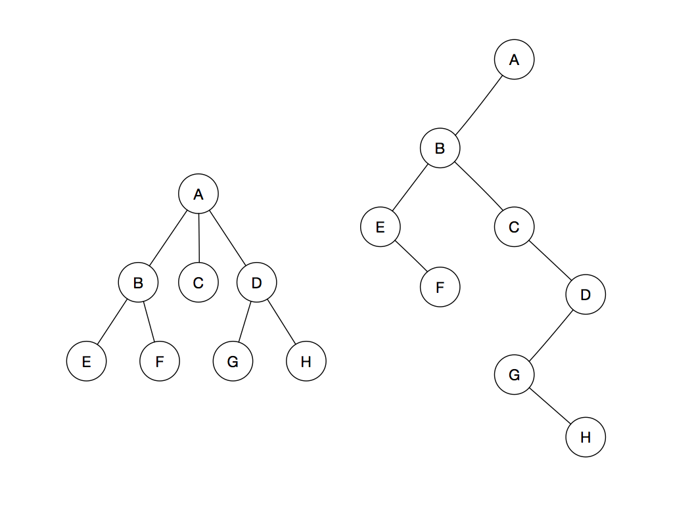


##### 森林与二叉树的转换

森林转换到二叉树的规则是：先将森林中每棵树转换成二叉树，第一棵树的根作为二叉树的根，第一棵树的左子树作为二叉树的左子树，第二棵树作为二叉树的右子树，第三棵树作为第二课树根结点的右子树，依次类推，二叉树转树倒做一遍即可，具体操作如下图：

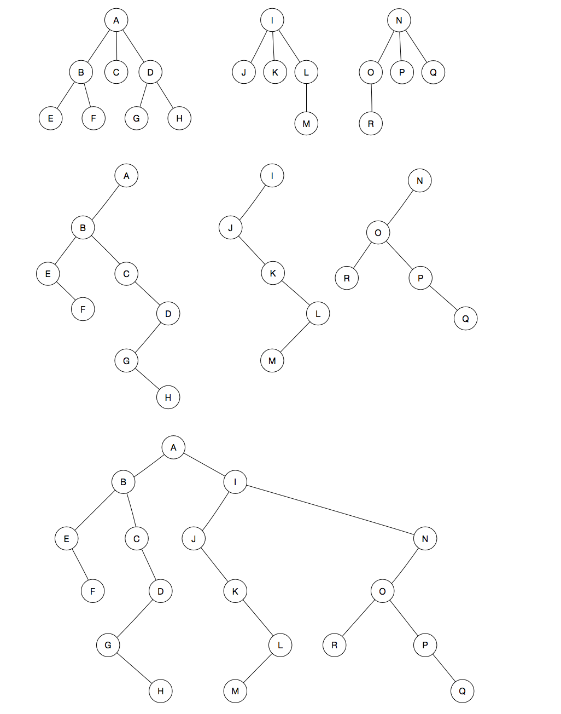


##### 树的遍历

树的遍历是以某种次序访问树的每个结点的过程，一般分为两种遍历方式，先根遍历和后根遍历。

- 先根遍历

先根次序遍历的遍历规则为：若树为空。则退出；否则先访问树的根点，然后从左到右依次先根遍历根的每棵子树。其顺序和这棵树对应二叉树的先序遍历顺序相同。

- 后根遍历

后根次序遍历的遍历规则为：若树为空。则退出；否则按从左到右依次遍历根的每棵子树，之后再访问根结点。其顺序和这棵树对应二叉树的中序遍历顺序相同。


#### 树与二叉树的应用

##### 哈夫曼树和哈夫曼编码

###### 哈夫曼树（最优二叉树）

- 路径和路径长度

在一棵树中，从一个节点往下可以达到的孩子或者子孙节点之间的通路称为路径。通路中分支的数目称为路径长度。

- 结点的权

若将树中结点赋给一个有着某种含义的数值，则这个数值称为该结点的权。

- 结点带权路径长度

从根结点到该结点之间的路径长度与该结点的权的乘积。

- 树的带权路径长度

所有叶子结点的带权路径长度之和，记为WPL。

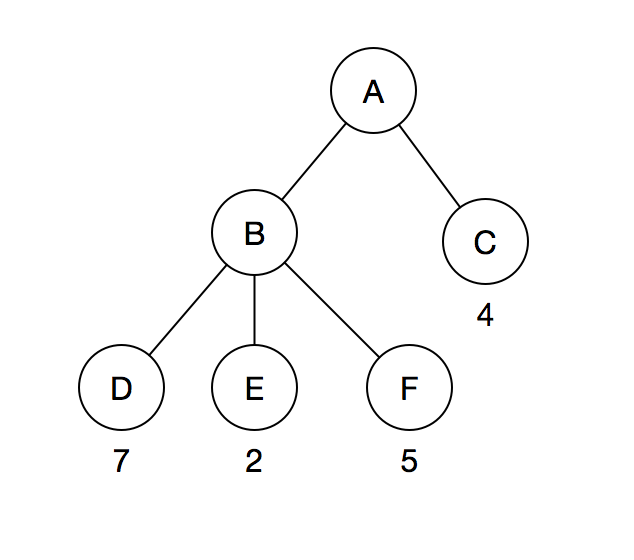

例如上图的WPL计算方式为

WPL=2\*7+2\*2+2\*5+1\*4=32

在含有n个带权叶子结点的二叉树中，WPL最小的二叉树被称为哈夫曼树，也叫最优二叉树。


###### 构造哈夫曼树

对于一组已知权值的n个结点做以下处理可得到哈夫曼树。

1. 首先把 n 个结点看做 n 棵树（仅有一个结点的二叉树），n棵树组成一个森林。
2. 把森林中权值最小和次小的两棵树合并成一棵树(小的放左边，大的放右边)，该树根结点的权值是两棵子树权值之和，这时森林中还有 n-1 棵树。
3. 重复第2步直到森林中只有一棵为止。此树就是哈夫曼树。

具体过程如下图：


###### 哈夫曼编码

哈夫曼编码是一种编码方式，是一种用于无损数据压缩的熵编码（权编码）算法。把要处理的字符当作是独立的结点，出现的频度作为权值，构造哈夫曼树。所有字符将出现在叶子结点上，我们可以把路径中向左转的标记为1，向右转的标记为0（此顺序没有硬性规定），那么对每一个节点都有唯一的标记串与之对应。比如上图中的哈夫曼树中各字母的编号可以是：

|  A   |  B   |  C   |  D   |  E   |
| :--: | :--: | :--: | :--: | :--: |
| 111  | 110  |  10  |  01  |  00  |


##### <span id = "rcczs">二叉查找树</span>

二叉查找树（BST）也叫二叉搜索树、有序二叉树、排序二叉树。二叉查找树或者是一棵空树，或者是一棵具有以下性质的树：

- 若左子树非空，则左子树上所有结点关键值均小于根结点的关键值。
- 若右子树非空，则右子树上所有结点关键值均大于根结点的关键值。
- 左右子树也分别是一棵二叉查找树。

如下图便是一棵二叉查找树：


对二叉查找树进行中序遍历便可得到递增的序列：3 12 13 17 20 27 28 29 40。


###### 二叉查找树的查找

二叉查找树的查找是从根结点开始，和给定的关键值对比，若相等，则查找成功，若大于要查找的值，则在左子树查找，若小于，则在右子树继续查找，一次查找下去。代码如下：

```c
// 二叉查找树的查找，找到返回值，找不到返回-1
ElemType Get(BTree t, ElemType key)
{
    if (!t)
    {
        return -1;
    }
    else if (key > t->data)
        return Get(t->rchild, key);
    else if (key < t->data)
        return Get(t->lchild, key);
    return t->data;
}

```

###### 二叉查找树的插入

由于二叉搜索树的特殊性质确定了二叉搜索树中每个元素只可能出现一次，所以在插入的过程中如果发现这个元素已经存在于二叉搜索树中，就不进行插入。否则若二叉树为空，则直接插入结点，若关键字小于根结点的值，则插入左子树，否则插入右子树。代码如下：

```c
Status Put(BTree *t, ElemType e)
{
    // printf("Put: %d ", e);
    if (!(*t))
    {
        (*t) = (BTree)malloc(sizeof(struct BTNode));
        (*t)->data = e;
        (*t)->rchild = NULL;
        (*t)->lchild = NULL;
        return OK;
    }
    else if (e == (*t)->data)
    {
        return ERROR;
    }
    else if (e > (*t)->data)
        return Put(&(*t)->rchild, e);
    else if (e < (*t)->data)
        return Put(&(*t)->lchild, e);
    return OK;
}
```


###### 二叉查找树的构造

构造二叉查找树就是依次插入数据，依次调用上边的插入函数即可：

```c
Status InitBST(BTree *t, char *str)
{
    (*t) = NULL;
    while (*str)
    {
        Put(t, (int)*str++ - '0');
    }
    return OK;
}
```


###### 二叉查找树的删除

二叉查找树删除元素较为复杂，这里分三种情况说明

- 若要删除结点是叶结点，直接删除。
- 若要删除结点只有左子树或右子树，则让此左子树/右子树替代删除结点。
- 若要删除结点既有左子树有有右子树，那么找到右子树最小的元素替代删除元素。

代码再补。。。。


##### <span id="ecphs">二叉平衡树</span>

为了避免二叉查找树高度增长过快，降低查找性能，规定在插入和删除二叉树结点时要保证任意的左右子树高度差不超过1，这样的二叉树称为二叉平衡树，简称AVL树。二叉平衡树或是一棵空树或满足以下性质：

- 左子树和右子树都是一棵二叉平衡树。
- 左子树和右子树高度差不超过1。


###### 二叉平衡树的插入


###### 二叉平衡树的删除


### 例题精解

【例题1】在有n个节点的二叉树的三叉链表表示中，空指针数为_____________。

A. 不确定          B. n          C. n+1          D. n+2

【例题1】在有n个节点的二叉树的二叉链表表示中，空指针数为_____________。

A. 不确定          B. n          C. n+1          D. n-1

【例题】图示的三棵二叉树中_____________为最优二叉树。

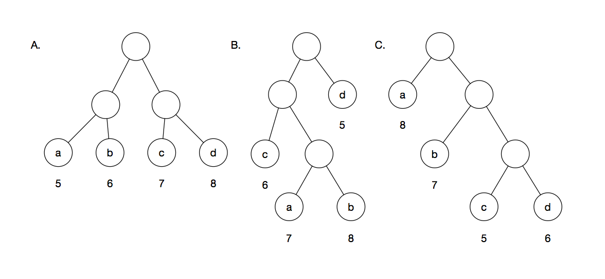

【例题】若从二叉树的根节点到其它任一节点的路径上所经过的节点序列按其关键字递增有序，则该二叉树是_________。

A. 二叉排序树

B. 哈夫曼树

C. 堆

D. 平衡二叉树

【例题】若某二叉树有n<sub>0</sub>个叶子节点，有n<sub>1</sub>个节点仅有一个孩子，则该二叉树的总节点数为（          ）

A. n<sub>0</sub>+n<sub>1</sub>                                  B. 2n<sub>0</sub>+n<sub>1</sub>

C. 2n<sub>0</sub>+n<sub>1</sub>+1                           D. 2n<sub>0</sub>+n<sub>1</sub>-1

【例题】一个二叉树按顺序方式存储在一个一维数组中，如下图：


则节点H在二叉树的第（      ）层。（根节点为第一层）

A. 1          B. 2          C. 3          D. 4

【例题】当二叉排序树是一棵平衡树时，其平均查找长度为______________。

【例题2】若某一二叉树按中序遍历可得到有序序列，则该二叉树是_____________。若某一二叉树从根节点到其它任一节点的路径上所经过的节点序列按其关键字递增有序，则该二叉树是_____________。

【例题】若二叉树的第i层存在，则二叉树的第i层上至少有____________个节点，至多有____________个节点，深度为k的二叉树至多有_________________个节点。

【例题】设高度为h的二叉树中只有度为0和度为2的节点，则此二叉树中所包含的节点数至少是_____________，至多是 ________。

【例题】具有n个节点的二叉查找树其高度至少是_____________ ，至多是 _____________。

【例题】一棵m阶的B-树，所有非终端节点至多有_____________棵子树，根节点至少有二棵子树，除根外的其它非终端节点至少有______________棵子树。

【例题3】若对完全二叉树中的节点从1开始按层进行编号，设最大编号为n，则编号为i的节点（1<i<=n）的父节点编号为_____________；所有编号_____________的节点为叶子节点。

【例题】判断题

1. 在二叉树的先序遍历序列中，任一节点均处在其孩子节点前面。
2. 通常，在二叉树的第i层上有2<sup>i-1</sup>个节点。
3. 二叉树按某种次序线索化后，任一节点均有指向其前驱和后继的线索指针。
4. 哈夫曼树中的节点个数一定是奇数。
5. 对于一颗m阶的B-树而言，树中每个节点至多有m个关键字，除根节点之外的所有非终端节点至少有$$ \lceil m/2 \rceil$$个关键字。
6. 对于具有n个节点的二叉树，不论其形态如何，进行先序、中序或后序遍历到1时间复杂度均为O(N)。

【例题】对二叉树_____________可得到有序序列。

【例题】已知某二叉树的先序遍历次序为：ABCDEFG，中序遍历次序为：BADCFEG。

（1）画出该二叉树。

（2）给出该二叉树的后续遍历次序。

（3）画出中序线索化后的二叉树形。

【例题】依序将关键字20、40、30、80、70、50、60、10插入到一棵2-3树中（初始状态为空）

（1）请画出该B-树。

（2）请先后删除关键字40、60，画出删除后的B-树。

【例题】请根据插入次序20，40，30，60，35，80

（1）请给出以此插入次序建立二叉排序树最终变化的结果。

（2）若仍以此插入次序建立平衡的二叉排序树，请给出最终变化的结果。

【例题】假设用于通讯的电文仅由8个字符A、B、C、D、E、F、G、H组成，字符在电文中出现的频率分别为3、12、9、23、2、17、21、13

（1）画出你所建的哈夫曼树

（2）给出每一字符的哈夫曼编码

【例题】将如下所示森林转换成二叉树，并分别写出该森林的先序序列和中序序列。

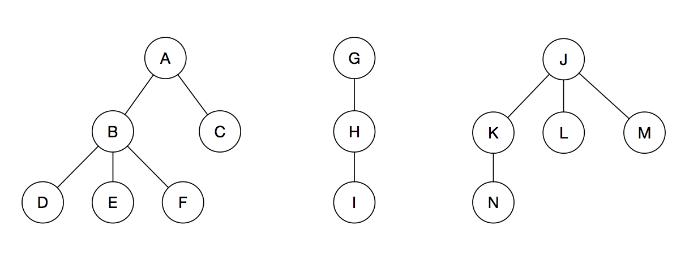

【例题】阅读函数，指出功能

```c
void A1(Bitree T, Status(*Visit)(TElemType))
{
    // 初始条件：二叉树T已存在
    if (T)
    {
        A1(T->lchild, Visit);
        A4(T->rchild, Visit);
        Visit(T->data);
	}
}
```


```c
typedef struct BiTreeNode
{
    ElemType data;
    BiTreeNode *lchild, *rchild;
} BiTreeNode, BiTree;

BinTreeNode* BinTreeS(BinTreeNode *BT)
{
    if (!BT)
        return NULL;
    else
    {
        pt = (BiTree)malloc(sizeof(BiTreeNode));
        pt->data = BT->data;
        pt->rchild = BinTreeS(BT->lchild);
        pt->lchild = BinTreeS(BT->rchild);
        return pt;
    }
}
```


【例题】请在“_____________“处填上合适的语句，完成该算法

```c
// 中序线索二叉树的遍历算法
void InOrderTraverse_Thr(BiThrTree T, void (*Visit)(TElemType e))
{
    p = T->lchild;
    while (p != T)
    {
        while (p->LTag == Link)
            p = p->lchild;
        ____________________;
        while (p->RTag == Thread && p->rchild != T)
        {
            ___________________;
            Visit(p->data);
        }
        __________________;
    }
}
```


【例题】设二叉链表结构为：

```c
typedef struct BiTNode
{
    TElemType data;
    struct BiNode *lchild, *rchild;
} *BiTree;
```

写一函数`void A1(BiTree T)`求二叉树T的深度。

【例题】设二叉链表表结构为：

```c
typedef struct BiTNode
{
    TElemType data;
    struct BiTNode *lchild, *rchild;
} BiTNoe, *BiTree;
```

写一过程：`void A1(BiTree & T, TElemType e1, TElemType e2)`

若在一颗已知二叉树T中存在数据元素为e<sub>1</sub>的节点，则删除该节点的右子树p；若存在数据元素e<sub>2</sub>的节点且该节点无右子树，则将p插入为该节点的右子树。

【例题】设有带头节点的非空中序线索二叉树T（T指向头节点，头节点的左指针lchild指向根节点，头节点的右指针rchild指向中序线索二叉树中最后访问的节点），若指针p指向其中某个节点，试写出插入p的中序后继s节点的算法。

注：节点结构如下：
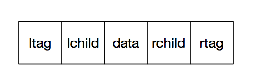


#### 单项选择题

------

2018

-------

【例题】以下说法中（          ）是正确的。

A. 构造线索二叉树是为能方便找到每个结点的双亲

B. 任何一棵二叉树，终端结点数为度为2的结点数减1

C. 二叉树不能用顺序结构表示

D. 完全二叉树中，某叶子结点的双亲若存在左兄弟X，则X一定不是叶子结点


### 习题精炼

设计一个算法，将给定的表达式树（二叉树）转换为等价的中缀表达式（通过括号反应操作符的操作次序）并输出，例如下列两棵表达式树作为算法的输入时：


输出的等价中缀表达式分别是(a+b)\*(*(-d))和(a\*b)+(-(c-d))。

二叉树结点定义如下：

```c
typedef struct node
{
    char data[10];
    struct node *left, *right;
} BTree;
```

要求：

1）给出算法的基本设计思想。

2）根据设计思想，采用C/C++语言描述算法，关键之处给出注释。


#### 填空题

----

2018

------

【例题】假设用于通讯的电文仅由8个字母组成，字母在电文中出现的频率分别为7，19，2，6，32，3，21，10。若为这8个字母设计哈夫曼编码（设合并两棵子树时次序在前的为左子树，次序在后的为右子树）。则频率为6的字母编码为：\_\_\_\_\_\_\_\_\_\_\_\_\_，频率为7的字母边阿妹为\_\_\_\_\_\_\_\_\_\_\_。


#### 问答与图示题

----

2018

----

【例题】已知森林的先序次序为：A,B,C,D,E,F,G,H,I,J,K。中序次序为：B,E,F,C,D,A,G,I,K,J,H。

（1）画出该森林。

（2）利用孩子兄弟法将其转化成二叉树。

（3）将该二叉树的中序线索化。


【例题】依次在查找表中插入：76，29，33，71，26，19，45，23，67，18，51。

（1）依照插入次序建立二叉排序树。

（2）依照插入次序建立平衡的二叉排序树

（3）依照插入次序建立3阶B-树。


#### 程序阅读题

----

2018

---------

【例题】1

```c
bool A(Bitree T)
{
    Initstack(S);
    Push(S, T);
    while(!StackEmpty(S))
    {
        while(GetTop(S, p) && p)
        {
            printf("%c", p->data);
            push(S, p->lchild);
        }
        Pop(S, p);
        if (!StackEmpty(S))
        {
            Pop(S, p);
            Push(S, p->rchild);
        }
    }
    return true;
}
```


###TODO

二叉树链式存储层次遍历（使前边实现的队列可用）

线索二叉树

二叉搜索树的删除

二叉平衡树


## <span id="Graph">图</span>

大纲要求
> 1. 掌握图的定义和术语。
> 2. 掌握图的存贮结构；理解图的基本操作。
> 3. 掌握图的遍历算法；了解利用图的遍历解决图的应用问题。
> 4. 理解图的有关应用：求最小生成树、求最短路径、拓扑排序及关键路径等算法的基本思想。


### 内容精讲

#### 图的基本概念

图G由顶点V和边集E组成，记为G=(V, E)，其中V(G)表示图G中顶点的有限非空集；E(G)表示图G中边集。这里要注意的是线性表可以是空表，树可以是空树，但图不能是空图，至少有一个顶点。


##### 图的基本术语

- 有向图：


若E是有向边的集合，则图G为有向图。这时边也叫弧，记为<v, w>，v指向w，v称为弧尾，w称为弧头，称为从顶点v到顶点w的弧，也称v邻接到w，或w邻接自v。上图1记为G<sub>1</sub>：

```
G1 = (V, { E }) 
其中  V = {A, B, C, D, E}
     E = {<A, B>, <C, B>, <B, D>, <B, E>, <D, E>}
```

- 无向图

若E是无向边的有限集合，则图G为无向图。边是顶点的无序对，记为(v, w)或(w, v)，v和w是顶点，可以称顶点w和顶点v互为邻接点。或者说边(v, w)和顶点v、w相关联。上图2记为G<sub>2</sub>：

```
G2 = (V, { E })
其中 V = {A, B, C, D, E}
    E = {(A, B), (B, C), (C, E), (E, D), (E, B)}
```

- 简单图

若图满足a. 没有到自己的边 b. 没有重复边，则此图为简单图，考研数据结构只考简单图。

- 多重图

非简单图即为多重图

- 完全图

任意两个顶点之间都有最多边的简单图为完全图，即无向图中任意两点间都有边（n(n-1)/2条），有向图中任意两点中都有相反的两条弧（n(n-1)条）。

- 子图

子图通俗来讲就是包含与被包含的关系，比如下边图都是图G1的子图

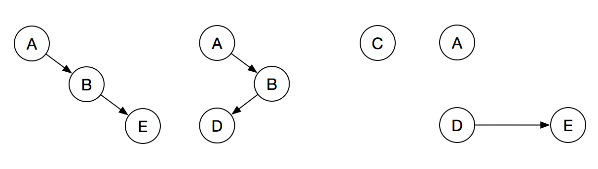

- 连通、连通图、连通分量

在无向图中，若从顶点v到顶点w的路径存在，则称v和w是联通的，若图G中任意两个顶点都是联通的，则图G为联通图，否则是非联通图。无向图中极大联通子图被称为联通分量。如下图中后两图都是第一图的联通分量。

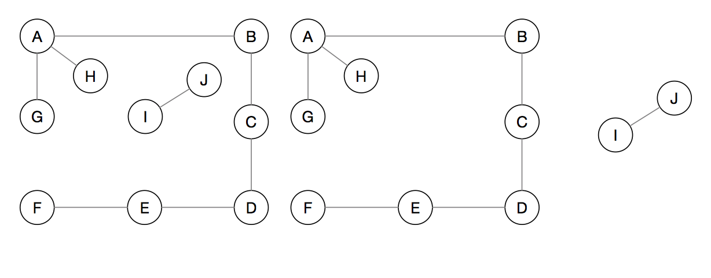

这里说明一下**极大连通子图**和<span id="jxltzt">**极小连通子图**</span>的概念，首先明确极大连通子图可以存在于无向图也可以存在于有向图中，而极小连通子图只存在于连通的无向图中。

无向图可以分成两种类型：连通的无向图、不连通的无向图.连通的无向图只有一个极大连通子图，即它本身，因为不存在另一个连通的子图包含的点和边比它本身还要多，所以叫作极大连通子图。不连通的无向图可以拆分为若干个连通的无向图，如果我们在拆分时注意把能连通的点边都放在一个连通子图中,使这个连通子图足够，,以至于再多包含一个点或边它就变成不连通的了，我们称这个连通子图为极大连通子图。

极小连通子图只存在于连通的无向图中，也就是说该图中只有一个连通分量（极大连通子图），之所以说它极小,是因为极小连通子图只要求包含图中所有顶点及其比顶点数量少一个的边（且不能成环），也就是说如果给极小连通子图任意两个顶点间加入一条边，则必有环。

极大和极小不是指一个意思，不要弄混了。极大连通子图是讨论连通分量的，极小连通子图是讨论生成树的。

- 强连通图、强连通分量

在有向图中，若在顶点v、w之间有两条互相连接的路径，则称这两个顶点时强连通的。若图中任意一对顶点都是强连通的，则此图为强连通图。有向图中极大强连通子图称为有向图的强连通分量，如下图所示：


- 生成树、生成森林

连通图的生成树是包含图中所有顶点的一个极小连通子图。顶点数为n的图的生成树有n-1条边，生成树如果少一条边即会不连通，多一条边即会出现环。非连通图的连通分量的生成树构成了非连通图的生成森林。下图即为生成树示意图：

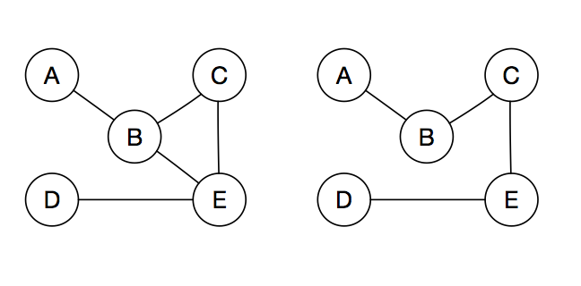

- 顶点的度

顶点的度是和顶点相关联的边的数目，记为TD(V)。

对于无向图，图中顶点度之和等于边数的两倍。

对于有向图，度分为入度和出度，入度是以顶点为终点的边的条数，记为ID(V)，出度是以顶点为起点的边的条数，记为OD(V)，T(V) = ID(V) + OD(V)。有向图的所有顶点入度之和等于出度之和等于边数。

- 边的权和网

在一个图中，每条边上都标出某个具有某种意义的数值，该值被称为权，这种带权的图称为带权图，也叫网。

- 稠密图和稀疏图

边数很少的图叫稀疏图，反之稠密图。

- 路径

顶点v<sub>p</sub>到顶点v<sub>q</sub>的一条路径指顶点v<sub>p</sub>, v<sub>1</sub>, v<sub>2</sub>, ..., v<sub>n</sub>, v<sub>q</sub>，路径上边的数目为路径长度，第一个顶点和最后一个顶点重合的路径称为环或回路。

- 简单路径、简单回路

在路径序列中，顶点不重复出现的路径称为简单路径，处第一个顶点和最后一个顶点外其它顶点不重复出现的回路称为简单回路。

- 距离

顶点v到顶点w之间的最短路径若存在，则此路径称为v到w的距离，若不存在路径，则距离为∞。

- 有向树

有一个顶点入度为0，其余顶点入度为1的有向图称为有向树。


#### 图的存储及基本操作

图的存储要求能完整、准确的反映顶点和边的信息，所以不论用何种方法存储，目的是一致的，只是不同的方法会给使用时的效率产生较大的影响，这里介绍四种方法。


##### 数组表示法

数组表示法也叫邻接矩阵法，是用一个一维数组存储顶点信息，一个二维数组存储边的信息的方法。存储边（即各顶点之间关系）的二维数组称为邻接矩阵。

结点数为n的图G，其邻接矩阵时n*n阶的，若v<sub>i</sub>和v<sub>j</sub>之间存在路径，则A\[i\]\[j\] = 1, 否则为0。对于带权图，如果两顶点间有路径存在则A\[i\]\[j\] = 权重，用∞或0表示两点间不存在路径。

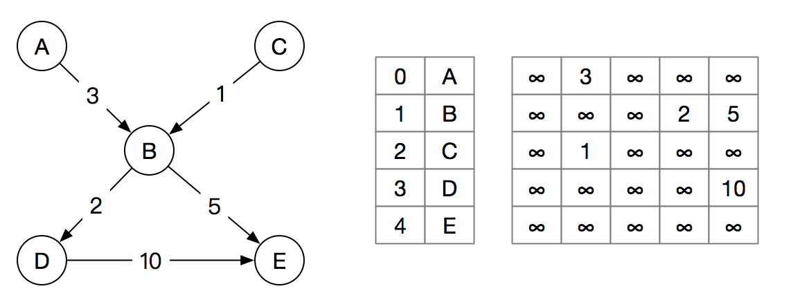

其结构可以定义如下：

```c
#define MAXVERTEXNUM 10

struct Graph
{
    VertexType vex[MAXVERTEXNUM];
    int edge[MAXVERTEXNUM][MAXVERTEXNUM];
    int vexnum;        // 图当前顶点数
    int arcnum;        // 当前弧数
};
```


##### 邻接表

如果图是稀疏图，那采用上边的邻接矩阵存储将会浪费大量空间，邻接表法解决了这个问题，邻接表法和前边树的孩子表示法有异曲同工之妙。

邻接表法是对图中每个顶点建立一个单链表，每个单链表表示依附于该顶点的边（或从顶点出来的弧），这个单链表就称为顶点的边表（出边表）。另一个表是顶点表，保存着顶点信息和边表的头指针，所以在以邻接表存储的图中有两种结点：边结点、顶点结点。存储逻辑如下：

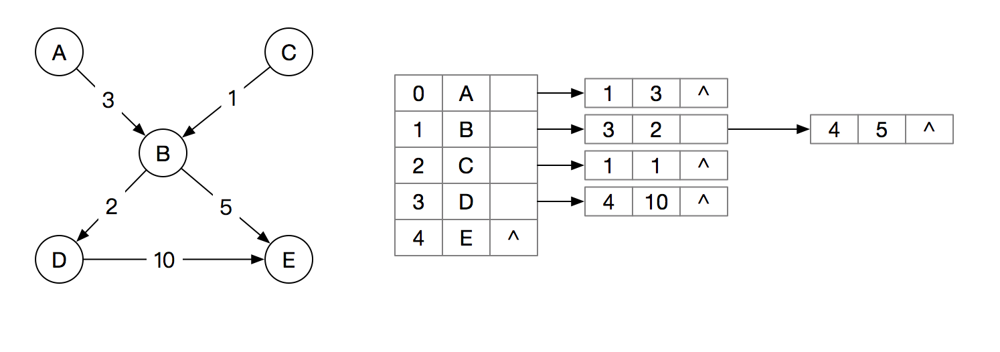

其结构体定义为：

```c
struct ArcNode
{
    int adjvex;            // 该弧指向的顶点位置
    int weigh;             // 权值
    struct ArcNode *next;  // 该弧指向的下一条弧
};
struct VexNode
{
    VertexType data;
    struct ArcNode *first;  // 指向从该顶点出发的第一条弧的指针
};
struct AGraph
{
    struct VexNode adjList[MAXVERTEXNUM]; // 邻接表
    int vexnum;                           // 图的顶点数
    int arcnum;                           // 图的弧数
};
```


##### 十字链表

在邻接表存储方式中，访问一个方向（进or出）一个结点可以很容易，但要是既要访问某结点的下一个结点又要访问上一个结点就不容易了。十字链表是**有向图**的另一种链式存储方式，解决了邻接表的问题。

在十字链表存储方式中，每个顶点有一个对应的结点，每个弧也有一个结点，结点定义如下：

- 顶点结点

顶点结点有3个域，data域存放数据信息，firstin指向第一个以该顶点为弧尾的弧结点，firstout指向第一个以该顶点为弧头的弧结点。

- 弧结点

弧结点有5个域，start为弧尾顶点在图中的位置，end为弧头顶点的位置，nextin指向下一个以end为弧头的结点，nextout指向下一个以start为弧尾的结点，weight为此边权重。存储逻辑如下图：

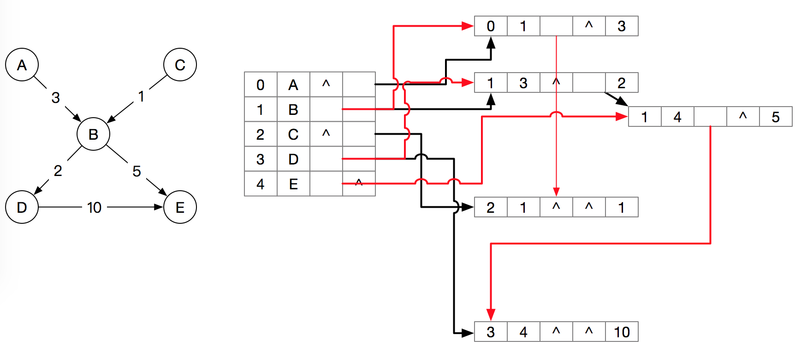

具体结构可以这样定义：

```c
struct GArcNode
{
    int start;
    int end;
    struct GVexNode* nextin;
    struct GVexNode* nextout;
    int weight;

};
struct GVexNode
{
    VertexType data;
    struct GArcNode *firstin;
    struct GArcNode *firstout;
};
struct GGraph
{
    struct GVexNode list[MAXVERTEXNUM];
    int vexnum;
    int arcnum;
};
```


##### 邻接多重表

邻接多重表是为**无向图**设计的另一种链式存储结构，在邻接表中，对无向图中每条边会存储两次，这样无疑是不优雅的，邻接多重表应用而生。

与十字链表类似，邻接多重表中每个顶点和边也用一个节点表示，其顶点结点有两个域，分别是数据域和指向与之相连第一条边的一个指针。边结点有5个域，分别存储该边依附的两个顶点在图中的位置，和分别依附与这两个顶点的下一条边，还有一个域保存边的权重。如下图：


代码定义：

```c
struct AMArcNode
{
    int ivex;
    int jvex;
    struct AMArcNode *inext;
    struct AMArcNode *jnext;
    int weight;
};
struct AMVexNode
{
    VertexType data;
    AMArcNode *firstedgt;
};
struct AMGraph
{
    struct AMVexNode list[MAXVERTEXNUM];
    int vexnum;
    int arcnum;
};
```


##### 图的基操

图的基本操作独立于图的存储结构，不同结构其对应操作的性能也会有很大不同，下边罗列一下图的基本操作。

- CreateGraph(&G, V, VR);
- DestroyGraph(&G);
- LocateVex(G, u);
- GetVex(G, v);
- PutVex(G, v, value);
- FirstAdjVex(G, v);
- NextAdjVex(G, v, w);
- InsertVex(&G, v);
- DeleteVex(&G, v);
- InsertArc(&G, v, w);
- DeleteArc(&G, v, w);
- DFSTraverse(G, Visit());
- BFSTraverse(G, Visit());


#### 图的遍历

图的遍历要求我们从某一顶点出发，对每个顶点访问且仅访问一次的过程。这一块主要涉及到2个思想过程，广度优先和深度优先，类比到树，广度优先就好像树的层次遍历，即访问一个节点，再访问与之直接相连的节点，一层一层向下；深度优先好比树的先根遍历法，现深入到树根，再往上遍历。


##### 广度优先搜索（BFS）

这种搜索类似于二叉树的层次遍历，基本思想是首先访问起始顶点v，接着从v出发，访问与v邻接的顶点v<sub>1</sub>、v<sub>2</sub>…，v<sub>n</sub>，然后再依次访问v<sub>1~n</sub>的邻接顶点，这样一层一层访问下去，直到所有顶点都被访问一遍。

要实现广度优先算法，要借助一个队列结构，用以记忆正在访问顶点的下一层顶点。其代码如下：

```c
int visited[MAXVERTEXNUM];
void BFSTraverse(Graph G)
{
    // 辅助数组visited标志顶点是否被访问过，这里先初始化为都没被访问。
    for (int i = 0; i < G.vexnum; i++)
    {
        visited[i] = FALSE;
	}
    // 初始化队列
    InitQueue(Q);
    // 循环遍历
    for (int i = 0; i < G.vexnum; i++)
    {
        if (!visited[i])
            BFS(G, i);
    }
}
void BFS(Graph G, int v)
{
    // 访问初始顶点v
    visit(v);
    visited[v] = TRUE;
    // 将v入队
    Put(Q, v);
    while(!isEmpty(Q))
    {
        // 将v出队
        Poll(Q ,v);
        // 访问v的所有邻接顶点
        for (w = FirstAdjVex(G, v); w >= 0; w = NextAdjVex(G, v, w))
        {
            // 没有被访问过则访问并入对
            if (!visited[w])
            {
                visit(w);
                visited[w] = TRUE;
                Put(Q, w);
            }
        }
    }
}
```

这里也像别人一样，举个例子：


- 假设从a节点开始访问，将其visited置为访问过标志，并将其入队；

- 此时对列非空，进入循环，将a出队，w有邻接顶点b，且b没有被访问过，访问b，并将b的visited置为访问过，将b入队；

- 接着访问a的下一个邻接顶点c，c之前没有被访问过，访问c，并将c的visited置为访问过，将c入队；

- 此时a没有邻接顶点了，for循环结束，此时队列里有b、c两个元素，将b出队，b有邻接顶点d，且d没有被访问过，访问d，将d的visited置为访问过，将d入队；

- 这时b没有邻接顶点了，跳出for循环，此时队列有c、d，c出队，b有邻接顶点b，但b被访问过，则看下一个邻接顶点d，d也被访问过，看下一个顶点e，e没有被访问过，访问e，将e的visited置为访问过，将e入队；

- 此时队列有d、e，将d出队，d的邻接顶点都被访问过，e出队，e的邻接顶点都被访问过，此时队列为空队列，广度遍历结束。


##### BFS的应用

###### 单源最短路径问题

由于广度优先遍历访问的次序是由近到远的，所以对于一个非带权图来说，用BFS可以找到单源最短路径。算法如下：

```c
// G为要找最短路径的图
// u为基点
void BFSMinDistance(Graph G, int u)
{
    for (int i = 0; i < G.vexnum; i++)
    {
        // d[i]存储顶点i到u的距离
        d[i] = -1;
    }
    visited[u] = TRUE;
    d[u] = 0;
    Put(Q, u);
    while(!isEmpty(Q))
    {
        Poll(Q, u);
        for (w = FirstAdjVex(G, u); w >= 0; w = NextAdjVex(G, u, w))
        {
            // 没有被访问过则访问并入对
            if (!visited[w])
            {
                visit(w);
                d[w] = d[u] + 1;
                Put(Q, w);
            }
        }
    }
}
// 此算法和上边的BFS遍历算法完全一样，不详细按步骤介绍了。
```


###### 广度优先生成树

可以利用广度优先遍历得到一棵遍历树，称之为广度优先生成树。由于图的邻接矩阵表示是唯一的，所以生成树是唯一的，二邻接表不唯一，生成树也不唯一。连通图可以生成一棵树，非连通图会生成森林。如下图是图的广度优先生成树事例：

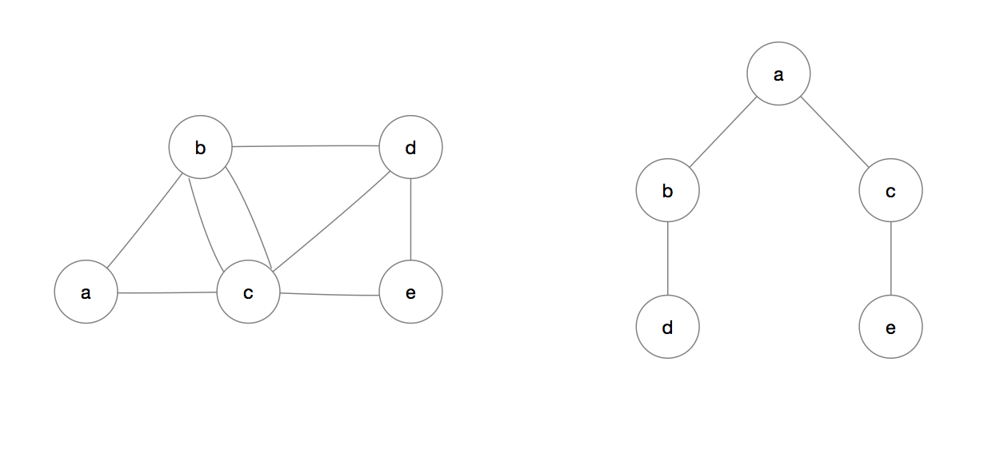


##### 深度优先搜索（DFS）

这种搜索算法类似于树的先根遍历，是先根遍历的推广。基本思想是先从图的一个顶点v出发，访问与v邻接且未被访问的顶点w<sub>1</sub>，接着访问与w<sub>1</sub>邻接且未被访问的顶点w<sub>2</sub>，依次进行下去，直到不能再继续访问，退回到最近一个被访问的顶点，若它还有未被访问的邻接点，则继续上述过程，直到所有点都被访问完。

DFS的递归代码如下：

```c
int visited[MAXVERTEXNUM];
void DFSTraverse(Graph G)
{
    // 辅助数组visited标志顶点是否被访问过，这里先初始化为都没被访问。
    for (int i = 0; i < G.vexnum; i++)
    {
        visited[i] = FALSE;
	}
    // 循环遍历
    for (int i = 0; i < G.vexnum; i++)
    {
        if (!visited[i])
            DFS(G, i);
    }
}
void DFS(Graph G, int v)
{
	visit(v);
    visited[v] = TRUE;
    for (w = FirstAdjVex(G, u); w >= 0; w = NextAdjVex(G, u, w))
    {
        // w是G中未被访问过的u的邻接顶点
        if (!visited[w])
            DFS(G, w);
    }
}
```

再举个例子：


- 假设从a节点开始访问，将其visited置为访问过标志。找到a的第一个邻接点b，b没有被访问过，对b进行DFS。
- 访问b，将其visited置为访问过标志，找到b的第一个邻接点c，c没有被访问过，对c进行DFS。
- 访问c，将其visited置为访问过标志，找到c的第一个邻接点b，b被访问过，找下一个邻接点e，e没有被访问过，对e进行DFS。
- 访问e，将其visited置为访问过标志，找到e的第一个邻接点d，d没有被访问过，对d进行DFS。
- 访问d，将其visited置为访问过标志，d的所邻接点都被访问过，结束本次访问。
- 结束DFSTraverse中的第一层for循环，进入第二层。所有结点已经被访问过，所以后序for循环都是空循环，DFS完成。


##### DFS的应用

###### 深度优先生成树

和广度优先生成树一样，深度优先遍历也是对连通图生成一棵树，非连通图生成森林，分别称为深度优先生成树和深度优先生成森林。同样，基于邻接表的深度优先树不唯一。下图是一个例子：

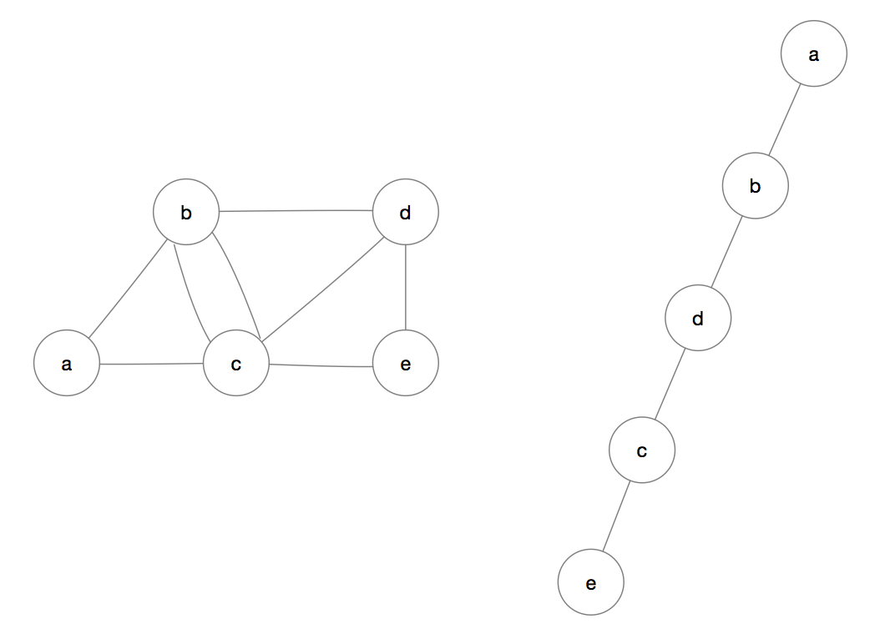


#### 图的应用

##### 最小生成树

一个连通图的生成树是图的[极小连通子图](#jxltzt)，对一个带权的无向连通图G = (V, E)，生成树不同，每棵树的权也可能不同，在所有生成树中找到权值最小的那棵，即为最小生成树。举个讲人话的例子：下沙大学城有一堆大学，你每天早上要在杭电、理工、传媒、计量、财经这几所大学间跑步，设计路线可以经过每所学校，其中最短那条路线（包含学校）就是最小生成树。通过这个例子我们可以知道：

- 最小生成树不唯一，杭电 -> 传媒 -> 理工 -> 杭职院 和 传媒 -> 杭电 -> 杭职院 -> 理工都是最小生成树。
- 最小生成树的边权值之和唯一，如果不唯一，那最小那个才是最小生成树。
- 最小生成树边数是顶点树减1。

构造最小生成树的算法为一般为先在所有顶点之间找到权值最小的边，将其放入树中，再在剩下的顶点之间找最小权值边，再把它们放入树中，最后将合成最小生成树。下边介绍具体算法。


###### Prim算法

这个算法很古老，和下边要说的Kruskal算法在《算法·第四版》中都将其描述为“最古老和最知名的算法之一”我们当然要掌握。

Prim算法思想很朴素，即先任找一点，放入结果集，再在所有与结果集相连的边中找出代价最小的边，将此顶点放入结果集，直到顶点集包含所有顶点，此时边集必然有顶点数减1条边，此时Prim算法完成。可视化的过程如下图：


算法的简单伪代码描述如下：

```c
void Prim(G, T)
{
    T = NULL;
    U = { w };    // 初始化添加任意一点到结果顶点集
    while(V - U)  // 若所有点没有被包含进结果集
    {
        (u, v) = min{(U, V) | u ∈ U, v ∈ (V - U)};
        T = T ∪ {(u, v)};
        U = U ∪ {v};
    }
}
```

Prim算法的时间复杂度为O(V<sup>2</sup>)，不依赖于边，因此可以求稠密图的最小生成树。


###### Kruskal算法

Kruskal算法的思想同样朴素，是一种按权值递增的顺序选择边的方法，先将每个顶点看成是单独的树，整个图构成了一个森林，在森林中依次寻找权值最小的边，如果加入这条边会构成回路，则忽略这条边，直到有顶点数减1条边。


Kruskal伪代码如下：

```c
void Kruskal
{
	T = V;   // 初始化结果集只包含顶点
	num = n; // 连通分量数
	while (num - 1) // 当联通分量大于1时继续循环
    {
    	(u, v) = min{(U, V)}   // 找到权值最小的边
    	if (!(v ⊂ T && u ⊂ T)) // v u不同时再一个连通分量里
        {
        	T = T ∪ {(u ,v)};
        	num--;
        }
    }
}
```

Kruskal算法的时间复杂度为O(ElogE)，适合于稀疏但顶点较多的图。


##### 最短路径

下边讨论的最短路径都是基于带权图，若是无权图，前边的广度优先搜索找到的路径即可。

最短路径的求解一般依赖两点之间最短路径也包含路径上其它顶点之间的最短路径。最短路径问题分为两类，一类是单源最短路径，即求某一点到图上各点的最短路径，常用算法为Dijkstra算法；另一种是求每一点间的最短路径，常用Floyd算法求解。


###### Dijkstra算法

狄杰斯特拉算法曾出现在了我们的数据结构、计网、算法导论课里，重要性可见一斑，然而它还并不向上边算法那么“朴素”，所以我们得再好好复习一遍。

Dijkstra算法是用来计算单源最短路径的算法，即一个点到其它各点的最短路径，路径的权值不能为负数，该算法和前边的Prim算法有相似之处，也是每一步都向最终结果中加入一条新边。具体操作是先构造一个存放已求得最短路径的点的集合s，初始化为只有给定点在s内。另外还要设置两个数组dist[]和path[]，dist[i]存放给定点到v<sub>i</sub>的路径长度，初始化dist[i] = arc\[0\]\[i\]，path[i]存放从源点到顶点i之间最短路径的下一个节点，通过path[]可以找到源点到任意点的具体路径。

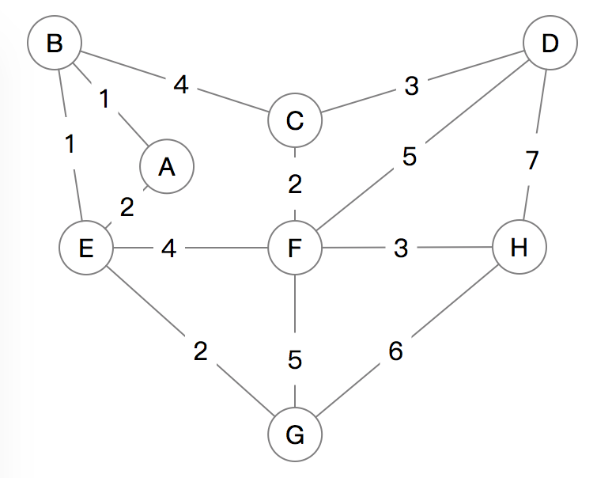

对于上图，我们具体描述一下Dijkstra的操作过程：

1. 初始化S = {A}，dist = {1, ∞, ∞, 2, ∞, ∞, ∞}，path={}。
2. 从顶点集合V-S里找到到A路径最短的B，此时S = {A, B}，dist = {1, ∞, ∞, 2, ∞, ∞, ∞}，path{}
3. 已经知道A->B是最短路径，所以以B为起点，判断B到S内除了A之外的其他点的距离是否比上次计算的dist中的值小，如果小，更新dist，这里S除A和B之外没有其他点，所以不更新。
4. 从{C, D, E, F, G, H}里找到到A路径最短的E, 此时S = {A, B, E}，dist = {1, ∞, ∞, 2, ∞, ∞, ∞}。
5. 已经知道A->E是最短路径，所以以E为起点，判断E到S内除了A之外的其他点的距离是否比上次计算的dist中的值小，如果小，更新dist，这里没有这样的点，所以不更新。
6. 从{C, D, F, G, H}里找到到A路径最短的G, 此时S = {A, B, E, G}，dist = {1, ∞, ∞, 2, ∞, 4, ∞}。
7. 已经知道A->E->G是最短路径，所以以G为起点，判断G到S内除了A之外的其他点的距离是否比上次计算的dist中的值小，如果小，更新dist，这里没有这样的点，所以不更新。
8. 从{C, D, F, H}里找到到A路径最短的C, 此时S = {A, B, C, E, G}，dist = {1, 5, ∞, 2, ∞, 4, ∞}。
9. 已经知道A->B->C是最短路径，所以以C为起点，判断C到S内除了A之外的其他点的距离是否比上次计算的dist中的值小，如果小，更新dist，这里没有这样的点，所以不更新。
10. 从{D, F, H}里找到到A路径最短的F, 此时S = {A, B, C, E, F, G}，dist = {1, 5, ∞, 2, 6, 4, ∞}。
11. 已经知道A->E->F是最短路径，所以以F为起点，判断F到S内除了A之外的其他点的距离是否比上次计算的dist中的值小，如果小，更新dist，这里没有这样的点，所以不更新。
12. 从{D, H}里找到到A路径最短的D, 此时S = {A, B, C, D, E, F, G}，dist = {1, 5, 8, 2, 6, 4, ∞}。
13. 已经知道A->B->C->D是最短路径，所以以D为起点，判断D到S内除了A之外的其他点的距离是否比上次计算的dist中的值小，如果小，更新dist，这里没有这样的点，所以不更新。
14. 从{ H }里找到到A路径最短的H, 此时S = {A, B, C, D, E, F, G, H}，dist = {1, 5, 8, 2, 6, 4, 10}。
15. 已经知道A->E->G->H是最短路径，所以以H为起点，判断H到S内除了A之外的其他点的距离是否比上次计算的dist中的值小，如果小，更新dist，这里没有这样的点，所以不更新。
16. S中已包含所有顶点，Dijkstra算法操作完成。

上边的过程也可以用下表表示：

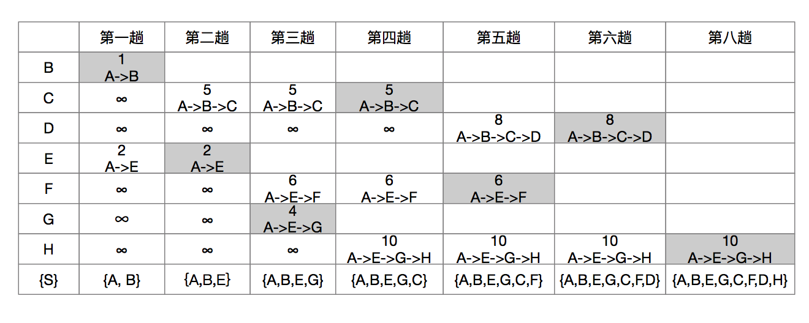

Dijkstra算法是基于贪心的，其时间复杂度为O(V<sup>1</sup>)。


###### Floyd算法

佛洛依德算法是用来求解带权图中每个顶点之间最短路径问题，虽然Dijkstra如果运行n次也可以实现这个功能，且这两个算法的时间复杂度都是O(V<sup>3</sup>)但Floyd更简单。

Floyd的核心思想是：对网中任意两个顶点，其最短路径只有两种可能，或两点之间边的权值就是最短路径，或两点之间经过若个点后，他们的权值之和为最短路径。

具体操作就是用图中所有点做以下判断：

```
Distance(A, K) + Distance(K, B) < Distance(A, B)
```

K表示图中所有点，Distance(A, B)表示A到B的距离。我们要做的就是，用每一个顶点（使K从空到包含全部的顶点）作为中间点判断上边式子是否成立，若成立，则更新A, B之间的距离。操作过程如下图：

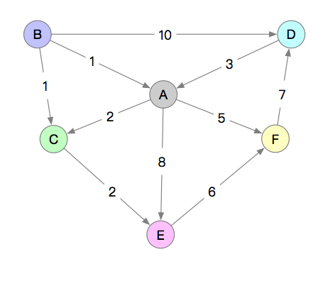


Floyd算法允许图中有带负权值的边，但不允许有包含负权值的边组成的回路。


##### 拓扑排序

###### 有向无环图

有向无环图简称DAG（Directed Acycline Graph），假设以有向图表示一个活动的实施顺序，则图中不可能出现回路，如果有回路，说明此项活动以自身为先觉条件，这是不可能的。下图都是DAG。


###### AOV网

如果用DAG表示一个工程，顶点表示事件，有向边表示活动的前后关系，边上的权值表示活动持续的时间，这样的图称为AOV网（Activity On Vertex Network）。在AOV网中，任何活动不能以自己作为前驱或后继。AOV网中只能有一个入度为0的点，称为开始顶点（源点），表示整个工程的开始。同时也只有一个出度为0的点，称为结束顶点（汇点），表示整个工程的结束。


###### 拓扑排序

拓扑排序是一种对非线性结构的有向图进行线性化的重要操作。一个由有向无环图顶点组成的序列如果满足：

1. 每个顶点只出现一次
2. 若顶点A在顶点B前面，则在图中不存在从顶点B到顶点A的路径。

拓扑排序的方法如下：

1. 从图中选择一个入度为0的顶点并输出。
2. 从图中删掉该顶点和以其为弧尾的弧。
3. 重复执行上述两个步骤，直到有向无环图为空结束。若最后图不为空但也不存在无前驱的顶点，则此图一定有环。

下边是一个实例：

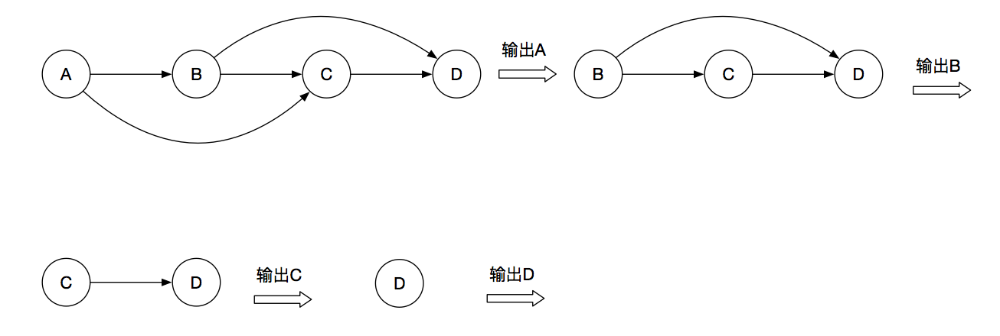

所以拓扑排序的结果为：{A, B, C, D, E}。

拓扑排序的时间复杂度为O(V+E)。


##### 关键路径

在带权有向图中，以顶点表示事件，有向边表示活动，边上的权值表示完成该活动的开销，则称这样的有向图为用边表示活动的网络，简称AOE（Activity On Edge Network）。在AOE网中，从源点到汇点的路径可能有多条，具有**最大路径长度**的路径称为关键路径，关键路径上的互动称为关键活动。我们的任务便是找到AOE网中的关键路径。


###### 基础概念

- 事件v<sub>k</sub>的最早发生时间ve(k)

从开始顶点v到v<sub>k</sub>的最长路径长度。

- 事件v<sub>k</sub>的最晚发生时间vl(k)

在不推迟整个工程完成的前提下，即保证它所指向的事件v<sub>i</sub>再ve(i)时刻能够发生时，该事件最迟必须发生的时间。

- 活动a<sub>i</sub>的最早开始时间e(i)

指该活动的起点所表示的事件最早发生的时间。

- 活动a<sub>i</sub>的最晚开始时间l(i)

指该活动的终点所表示的事件最迟发生的时间与该活动所需的事件差。

- 一个活动a<sub>i</sub>的最晚开始时间l(i)和其最早开始时间e(i)的差额d(i) = l(i) - e(i)

指该活动完成的时间余量，在不增加完成整个工程所需的总时间的情况下，活动a<sub>i</sub>可以拖延的时间。

有了上边的几个基础概念，我们可以按以下步骤求解关键路径：

1. 求AOE网中所有事件的最早发生时间ve()。
2. 求AOE网中所有事件的最晚发生时间vl()。
3. 求AOE网中所有活动的最早发生时间e()。
4. 求AOE网中所有活动的最晚发生时间l()。
5. 求AOE网中所有活动的差额d()，找出所有d() = 0的活动构成的关键路径。

下边是一个例子：

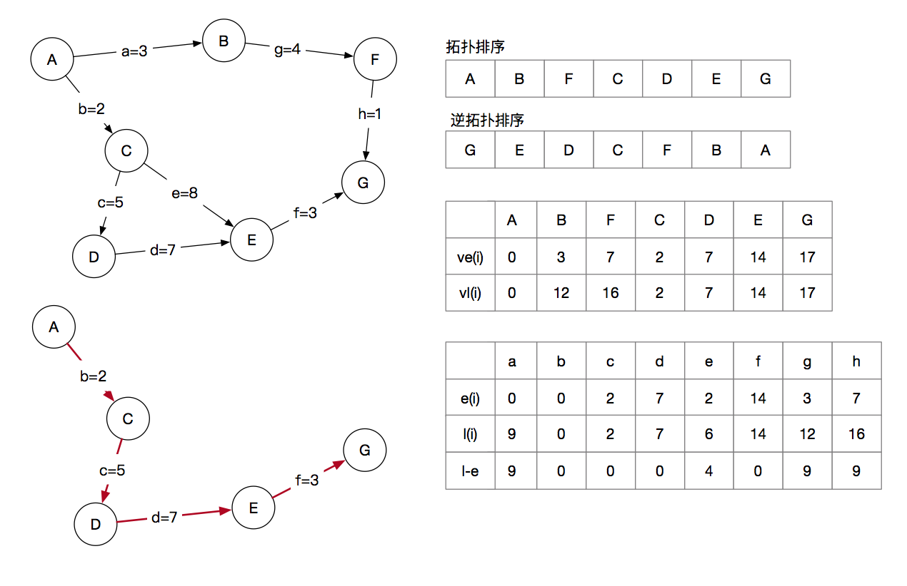

通过拓扑排序顺序找到每个事件（顶点）的最早发生时间，再通过逆拓扑排序的顺序找到顶点最晚发生时间（其中vl(G)和ve(G)相等），最早活动发生时间是这条边之前所有边的权值，最晚活动发生时间为其指向事件最晚发生时间减去此活动的权值。最终关键路径如上图。


### 例题精解

【判断题】

- 用邻接矩阵（数组表示法）存储一个图时，所需的存储空间大小与图的边数无关。

答案：正确


【例题】任何一个连通网的最小生成树\_\_\_\_\_\_。

A. 只有一棵                              B. 有一棵或多棵

C. 一定有多棵                          D. 可能不存在

答案：B


【例题】关键路径是指在只有一个源点和一个汇点的有向无环网中源点至汇点\_\_\_\_\_\_。

A. 弧的数目最多                      B. 弧的数目最少

C. 权值之和最大                      D. 权值之和最小

答案：C


【例题】在一个有向图中，所有顶点的出度之和等于所有的弧的（      ）倍。

A. 3                      B. 2                   C. 1                   D. 1/2

答案：C


【例题】设无向图G = (V, E)和G' = (V', E')，若G'是G的生成树，则下面不正确的是\_\_\_\_\_\_。

A. G‘是G的子图                       B. G’是G的连通分量

C. G'是G的无环子图               D. G‘是G的极小连通子图且V' = V

答案：


【例题】n个顶点的强连通图至少有\_\_\_\_\_\_条弧，至多有\_\_\_\_\_\_条弧。

【例题】n个顶点的连通图至少有\_\_\_\_\_\_条边，至多有\_\_\_\_\_\_条边。

【例题】对于无向图的存储结构有\_\_\_\_\_\_\_\_\_\_\_\_，\_\_\_\_\_\_\_\_\_\_\_\_，\_\_\_\_\_\_\_\_\_\_\_\_等方法。

【例题】关键路径时AOE网中源点到汇点的\_\_\_\_\_\_\_\_\_\_\_\_路径。

【例题】已知某无向图如下图所示：

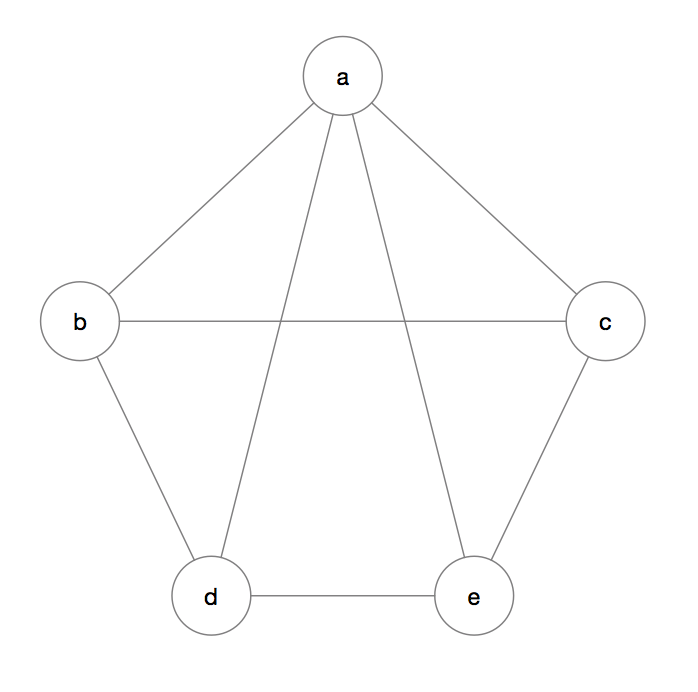

（1）画出该图的邻接表存储结构。

（2）画出该图的邻接矩阵存储结构。

（3）根据你所绘制的邻接表给出DFS及BFS次序。

【例题】设有向图如下：


（1）试画出该图的邻接表。

（2）根据你的邻接表，给出BFS和DFS次序。

（3）画出该图的十字链表。

【例题】若有带权的无向图G = (V, E)，其中顶点集V = {a, b, c, d, e, f}，边集E = {(a, b), (a, c), (b, c), (c, e), (c, f), (d, e), (e, f)}，各边对应的权值依次为(4, 10, 8, 5, 6, 7, 12, 9)。

（1）写出其邻接矩阵。

（2）用Prim算法，从顶点a开始构造最小生成树，一次列出加入生成树的边。

【例题】算法填空，请在“\_\_\_\_\_\_”填上合适的短语，完成该算法。

1. 建立有向图的邻接表

```c
Createdg(algraph &G)
{
    scanf(&g.vexnum, &g.arcnum, &incinfo);
    g.king = dg;
    for (i = 0; i < g.vexnum; i++)
    {
        scanf(&g.vertices[i].data);
        __________________________;
    }
    for (k = 0; _____________; k++)
    {
        scanf(&v1, &v2)
        i = locatevex(g, v1);
        j = locatevex(g, v2);
        P = (arcnode*)malloc(sizeof(arcnode));
        *p = {j, g.vertices[i].firstarc };
        _________________________________;
        if (incinfo)
            input(*p->info);
    }
}
```

【例题】算法设计题。设有向图的十字链表存储结构定义如下，试分别编写求图中顶点i的出度和入度的算法。（14分）

```c
#define MAX_V_NUM 20
typedef struct ArcNode // 弧结点
{
    int tailvex, headvex; // 该弧的尾和头顶点位置
    struct ArcNode *hlink, tlink; // 分别为弧头相同和弧尾形同的弧的链域
}ArcNode;
typedef struct Vnode
{
    VErtexType data;  // 顶点信息
    ArcNode *firstin, *firstout; //分别指向该顶点的第一条入弧和出弧
}VNode;
typedef struct
{
    VNode xList[MAX_V_NUM];
    int vexnum, arcnum; // 有向图的当前顶点数和弧数
}OLGraph;
```

【例题】算法设计。写一算法，判断有向图是否有回路。（此题13分）


#### 单项选择题

------

2018

------

【例题】若邻接表中有奇数个表结点，则该图是（          ）。

A. 连通图

B. 强连通图

C. 无向图

D. 有向图


【例题】以下叙述中，不正确的是（         ）

A. 图和树的区别之一在于树的序偶对个数等于顶点数减一、而图的序偶对个数可以大于顶点数。

B. 假设有图G={V, E}及G’ = {V’, E’}，满足V’⊆V 且E’⊆E，则G’是G的子图。

C. 无向图的连通分量指无向图中的极小连通子图

D. 连通图的遍历一定能从图中某一顶点出发访遍图中全部顶点


【例题】下列AOE网表示一项包含8个活动的工程，其关键活动为（         ）。


A. a,b,c,d,e,f

B. b,c,d,e,h,g

C. b,c,d,e,f,h

D. a,b,d,e,f,h


#### 问答与图示题

-------

2018

------

【例题】已知某无向网如图所示：


（1）采用邻接多重表表示该无向图，画出存储结构示意图（要求复合按边结点次序插入在相应链表中）

（2）依据所建图的邻接多重表存储，分别给出该图的深度优先和广度优先遍历序列。

（3）分别按Prim算法（从顶点A开始）及Kruskal算法依次给出最小生成树的边集。


#### 程序阅读题

------

2018

------

【例题】1

```c
bool A-1(Graph G, VertexType Vi, VeretexType Vj)
{
    for (v = 0; v < G.vexnum; ++v)
    {
        visited[v] = false;
    }
    found = false;
    i = LocateVex(G, Vi);
    j = LocateVex(G, Vj);
    A-2(G, i, j, found);
    if (found)
        return true;
    else
        return false;
}

void A-2(Graph G, int v, int u, bool &found)
{
    visited[v] = true;
    for (w = FirstAdjVex(G, v); !found && w >= 0; w = NextAdjVex(G, v, w))
    {
        if (w == u)
        {
            found = true;
            break;
        }
        if (!visited[w])
            A-2(G, w, u, found);
    }
}
```


#### 算法设计题

-----

2018

------

【例题】已知有向图采用邻接表存储表示，试用深度优先搜索的策略基于图的邻接表存储写一算法，判断有向图是否存在回路。


### 习题精炼

求一个无向连通图的割点，割点的定义为：如果除去此节点和与其相关的边，无向图不再连通，描述算法。（网易笔试）


### TODO

图的基本操作

这一章的所有代码实现


## <span id="Search_Algorithm">查找</span>

大纲要求
> 1. 掌握静态查找表。
> 2. 掌握二叉排序树和平衡二叉树。
> 3. 理解B－树；了解B＋树。
> 4. 掌握哈希表。
> 5. 掌握各种查找方法的时间性能分析。


### 内容精讲


#### 查找的基本概念

查找即按照某种方法，从给定的数据集中找到满足某个约束条件的某个或某类数据元素的过程。

- 查找表

用于查找的数据集合称为查找表，由同一类数据元素组成。

- 静态查找表

只用作查找的查找表称为静态查找表，主要操作包括

1. 查询某个特定元素是否存在于查找表中
2. 查找某个元素的各种属性

静态查找包括：顺序查找、有序表查找、散列查找等。

- 动态查找表

在查找过程中可以动态地改变查找表元素的查找表称为动态查找表，主要操作包括：

1. 查找是插入元素
2. 查找时删除元素

动态查找包括二叉排序树查找、散列查找等。

- 关键字

在一个查找中可以唯一标识一个查找结果的字段称为关键字。如数据元素是学生信息，那么学号便可作为关键字。

- 平均查找长度

查找长度是一次查找中关键字需要比较的次数。平均查找长度则是所有查找过程中关键字需要比较的次数的平均值，用ASL表示，数学定义为：
$$
\sum_{i=1} ^{n}P_iC_i\qquad
$$
P<sub>i</sub>是查找第i个数据元素的概率，C<sub>i</sub>是找到第i个元素要进行比较的次数。由于我们没有任何理由判定哪个数据要进比较的可能性更大，只好认为P<sub>i</sub> = 1/n。


#### 静态查找表

静态查找表的概念我们上边已经做过讨论，这里我们主要介绍五种具体实施方式，包括一般顺序查找、有序表的顺序查找、二分查找、索引顺序表查找和散列查找。


##### 无序表顺序查找

顺序查找又叫线性查找，主要在线性表中进行查找。顺序查找作为一种最最朴素的查找方式，即从第一个元素开始，依次遍历整个顺序表，直到找到为止，找到返回当前位置，遍历到最后都没找到返回-1。这里有个小技巧是设置“哨兵”。可以使代码更短，但使用时会又些不便，具体对比如下：

```c
// 算法1
int SeqSearch1(struct D_SqList l, ElemType key)
{
    for(int i = 1; i <= l.length; i++)
    {
        if (l.elem[i] == key)
        {
            return i;
        }
    }
    return -1;
}
SeqSearch1(L, 914);
```

```c
// 算法2
int SeqSearch2(struct D_SqList l, ElemType key)
{
    int i = 0;
    for (i = l.length; l.elem[i] != key; i--);    // 没有找到key，也会在哨兵位置退出
        return i;
}
ListInsert(&L, 1, 914); // 在第一个位置插入“哨兵”
SeqSearch2(L, 914);
```

上边的算法应该是我们学编程接触到的第一个算法，大家都很熟悉，不多说，时间复杂度时O(n)。其优势是对存储结构没有要求，顺序存储、链式存储都可以，缺点是当n很大时，用时可能会很长。

ASL=


##### 有序表顺序查找

这里提出的有序表的顺序查找有别于下边马上要说的有序表二分查找，这里的查找方式还是从顺序表的第一个位置依次向后查找，当出现key大于表中元素（针对递增的顺序表）但还没找到key时，则退出循环，查找失败，对于递减的顺序表则相反。代码如下：

```c
// flag为0是升序，否则降序
int SeqedSearch(struct D_SqList l, int flag, ElemType key)
{
    for (int i = 0; i < l.length; i++)
    {
        if (l.elem[i] == key)
            return i;
        if (flag && (l.elem[i] < key))
        {
            return -1;
        }
        else if (!flag && (l.elem[i] > key))
        {
            return -1;
        }
    }
    return -1;
}
```

这个算法同样适用于顺序结构存储的线性表和链式存储的线性表，如果查找成功，所用时间和前边无序表顺序查找一样，但查找失败，用这个算法会更快一些。


##### 二分查找

二分查找又叫折半查找，仅适用于顺序存储的有序表，因为要按下标随机访问元素，思路是设置三个“指针”low、high、mid，low、high开始时分别指向顺序表的第一个和最后一个位置，mid则指向中间位置⌊(low+high)/2⌋ ，此时对比要查找的key和mid所指位置元素关键字的大小，若大于mid，则low = mid，mid = ⌊(low+high)/2⌋，若小于mid，则high = mid，mid = ⌊(low+high)/2⌋，再比较key和mid的大小，依次比下去，直到key=mid则返回mid，或者low<=high不成立，返回失败。具体代码如下：

```c
// flag为0是升序，否则降序
int BinarySearch(struct D_SqList l, int flag, ElemType key)
{
    int low = 0;
    int high = l.length;
    while (low <= high)
    {
        int mid = (low + high) / 2;
        if (key == l.elem[mid])
        {
            return mid;
        }
        else if (!flag && (key > l.elem[mid]))
            low = mid + 1;
        else if (!flag && (key < l.elem[mid]))
            high = mid - 1;
        else if (flag && (key > l.elem[mid]))
            high = mid - 1;
        else if (flag && (key < l.elem[mid]))
            low = mid + 1;
    }
    return -1;
}

```

二分查找也是一种我们最常用的查找算法，其时间复杂度为O(log<sub>2</sub>n)。


##### 索引顺序表查找

索引顺序表查找又叫分块查找，是结合了顺序查找和二分查找的算法，是将要查找的集合先分成若干块，其中第一块中最大元素小于第二块中最小元素，第二块中最大元素小于第三块中最小元素，依次类推，然后把每块中最大的元素拿出来建立一个有序索引，每块中元素可以无序。要查找时先用前边讲到的二分查找或有序表顺序查找在索引表中确定要查找的块，在用顺序查找在块内查找最终要找的元素。

如下图，用一个有序数组保存索引，按索引指示到具体块中查找元素。

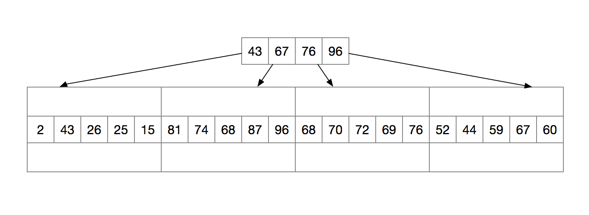

索引顺序表查找的代码如下：

```c
// b为已分好的块
// index为索引数组
// p q分别时结果所在的块下标和在块内的下标
Status BlockSearch(struct Block *b, int *index, ElemType key, int *p, int *q)
{
    int i = 0;
    int j = 0;
    for (i = 0; ;i++)
    {
        if (index[i] >= key)
            break;
    }
    for (j = 0; j < b[i].length; j++)
    {
        if (b[i].elem[j] == key)
            break;
    }
    *p = i;
    *q = j;
    return 0;
}
```

设要查找序列的元素总数为n，将其分为n<sup>1/2</sup>块时，效率最高。

静态查找表的所有代码在[这](https://github.com/qvjp/UNGEE/tree/master/DataStructure/Search_Algorithm/src/sequenticl_search.c)


##### 散列查找

散列查找具体做法见[哈希表](#hash)


#### 二叉查找树和二叉平衡树

[二叉查找树](../Tree/README.md#rcczs)和[二叉平衡树](../Tree/README.md#ecphs)前边在树章节已经讨论过，不再啰嗦。


#### B-树和B+树

B-树和B+树都是为处理大块数据的读和写操作。算法减少定位记录时所经历的中间过程，从而加快存取速度。普遍运用在数据库和文件系统。B/B+树上操作的时间通常由存取磁盘的时间和CPU计算时间这两部分构成,而CPU的速度非常快,所以B/B+树的操作效率取决于访问磁盘的次数,关键字总数相同的情况下B/B+树的高度越小，磁盘I/O所花的时间越少。

题外话：B-树，读作B树，不是B减树，就把中间的“-”看成连字符吧，B+树是真的B加树。


##### B-树

B-树又叫多路平衡查找树，B-树中所有结点的孩子结点树的最大值称为B-树的阶，通常用m表示，一棵m阶B-树或为空树，或满足如下的特征：

- 树中每个结点至多有m棵子树（至多含有m-1个关键字）
- 若根结点不是终端节点，则至少有两棵子树
- 除非根结点外的所有非叶节点至少有⌈m/2⌉棵子树（至少含有⌈m/2⌉-1个关键字
- 所有的非叶结点的结构如下：


其中K<sub>i</sub>为关键字，且满足K<sub>1</sub> < K<sub>2</sub> < ... < K<sub>n</sub>；P<sub>i</sub>为指向子树根结点的指针，且指针P<sub>i-1</sub>所指子树的所有结点的关键字均小于K<sub>i</sub>，P<sub>i</sub>所指子树的所有结点的关键字均大于K<sub>i</sub>，n为关键字个数。（⌈m / 2⌉ <= n <= m - 1）

- 所有的叶结点都出现在同一层上，并且不带信息。

B树是所有结点的平衡因子都是0的多路查找树，下图便是一棵3阶B树，底层长方形结点表示叶结点，不存储任何信息。


###### B-树的高度


###### B-树的查找


###### B-树的插入


###### B-树的删除


##### B+树


#### <span id="hash">哈希表</span>

##### 哈希表的概念

前边介绍的线性表和树的查找都是基于一次次比较进行的，这是因为表中关键字和记录关键字的位置没有任何关系，哈希表使关键字和位置产生了关连，是一种和前边的查找完全不同的操作。

要使关键字和位置产生关联，要用到**哈希函数**，通常表示为Hash(key) = Address。（这里的位置不一定指内存地址，也指数组下标等可以标识位置的手段）通过哈希函数，可以生成一张关键字对应地址的**哈希表**，然后就可以通过哈希表直接用关键字访问到其具体地址。但在生成地址的时候可能会出现**冲突**，即不同的key会对应同一个地址，这时候称这两个不同的关键字为**同义词**，为了解决这种冲突，我们不仅要设计更优的哈希函数，还要设计解决冲突的方法。


##### 哈希函数

哈希函数是整个哈希表存储的关键，一个好的哈希函数必须满足下边几点：

- 定义域包含所有关键字，值域依赖哈希表的大小。
- 哈希函数计算结果能均匀分布在整个地址空间，减少冲突发生。
- 哈希函数要尽可能高效

下边是几种哈希函数实例：

###### 直接定址法

直接取关键字的某种线性函数值为哈希地址，Hash(key) = a * key + b，这种方式不会出现冲突，但对于不连续数据会造成很大空间浪费。

###### 除留余数法

这是考试**最经常考**的方法，具体操作是：假定哈希表表长为m，取一个不大于m但最接近或等于m的质数p，取模p，即Hash(key) = key % p。这里的关键是p的选取，尽可能让关键字通过该函数后能均匀分布在哈希表上。

###### 数字分析法

这种方法是观察分析关键字的规律，如果某些信息出现分布很不均匀而另一部分相对均匀，那么就舍去不均匀的，将均匀位作为哈希地址，比如一个班中同学的出生日期，年份很可能都是相同的，那么就舍去年份，只用月和日来作为哈希地址。

###### 平方取中法

取关键字平方后的中间几位为哈希地址。

###### 折叠法

将关键字分割成位数相同的几部分（最后一部分的位数可以不同），然后取这几部分的叠加和（舍去进位）作为哈希地址。


##### 处理冲突的方法

常用的散列函数作用到关键词后都会或多或少的产生冲突，这里介绍处理冲突的两种方法。


###### 开放定址法

开放定址法就是一旦发生冲突，就去寻找下一个空的散列地址，只要散列表足够大，空的散列地址总能找到，并将记录存入。H<sub>i</sub> = (H(key) + d<sub>i</sub>) % m, i=1, 2, …, k(k <= m - 1)，其中H(key)为散列函数，m为散列表长，d<sub>i</sub>为增量序列。通过取不同的d<sub>i</sub>，这里又分为4种：

- 线性探测法

这里d<sub>i</sub>取0，1，2，3，4，…，m-1。也就是如果发生冲突，就到下一个地址探测，如果还是冲突，就到下下个，如果遇到表尾，就反过来从表头开始找，直到找到空的散列地址，或者查遍全表仍未找到，此时表满。可以用下边的例子帮助理解。

【例】使用散列函数H(key) = key % 11，把一个整数值转换成散列表下标，现要把数据{1，13，12，34，38，33，27，22}依次插入到散列表中，使用线性探测法构造散列表。

首先第一步画出散列表，因为这里是模11，所以画10列就够了。先用1模11，得1，填入表中下标是1的位置，结果如下：

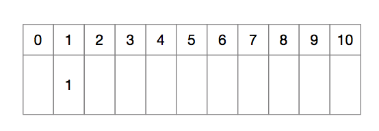

再用13模11，得2，将13填入下标为2的位置：


用12模模11，得1，发现1的位置已经被占用，按照线性探测法，去探测下一个位置，位置2也被占用，再探测位置3，发现3没有被占用，将12填入下标为3的位置：


接着是34，用34模11得1，按照前边同样的方法，这次把34填到了位置4：

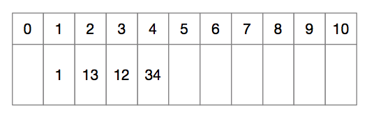

一直这样做下去，最终结果如图：


这就是线性探测法的具体使用过程，如果要<span id="hashSearch">查询</span>某值是否存在，比如27，过程和上边一样，先用27模11得5，去下标为5的位置找，发现38不等于27，就去下一个位置6找，直到找到27。

线性探测法可能使本该存在第i个位置的元素存到i+1的位置，i+1的元素存到i+2的位置，最终使大量元素堆积起来，大大降低查找速度，所以引入下边的平方探测法。

- 平方探测法

平方探测法中d<sub>i</sub>=1<sup>2</sup>,-1<sup>2</sup>, 2<sup>2</sup>, -2<sup>2</sup>, 3<sup>2</sup>, -3<sup>2</sup>, …, k<sup>2</sup>, -k<sup>2</sup>，其中k<=m/2。具体操作过程和线性探测法基本一致，不赘述。用这种方法能较好的处理堆积问题，但是只能探测到表上一半的位置。


###### 拉链法

不同的关键字通过哈希函数可能会映射到同一个地址，除了把该放a位置的元素放到b位置外，我们还可以在a位置建立一个链表，这条链表包含了所有映射到这个位置的元素，这种方法称为拉链法。仍然是前边线性探测法用到的数据，我们再用拉链法做一次。

【例】使用散列函数H(key) = key % 11，把一个整数值转换成散列表下标，现要把数据{1，13，12，34，38，33，27，22}依次插入到散列表中，使用拉链法构造散列表。

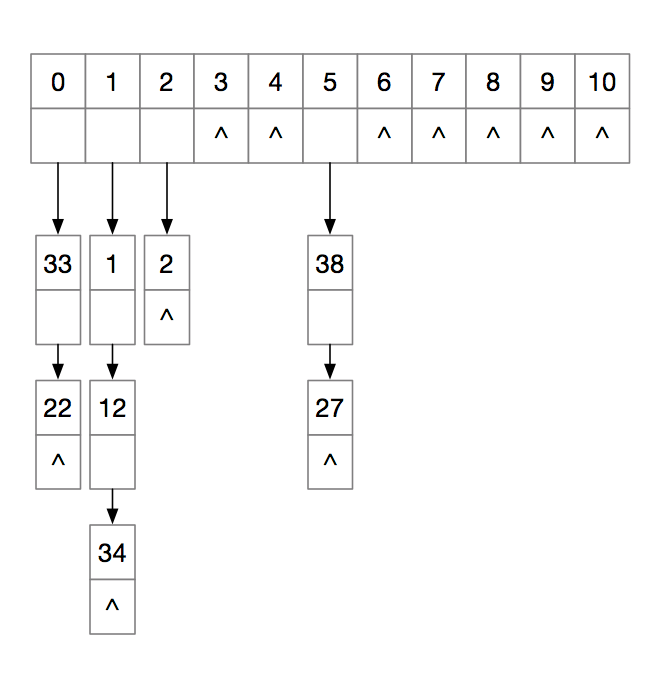


##### 装填因子

装填因子一般记为𝞪，表示一个表装满的程度，即：
$$
𝞪=\frac{表中记录数n}{散列表长度m}
$$
散列表的平均查找长度依赖于装填因子𝞪，而不是直接依赖于n或m，因为𝞪越大，表越满，越可能出现冲突，冲突越多，查询长度越长。


##### 哈希查找

哈希查找和构造哈希表过程基本一样，也是通过将key交由哈希函数处理，得到一个地址，用该地址对应的值与key对比是否相等，若等，则查找成功，不等，则按照冲突处理方法所规定的规则去找下一个位置，直到找到或找寻完整个表。参考[上边](#hashSearch)的具体过程。


#### KMP算法

// 杭电不考KMP。。。。有时间再总结


#### 各种查找方法性能分析


### 例题精解


【例题】下列查找方法中，\_\_\_\_\_\_\_\_\_适用于查找单链表。

A. 顺序查找                              B. 折半查找

C. 分块查找                              D. hash查找


【例题】静态查找表和动态查找表的区别是\_\_\_\_\_\_\_\_\_。

A. 前者是顺序存储，后者是链式存储

B. 前者仅适宜查找操作，后者既适宜查找也适宜插入和删除操作

C. 前者只能顺序查找，后者只能折半查找

D. 前者可被排序，后者不能被排序


【例题】在一个含有n个元素的有序表上进行折半查找，找到一个元素最多要进行（        ）次元素比较。

A.  ⌊log<sub>2</sub>(n)⌋                            C. ⌊log<sub>2</sub>(n)⌋ + 1

C.  ⌊log<sub>2</sub>(n + 1)⌋                     D. ⌊log<sub>2</sub>(n + 1)⌋ + 1


【例题】哈希表的查找效率取决于构造hash函数的方法、处理冲突的策略、及\_\_\_\_\_\_\_\_\_。


【例题】设哈希函数为H(key) = key mod 7，用链地址法处理冲突，若依次在哈希表中插入12个元素32、65、83、25、74、21、33、18、61、27、47、28.

（1）画出它们在表中的分布情形。

（2）计算其平均成功的查找长度。


【例题】设哈希表长度为15，哈希函数为H(key) = mod 13，用开放定址法的二次探测再散列处理冲突（d<sub>i</sub> = 1<sup>2</sup>, -1<sup>2</sup>, 2<sup>2</sup>, -2<sup>2</sup>, 3<sup>2</sup>, -3<sup>2</sup>……）。依次存入12个元素：

56、82、17、24、36、21、83、96、13、34、57、50.

（1）画出它们在表中的分布情形。

（2）计算平均成功的查找长度。


【例题】在“\_\_\_\_\_\_\_\_\_”处填上合适的语句，完成算法。

```c
// 折半查找
int Search_Bin(SSTable ST, KeyType key)
{
    low = 1;
    high = ST.length;
    while (______________)
    {
        mid = ______________;
        if (EQ(key, ST.elem[mid].key))
            return mid;
        else if (LT(key, ST.elem[mid].keu))
            high = mid - 1;
        else
            _____________;
    }
    return 0;
}
```


【例题】阅读函数，指出算法功能。

```c
int A1(SSTable ST, KeyType key)
{
    // 初始条件：顺序表ST已存在
    int i;
    ST.elem[0].key = key;
    for (i = ST.length; !EQ(ST.elem[i].key, key); --i);
    return i;
}
```


#### 填空题

-----

2018

-------

哈希表的地址区间为0-10，哈希函数为H(K) = K mod 11。采用开放地址法处理冲突，增量序列取平方探测再散列，将关键字序列26，25，72，38，8，18，59，32，28依次存储到哈希表中。则关键字59存放在表中的下标地址是\_\_\_\_\_\_\_\_\_\_，关键字28存放在表中的下标地址是\_\_\_\_\_\_\_\_\_。


### 习题精炼


自学红黑树


### TODO

B/B+树

KMP算法

各算法性能分析


## <span id="Sorting_Algorithm">内部排序</span>

大纲要求
> 1. 掌握直接插入排序、希尔排序、冒泡排序、快速排序、简单选择排序、堆排序、归并排序；理解基数排序。
> 2. 学会各种内部排序方法的比较（时间复杂度、空间复杂度、稳定性）。


### 内容精讲

#### 排序

排序就是通过一定的算法，使一组无序元素变得有序。


##### 算法稳定性

假定在待排序的序列中存在关键字相等的元素，排序完成后关键字相等的元素的相对位置没有发生变化，则此算法稳定，否则不稳定。


##### 内部排序

算法运行期间所有数据都存放在内存中，这样的排序算法称为内部排序。这里，我们只讨论内部排序，共8种：

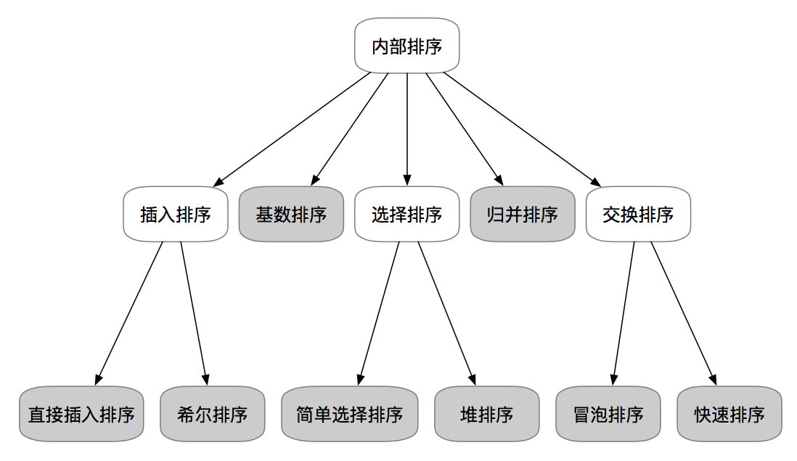


##### 外部排序

在排序期间，大数据无法全部存放于内存，必须不断进行内外存交换的排序方法称为外部排序。


#### 插入排序

##### 综述

插入排序的思想是每一轮循环将一个元素插入到已排好序（8种算法我们都按递增序列为例）的序列中，直到全部都插完。在实际操作中是首先将第一个元素看作是已排好序的序列，把第二个插入，把第三个插入。。。直到全部插入。


##### 示意图

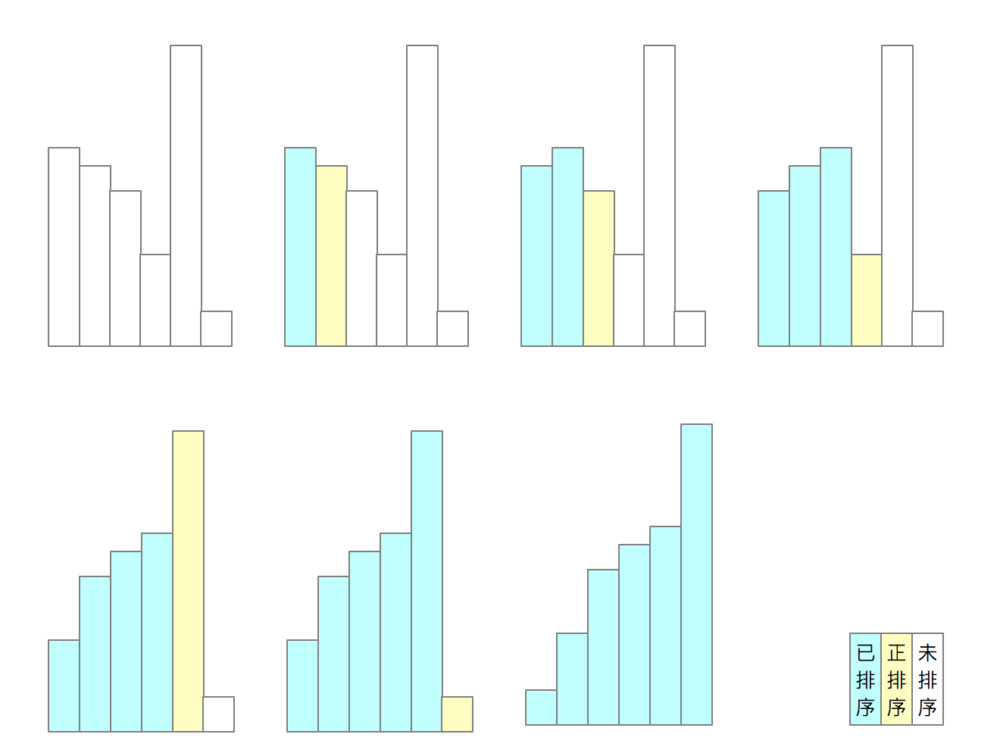


##### 代码实现

```c
void InsertionSort(struct D_SqList *l)
{
    int len = l->length;
    ElemType tmp;
    for (int i = 0; i < len; i++)
    {
        for (int j = i; j > 0; j--)
        {
            if (l->elem[j] <= l->elem[j-1])
            {
                tmp = l->elem[j];
                l->elem[j] = l->elem[j-1];
                l->elem[j-1] = tmp;
            }
        }
    }
}
```


##### 时间复杂度

整个排序过程中，向有序子表插入元素一共进行了n-1次，每次操作都有若干次比较和移动。

###### 最好情况

若原表即有序表，则每次插入一个元素只需比较，不需移动，此时为O(n)。

###### 最坏情况

若原表逆向有序，则每插入一个元素都需要进行比较、移动，且越到后边比较移动的次数越多，从第二个元素开始，比较次数分别为1、2、3、4、…、n-1，移动次数也为1、2、3、4、...、n-1，所以加起来等于n<sup>2</sup>-n。用O表示法表示为O(n<sup>2</sup>)。

###### 平均情况

平均情况可能既不是顺序也不是逆序，这里我们取最好最坏的平均值为平均情况的复杂度，所以，平均比较次数为(n<sup>2</sup>+n)/2，平均移动次数是(n<sup>2</sup>-n)/4。加起来是(3n<sup>2</sup>+n)/4，即O(n<sup>2</sup>)。

// TODO: 我哪里分析错了？为什么和书上不一样？


##### 空间复杂度

仅使用了一个tmp中间变量，常数个，所以空间复杂度为O(1)。


##### 稳定性

每次插入一个新数都是从后取，且从后向前循环比较，如果关键字相同，不会改变相对位置，所以插入排序是稳定的。


##### 适用性

不需要按下标随机访问，适用于顺序存储结构和链式存储结构。针对基本有序且数据量不太大的序列使用直接插入排序性能很好。


#### 希尔排序

##### 综述

希尔排序（Shell's Sort）我想吐槽一下这个中文翻译。。。这种命名法干脆别翻译。。。

希尔排序又称缩小增量排序，是为了解决直接插入排序对完全无序和数据量大太不太靠谱而产生的排序方式。希尔排序是先将要排序序列分为n份，把每一份中第一个进行插入排序，排完后，再把n缩小，再把每一份第一个数据排序，直到n=1，这时候基本已经是有序序列了，再用直接插入法排一次即可得到排序好的序列。这里的份数，也就是步长一般取总数据量的⌈1/2⌉，以后每次再取⌈1/2⌉，直到1。


##### 示意图

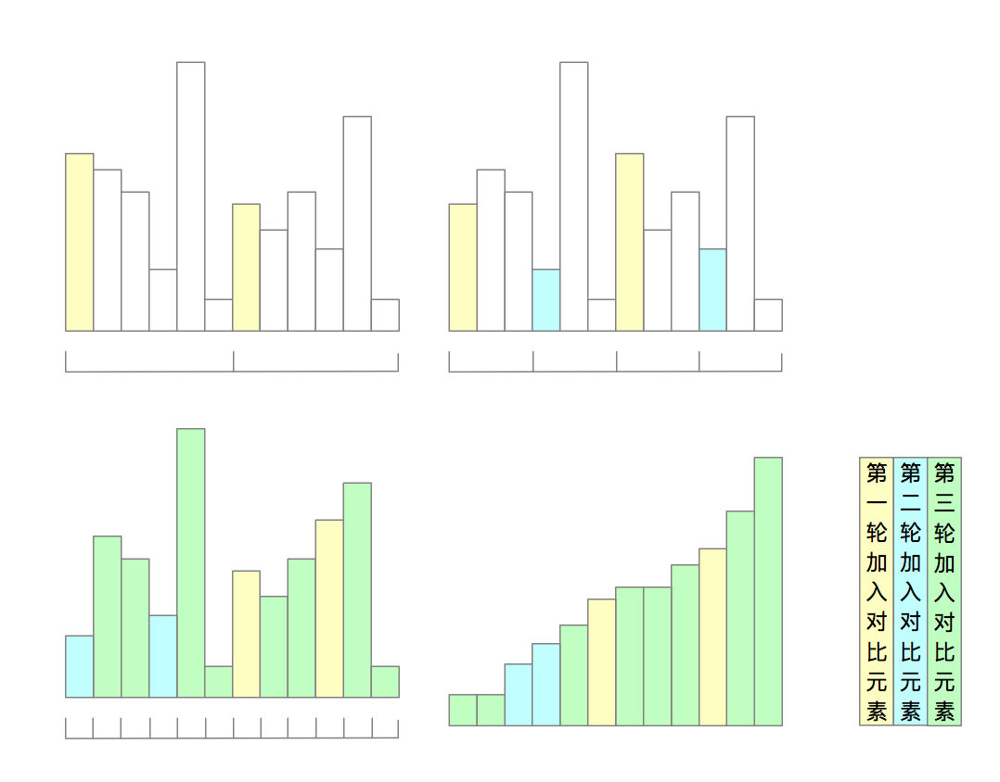


##### 代码实现

```c
void ShellSort(struct D_SqList *l)
{
    int len = l->length;
    ElemType tmp = 0;
    for (int step = len / 2; step >= 1; step /= 2)
    {
        for (int i = 0; i < len; i+=step)
        {
            for (int j = i; j > 0; j -= step)
            {
                if (l->elem[j] < l->elem[j - step])
                {
                    tmp = l->elem[j];
                    l->elem[j] = l->elem[j-step];
                    l->elem[j-step] = tmp;
                }
            }
        }
    }
}
```


##### 时间复杂度

时间复杂度和我们取的步长有关，**据说**数学上都解不出来？听人说最差时间复杂度是O(n<sup>2</sup>)，最好的时间复杂度是O(n)，平均时间复杂度还是O(n<sub>2</sub>)。


##### 空间复杂度

使用一个辅助临时变量，常数个，空间复杂度为O(1)。


##### 稳定性

当相同关键字被分到不同的子表时，可能会出现相对位置交换，所以希尔排序时不稳定的。


##### 适用性

适合直接排序性能不够的大量数据，且要求数据时顺序存储。


#### 冒泡排序

##### 综述

我们接触的第一个排序算法，大概就是冒泡了，再复习一下。

冒泡排序就是从前往后，每次找到最到的一个元素，放到表尾，称为一次冒泡。具体来说便是第一次从第一个元素到最后一个元素，依次遍历，对比大小，将最大的往后移动，第二次便从第一个到倒数第二个元素进行遍历，再找到一个最大的，放到倒数第二的位置，这样依次进行下去，直到要遍历的元素只剩下第一个，排序结束。


##### 示意图

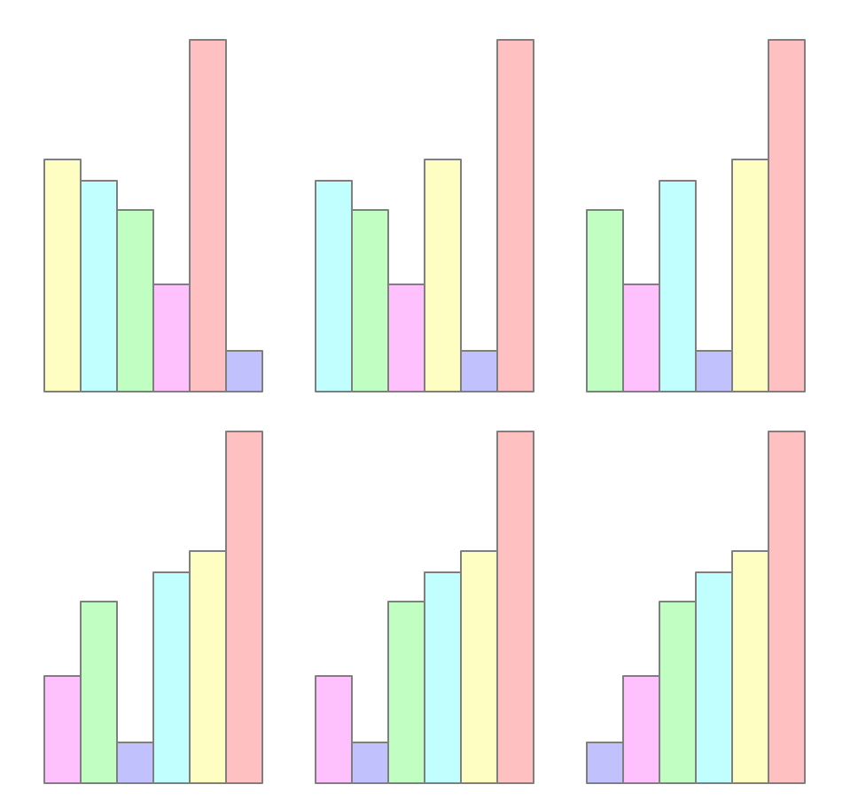


##### 代码实现

```c
void BubbleSort(struct D_SqList *l)
{
    int len = l->length;
    int tmp = 0;
    for (int i = 0; i < len - 1; i++)
    {
        for (int j = 0; j < len - i - 1; j++)
        {
            if (l->elem[j] > l->elem[j + 1])
            {
                tmp = l->elem[j];
                l->elem[j] = l->elem[j + 1];
                l->elem[j + 1] = tmp;
            }
        }
    }
}
```


##### 时间复杂度

###### 最好情况

当初始序列即为有序序列时，只需要进行比较，不需要移动，要比较的次数为：(n-1)+(n-2)+...+1，即n*(n-1)/2，时间复杂度为O(n<sup>2</sup>)。

###### 最坏情况

最坏情况下所有元素正好逆序，这时每个元素都要进行移动，且移动位置次数为：(n-1)+(n-2)+...+1，也是n*(n-1)/2，所以比较和移动一共加起来时n(n-1)，时间复杂度为O(n<sup>2</sup>)。

###### 平均情况

平均情况取最好和最坏的平均值，时间复杂度是O(n<sup>2</sup>)。


##### 空间复杂度

辅助变量只用到一个，常数个辅助空间，空间复杂度为O(1)。


##### 稳定性

对比时如果两个元素相等，不会交换两元素位置，是稳定的。


##### 适用性


#### 快速排序

##### 综述

快速排序是对冒泡排序的一种改进。算法每次都会将待排序序列分为两部分，一部分关键字都小于一个值，一部分关键字都大于一个值，这个值叫做枢轴值。这里枢轴值取每次序列的第一个值，具体做法是设置两个指针，分别指向序列第一个和最后一个元素下标，先找到后边指针所指值小于枢轴值的元素，和枢轴值交换位置，再去前边找到第一个大于枢轴值的元素，和枢轴值交换位置，再去后边找，再去前边找，直到前边和后边的指针所指位置相同，这时正好把序列分为了以枢轴为分界线的两部分，然后分别去这两部分中再次使用同样的方式，直到序列一边只剩下一个元素，快速排序完成。


##### 示意图


##### 代码实现

```c
void sort(struct D_SqList *l, int start, int end)
{
    if (start >= end)
        return;
    int mid = start;
    ElemType tmp = 0;
    for (int i = start, j = end; i < j; )
    {
        for (; l->elem[mid] <= l->elem[j] && j > i;)
        {
            j--;
        }
        tmp = l->elem[j];
        l->elem[j] = l->elem[mid];
        l->elem[mid] = tmp;
        mid = j;
        for (; l->elem[mid] >= l->elem[i] && i < j;)
        {
            i++;
        }
        tmp = l->elem[i];
        l->elem[i] = l->elem[mid];
        l->elem[mid] = tmp;
        mid = i;
    }
    sort(l, start, mid - 1);
    sort(l, mid + 1, end);
}

void QuickSort(struct D_SqList *l)
{
    int len = l->length;
    sort(l, 0, len-1);
}
```


##### 时间复杂度

快速排序是所有内部排序中效率最高的。具体时间复杂度和所选取的枢轴有关。

###### 最坏情况

最坏的情况是假如每次枢轴都选取序列的最大值或最小值时，这时候和冒泡排序的时间复杂度一样，是O(n<sup>2</sup>)。

###### 最好情况

最好情况是枢轴正好是序列中间元素，这时的时间复杂度是O(nlog<sub>2</sub>n)。

###### 平均情况

由于平均来看，当序列足够大时，枢轴的值会越来越趋于将列表分为两个长度相同的序列，所以平均时间复杂度可以近似看为O(nlog<sub>2</sub>n)。


##### 空间复杂度

快速排序要用到递归，所以需要与其序列长度相关的额外空间，其大小与递归调用的最大深度一致。要递归调用log<sub>2</sub>n次所以空间复杂度为O(log<sub>2</sub>n)。


##### 稳定性

不稳定。在划分算法中，若一边两个关键字相同的元素被交换的另一边，其相对位置会发生改变。


#### 简单选择排序

##### 综述

这个算法比较简单，算法的思想是依次遍历序列，找出最小的，和第一个位置元素交换，再找出第二小的，和第二个位置交换，一直找到最后一个元素。


##### 示意图


##### 代码实现

```c
void SelectionSort(struct D_SqList *l)
{
    int len = l->length;
    int min = 0;
    ElemType tmp = 0;
    for (int i = 0; i < len - 1; i++)
    {
        min = i;
        for (int j = i; j < len; j++)
        {
            if (l->elem[min] > l->elem[j])
            {
                min = j;
            }
        }
        tmp = l->elem[min];
        l->elem[min] = l->elem[i];
        l->elem[i] = tmp;
    }

}
```


##### 时间复杂度

###### 最好情况

当原序列本来就有序，此时不需要交换位置，但比较的次数是n + (n-1) + (n-2) + ...+ 1 =  n(n+1)/2，此时时间复杂度为O(n<sup>2</sup>)。

###### 最差情况

如果原来序列是逆序的，除了要进行n(n+1)/2次比较，还要进行n-1次移动，所以时间复杂度还是O(n<sup>2</sup>)。

###### 平均情况

最差最好都是O(n<sup>2</sup>)，平均情况也是O(n<sup>2</sup>)。


##### 空间复杂度

需要常数个辅助单元，因此空间复杂度是O(1)。


##### 稳定性

是一个不稳定的排序算法。在第i趟循环时，最小值和第i个元素交换位置，可能把本来i上的元素换到和它关键字一样元素的后边，相对顺序可能发生改变。


#### 堆排序

##### 综述

堆分为大顶堆和小顶堆，本质都是完全二叉树。大顶堆要求子结点关键字不能大于其双亲结点，所以，堆顶元素一定是整个堆中关键字最大的元素，小顶堆反之。

堆排序利用了大顶堆（小顶堆）的性质，每次从堆顶取元素，放到序列最后，再把剩余元素重新调整为大顶堆（小顶堆），再取堆顶放到序列最后，以此类推，直到所有元素都被排序。

所以，建堆是我们首先要考虑的，建堆的过程是：首先找到最后一个非叶子结点p（⌈n/2⌉-1），判断它的孩子关键字是否大于它，若大，则和孩子交换位置；接着p向前移动一个位置，再次进行判断，将双亲结点和孩子结点中关键字最大的放到双亲结点上，一直做下去，直到做完p指向树的根结点的情况（步骤如下图），这时候我们就得到了一个大顶堆。

有了上边建堆的过程，接着堆排序的正式排序就比较容易了，每次从堆顶取一个最大元素放到序列尾部，再对前边未排序部分进行建堆，再取最大放到后边，依次进行，直到完成。


##### 示意图

构建堆

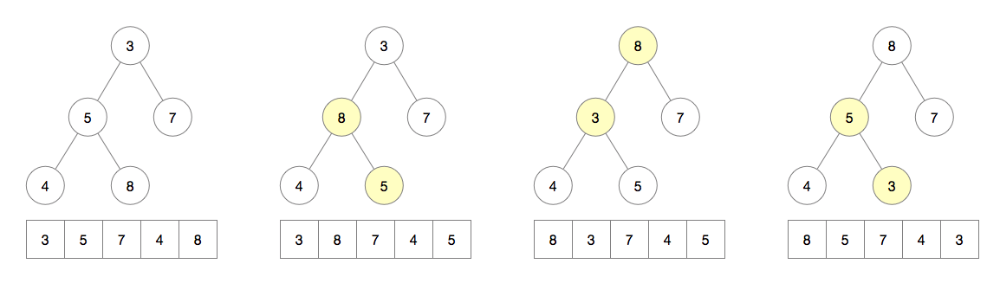

堆排序

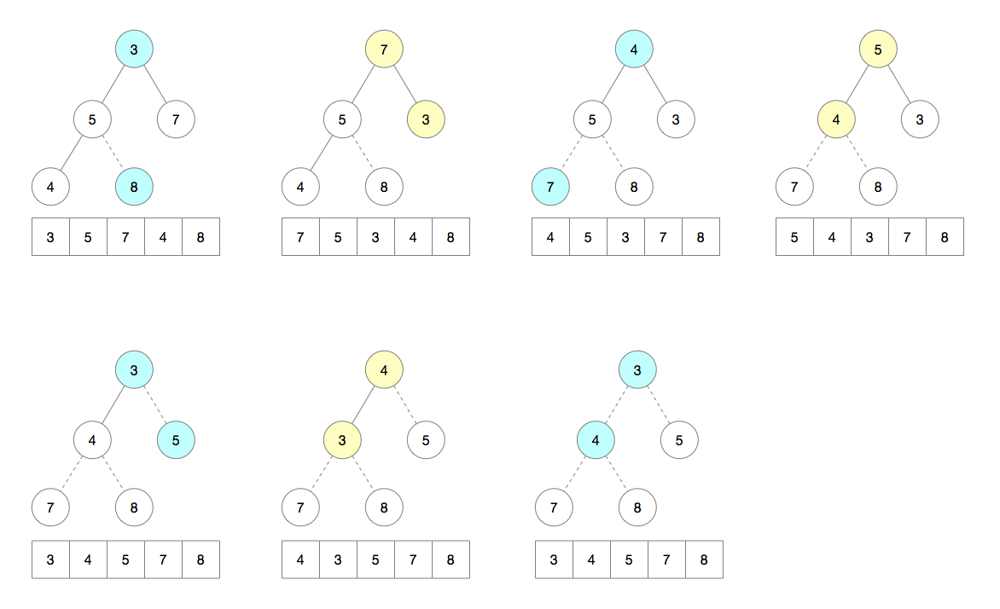


##### 代码实现

```c
void adjustHeap(struct D_SqList *l, int parent, int length)
{
    int tmp = l->elem[parent];
    int child = 2 * parent + 1; // 左孩子
    while (child < length)
    {
        // 如果右孩子存在
        if (child + 1 < length && l->elem[child] < l->elem[child + 1])
            child++;
        if (tmp >= l->elem[child])
            break;
        l->elem[parent] = l->elem[child];
        parent = child;
        child = 2 * parent + 1;
    }
    l->elem[parent] = tmp;
}

void HeapSort(struct D_SqList *l)
{
    int len = l->length;
    for (int i = len / 2 - 1; i >= 0; i--)
    {
        adjustHeap(l, i, len);
    }
    for (int i = len - 1; i > 0; i--)
    {
        int tmp = l->elem[i];
        l->elem[i] = l->elem[0];
        l->elem[0] = tmp;
        adjustHeap(l, 0, i);
    }

}
```


##### 时间复杂度

建堆的时间复杂度是O(n)，从堆顶取出元素后的重建堆的时间复杂度是O(logn)，所以整个堆排序的时间复杂度是O(nlogn)。


##### 空间复杂度

使用了常数个辅助单元，空间复杂度为O(1)。


##### 稳定性

不稳定，举个例子：

序列100 10 10 10，如果堆顶100先输出，最后一个10将会直接换到堆顶，下次输出的就是最后一个10，和另外的10交换了相对位置，不稳定。


#### 归并排序

##### 综述

归并排序和上边我们说的有些不同，是利用归并的思想实现的排序方法，该算法采用经典的分治（divide-and-conquer）策略（分治法将问题分(divide)成一些小的问题然后递归求解，而治(conquer)的阶段则将分的阶段得到的各答案"修补"在一起，即分而治之)。


如何合并两个有序子序列呢？我们可以按下图所示的方法进行合并。


##### 示意图


##### 代码实现

```c
void merge(struct D_SqList *l, int reg[], int start, int end)
{
    if (start >= end)
        return;
    int len = end -start;
    int mid = len / 2 + start;
    int start1 = start;
    int end1 = mid;
    int start2 = mid + 1;
    int end2 = end;
    merge(l, reg, start1, end1);
    merge(l, reg, start2, end2);
    int k = start;
    while (start1 <= end1 && start2 <= end2)
        reg[k++] = l->elem[start1] < l->elem[start2] ? l->elem[start1++] : l->elem[start2++];
    while (start1 <= end1)
        reg[k++] = l->elem[start1++];
    while (start2 <= end2)
        reg[k++] = l->elem[start2++];
    for (k = start; k <= end; k++)
        l->elem[k] = reg[k];
}

void MergeSort(struct D_SqList *l)
{
    int len = l->length;
    int reg[len];
    merge(l, reg, 0, len-1);
}
```


##### 时间复杂度

每次合并操作的平均时间复杂度为O(n)，而完全二叉树的深度为log<sub>2</sub>n。总的平均时间复杂度为O(nlog<sub>2</sub>n)。而且，归并排序的最好，最坏，平均时间复杂度均为O(nlog<sub>2</sub>n)。


##### 空间复杂度

归并操作需要占用n个辅助单元，所以空间复杂度是O(n)。


##### 稳定性

是稳定的。归并不会改变元素本来的相对位置。


#### 基数排序

##### 综述

基数排序又叫分配式排序，是一种采用多关键字排序思想的算法，借助“分配”、“收集”两种操作，每次只对单逻辑关键字进行排序。基数排序分为高位优先（MSD）排序和低位优先（LSD）排序。下边以LSD为例说明算法。

设初始序列为{393, 88, 40, 424, 8, 64, 42, 561, 457, 432}，先按个位放入：


将桶中数依次倒出，对于同一个桶中的数按先进先出顺序倒出，为{40, 561, 42, 432, 393, 424, 64, 457, 88, 8}，再按十位放入：

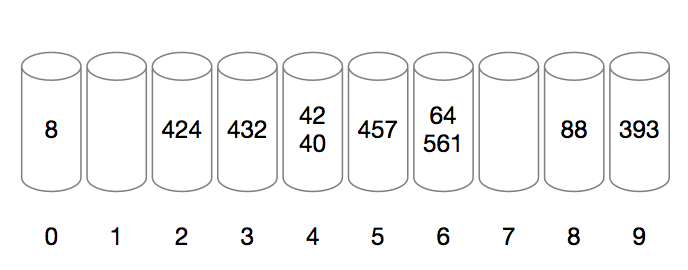

将桶中数依次倒出，对于同一个桶中的数按先进先出顺序倒出，为{8, 424, 432, 40, 42, 457, 561, 64, 88, 393}，再按百位放入：


再依次到出，此时序列为{8, 40, 42, 64, 88, 393, 424, 432, 457, 561}，可以发现，已经排好了次序。


##### 示意图

如上图


##### 代码实现

```c
void RadixSort(struct D_SqList *l)
{
    int max = getMax(*l);
    int len = l->length;
    struct Queue Q[10];
    int time = 10;
    for (int i = 0; i < 10; i++)
    {
        InitQueue(&Q[i]);
    }

    while (max / (time/10))
    {
        int d = 0;
        // 提取一位，放到对应的桶中
        for (int i = 0; i < len; i++)
        {
            d = (l->elem[i] % time) / (time / 10);
            Put(&Q[d], l->elem[i]);
        }
        // 依次将桶中的数据取出，放回序列
        ClearList(l);
        for (int k = 0, i = 0; k < 10; k++)
        {
            int a = 0;
            while (QueueLength(Q[k]))
            {
                Poll(&Q[k], &a);
                ListInsert(l, i + 1, a);
                i++;
            }
        }
        time *= 10;
    }
}
```


##### 时间复杂度

时间分为两部分，分配和搜集，每趟分配需要O(n)，每趟搜集需要O(q)，一共需要t趟分配搜集过程，所以时间复杂度为O(t(n+q))。


##### 空间复杂度

一趟排序需要辅助存储空间为q个（q为队列个数），单这q个队列可以重复利用，所以空间复杂度为O(q)。


##### 稳定性

是稳定的。因为按位排序时每次是稳定的，最后的结果也是稳定的。


### 例题精解

【例题】判断题

- 对于任何待排序的序列来说，快速排序均快于冒泡排序。


【例题】下列排序中，\_\_\_\_\_\_\_\_\_\_\_\_是稳定的，\_\_\_\_\_\_\_\_\_\_\_\_具有最好的平均性能，当待排序的关键字为倒序时，若需要为之进行正序排序，下列方案中以\_\_\_\_\_\_\_\_\_\_\_\_为佳。

A. 堆排序                                   B. 快速排序

C. 直接插入排序                        D. 简单选择排序


【例题】在一个含有n个元素的有序表上进行折半查找，找到一个元素最多要进行（    ）次元素比较。

A. ⌈log<sub>2</sub>(n)⌉                                B. ⌈log<sub>2</sub>(n)⌉ + 1

C. ⌈log<sub>2</sub>(n+1)⌉                            D. ⌈log<sub>2</sub>(n+1)⌉  + 1


【例题】对5个不同的数据元素进行插入排序，最少需要进行（          ）次比较。

A. 4                       B. 5                             C. 8                                D. 10


【例题】若需要从100万个记录中挑选出关键字最小的50个记录，下列方法中最好使用（          ）方法。

A. 插入排序                                B. 希尔排序

C. 快速排序                                D. 堆排序


【例题】下列排序方法中，（           ）平均时间复杂度为O(nlogn)，最坏情况下时间复杂度为O(n<sup>2</sup>)；（           ）所有情况下时间复杂度均为O(nlogn)；当记录的个数n较大时，若仅需要排定前m元素的位置（m远小于n）时，下列方案中（       ）为佳；当初始记录依关键字有序时下列方案中（      ）为佳。

A. 希尔排序              B. 快速排序              C. 堆排序

D. 直接插入排序      E. 简单选择排序       F. 基数排序


【例题】已知待排序序列为：33，34，7，28，38，11，65，15，37，20，则：

以第一个元素为枢轴的快速排序第一趟分划的结果为\_\_\_\_\_\_\_\_\_\_\_\_。

堆排序初始建堆（小顶堆）的结果是\_\_\_\_\_\_\_\_\_\_\_\_。

希尔排序第一趟（增量为3）的结果是\_\_\_\_\_\_\_\_\_\_\_\_。


【例题】

已知待排序序列为：25，12，9，20，7，31，24，35，17，10，试写出：

（1）堆排序初始建堆（大顶堆）的结果。

（2）以第一个元素为枢轴的快速排序一趟分划的结果。

（3）希尔排序第一趟（增量为5）的结果。


【例题】请在“\_\_\_\_\_\_\_\_\_\_\_\_”处填上合适的语句，完成算法。

1. 已知R[s..m]中记录的关键字除R[s]之外均满足堆的特征，本函数自上而下调整R[s]的关键字，使R[s..m]也成为一个大顶堆。

```c
void HeapAdjust(RcdType &R[], int s, int m)
{
    rc = R[s];
    for (j = 2*s; j <= m; ______________)
    {
        if (j < m && ___________)
            ++j;
        if (rc.key >= R[j].key)
            break;
        R[s] = R[j];
        s = j;
    }
    ________________;
}
```

2. 折半查找

```c
int Search_Bin(SSTable ST, KeyType key)
{
    low = 1;
    high = ST.length;
    while (_____________)
    {
        mid = ______________;
        if (EQ(key, ST.elem[mid].key))
            return mid;
        else if (LT(key, ST.elem[mid].key))
            high = mid - 1;
        else
            _________________;
    }
    return 0;
}
```


【例题】阅读函数，指出算法功能。

```c
int A(SqList L, int i)
{
    // 初始条件：顺序表L已存在
    int min;
    int j, k;
    k = i;
    min = L.r[i].key;
    for (j = i + 1; j <= L.length; j++)
        if (L.r[j].key < min)
        {
            k = j;
            min = L.r[j].key;
        }
    return k;
}
```


【例题】阅读以下过程：

```c
void A(ElemType R[], int n)
{
    i = n;
    while (i > 1)
    {
        lastExchangeIndex = 1;
        for (j = 1; j < i; j++)
            if (R[j + 1].key < R[j].keu)
            {
                Swap(R[j], R[j+1]);
                lastExchangeIndex = j;
            }
        i = lastExchangeIndex;
    }
}
```

回答以下问题：

1. 算法的功能
2. 当初始数据依关键字递增有序时关键字的比较次数是多少？
3. 当初始数据依关键字递减有序时关键字的比较次数是多少？
4. 算法的时间复杂度？


【例题】算法设计题。单链表结构如下：

```c
typedef struct LNode
{
    int data;
    struct LNode *next;
} *LinkList;
```

写一函数void A(LinkList L)试采用直接插入排序的方法将单链表L（带头节点）中的节点按非递减次序排列。


#### 单项选择题

------

2018

------

【例题】下列排序方法中，时间性能与待排序记录的初始排列无关的是（        ）。

A. 插入排序和快速排序

B. 归并排序和快速排序

C. 堆排序和归并排序

D. 插入排序和归并排序


#### 问答与图示题

------

2018

------

【例题】给出一组关键字T = (37,58,31,45,8,25,32,19,26,18,62,11)：

（1）给出希尔排序（第一趟排序的增量为5）一趟排序的结果。

（2）给出快速排序（选第一个记录为枢轴）一趟排序的结果。

（3）给出小顶堆的排列结果。

（4）给出归并排序（非递归）一趟排序的结果。

（5）给出基础排序一趟排序的结果。


### 习题精炼

编写一个程序Frequency，从标准输入读取一列字符串并按照字符串出现频率由高到低的顺序打印每个字符串及其出现的次数。


### 排序时间实测

下边我对这八种算法进行了几次测试，分别对应：

- A组小规模数据&小关键字
- B组小规模数据&大关键字
- C组大规模数据&小关键字
- D组大规模数据&大关键字

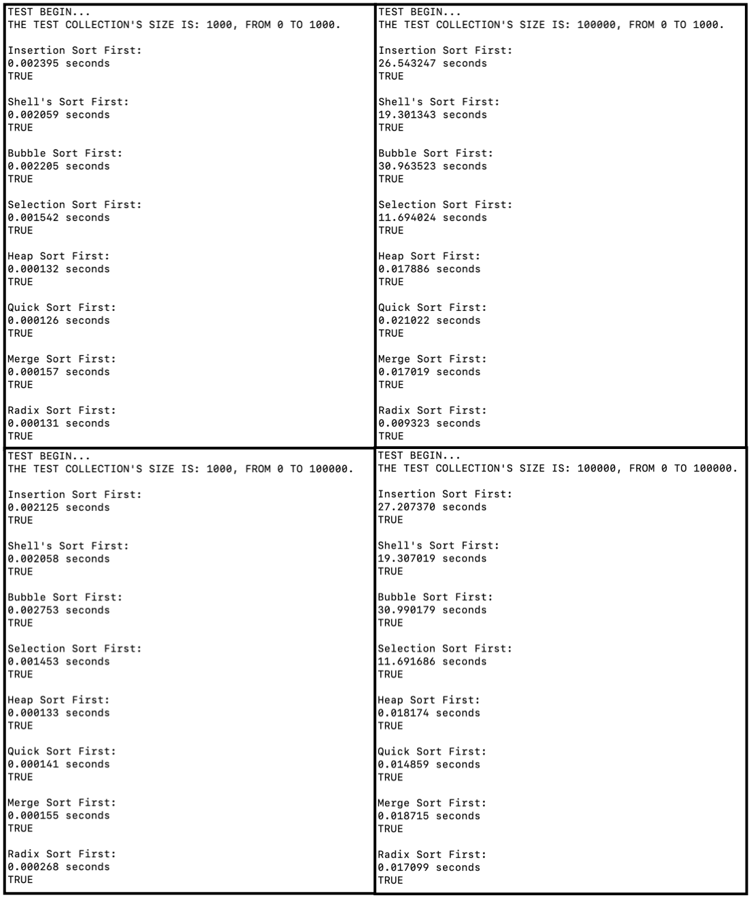

排除代码写法、机器随机因素、只看数量级，观察可知快速排序、归并排序、堆排序。在任何情况下表现都很出色，基数排序和要排序的序列范围有较大关系，直接插入排序、冒泡排序在大数据面前速度是真的慢。

上图的测试代码在[这](https://github.com/qvjp/UNGEE/tree/master/DataStructure/Sorting_Algorithm/src/test.c)
