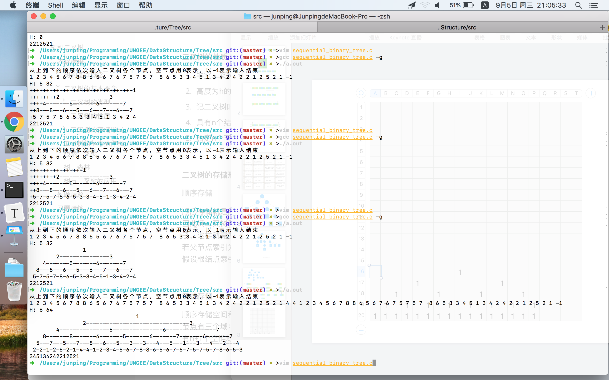

> 8月26号

考研复习就像洗衣服，洗一遍，用清水淘三遍，学一天，用三倍的时间去练习。

等我考完，不论考上考不上，都要犒劳自己，打两个月的代码，去一个没有任何人需要说话的地方，把手机扔了,开始构思，开始编码。

学习这点考研数学，真的，我好累，甚至感觉自己“毫无灵性”，或许这就是大学前两年数学课一下没听的报应吧，出来混，早晚要还。

我把自己为考研做的准备、抱怨、理想，都放到了这个repo里，并不是想怎样，只是想做个纪念，期待100年后，有人会为它吹去尘封已久的灰尘，来理解我的抱怨。

我喜欢什么，我想要什么，我能怎样，我不知道，初中知道自己要考高中，高中知道自己要考大学，大学，前两年以为自己大学毕业要去工作，但还妄自菲薄觉得自己进不了喜欢的华为的OS部门，所以，就像其他咸鱼一样，走上了考研之路，可是，万万没想到，华为OS部门好像我真的可以进，然而，在知道这个消息的时候，我已经半年没怎么摸计算机知识了，已经在考研的路上走了半年，这时候，我舍不得放弃这个半年为考研做的准备，也对自己半年没玩计算机而直接去华为感到危机。在这个时间点上，我不知道我到底喜欢什么，我喜欢考研？我喜欢工作？我喜欢不劳而获？富婆？投机？我喜欢什么？好像我真的不知道，这些东西好像都唾手可得，又好像离我远到内存第一个比特到最后一个比特的距离，我好久没有好好看自己了，我就像一个还没成熟的自动驾驶汽车，放到了广袤的原野，乱走。

我，我说每一句话好像都喜欢加个我，或许我就是这么已自我为中心，没关系，无所谓。

我觉得我在学习计算机方面虽然不能说天赋异禀，但和这种普通一本大学的同学比起来，还是强于他们的，我学一个东西，一定要从下到上，依次了解，我是做软件的，软件的最下边就是OS了，再往下就是硬件了，所以我要从OS入手，OS精通不是目的，是过程。~~此处无内容~~。

我是传奇，我要做一个传奇。

第一步，先把考研搞定，目标不高，杭电就好。我没必要在一个自己不喜欢也不擅长的领域有什么很奇怪的表现。考完研，好好研究我的计算机。这才是我应该为之奋斗终身的东西。


----------

> 8月27号

以前小时候真好，看到漂亮女生还会喜欢，还想找女朋友，现在我就和死人一样了，别人都说你还会喜欢人，只是没遇到合适的人罢了，我不信，我认为我丧失了这种能力。


-------

> 9月3号

这几天一直学到晚上10点才回去，我好累啊，我好想，我好想，我好想什么。。。我不知道啊。。。不知道想干什么，还是再学习一会儿吧。

呵呵，指针的指针


---------

> 9月4号

我好累啊，头疼，想去尿尿，又懒得去


---------

> 9月5号

过程




--------


> 9月12号

明天到考试整整100天，仪式感在哪？


--------

> 9月12号

今天开始复习计组，计组不会像数据结构那样写总结怎么办？


--------

> 9月15号

### 第一阶段100-->60（单位：天）


*每天上午8:00到12:00*

数学，1000题练习，计划平均每天/4小时/25道题目，40天基本完成。


*每天下午1:00到5:00*

专业，杭电历年真题分析，计划平均每天/4小时/一套卷，40天循环滚动练习。


*每天晚上6:00到10:00*

英语，考研真题试卷，计划平均每天/4小时/半套卷，40天看完21套真题。


*每天午夜11:00到1:00*
政治，看视频熟悉/放松自己，10月1号前只看视频，不做练习。


每天午夜1点睡到早上7点半共六个半小时。


**容错：** 

上午数学不足4小时的时间差可以找专业课借，英语也可以找专业课借，政治不可以。

**总结：** 

学习时间大约为4+4+4+2=14小时

休息时间为6.5+0.5+1+1+1=10小时

学习/休息=7/5安排较为合理，符合社会主义当前阶段的核心价值观。


### 第二阶段#60-->30


### 第三阶段#30-->0

----------

> 9月23号

明天晚上睡觉前，把线性代数弄完。2018-9-24（中秋节）

-------

> 9月24日

不能困，学完就没事了

--------

> 9月28号

这几天左眼一直跳

---------

> 10月1号

还有100-17=83天

```
➜  /Users/junping/Programming/UNGEE git:(master) >uptime
 9:09  up 17 days, 18:48, 2 users, load averages: 2.08 1.92 2.02
```

---------

>10月3号

以前觉得旋风冲锋是男一号，一直最快，厉害，想成为旋风冲锋，现在依然这样觉得，但是三角箭那种慢速起步，后期超高速的跑法，也不失为一种优雅的装逼。

------

>10月4号

到今天了，眼睛还是一直跳，左眼

--------

>10月6号

有些人啊，是真的不知道天高地厚，老在我面前很自然的显示自己学的很超前。

殊不知，呵呵，哈哈哈哈哈哈哈，这里我说个我的想法，如果考研最终成绩不比这种人高50分，算我输。


---

我现在的心理、价值观等等的，好像都存在不小的问题，为什么会这样？我难道不想做一个好人吗？不对，我是想做好人的。或许是因为太久没有个大自然亲密接触了，这样不对，今天晚上去跑步吧。


------

>10月9号

考不上就考不上吧，考不上就去打工，底线是>华为。

----------

>10月10号

感冒了，不是今天开始感冒的，今天加重了，或许，是我内心在谴责自己？亦或是我被谴责了？无论哪个，都是我不对，我错了。

我这样做，不是因为考试，不是什么，也不是分心什么的屁话，或许，这就是我的悲哀，20-25岁最大的悲哀吧。

希望每个人都开心，除了我。

--------

>10月18号

感冒基本好了，轻松了

心理不轻松，还有64天大概，差的还太多。但我总是感觉我是超级超级厉害的，无论从学习方法，还是对事情的认识，我都明显超出“我该对齐”的人的水平，这或许预示了以后我能成为一名王者吧。哈哈😄

--------

>10月21号

问：为什么有了国外的梅赛德斯还要造国产的红旗？

答：为什么有了Linux还要造INLOW。

130000000 / 1000000 = 130
一百万人中才能出一个主角，全中国至少有130个主角

\-\-\-\-\-\- “为什么考杭电，好丢人“

\-\-\-\-\-\- “获奖，让此奖感到荣耀“

--------

>10月26号

我们学的是为特定型号的汽车造一些配件，学的好的造引擎，差点的造玻璃，还有些可以设计车的外形。

但我要的是造车，一辆完整的车，车的引擎要最好的，外形要最酷的，各种都要最好的，但是，引擎不一定我造，

外形不一定我造，我造的是车，而不是某个零件。

当然，前边说引擎的例子不太合适，引擎是核心，这个必须我来造，其他东西就交由别人了。

-----

>10月28号

越来越觉得我最终数学能考130+


---------

>11月3号

可能不是我变傻了，是身边人都太灵了？

---------

>11月6号

7号 293-308+英语一套卷+政治1.5小时
8号 309-326+英语一套卷+政治1.5小时
9号 179-198+英语一套卷+政治1.5小时
10号 199-229+英语一套卷+政治1.5小时
11号 230-260+英语一套卷+政治1.5小时
12号 3-20+英语一套卷+政治1.5小时
13号 21-49+英语一套卷+政治1.5小时
14号 50-67+英语一套卷+政治1.5小时
15号 68-82+英语一套卷+政治1.5小时
16号 83-104+英语一套卷+政治1.5小时
17号 105-139+英语一套卷+政治1.5小时
18号 140-160+英语一套卷+政治1.5小时
19号 161-176+英语一套卷+政治1.5小时

完成，白天弄不完就到晚上，是时候熬夜了。

专业课在数学弄完当天任务情况下可酌情复习。

这一段是13天

20号以后一个月，


------

>11月7号

忘吃饭了，头晕 \-\-\-\-\- 13:31:05

突然想起来昨晚做了个梦，梦到我从鞋子里倒出了个大蟑螂，在家倒的，蟑螂是南方的大蟑螂，
我和我妈说这个家伙可能是从杭州就一直呆在我鞋里，鞋有点长，脚尖前边正好能放一只蟑螂，
我就一只没察觉出来。 \-\-\-\-\- 16:09:52

-------

>11月9号

又难又多

------

>11月10号

NULL


-------

>11月12号

好像我离好人越来越远，不行，我要做个好人


# 没考上就没考上了，好好上班也挺好，甚至比考上还好

-----

>11月16号

INLOW终于作为毕设、考研复试、找工作三位一体的核心关键了。

------

>11月20号

前几天写的牢骚被我弄没了。。。原因是icdiff在Python2.x下不支持中文，
为了给开发者提Issue，只好把长篇大论的东西删掉，然后优雅的把diff截
下来。然而。。提完Issue后忘了再把剪掉的部分粘回来，刚才，顺手就把
tmp.txt rm了。我他娘的这是个人才，去配置rm了，不能让它权限这么大还
这么不好用。

-------

>11月21号

早上醒的有点早，又睡着了，做了个梦，梦到我正在上自习课，有人问我
一道题好像，正好被初中班主任（张老师）看到了，他从前门进来，那双
眼睛，那眼神，我现在好清楚在脑海里。然后我就被罚去在办公室窗台前
写检查了，本子还一波三折，最后拿出的是杭电的练习本，还有人在还运
动会好像，在我身后嗖嗖的跑来跑去，我在窗台前写检查。事情就是这样，
在大学校园被初中班主任教训，哈哈哈

------

>11月22号

还有一个月？

每天学习的时候，总是会不经意想到INLOW，想把它早日写的有个人（OS）样。
