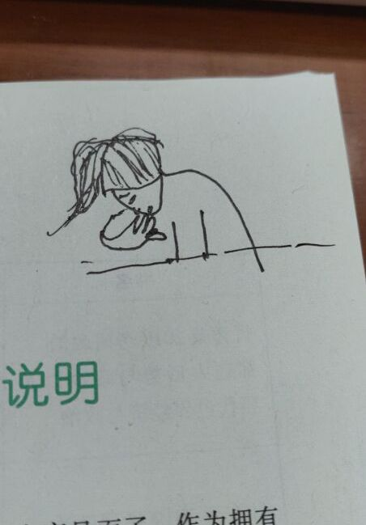

> 8月26号

考研复习就像洗衣服，洗一遍，用清水淘三遍，学一天，用三倍的时间去练习。

等我考完，不论考上考不上，都要犒劳自己，打两个月的代码，去一个没有任何人需要说话的地方，把手机扔了,开始构思，开始编码。

学习这点考研数学，真的，我好累，甚至感觉自己“毫无灵性”，或许这就是大学前两年数学课一下没听的报应吧，出来混，早晚要还。

我把自己为考研做的准备、抱怨、理想，都放到了这个repo里，并不是想怎样，只是想做个纪念，期待100年后，有人会为它吹去尘封已久的灰尘，来理解我的抱怨。

我喜欢什么，我想要什么，我能怎样，我不知道，初中知道自己要考高中，高中知道自己要考大学，大学，前两年以为自己大学毕业要去工作，但还妄自菲薄觉得自己进不了喜欢的华为的OS部门，所以，就像其他咸鱼一样，走上了考研之路，可是，万万没想到，华为OS部门好像我真的可以进，然而，在知道这个消息的时候，我已经半年没怎么摸计算机知识了，已经在考研的路上走了半年，这时候，我舍不得放弃这个半年为考研做的准备，也对自己半年没玩计算机而直接去华为感到危机。在这个时间点上，我不知道我到底喜欢什么，我喜欢考研？我喜欢工作？我喜欢不劳而获？富婆？投机？我喜欢什么？好像我真的不知道，这些东西好像都唾手可得，又好像离我远到内存第一个比特到最后一个比特的距离，我好久没有好好看自己了，我就像一个还没成熟的自动驾驶汽车，放到了广袤的原野，乱走。

我，我说每一句话好像都喜欢加个我，或许我就是这么已自我为中心，没关系，无所谓。

我觉得我在学习计算机方面虽然不能说天赋异禀，但和这种普通一本大学的同学比起来，还是强于他们的，我学一个东西，一定要从下到上，依次了解，我是做软件的，软件的最下边就是OS了，再往下就是硬件了，所以我要从OS入手，OS精通不是目的，是过程。~~此处无内容~~。

我是传奇，我要做一个传奇。

第一步，先把考研搞定，目标不高，杭电就好。我没必要在一个自己不喜欢也不擅长的领域有什么很奇怪的表现。考完研，好好研究我的计算机。这才是我应该为之奋斗终身的东西。


----------

> 8月27号

以前小时候真好，看到漂亮女生还会喜欢，还想找女朋友，现在我就和死人一样了，别人都说你还会喜欢人，只是没遇到合适的人罢了，我不信，我认为我丧失了这种能力。


-------

> 9月3号

这几天一直学到晚上10点才回去，我好累啊，我好想，我好想，我好想什么。。。我不知道啊。。。不知道想干什么，还是再学习一会儿吧。

呵呵，指针的指针


---------

> 9月4号

我好累啊，头疼，想去尿尿，又懒得去


---------

> 9月5号

过程


--------


> 9月12号

明天到考试整整100天，仪式感在哪？


--------

> 9月12号

今天开始复习计组，计组不会像数据结构那样写总结怎么办？


--------

> 9月15号

### 第一阶段100-->60（单位：天）


*每天上午8:00到12:00*

数学，1000题练习，计划平均每天/4小时/25道题目，40天基本完成。


*每天下午1:00到5:00*

专业，杭电历年真题分析，计划平均每天/4小时/一套卷，40天循环滚动练习。


*每天晚上6:00到10:00*

英语，考研真题试卷，计划平均每天/4小时/半套卷，40天看完21套真题。


*每天午夜11:00到1:00*
政治，看视频熟悉/放松自己，10月1号前只看视频，不做练习。


每天午夜1点睡到早上7点半共六个半小时。


**容错：** 

上午数学不足4小时的时间差可以找专业课借，英语也可以找专业课借，政治不可以。

**总结：** 

学习时间大约为4+4+4+2=14小时

休息时间为6.5+0.5+1+1+1=10小时

学习/休息=7/5安排较为合理，符合社会主义当前阶段的核心价值观。


### 第二阶段#60-->30


### 第三阶段#30-->0

----------

> 9月23号

明天晚上睡觉前，把线性代数弄完。2018-9-24（中秋节）

-------

> 9月24日

不能困，学完就没事了

--------

> 9月28号

这几天左眼一直跳

---------

> 10月1号

还有100-17=83天

```
➜  /Users/junping/Programming/UNGEE git:(master) >uptime
 9:09  up 17 days, 18:48, 2 users, load averages: 2.08 1.92 2.02
```

---------

>10月3号

以前觉得旋风冲锋是男一号，一直最快，厉害，想成为旋风冲锋，现在依然这样觉得，但是三角箭那种慢速起步，后期超高速的跑法，也不失为一种优雅的装逼。

------

>10月4号

到今天了，眼睛还是一直跳，左眼

--------

>10月6号

有些人啊，是真的不知道天高地厚，老在我面前很自然的显示自己学的很超前。

殊不知，呵呵，哈哈哈哈哈哈哈，这里我说个我的想法，如果考研最终成绩不比这种人高50分，算我输。

---

我现在的心理、价值观等等的，好像都存在不小的问题，为什么会这样？我难道不想做一个好人吗？不对，我是想做好人的。或许是因为太久没有个大自然亲密接触了，这样不对，今天晚上去跑步吧。

------

>10月9号

考不上就考不上吧，考不上就去打工，底线是>华为。

----------

>10月10号

感冒了，不是今天开始感冒的，今天加重了，或许，是我内心在谴责自己？亦或是我被谴责了？无论哪个，都是我不对，我错了。

我这样做，不是因为考试，不是什么，也不是分心什么的屁话，或许，这就是我的悲哀，20-25岁最大的悲哀吧。

希望每个人都开心，除了我。

--------

>10月18号

感冒基本好了，轻松了

心理不轻松，还有64天大概，差的还太多。但我总是感觉我是超级超级厉害的，无论从学习方法，还是对事情的认识，我都明显超出“我该对齐”的人的水平，这或许预示了以后我能成为一名王者吧。哈哈😄

--------

>10月21号

问：为什么有了国外的梅赛德斯还要造国产的红旗？

答：为什么有了Linux还要造INLOW。

130000000 / 1000000 = 130
一百万人中才能出一个主角，全中国至少有130个主角

\-\-\-\-\-\- “为什么考杭电，好丢人“

\-\-\-\-\-\- “获奖，让此奖感到荣耀“

--------

>10月26号

我们学的是为特定型号的汽车造一些配件，学的好的造引擎，差点的造玻璃，还有些可以设计车的外形。

但我要的是造车，一辆完整的车，车的引擎要最好的，外形要最酷的，各种都要最好的，但是，引擎不一定我造，

外形不一定我造，我造的是车，而不是某个零件。

当然，前边说引擎的例子不太合适，引擎是核心，这个必须我来造，其他东西就交由别人了。

-----

>10月28号

越来越觉得我最终数学能考130+

---------

>11月3号

可能不是我变傻了，是身边人都太灵了？

---------

>11月6号

7号 293-308+英语一套卷+政治1.5小时
8号 309-326+英语一套卷+政治1.5小时
9号 179-198+英语一套卷+政治1.5小时
10号 199-229+英语一套卷+政治1.5小时
11号 230-260+英语一套卷+政治1.5小时
12号 3-20+英语一套卷+政治1.5小时
13号 21-49+英语一套卷+政治1.5小时
14号 50-67+英语一套卷+政治1.5小时
15号 68-82+英语一套卷+政治1.5小时
16号 83-104+英语一套卷+政治1.5小时
17号 105-139+英语一套卷+政治1.5小时
18号 140-160+英语一套卷+政治1.5小时
19号 161-176+英语一套卷+政治1.5小时

完成，白天弄不完就到晚上，是时候熬夜了。

专业课在数学弄完当天任务情况下可酌情复习。

这一段是13天

20号以后一个月，

------

>11月7号

忘吃饭了，头晕 \-\-\-\-\- 13:31:05

突然想起来昨晚做了个梦，梦到我从鞋子里倒出了个大蟑螂，在家倒的，蟑螂是南方的大蟑螂，
我和我妈说这个家伙可能是从杭州就一直呆在我鞋里，鞋有点长，脚尖前边正好能放一只蟑螂，
我就一只没察觉出来。 \-\-\-\-\- 16:09:52

-------

>11月9号

又难又多

------

>11月10号

NULL

-------

>11月12号

好像我离好人越来越远，不行，我要做个好人


# 没考上就没考上了，好好上班也挺好，甚至比考上还好

-----

>11月16号

INLOW终于作为毕设、考研复试、找工作三位一体的核心关键了。

------

>11月20号

前几天写的牢骚被我弄没了。。。原因是icdiff在Python2.x下不支持中文，
为了给开发者提Issue，只好把长篇大论的东西删掉，然后优雅的把diff截
下来。然而。。提完Issue后忘了再把剪掉的部分粘回来，刚才，顺手就把
tmp.txt rm了。我他娘的这是个人才，去配置rm了，不能让它权限这么大还
这么不好用。

-------

>11月21号

早上醒的有点早，又睡着了，做了个梦，梦到我正在上自习课，有人问我
一道题好像，正好被初中班主任（张老师）看到了，他从前门进来，那双
眼睛，那眼神，我现在好清楚在脑海里。然后我就被罚去在办公室窗台前
写检查了，本子还一波三折，最后拿出的是杭电的练习本，还有人在还运
动会好像，在我身后嗖嗖的跑来跑去，我在窗台前写检查。事情就是这样，
在大学校园被初中班主任教训，哈哈哈

------

>11月22号

还有一个月？

每天学习的时候，总是会不经意想到INLOW，想把它早日写的有个人（OS）样。

------

> 11月28号

我对面女生长的好像挺好看的 :-)

----

> 11月30号

眼快瞎了，身体也一天不如一天，熬夜也熬不动了，考研使我生不如死。

但对面女生是真的好看，长的就像我很熟悉的人一样。





------

> 12月2号

秀峰说，马上就要尘埃落定了，这一页马上就要翻过去了，想想，是。

但图书馆这一页虽静寂无声，但真的很好，各种好。


2-3 线性代数视频
4-5 概率论
每天政治一套卷
数学一套卷
英语背作文

-------

> 12月4号

有些人是可以发光的，他们可能就是隐藏起来的奥特曼（我没说我，我说前几天我对面那个女生）


曾几何时（我会用成语，我这里故意这样用），我觉得大学生好厉害啊，和科学家差不多，
现在，图书馆我身后坐了几百个大学生，我发现我比他们大部分人都要强。我有理想，我
会去实现它。这么多年，我一直在总结我的优点到底是什么，不是小明所说的他会唱歌，
小红说的她会跳舞，我的优点是，我敢想，我有理想，这个优点，以一当十。。。亿。

-------

> 12月8号

大概，每个人都在崩溃边缘了吧

-----

>12月9号

有些人，不懂得对神明心存敬畏，所以到最后都不知道怎么死的

----

>12月10号

那些说这种题会做是因为他做多了，所以会的人啊，八成是他怕伤你自尊心乱说的，
其实就是他比你聪明，他可能也没做过。
哈哈哈

-----

>12月11号

继续不想学习，还有10天就考了，回忆一下大学这段时间，好像也不是什么都没。

##### 加入达尔文
大一，和旺发跑步（好像还真有点功利，我日），毛遂自荐加入DEW，虽然这个
项目水，但真的给了我不少启蒙性的锻炼，为后来其他方面广泛学习埋下了伏
笔。现在想一下当初，旺发在我的申请下没多久就让我加入了，对比后来王聪，
我到现在都没想明白为什么旺发对我这么好😂。


##### 广泛学习计算机知识
大二，买了这台MacBook Pro，这对我的学习是有很大促进的，我一直认为要好
马配好鞍。在DEW里，开始我只是写前端的，我当时是很不服，但也没办法，我
能怎么办呢，后来有机会参加高佳琪的Java Web培训班，虽然这个班很水，但它
打开了我学习其他东西的大门，后来自己学了一段时间Java、NodeJS，又去学
Golang、Swift、Python（？玩了玩用别人框架搭一些AI的小玩意，那一段时间
打算写好多小东西(什么博客平台、社交平台、视频播放器、iOS应用、Android
应用、录屏工具、U3D游戏等等等)，当然最后都没写成，因为大三想法变了，但
这一年的学习让我对自己充满了自信，觉得自己不论写什么都能写出来。


##### 上道
大三，观察发现，其实也不用观察，身边的人都在学、在玩我上边说的东西，我
瞬间觉得那些好Low（我就这种人，别人玩的多的东西，我就不玩，我要和别人区
分开，当然了，这里的别人指的是和自己平级或比自己低的），玩什么呢？OS吧，
这毕竟是我当时被停课在三舅家给自己定的理想，现在想想，还是理想，就是OS
了。大三那年，我真的没想过学OS将来会赚多少钱、会不会好找工作，只是因为
我的一腔热血和为了区别于别人的洁癖。定下将来不短一段时间要学OS后，我就
各方寻找资料，大概是大三前的那个暑假就开始了，最开始在看那本21天写一个
操作系统的书，跟着打了一遍，感觉没味道，又去YouTube上找，找到一个不错的，
看视频、跟着打，这个学完以后，我好像大致懂了一点了，又去OSDev.org上学习，
这个网站被很多大佬说太基础，但很适合我啊，我就拼命学，终于学的有了感觉，
我用了一周的时间给我的OS起名字，后来取了个现在觉得傻傻的，但我永远不会改
的INLOW。然后在大三那个十一黄金周的第一天，我给INLOW提交了第一个commit。


##### 迷茫
大四，种种原因，我要考研。
出于对华为的崇拜，我在大三结束时给华为投了一份简历，后来阴差阳错去参加了
华为的机试，结果还是满分通过！就这样华为好几个HR给我打电话，让我去参加面
试，一来我要考研，二来我还真的有点不敢去，怕挂了丢人，我就都拒绝了。就这样
到了大四，大概8月份吧，华为又一个HR给我打了电话，给我说了很多，讲了很多OS
部门的东西，还教我怎么改简历，让我去试试，可能是我和HR接触的太少，反正听完
她说的后，我就特别想去，而且还觉得一定能去，机不可失，失不再来，我真的不考
了吗？我真的要去上班了吗？我定不下来，我打电话问了三舅，他的建议是考吧，我
迷茫，我又一次拒绝了华为的面试，这次我把我的资料从华为的网站删除了，我要考。
但，我还是迷茫，我明明不想学高数，我明明喜欢OS，但我要考。就这样每天迷茫着
到了今天。看着身边很多人去了各大公司，虽然在我看来那些公司和华为比就是个弟
弟，但他们还是去了，他们很早的证明了自己，哎，我迷茫，我不知道能不能考上，
不知道考不上后华为还会不会要我，MF。


##### 总结
感谢给我支持的、为我发展成现在这样提供过哪怕一丁点益处的亲人、同学、朋友。

